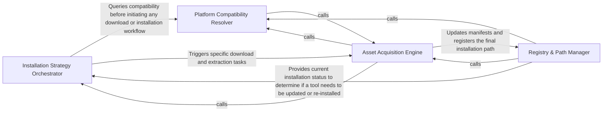

## Details

Handles the physical acquisition of external assets. It resolves platform-specific binaries, manages downloads, and extracts native tools or language runtimes into the local registry.

### Installation Strategy Orchestrator
Manages the high-level logic for provisioning tools by evaluating tool requirements and delegating installation to specific handlers.

**Related Classes/Methods**:

- `tool_registry.installers.install_tools`:515-537
- `tool_registry.installers.install_native_tools`:169-271

**Source Files:**

- [`install.py`](https://github.com/CodeBoarding/CodeBoarding/blob/main/.codeboardinginstall.py)
  - `install.download_jdtls` ([L480-L488](https://github.com/CodeBoarding/CodeBoarding/blob/main/.codeboardinginstall.py#L480-L488)) - Function
- [`tool_registry/installers.py`](https://github.com/CodeBoarding/CodeBoarding/blob/main/.codeboardingtool_registry/installers.py)
  - `tool_registry.installers._extract_compressed_binary` ([L91-L137](https://github.com/CodeBoarding/CodeBoarding/blob/main/.codeboardingtool_registry/installers.py#L91-L137)) - Function

### Platform Compatibility Resolver
Determines if a tool's requirements match the host's operating system and architecture, acting as a gatekeeper for installations.

**Related Classes/Methods**:

- `tool_registry.registry.ToolDependency.is_available_on_host`:140-152
- `tool_registry.registry.ToolDependency`:127-152

**Source Files:**

- [`tool_registry/installers.py`](https://github.com/CodeBoarding/CodeBoarding/blob/main/.codeboardingtool_registry/installers.py)
  - `tool_registry.installers.resolve_native_asset_name` ([L60-L82](https://github.com/CodeBoarding/CodeBoarding/blob/main/.codeboardingtool_registry/installers.py#L60-L82)) - Function
  - `tool_registry.installers._is_compressed_asset` ([L85-L88](https://github.com/CodeBoarding/CodeBoarding/blob/main/.codeboardingtool_registry/installers.py#L85-L88)) - Function
  - `tool_registry.installers.install_archive_tool` ([L475-L509](https://github.com/CodeBoarding/CodeBoarding/blob/main/.codeboardingtool_registry/installers.py#L475-L509)) - Function

### Asset Acquisition Engine
Handles network and filesystem operations to fetch, download, and unpack binaries from remote sources.

**Related Classes/Methods**:

- `tool_registry.installers.download_asset`:140-163
- `tool_registry.installers.install_archive_tool`:475-509

**Source Files:**

- [`tool_registry/installers.py`](https://github.com/CodeBoarding/CodeBoarding/blob/main/.codeboardingtool_registry/installers.py)
  - `tool_registry.installers.asset_url` ([L51-L57](https://github.com/CodeBoarding/CodeBoarding/blob/main/.codeboardingtool_registry/installers.py#L51-L57)) - Function
  - `tool_registry.installers.download_asset` ([L140-L163](https://github.com/CodeBoarding/CodeBoarding/blob/main/.codeboardingtool_registry/installers.py#L140-L163)) - Function
  - `tool_registry.installers.install_native_tools` ([L169-L271](https://github.com/CodeBoarding/CodeBoarding/blob/main/.codeboardingtool_registry/installers.py#L169-L271)) - Function

### Registry & Path Manager
Maintains the state of the local tool registry, tracks installations via manifests, and provides a unified interface for locating binaries.

**Related Classes/Methods**: _None_

**Source Files:**

- [`tool_registry/installers.py`](https://github.com/CodeBoarding/CodeBoarding/blob/main/.codeboardingtool_registry/installers.py)
  - `tool_registry.installers.install_tools` ([L515-L537](https://github.com/CodeBoarding/CodeBoarding/blob/main/.codeboardingtool_registry/installers.py#L515-L537)) - Function
- [`tool_registry/registry.py`](https://github.com/CodeBoarding/CodeBoarding/blob/main/.codeboardingtool_registry/registry.py)
  - `tool_registry.registry.ToolKind` ([L56-L64](https://github.com/CodeBoarding/CodeBoarding/blob/main/.codeboardingtool_registry/registry.py#L56-L64)) - Class
  - `tool_registry.registry.ConfigSection` ([L67-L71](https://github.com/CodeBoarding/CodeBoarding/blob/main/.codeboardingtool_registry/registry.py#L67-L71)) - Class
  - `tool_registry.registry.ToolSource` ([L75-L78](https://github.com/CodeBoarding/CodeBoarding/blob/main/.codeboardingtool_registry/registry.py#L75-L78)) - Class
  - `tool_registry.registry.GitHubToolSource` ([L82-L103](https://github.com/CodeBoarding/CodeBoarding/blob/main/.codeboardingtool_registry/registry.py#L82-L103)) - Class
  - `tool_registry.registry.UpstreamToolSource` ([L107-L111](https://github.com/CodeBoarding/CodeBoarding/blob/main/.codeboardingtool_registry/registry.py#L107-L111)) - Class
  - `tool_registry.registry.PackageManagerToolSource` ([L115-L123](https://github.com/CodeBoarding/CodeBoarding/blob/main/.codeboardingtool_registry/registry.py#L115-L123)) - Class
  - `tool_registry.registry.ToolDependency` ([L127-L152](https://github.com/CodeBoarding/CodeBoarding/blob/main/.codeboardingtool_registry/registry.py#L127-L152)) - Class
  - `tool_registry.registry.ToolDependency.is_available_on_host` ([L140-L152](https://github.com/CodeBoarding/CodeBoarding/blob/main/.codeboardingtool_registry/registry.py#L140-L152)) - Method

### [FAQ](https://github.com/CodeBoarding/GeneratedOnBoardings/tree/main?tab=readme-ov-file#faq)