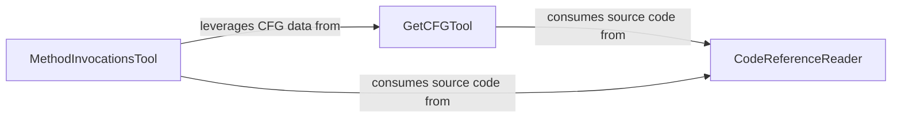

## Details

Tool that provides the LLM Agent Core with the capability to query and retrieve Control Flow Graph (CFG) data, offering insights into execution paths and program logic. It acts as an interface to the CFG Analysis Engine.

### CodeReferenceReader
Retrieves raw source code content from various references (files, modules, specific lines). It serves as the foundational data access layer for static analysis, providing the raw text needed for further processing by other analysis tools.

**Related Classes/Methods**:

- <a href="https://github.com/CodeBoarding/CodeBoarding/blob/main/.codeboardingagents/tools/read_source.py" target="_blank" rel="noopener noreferrer">`agents.tools.read_source`</a>

### GetCFGTool
Generates Control Flow Graphs (CFGs) for specified code components, abstracting execution flow into a graphical representation. This tool is crucial for understanding program logic and potential execution paths without actual execution.

**Related Classes/Methods**:

- <a href="https://github.com/CodeBoarding/CodeBoarding/blob/main/.codeboardingagents/tools/read_cfg.py" target="_blank" rel="noopener noreferrer">`agents.tools.read_cfg`</a>

### MethodInvocationsTool
Identifies and reports method invocation instances across the codebase, mapping call hierarchies and dependencies. It provides insights into how different parts of the code interact, complementing CFG analysis by detailing inter-component communication.

**Related Classes/Methods**:

- <a href="https://github.com/CodeBoarding/CodeBoarding/blob/main/.codeboardingagents/tools/get_method_invocations.py" target="_blank" rel="noopener noreferrer">`agents.tools.get_method_invocations`</a>

### [FAQ](https://github.com/CodeBoarding/GeneratedOnBoardings/tree/main?tab=readme-ov-file#faq)