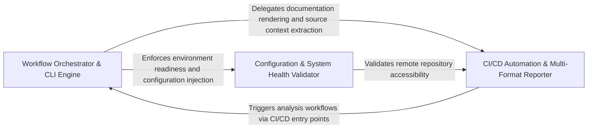

## Details

Serves as the primary interface for external automation, handling environment setup, depth-level resolution, and the generation of final documentation artifacts in Markdown, HTML, MDX, and RST formats.

### Workflow Orchestrator & CLI Engine [[Expand]](./Workflow_Orchestrator_CLI_Engine.md)
Acts as the primary entry point for the application, responsible for parsing commands, resolving local paths, and dispatching specific analysis workflows.

**Related Classes/Methods**:

- `main.main`:99-106
- `main._dispatch`:80-96
- `codeboarding_cli.bootstrap.resolve_local_run_paths`:17-26
- `codeboarding_workflows.analysis.run_full`:49-74
- `codeboarding_cli.view_instructions.print_view_instructions`:20-41

**Source Files:**

- [`codeboarding_cli/bootstrap.py`](https://github.com/CodeBoarding/CodeBoarding/blob/main/.codeboardingcodeboarding_cli/bootstrap.py)
  - `codeboarding_cli.bootstrap.resolve_local_run_paths` ([L17-L26](https://github.com/CodeBoarding/CodeBoarding/blob/main/.codeboardingcodeboarding_cli/bootstrap.py#L17-L26)) - Function
- [`codeboarding_cli/commands/full_analysis.py`](https://github.com/CodeBoarding/CodeBoarding/blob/main/.codeboardingcodeboarding_cli/commands/full_analysis.py)
  - `codeboarding_cli.commands.full_analysis.add_arguments` ([L25-L55](https://github.com/CodeBoarding/CodeBoarding/blob/main/.codeboardingcodeboarding_cli/commands/full_analysis.py#L25-L55)) - Function
  - `codeboarding_cli.commands.full_analysis.validate_arguments` ([L58-L71](https://github.com/CodeBoarding/CodeBoarding/blob/main/.codeboardingcodeboarding_cli/commands/full_analysis.py#L58-L71)) - Function
  - `codeboarding_cli.commands.full_analysis.run_from_args` ([L74-L80](https://github.com/CodeBoarding/CodeBoarding/blob/main/.codeboardingcodeboarding_cli/commands/full_analysis.py#L74-L80)) - Function
  - `codeboarding_cli.commands.full_analysis._run_local` ([L83-L117](https://github.com/CodeBoarding/CodeBoarding/blob/main/.codeboardingcodeboarding_cli/commands/full_analysis.py#L83-L117)) - Function
  - `codeboarding_cli.commands.full_analysis._run_local.scope` ([L97-L105](https://github.com/CodeBoarding/CodeBoarding/blob/main/.codeboardingcodeboarding_cli/commands/full_analysis.py#L97-L105)) - Function
  - `codeboarding_cli.commands.full_analysis._run_remote` ([L120-L158](https://github.com/CodeBoarding/CodeBoarding/blob/main/.codeboardingcodeboarding_cli/commands/full_analysis.py#L120-L158)) - Function
  - `codeboarding_cli.commands.full_analysis._process_one_remote` ([L161-L207](https://github.com/CodeBoarding/CodeBoarding/blob/main/.codeboardingcodeboarding_cli/commands/full_analysis.py#L161-L207)) - Function
  - `codeboarding_cli.commands.full_analysis._process_one_remote.scope` ([L168-L201](https://github.com/CodeBoarding/CodeBoarding/blob/main/.codeboardingcodeboarding_cli/commands/full_analysis.py#L168-L201)) - Function
- [`codeboarding_cli/commands/incremental_analysis.py`](https://github.com/CodeBoarding/CodeBoarding/blob/main/.codeboardingcodeboarding_cli/commands/incremental_analysis.py)
  - `codeboarding_cli.commands.incremental_analysis.add_arguments` ([L18-L23](https://github.com/CodeBoarding/CodeBoarding/blob/main/.codeboardingcodeboarding_cli/commands/incremental_analysis.py#L18-L23)) - Function
  - `codeboarding_cli.commands.incremental_analysis.validate_arguments` ([L26-L28](https://github.com/CodeBoarding/CodeBoarding/blob/main/.codeboardingcodeboarding_cli/commands/incremental_analysis.py#L26-L28)) - Function
  - `codeboarding_cli.commands.incremental_analysis.run_from_args` ([L31-L85](https://github.com/CodeBoarding/CodeBoarding/blob/main/.codeboardingcodeboarding_cli/commands/incremental_analysis.py#L31-L85)) - Function
  - `codeboarding_cli.commands.incremental_analysis._emit_error` ([L88-L95](https://github.com/CodeBoarding/CodeBoarding/blob/main/.codeboardingcodeboarding_cli/commands/incremental_analysis.py#L88-L95)) - Function
  - `codeboarding_cli.commands.incremental_analysis._emit` ([L98-L101](https://github.com/CodeBoarding/CodeBoarding/blob/main/.codeboardingcodeboarding_cli/commands/incremental_analysis.py#L98-L101)) - Function
- [`codeboarding_cli/commands/partial_analysis.py`](https://github.com/CodeBoarding/CodeBoarding/blob/main/.codeboardingcodeboarding_cli/commands/partial_analysis.py)
  - `codeboarding_cli.commands.partial_analysis.add_arguments` ([L17-L28](https://github.com/CodeBoarding/CodeBoarding/blob/main/.codeboardingcodeboarding_cli/commands/partial_analysis.py#L17-L28)) - Function
  - `codeboarding_cli.commands.partial_analysis.validate_arguments` ([L31-L33](https://github.com/CodeBoarding/CodeBoarding/blob/main/.codeboardingcodeboarding_cli/commands/partial_analysis.py#L31-L33)) - Function
  - `codeboarding_cli.commands.partial_analysis.run_from_args` ([L36-L69](https://github.com/CodeBoarding/CodeBoarding/blob/main/.codeboardingcodeboarding_cli/commands/partial_analysis.py#L36-L69)) - Function
  - `codeboarding_cli.commands.partial_analysis.run_from_args.scope` ([L51-L56](https://github.com/CodeBoarding/CodeBoarding/blob/main/.codeboardingcodeboarding_cli/commands/partial_analysis.py#L51-L56)) - Function
- [`codeboarding_cli/view_instructions.py`](https://github.com/CodeBoarding/CodeBoarding/blob/main/.codeboardingcodeboarding_cli/view_instructions.py)
  - `codeboarding_cli.view_instructions.print_view_instructions` ([L20-L41](https://github.com/CodeBoarding/CodeBoarding/blob/main/.codeboardingcodeboarding_cli/view_instructions.py#L20-L41)) - Function
- [`codeboarding_workflows/analysis.py`](https://github.com/CodeBoarding/CodeBoarding/blob/main/.codeboardingcodeboarding_workflows/analysis.py)
  - `codeboarding_workflows.analysis.run_full` ([L49-L74](https://github.com/CodeBoarding/CodeBoarding/blob/main/.codeboardingcodeboarding_workflows/analysis.py#L49-L74)) - Function
- [`codeboarding_workflows/orchestration.py`](https://github.com/CodeBoarding/CodeBoarding/blob/main/.codeboardingcodeboarding_workflows/orchestration.py)
  - `codeboarding_workflows.orchestration.run_analysis_pipeline` ([L25-L48](https://github.com/CodeBoarding/CodeBoarding/blob/main/.codeboardingcodeboarding_workflows/orchestration.py#L25-L48)) - Function
- [`codeboarding_workflows/sources/local.py`](https://github.com/CodeBoarding/CodeBoarding/blob/main/.codeboardingcodeboarding_workflows/sources/local.py)
  - `codeboarding_workflows.sources.local.local_source` ([L22-L23](https://github.com/CodeBoarding/CodeBoarding/blob/main/.codeboardingcodeboarding_workflows/sources/local.py#L22-L23)) - Function
- [`diagram_analysis/run_context.py`](https://github.com/CodeBoarding/CodeBoarding/blob/main/.codeboardingdiagram_analysis/run_context.py)
  - `diagram_analysis.run_context.RunPaths` ([L20-L25](https://github.com/CodeBoarding/CodeBoarding/blob/main/.codeboardingdiagram_analysis/run_context.py#L20-L25)) - Class
  - `diagram_analysis.run_context.RunContext` ([L29-L56](https://github.com/CodeBoarding/CodeBoarding/blob/main/.codeboardingdiagram_analysis/run_context.py#L29-L56)) - Class
  - `diagram_analysis.run_context.RunContext.resolve` ([L37-L52](https://github.com/CodeBoarding/CodeBoarding/blob/main/.codeboardingdiagram_analysis/run_context.py#L37-L52)) - Method
  - `diagram_analysis.run_context.RunContext.finalize` ([L54-L56](https://github.com/CodeBoarding/CodeBoarding/blob/main/.codeboardingdiagram_analysis/run_context.py#L54-L56)) - Method
- [`main.py`](https://github.com/CodeBoarding/CodeBoarding/blob/main/.codeboardingmain.py)
  - `main._build_shared_parser` ([L12-L23](https://github.com/CodeBoarding/CodeBoarding/blob/main/.codeboardingmain.py#L12-L23)) - Function
  - `main.build_parser` ([L26-L61](https://github.com/CodeBoarding/CodeBoarding/blob/main/.codeboardingmain.py#L26-L61)) - Function
  - `main._inject_default_subcommand` ([L64-L77](https://github.com/CodeBoarding/CodeBoarding/blob/main/.codeboardingmain.py#L64-L77)) - Function
  - `main._dispatch` ([L80-L96](https://github.com/CodeBoarding/CodeBoarding/blob/main/.codeboardingmain.py#L80-L96)) - Function
  - `main.main` ([L99-L106](https://github.com/CodeBoarding/CodeBoarding/blob/main/.codeboardingmain.py#L99-L106)) - Function
- [`monitoring/paths.py`](https://github.com/CodeBoarding/CodeBoarding/blob/main/.codeboardingmonitoring/paths.py)
  - `monitoring.paths.get_monitoring_base_dir` ([L8-L12](https://github.com/CodeBoarding/CodeBoarding/blob/main/.codeboardingmonitoring/paths.py#L8-L12)) - Function
  - `monitoring.paths.get_monitoring_run_dir` ([L15-L22](https://github.com/CodeBoarding/CodeBoarding/blob/main/.codeboardingmonitoring/paths.py#L15-L22)) - Function
  - `monitoring.paths.generate_log_path` ([L25-L27](https://github.com/CodeBoarding/CodeBoarding/blob/main/.codeboardingmonitoring/paths.py#L25-L27)) - Function
  - `monitoring.paths.get_latest_run_dir` ([L30-L50](https://github.com/CodeBoarding/CodeBoarding/blob/main/.codeboardingmonitoring/paths.py#L30-L50)) - Function
- [`repo_utils/__init__.py`](https://github.com/CodeBoarding/CodeBoarding/blob/main/.codeboardingrepo_utils/__init__.py)
  - `repo_utils.__init__.store_token` ([L140-L144](https://github.com/CodeBoarding/CodeBoarding/blob/main/.codeboardingrepo_utils/__init__.py#L140-L144)) - Function
  - `repo_utils.__init__.get_branch` ([L222-L227](https://github.com/CodeBoarding/CodeBoarding/blob/main/.codeboardingrepo_utils/__init__.py#L222-L227)) - Function
- [`repo_utils/errors.py`](https://github.com/CodeBoarding/CodeBoarding/blob/main/.codeboardingrepo_utils/errors.py)
  - `repo_utils.errors.NoGithubTokenFoundError` ([L1-L2](https://github.com/CodeBoarding/CodeBoarding/blob/main/.codeboardingrepo_utils/errors.py#L1-L2)) - Class
- [`repo_utils/git_ops.py`](https://github.com/CodeBoarding/CodeBoarding/blob/main/.codeboardingrepo_utils/git_ops.py)
  - `repo_utils.git_ops._git_argv` ([L34-L42](https://github.com/CodeBoarding/CodeBoarding/blob/main/.codeboardingrepo_utils/git_ops.py#L34-L42)) - Function
  - `repo_utils.git_ops.get_current_commit` ([L45-L62](https://github.com/CodeBoarding/CodeBoarding/blob/main/.codeboardingrepo_utils/git_ops.py#L45-L62)) - Function
  - `repo_utils.git_ops.require_current_commit` ([L65-L74](https://github.com/CodeBoarding/CodeBoarding/blob/main/.codeboardingrepo_utils/git_ops.py#L65-L74)) - Function
  - `repo_utils.git_ops.is_git_repository` ([L77-L89](https://github.com/CodeBoarding/CodeBoarding/blob/main/.codeboardingrepo_utils/git_ops.py#L77-L89)) - Function
  - `repo_utils.git_ops.has_uncommitted_changes` ([L92-L110](https://github.com/CodeBoarding/CodeBoarding/blob/main/.codeboardingrepo_utils/git_ops.py#L92-L110)) - Function
  - `repo_utils.git_ops.get_changed_files_since` ([L113-L135](https://github.com/CodeBoarding/CodeBoarding/blob/main/.codeboardingrepo_utils/git_ops.py#L113-L135)) - Function
  - `repo_utils.git_ops.approve_https_credentials` ([L138-L144](https://github.com/CodeBoarding/CodeBoarding/blob/main/.codeboardingrepo_utils/git_ops.py#L138-L144)) - Function
  - `repo_utils.git_ops._list_uncommitted_changed_files` ([L147-L170](https://github.com/CodeBoarding/CodeBoarding/blob/main/.codeboardingrepo_utils/git_ops.py#L147-L170)) - Function
  - `repo_utils.git_ops._parse_name_status_paths` ([L173-L187](https://github.com/CodeBoarding/CodeBoarding/blob/main/.codeboardingrepo_utils/git_ops.py#L173-L187)) - Function
- [`repo_utils/ignore.py`](https://github.com/CodeBoarding/CodeBoarding/blob/main/.codeboardingrepo_utils/ignore.py)
  - `repo_utils.ignore.initialize_codeboardingignore` ([L338-L351](https://github.com/CodeBoarding/CodeBoarding/blob/main/.codeboardingrepo_utils/ignore.py#L338-L351)) - Function
- [`utils.py`](https://github.com/CodeBoarding/CodeBoarding/blob/main/.codeboardingutils.py)
  - `utils.CFGGenerationError` ([L20-L21](https://github.com/CodeBoarding/CodeBoarding/blob/main/.codeboardingutils.py#L20-L21)) - Class
  - `utils.get_project_root` ([L59-L64](https://github.com/CodeBoarding/CodeBoarding/blob/main/.codeboardingutils.py#L59-L64)) - Function
  - `utils.monitoring_enabled` ([L78-L80](https://github.com/CodeBoarding/CodeBoarding/blob/main/.codeboardingutils.py#L78-L80)) - Function
  - `utils.generate_run_id` ([L97-L98](https://github.com/CodeBoarding/CodeBoarding/blob/main/.codeboardingutils.py#L97-L98)) - Function
  - `utils.copy_files` ([L101-L107](https://github.com/CodeBoarding/CodeBoarding/blob/main/.codeboardingutils.py#L101-L107)) - Function

### Configuration & System Health Validator [[Expand]](./Configuration_System_Health_Validator.md)
Manages the initialization and validation of the system state, including user-defined LLM provider configurations and pre-flight health checks.

**Related Classes/Methods**:

- `user_config.UserConfig`:116-125
- `user_config.load_user_config`:128-162
- `health_main.run_health_check_local`:29-49
- `health_main.run_health_check_remote`:52-71
- `health_main._run_health_checks`:74-94

**Source Files:**

- [`agents/llm_config.py`](https://github.com/CodeBoarding/CodeBoarding/blob/main/.codeboardingagents/llm_config.py)
  - `agents.llm_config.configure_models` ([L54-L80](https://github.com/CodeBoarding/CodeBoarding/blob/main/.codeboardingagents/llm_config.py#L54-L80)) - Function
  - `agents.llm_config.supports_prompt_caching` ([L485-L491](https://github.com/CodeBoarding/CodeBoarding/blob/main/.codeboardingagents/llm_config.py#L485-L491)) - Function
- [`codeboarding_cli/bootstrap.py`](https://github.com/CodeBoarding/CodeBoarding/blob/main/.codeboardingcodeboarding_cli/bootstrap.py)
  - `codeboarding_cli.bootstrap.bootstrap_environment` ([L29-L44](https://github.com/CodeBoarding/CodeBoarding/blob/main/.codeboardingcodeboarding_cli/bootstrap.py#L29-L44)) - Function
- [`core/__init__.py`](https://github.com/CodeBoarding/CodeBoarding/blob/main/.codeboardingcore/__init__.py)
  - `core.__init__.Registries` ([L30-L38](https://github.com/CodeBoarding/CodeBoarding/blob/main/.codeboardingcore/__init__.py#L30-L38)) - Class
  - `core.__init__.Registries.__init__` ([L36-L38](https://github.com/CodeBoarding/CodeBoarding/blob/main/.codeboardingcore/__init__.py#L36-L38)) - Method
  - `core.__init__.get_registries` ([L44-L49](https://github.com/CodeBoarding/CodeBoarding/blob/main/.codeboardingcore/__init__.py#L44-L49)) - Function
  - `core.__init__.reset_registries` ([L52-L55](https://github.com/CodeBoarding/CodeBoarding/blob/main/.codeboardingcore/__init__.py#L52-L55)) - Function
  - `core.__init__.run_plugin_health_checks` ([L58-L74](https://github.com/CodeBoarding/CodeBoarding/blob/main/.codeboardingcore/__init__.py#L58-L74)) - Function
  - `core.__init__.load_plugin_tools` ([L77-L89](https://github.com/CodeBoarding/CodeBoarding/blob/main/.codeboardingcore/__init__.py#L77-L89)) - Function
- [`core/plugin_loader.py`](https://github.com/CodeBoarding/CodeBoarding/blob/main/.codeboardingcore/plugin_loader.py)
  - `core.plugin_loader.load_plugins` ([L17-L46](https://github.com/CodeBoarding/CodeBoarding/blob/main/.codeboardingcore/plugin_loader.py#L17-L46)) - Function
- [`core/registry.py`](https://github.com/CodeBoarding/CodeBoarding/blob/main/.codeboardingcore/registry.py)
  - `core.registry.DuplicateRegistrationError` ([L8-L9](https://github.com/CodeBoarding/CodeBoarding/blob/main/.codeboardingcore/registry.py#L8-L9)) - Class
  - `core.registry.Registry` ([L12-L46](https://github.com/CodeBoarding/CodeBoarding/blob/main/.codeboardingcore/registry.py#L12-L46)) - Class
  - `core.registry.Registry.__init__` ([L20-L22](https://github.com/CodeBoarding/CodeBoarding/blob/main/.codeboardingcore/registry.py#L20-L22)) - Method
  - `core.registry.Registry.register` ([L24-L29](https://github.com/CodeBoarding/CodeBoarding/blob/main/.codeboardingcore/registry.py#L24-L29)) - Method
  - `core.registry.Registry.get` ([L31-L33](https://github.com/CodeBoarding/CodeBoarding/blob/main/.codeboardingcore/registry.py#L31-L33)) - Method
  - `core.registry.Registry.all` ([L35-L37](https://github.com/CodeBoarding/CodeBoarding/blob/main/.codeboardingcore/registry.py#L35-L37)) - Method
  - `core.registry.Registry.__len__` ([L39-L40](https://github.com/CodeBoarding/CodeBoarding/blob/main/.codeboardingcore/registry.py#L39-L40)) - Method
  - `core.registry.Registry.__contains__` ([L42-L43](https://github.com/CodeBoarding/CodeBoarding/blob/main/.codeboardingcore/registry.py#L42-L43)) - Method
  - `core.registry.Registry.__repr__` ([L45-L46](https://github.com/CodeBoarding/CodeBoarding/blob/main/.codeboardingcore/registry.py#L45-L46)) - Method
- [`diagram_analysis/__init__.py`](https://github.com/CodeBoarding/CodeBoarding/blob/main/.codeboardingdiagram_analysis/__init__.py)
  - `diagram_analysis.__init__.__getattr__` ([L6-L30](https://github.com/CodeBoarding/CodeBoarding/blob/main/.codeboardingdiagram_analysis/__init__.py#L6-L30)) - Function
- [`diagram_analysis/diagram_generator.py`](https://github.com/CodeBoarding/CodeBoarding/blob/main/.codeboardingdiagram_analysis/diagram_generator.py)
  - `diagram_analysis.diagram_generator.DiagramGenerator._run_health_report` ([L749-L767](https://github.com/CodeBoarding/CodeBoarding/blob/main/.codeboardingdiagram_analysis/diagram_generator.py#L749-L767)) - Method
- [`health/config.py`](https://github.com/CodeBoarding/CodeBoarding/blob/main/.codeboardinghealth/config.py)
  - `health.config._initialize_template` ([L77-L84](https://github.com/CodeBoarding/CodeBoarding/blob/main/.codeboardinghealth/config.py#L77-L84)) - Function
  - `health.config.initialize_health_dir` ([L87-L98](https://github.com/CodeBoarding/CodeBoarding/blob/main/.codeboardinghealth/config.py#L87-L98)) - Function
  - `health.config._load_health_exclude_patterns` ([L101-L126](https://github.com/CodeBoarding/CodeBoarding/blob/main/.codeboardinghealth/config.py#L101-L126)) - Function
  - `health.config.load_health_config` ([L129-L173](https://github.com/CodeBoarding/CodeBoarding/blob/main/.codeboardinghealth/config.py#L129-L173)) - Function
- [`health/models.py`](https://github.com/CodeBoarding/CodeBoarding/blob/main/.codeboardinghealth/models.py)
  - `health.models.FileHealthSummary` ([L110-L119](https://github.com/CodeBoarding/CodeBoarding/blob/main/.codeboardinghealth/models.py#L110-L119)) - Class
  - `health.models.HealthReport` ([L122-L135](https://github.com/CodeBoarding/CodeBoarding/blob/main/.codeboardinghealth/models.py#L122-L135)) - Class
  - `health.models.HealthCheckConfig` ([L138-L186](https://github.com/CodeBoarding/CodeBoarding/blob/main/.codeboardinghealth/models.py#L138-L186)) - Class
- [`health/runner.py`](https://github.com/CodeBoarding/CodeBoarding/blob/main/.codeboardinghealth/runner.py)
  - `health.runner._relativize_path` ([L67-L69](https://github.com/CodeBoarding/CodeBoarding/blob/main/.codeboardinghealth/runner.py#L67-L69)) - Function
  - `health.runner._compute_overall_score` ([L136-L144](https://github.com/CodeBoarding/CodeBoarding/blob/main/.codeboardinghealth/runner.py#L136-L144)) - Function
  - `health.runner._aggregate_file_summaries` ([L147-L173](https://github.com/CodeBoarding/CodeBoarding/blob/main/.codeboardinghealth/runner.py#L147-L173)) - Function
  - `health.runner._relativize_report_paths` ([L176-L192](https://github.com/CodeBoarding/CodeBoarding/blob/main/.codeboardinghealth/runner.py#L176-L192)) - Function
  - `health.runner.run_health_checks` ([L195-L243](https://github.com/CodeBoarding/CodeBoarding/blob/main/.codeboardinghealth/runner.py#L195-L243)) - Function
- [`health_main.py`](https://github.com/CodeBoarding/CodeBoarding/blob/main/.codeboardinghealth_main.py)
  - `health_main.run_health_check_local` ([L29-L49](https://github.com/CodeBoarding/CodeBoarding/blob/main/.codeboardinghealth_main.py#L29-L49)) - Function
  - `health_main.run_health_check_remote` ([L52-L71](https://github.com/CodeBoarding/CodeBoarding/blob/main/.codeboardinghealth_main.py#L52-L71)) - Function
  - `health_main._run_health_checks` ([L74-L94](https://github.com/CodeBoarding/CodeBoarding/blob/main/.codeboardinghealth_main.py#L74-L94)) - Function
  - `health_main.main` ([L97-L148](https://github.com/CodeBoarding/CodeBoarding/blob/main/.codeboardinghealth_main.py#L97-L148)) - Function
- [`logging_config.py`](https://github.com/CodeBoarding/CodeBoarding/blob/main/.codeboardinglogging_config.py)
  - `logging_config.setup_logging` ([L14-L71](https://github.com/CodeBoarding/CodeBoarding/blob/main/.codeboardinglogging_config.py#L14-L71)) - Function
  - `logging_config.add_file_handler` ([L74-L95](https://github.com/CodeBoarding/CodeBoarding/blob/main/.codeboardinglogging_config.py#L74-L95)) - Function
  - `logging_config._resolve_log_path` ([L98-L120](https://github.com/CodeBoarding/CodeBoarding/blob/main/.codeboardinglogging_config.py#L98-L120)) - Function
  - `logging_config._fix_console_encoding` ([L123-L136](https://github.com/CodeBoarding/CodeBoarding/blob/main/.codeboardinglogging_config.py#L123-L136)) - Function
- [`static_analyzer/__init__.py`](https://github.com/CodeBoarding/CodeBoarding/blob/main/.codeboardingstatic_analyzer/__init__.py)
  - `static_analyzer.__init__.get_static_analysis` ([L852-L885](https://github.com/CodeBoarding/CodeBoarding/blob/main/.codeboardingstatic_analyzer/__init__.py#L852-L885)) - Function
- [`user_config.py`](https://github.com/CodeBoarding/CodeBoarding/blob/main/.codeboardinguser_config.py)
  - `user_config.ProviderUserConfig` ([L88-L105](https://github.com/CodeBoarding/CodeBoarding/blob/main/.codeboardinguser_config.py#L88-L105)) - Class
  - `user_config.LLMUserConfig` ([L109-L112](https://github.com/CodeBoarding/CodeBoarding/blob/main/.codeboardinguser_config.py#L109-L112)) - Class
  - `user_config.UserConfig` ([L116-L125](https://github.com/CodeBoarding/CodeBoarding/blob/main/.codeboardinguser_config.py#L116-L125)) - Class
  - `user_config.UserConfig.apply_to_env` ([L120-L125](https://github.com/CodeBoarding/CodeBoarding/blob/main/.codeboardinguser_config.py#L120-L125)) - Method
  - `user_config.load_user_config` ([L128-L162](https://github.com/CodeBoarding/CodeBoarding/blob/main/.codeboardinguser_config.py#L128-L162)) - Function
- [`vscode_constants.py`](https://github.com/CodeBoarding/CodeBoarding/blob/main/.codeboardingvscode_constants.py)
  - `vscode_constants.get_bin_path` ([L5-L12](https://github.com/CodeBoarding/CodeBoarding/blob/main/.codeboardingvscode_constants.py#L5-L12)) - Function
  - `vscode_constants.update_command_paths` ([L15-L62](https://github.com/CodeBoarding/CodeBoarding/blob/main/.codeboardingvscode_constants.py#L15-L62)) - Function
  - `vscode_constants.update_config` ([L72-L74](https://github.com/CodeBoarding/CodeBoarding/blob/main/.codeboardingvscode_constants.py#L72-L74)) - Function

### CI/CD Automation & Multi-Format Reporter
Handles repository lifecycle management and transforms internal analysis data into various documentation formats for automation environments.

**Related Classes/Methods**:

- `github_action.generate_analysis`:99-143
- `codeboarding_workflows.rendering.render_docs`:104-139
- `github_action.generate_markdown`:16-30
- `github_action.generate_html`:33-42
- `repo_utils.__init__.clone_repository`:104-126

**Source Files:**

- [`codeboarding_workflows/rendering.py`](https://github.com/CodeBoarding/CodeBoarding/blob/main/.codeboardingcodeboarding_workflows/rendering.py)
  - `codeboarding_workflows.rendering.render_docs` ([L104-L139](https://github.com/CodeBoarding/CodeBoarding/blob/main/.codeboardingcodeboarding_workflows/rendering.py#L104-L139)) - Function
- [`codeboarding_workflows/sources/local.py`](https://github.com/CodeBoarding/CodeBoarding/blob/main/.codeboardingcodeboarding_workflows/sources/local.py)
  - `codeboarding_workflows.sources.local.SourceContext` ([L8-L18](https://github.com/CodeBoarding/CodeBoarding/blob/main/.codeboardingcodeboarding_workflows/sources/local.py#L8-L18)) - Class
- [`codeboarding_workflows/sources/remote.py`](https://github.com/CodeBoarding/CodeBoarding/blob/main/.codeboardingcodeboarding_workflows/sources/remote.py)
  - `codeboarding_workflows.sources.remote.onboarding_materials_exist` ([L18-L28](https://github.com/CodeBoarding/CodeBoarding/blob/main/.codeboardingcodeboarding_workflows/sources/remote.py#L18-L28)) - Function
  - `codeboarding_workflows.sources.remote.remote_source` ([L32-L71](https://github.com/CodeBoarding/CodeBoarding/blob/main/.codeboardingcodeboarding_workflows/sources/remote.py#L32-L71)) - Function
- [`github_action.py`](https://github.com/CodeBoarding/CodeBoarding/blob/main/.codeboardinggithub_action.py)
  - `github_action.generate_markdown` ([L16-L30](https://github.com/CodeBoarding/CodeBoarding/blob/main/.codeboardinggithub_action.py#L16-L30)) - Function
  - `github_action.generate_html` ([L33-L42](https://github.com/CodeBoarding/CodeBoarding/blob/main/.codeboardinggithub_action.py#L33-L42)) - Function
  - `github_action.generate_mdx` ([L45-L59](https://github.com/CodeBoarding/CodeBoarding/blob/main/.codeboardinggithub_action.py#L45-L59)) - Function
  - `github_action.generate_rst` ([L62-L76](https://github.com/CodeBoarding/CodeBoarding/blob/main/.codeboardinggithub_action.py#L62-L76)) - Function
  - `github_action._seed_existing_analysis` ([L79-L85](https://github.com/CodeBoarding/CodeBoarding/blob/main/.codeboardinggithub_action.py#L79-L85)) - Function
  - `github_action._resolve_depth_level` ([L88-L96](https://github.com/CodeBoarding/CodeBoarding/blob/main/.codeboardinggithub_action.py#L88-L96)) - Function
  - `github_action.generate_analysis` ([L99-L143](https://github.com/CodeBoarding/CodeBoarding/blob/main/.codeboardinggithub_action.py#L99-L143)) - Function
- [`repo_utils/__init__.py`](https://github.com/CodeBoarding/CodeBoarding/blob/main/.codeboardingrepo_utils/__init__.py)
  - `repo_utils.__init__.sanitize_repo_url` ([L64-L78](https://github.com/CodeBoarding/CodeBoarding/blob/main/.codeboardingrepo_utils/__init__.py#L64-L78)) - Function
  - `repo_utils.__init__.remote_repo_exists` ([L82-L93](https://github.com/CodeBoarding/CodeBoarding/blob/main/.codeboardingrepo_utils/__init__.py#L82-L93)) - Function
  - `repo_utils.__init__.get_repo_name` ([L96-L100](https://github.com/CodeBoarding/CodeBoarding/blob/main/.codeboardingrepo_utils/__init__.py#L96-L100)) - Function
  - `repo_utils.__init__.clone_repository` ([L104-L126](https://github.com/CodeBoarding/CodeBoarding/blob/main/.codeboardingrepo_utils/__init__.py#L104-L126)) - Function
  - `repo_utils.__init__.checkout_repo` ([L130-L137](https://github.com/CodeBoarding/CodeBoarding/blob/main/.codeboardingrepo_utils/__init__.py#L130-L137)) - Function
  - `repo_utils.__init__.upload_onboarding_materials` ([L148-L177](https://github.com/CodeBoarding/CodeBoarding/blob/main/.codeboardingrepo_utils/__init__.py#L148-L177)) - Function
- [`repo_utils/errors.py`](https://github.com/CodeBoarding/CodeBoarding/blob/main/.codeboardingrepo_utils/errors.py)
  - `repo_utils.errors.RepoDontExistError` ([L5-L6](https://github.com/CodeBoarding/CodeBoarding/blob/main/.codeboardingrepo_utils/errors.py#L5-L6)) - Class
- [`utils.py`](https://github.com/CodeBoarding/CodeBoarding/blob/main/.codeboardingutils.py)
  - `utils.create_temp_repo_folder` ([L24-L28](https://github.com/CodeBoarding/CodeBoarding/blob/main/.codeboardingutils.py#L24-L28)) - Function
  - `utils.remove_temp_repo_folder` ([L31-L35](https://github.com/CodeBoarding/CodeBoarding/blob/main/.codeboardingutils.py#L31-L35)) - Function

### [FAQ](https://github.com/CodeBoarding/GeneratedOnBoardings/tree/main?tab=readme-ov-file#faq)