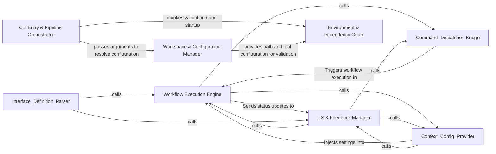

## Details

Acts as the pre-flight controller, initializing the application environment and ensuring all external dependencies are present.

### Workflow Execution Engine
Orchestrates high-level agentic or analytical processes based on validated commands.

**Related Classes/Methods**: _None_

**Source Files:**

- [`codeboarding_workflows/sources/local.py`](https://github.com/CodeBoarding/CodeBoarding/blob/main/.codeboardingcodeboarding_workflows/sources/local.py)
  - `codeboarding_workflows.sources.local.local_source` ([L22-L23](https://github.com/CodeBoarding/CodeBoarding/blob/main/.codeboardingcodeboarding_workflows/sources/local.py#L22-L23)) - Function
- [`main.py`](https://github.com/CodeBoarding/CodeBoarding/blob/main/.codeboardingmain.py)
  - `main._build_shared_parser` ([L11-L22](https://github.com/CodeBoarding/CodeBoarding/blob/main/.codeboardingmain.py#L11-L22)) - Function
  - `main.build_parser` ([L25-L59](https://github.com/CodeBoarding/CodeBoarding/blob/main/.codeboardingmain.py#L25-L59)) - Function
  - `main._inject_default_subcommand` ([L62-L75](https://github.com/CodeBoarding/CodeBoarding/blob/main/.codeboardingmain.py#L62-L75)) - Function

### UX & Feedback Manager
Handles terminal presentation and real-time progress updates for long-running tasks.

**Related Classes/Methods**: _None_

**Source Files:**

- [`main.py`](https://github.com/CodeBoarding/CodeBoarding/blob/main/.codeboardingmain.py)
  - `main.main` ([L78-L91](https://github.com/CodeBoarding/CodeBoarding/blob/main/.codeboardingmain.py#L78-L91)) - Function
- [`repo_utils/ignore.py`](https://github.com/CodeBoarding/CodeBoarding/blob/main/.codeboardingrepo_utils/ignore.py)
  - `repo_utils.ignore.initialize_codeboardingignore` ([L332-L345](https://github.com/CodeBoarding/CodeBoarding/blob/main/.codeboardingrepo_utils/ignore.py#L332-L345)) - Function

### CLI Entry & Pipeline Orchestrator
The primary execution controller that parses command-line arguments, initializes the application state, and triggers the high-level analysis pipeline.

**Related Classes/Methods**:

- `main.main`:78-91

**Source Files:**

- [`codeboarding_cli/commands/full_analysis.py`](https://github.com/CodeBoarding/CodeBoarding/blob/main/.codeboardingcodeboarding_cli/commands/full_analysis.py)
  - `codeboarding_cli.commands.full_analysis._process_one_remote` ([L160-L209](https://github.com/CodeBoarding/CodeBoarding/blob/main/.codeboardingcodeboarding_cli/commands/full_analysis.py#L160-L209)) - Function
  - `codeboarding_cli.commands.full_analysis._process_one_remote.scope` ([L167-L203](https://github.com/CodeBoarding/CodeBoarding/blob/main/.codeboardingcodeboarding_cli/commands/full_analysis.py#L167-L203)) - Function

### Environment & Dependency Guard
A pre-flight validation engine that checks for mandatory external tools and runtime requirements to prevent mid-execution failures.

**Related Classes/Methods**: _None_

**Source Files:**

- [`codeboarding_cli/commands/full_analysis.py`](https://github.com/CodeBoarding/CodeBoarding/blob/main/.codeboardingcodeboarding_cli/commands/full_analysis.py)
  - `codeboarding_cli.commands.full_analysis._run_local` ([L79-L116](https://github.com/CodeBoarding/CodeBoarding/blob/main/.codeboardingcodeboarding_cli/commands/full_analysis.py#L79-L116)) - Function
- [`monitoring/context.py`](https://github.com/CodeBoarding/CodeBoarding/blob/main/.codeboardingmonitoring/context.py)
  - `monitoring.context.monitor_execution.MonitorContext.step` ([L77-L81](https://github.com/CodeBoarding/CodeBoarding/blob/main/.codeboardingmonitoring/context.py#L77-L81)) - Method

### Workspace & Configuration Manager
Handles the resolution of global settings, manages the target repository workspace, and prepares the data structures for storing analysis results.

**Related Classes/Methods**: _None_

**Source Files:**

- [`main.py`](https://github.com/CodeBoarding/CodeBoarding/blob/main/.codeboardingmain.py)
  - `main.main` ([L78-L91](https://github.com/CodeBoarding/CodeBoarding/blob/main/.codeboardingmain.py#L78-L91)) - Function
- [`monitoring/context.py`](https://github.com/CodeBoarding/CodeBoarding/blob/main/.codeboardingmonitoring/context.py)
  - `monitoring.context.monitor_execution.DummyContext.step` ([L33-L34](https://github.com/CodeBoarding/CodeBoarding/blob/main/.codeboardingmonitoring/context.py#L33-L34)) - Method
- [`repo_utils/git_ops.py`](https://github.com/CodeBoarding/CodeBoarding/blob/main/.codeboardingrepo_utils/git_ops.py)
  - `repo_utils.git_ops.get_current_commit` ([L47-L64](https://github.com/CodeBoarding/CodeBoarding/blob/main/.codeboardingrepo_utils/git_ops.py#L47-L64)) - Function

### [FAQ](https://github.com/CodeBoarding/GeneratedOnBoardings/tree/main?tab=readme-ov-file#faq)