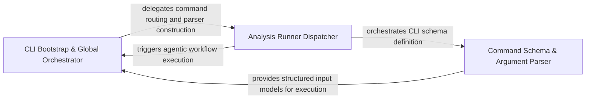

## Details

The primary entry point that defines the CLI interface, parses global and command-specific arguments, and routes execution to the appropriate analysis runner.

### CLI Bootstrap & Global Orchestrator
Acts as the application's 'Front Controller,' responsible for the initial process startup, environment validation, and high-level routing.

**Related Classes/Methods**: _None_

**Source Files:**

- [`codeboarding_cli/commands/full_analysis.py`](https://github.com/CodeBoarding/CodeBoarding/blob/main/.codeboardingcodeboarding_cli/commands/full_analysis.py)
  - `codeboarding_cli.commands.full_analysis.add_arguments` ([L25-L55](https://github.com/CodeBoarding/CodeBoarding/blob/main/.codeboardingcodeboarding_cli/commands/full_analysis.py#L25-L55)) - Function
- [`codeboarding_cli/commands/incremental_analysis.py`](https://github.com/CodeBoarding/CodeBoarding/blob/main/.codeboardingcodeboarding_cli/commands/incremental_analysis.py)
  - `codeboarding_cli.commands.incremental_analysis.add_arguments` ([L18-L23](https://github.com/CodeBoarding/CodeBoarding/blob/main/.codeboardingcodeboarding_cli/commands/incremental_analysis.py#L18-L23)) - Function

### Command Schema & Argument Parser
Defines the structural interface of the CLI, mapping user inputs to internal data models using a modular approach.

**Related Classes/Methods**: _None_

**Source Files:**

- [`codeboarding_cli/commands/partial_analysis.py`](https://github.com/CodeBoarding/CodeBoarding/blob/main/.codeboardingcodeboarding_cli/commands/partial_analysis.py)
  - `codeboarding_cli.commands.partial_analysis.add_arguments` ([L17-L28](https://github.com/CodeBoarding/CodeBoarding/blob/main/.codeboardingcodeboarding_cli/commands/partial_analysis.py#L17-L28)) - Function
- [`main.py`](https://github.com/CodeBoarding/CodeBoarding/blob/main/.codeboardingmain.py)
  - `main._build_shared_parser` ([L12-L23](https://github.com/CodeBoarding/CodeBoarding/blob/main/.codeboardingmain.py#L12-L23)) - Function
  - `main._dispatch` ([L80-L96](https://github.com/CodeBoarding/CodeBoarding/blob/main/.codeboardingmain.py#L80-L96)) - Function

### Analysis Runner Dispatcher
Bridges the CLI layer and core analysis logic, initializing environments and triggering agentic workflows.

**Related Classes/Methods**: _None_

**Source Files:**

- [`main.py`](https://github.com/CodeBoarding/CodeBoarding/blob/main/.codeboardingmain.py)
  - `main.build_parser` ([L26-L61](https://github.com/CodeBoarding/CodeBoarding/blob/main/.codeboardingmain.py#L26-L61)) - Function
  - `main._inject_default_subcommand` ([L64-L77](https://github.com/CodeBoarding/CodeBoarding/blob/main/.codeboardingmain.py#L64-L77)) - Function
  - `main.main` ([L99-L106](https://github.com/CodeBoarding/CodeBoarding/blob/main/.codeboardingmain.py#L99-L106)) - Function

### [FAQ](https://github.com/CodeBoarding/GeneratedOnBoardings/tree/main?tab=readme-ov-file#faq)