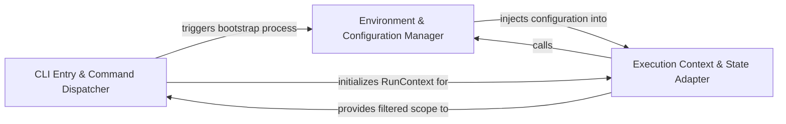

## Details

Manages the CLI lifecycle, including argument parsing, local path resolution, and dispatching to specific command handlers.

### CLI Entry & Command Dispatcher [[Expand]](./CLI_Entry_Command_Dispatcher.md)
Acts as the primary interface for the user, defining CLI grammar, parsing arguments, and routing execution to appropriate command handlers.

**Related Classes/Methods**:

- `main.main`:78-91
- `main.build_parser`:25-59
- `codeboarding_cli.commands.full_analysis.run_from_args`:69-75

**Source Files:**

- [`agents/change_status.py`](https://github.com/CodeBoarding/CodeBoarding/blob/main/.codeboardingagents/change_status.py)
  - `agents.change_status.ChangeStatus` ([L4-L9](https://github.com/CodeBoarding/CodeBoarding/blob/main/.codeboardingagents/change_status.py#L4-L9)) - Class
- [`codeboarding_cli/commands/full_analysis.py`](https://github.com/CodeBoarding/CodeBoarding/blob/main/.codeboardingcodeboarding_cli/commands/full_analysis.py)
  - `codeboarding_cli.commands.full_analysis.add_arguments` ([L24-L50](https://github.com/CodeBoarding/CodeBoarding/blob/main/.codeboardingcodeboarding_cli/commands/full_analysis.py#L24-L50)) - Function
  - `codeboarding_cli.commands.full_analysis.validate_arguments` ([L53-L66](https://github.com/CodeBoarding/CodeBoarding/blob/main/.codeboardingcodeboarding_cli/commands/full_analysis.py#L53-L66)) - Function
  - `codeboarding_cli.commands.full_analysis.run_from_args` ([L69-L75](https://github.com/CodeBoarding/CodeBoarding/blob/main/.codeboardingcodeboarding_cli/commands/full_analysis.py#L69-L75)) - Function
  - `codeboarding_cli.commands.full_analysis._run_local` ([L78-L113](https://github.com/CodeBoarding/CodeBoarding/blob/main/.codeboardingcodeboarding_cli/commands/full_analysis.py#L78-L113)) - Function
  - `codeboarding_cli.commands.full_analysis._run_remote` ([L116-L154](https://github.com/CodeBoarding/CodeBoarding/blob/main/.codeboardingcodeboarding_cli/commands/full_analysis.py#L116-L154)) - Function
  - `codeboarding_cli.commands.full_analysis._process_one_remote` ([L157-L206](https://github.com/CodeBoarding/CodeBoarding/blob/main/.codeboardingcodeboarding_cli/commands/full_analysis.py#L157-L206)) - Function
- [`codeboarding_cli/commands/partial_analysis.py`](https://github.com/CodeBoarding/CodeBoarding/blob/main/.codeboardingcodeboarding_cli/commands/partial_analysis.py)
  - `codeboarding_cli.commands.partial_analysis.add_arguments` ([L15-L26](https://github.com/CodeBoarding/CodeBoarding/blob/main/.codeboardingcodeboarding_cli/commands/partial_analysis.py#L15-L26)) - Function
  - `codeboarding_cli.commands.partial_analysis.validate_arguments` ([L29-L31](https://github.com/CodeBoarding/CodeBoarding/blob/main/.codeboardingcodeboarding_cli/commands/partial_analysis.py#L29-L31)) - Function
  - `codeboarding_cli.commands.partial_analysis.run_from_args` ([L34-L68](https://github.com/CodeBoarding/CodeBoarding/blob/main/.codeboardingcodeboarding_cli/commands/partial_analysis.py#L34-L68)) - Function
- [`codeboarding_workflows/orchestration.py`](https://github.com/CodeBoarding/CodeBoarding/blob/main/.codeboardingcodeboarding_workflows/orchestration.py)
  - `codeboarding_workflows.orchestration.run_analysis_pipeline` ([L25-L48](https://github.com/CodeBoarding/CodeBoarding/blob/main/.codeboardingcodeboarding_workflows/orchestration.py#L25-L48)) - Function
- [`codeboarding_workflows/sources/local.py`](https://github.com/CodeBoarding/CodeBoarding/blob/main/.codeboardingcodeboarding_workflows/sources/local.py)
  - `codeboarding_workflows.sources.local.local_source` ([L22-L23](https://github.com/CodeBoarding/CodeBoarding/blob/main/.codeboardingcodeboarding_workflows/sources/local.py#L22-L23)) - Function
- [`constants.py`](https://github.com/CodeBoarding/CodeBoarding/blob/main/.codeboardingconstants.py)
  - `constants.AppConfig` ([L4-L8](https://github.com/CodeBoarding/CodeBoarding/blob/main/.codeboardingconstants.py#L4-L8)) - Class
- [`diagram_analysis/run_mode.py`](https://github.com/CodeBoarding/CodeBoarding/blob/main/.codeboardingdiagram_analysis/run_mode.py)
  - `diagram_analysis.run_mode.RunMode` ([L8-L10](https://github.com/CodeBoarding/CodeBoarding/blob/main/.codeboardingdiagram_analysis/run_mode.py#L8-L10)) - Class
- [`main.py`](https://github.com/CodeBoarding/CodeBoarding/blob/main/.codeboardingmain.py)
  - `main._build_shared_parser` ([L11-L22](https://github.com/CodeBoarding/CodeBoarding/blob/main/.codeboardingmain.py#L11-L22)) - Function
  - `main.build_parser` ([L25-L59](https://github.com/CodeBoarding/CodeBoarding/blob/main/.codeboardingmain.py#L25-L59)) - Function
  - `main._inject_default_subcommand` ([L62-L75](https://github.com/CodeBoarding/CodeBoarding/blob/main/.codeboardingmain.py#L62-L75)) - Function
  - `main.main` ([L78-L91](https://github.com/CodeBoarding/CodeBoarding/blob/main/.codeboardingmain.py#L78-L91)) - Function
- [`repo_utils/ignore.py`](https://github.com/CodeBoarding/CodeBoarding/blob/main/.codeboardingrepo_utils/ignore.py)
  - `repo_utils.ignore.initialize_codeboardingignore` ([L332-L345](https://github.com/CodeBoarding/CodeBoarding/blob/main/.codeboardingrepo_utils/ignore.py#L332-L345)) - Function
- [`static_analyzer/engine/lsp_constants.py`](https://github.com/CodeBoarding/CodeBoarding/blob/main/.codeboardingstatic_analyzer/engine/lsp_constants.py)
  - `static_analyzer.engine.lsp_constants.EdgeStrategy` ([L29-L33](https://github.com/CodeBoarding/CodeBoarding/blob/main/.codeboardingstatic_analyzer/engine/lsp_constants.py#L29-L33)) - Class

### Environment & Configuration Manager [[Expand]](./Environment_Configuration_Manager.md)
Handles the pre-flight phase, resolving local paths, loading configuration files, and initializing LLM provider settings.

**Related Classes/Methods**:

- `codeboarding_cli.bootstrap.bootstrap_environment`:38-53
- `user_config.UserConfig`:114-123
- `agents.llm_config.configure_models`:54-80

**Source Files:**

- [`agents/constants.py`](https://github.com/CodeBoarding/CodeBoarding/blob/main/.codeboardingagents/constants.py)
  - `agents.constants.LLMDefaults` ([L4-L7](https://github.com/CodeBoarding/CodeBoarding/blob/main/.codeboardingagents/constants.py#L4-L7)) - Class
  - `agents.constants.FileStructureConfig` ([L10-L13](https://github.com/CodeBoarding/CodeBoarding/blob/main/.codeboardingagents/constants.py#L10-L13)) - Class
  - `agents.constants.ModelCapabilities` ([L16-L38](https://github.com/CodeBoarding/CodeBoarding/blob/main/.codeboardingagents/constants.py#L16-L38)) - Class
- [`agents/llm_config.py`](https://github.com/CodeBoarding/CodeBoarding/blob/main/.codeboardingagents/llm_config.py)
  - `agents.llm_config.configure_models` ([L54-L80](https://github.com/CodeBoarding/CodeBoarding/blob/main/.codeboardingagents/llm_config.py#L54-L80)) - Function
- [`codeboarding_cli/bootstrap.py`](https://github.com/CodeBoarding/CodeBoarding/blob/main/.codeboardingcodeboarding_cli/bootstrap.py)
  - `codeboarding_cli.bootstrap.LocalRunPaths` ([L18-L23](https://github.com/CodeBoarding/CodeBoarding/blob/main/.codeboardingcodeboarding_cli/bootstrap.py#L18-L23)) - Class
  - `codeboarding_cli.bootstrap.resolve_local_run_paths` ([L26-L35](https://github.com/CodeBoarding/CodeBoarding/blob/main/.codeboardingcodeboarding_cli/bootstrap.py#L26-L35)) - Function
  - `codeboarding_cli.bootstrap.bootstrap_environment` ([L38-L53](https://github.com/CodeBoarding/CodeBoarding/blob/main/.codeboardingcodeboarding_cli/bootstrap.py#L38-L53)) - Function
- [`core/plugin_loader.py`](https://github.com/CodeBoarding/CodeBoarding/blob/main/.codeboardingcore/plugin_loader.py)
  - `core.plugin_loader.load_plugins` ([L17-L46](https://github.com/CodeBoarding/CodeBoarding/blob/main/.codeboardingcore/plugin_loader.py#L17-L46)) - Function
- [`diagram_analysis/__init__.py`](https://github.com/CodeBoarding/CodeBoarding/blob/main/.codeboardingdiagram_analysis/__init__.py)
  - `diagram_analysis.__init__.__getattr__` ([L6-L22](https://github.com/CodeBoarding/CodeBoarding/blob/main/.codeboardingdiagram_analysis/__init__.py#L6-L22)) - Function
- [`user_config.py`](https://github.com/CodeBoarding/CodeBoarding/blob/main/.codeboardinguser_config.py)
  - `user_config.UserConfig.apply_to_env` ([L118-L123](https://github.com/CodeBoarding/CodeBoarding/blob/main/.codeboardinguser_config.py#L118-L123)) - Method
  - `user_config.ensure_config_template` ([L163-L169](https://github.com/CodeBoarding/CodeBoarding/blob/main/.codeboardinguser_config.py#L163-L169)) - Function
  - `user_config._append_commented_key` ([L172-L181](https://github.com/CodeBoarding/CodeBoarding/blob/main/.codeboardinguser_config.py#L172-L181)) - Function

### Execution Context & State Adapter [[Expand]](./Execution_Context_State_Adapter.md)
Manages stateful aspects of a run, particularly for incremental analysis, and interfaces with language-specific adapters to understand codebase state.

**Related Classes/Methods**:

- `codeboarding_cli.commands.incremental_analysis.run_from_args`:44-123
- `diagram_analysis.run_context.RunContext`:13-40
- `static_analyzer.engine.adapters.python_adapter.PythonAdapter`:10-57

**Source Files:**

- [`codeboarding_cli/commands/incremental_analysis.py`](https://github.com/CodeBoarding/CodeBoarding/blob/main/.codeboardingcodeboarding_cli/commands/incremental_analysis.py)
  - `codeboarding_cli.commands.incremental_analysis.add_arguments` ([L19-L36](https://github.com/CodeBoarding/CodeBoarding/blob/main/.codeboardingcodeboarding_cli/commands/incremental_analysis.py#L19-L36)) - Function
  - `codeboarding_cli.commands.incremental_analysis.validate_arguments` ([L39-L41](https://github.com/CodeBoarding/CodeBoarding/blob/main/.codeboardingcodeboarding_cli/commands/incremental_analysis.py#L39-L41)) - Function
  - `codeboarding_cli.commands.incremental_analysis.run_from_args` ([L44-L123](https://github.com/CodeBoarding/CodeBoarding/blob/main/.codeboardingcodeboarding_cli/commands/incremental_analysis.py#L44-L123)) - Function
  - `codeboarding_cli.commands.incremental_analysis._emit_error` ([L126-L133](https://github.com/CodeBoarding/CodeBoarding/blob/main/.codeboardingcodeboarding_cli/commands/incremental_analysis.py#L126-L133)) - Function
  - `codeboarding_cli.commands.incremental_analysis._emit` ([L136-L139](https://github.com/CodeBoarding/CodeBoarding/blob/main/.codeboardingcodeboarding_cli/commands/incremental_analysis.py#L136-L139)) - Function
- [`diagram_analysis/io_utils.py`](https://github.com/CodeBoarding/CodeBoarding/blob/main/.codeboardingdiagram_analysis/io_utils.py)
  - `diagram_analysis.io_utils._AnalysisFileStore.__init__` ([L73-L79](https://github.com/CodeBoarding/CodeBoarding/blob/main/.codeboardingdiagram_analysis/io_utils.py#L73-L79)) - Method
  - `diagram_analysis.io_utils.load_analysis_commit_hash` ([L322-L349](https://github.com/CodeBoarding/CodeBoarding/blob/main/.codeboardingdiagram_analysis/io_utils.py#L322-L349)) - Function
  - `diagram_analysis.io_utils.load_snapshot_commit` ([L352-L374](https://github.com/CodeBoarding/CodeBoarding/blob/main/.codeboardingdiagram_analysis/io_utils.py#L352-L374)) - Function
- [`diagram_analysis/run_context.py`](https://github.com/CodeBoarding/CodeBoarding/blob/main/.codeboardingdiagram_analysis/run_context.py)
  - `diagram_analysis.run_context.RunContext.finalize` ([L38-L40](https://github.com/CodeBoarding/CodeBoarding/blob/main/.codeboardingdiagram_analysis/run_context.py#L38-L40)) - Method
- [`static_analyzer/engine/adapters/python_adapter.py`](https://github.com/CodeBoarding/CodeBoarding/blob/main/.codeboardingstatic_analyzer/engine/adapters/python_adapter.py)
  - `static_analyzer.engine.adapters.python_adapter.PythonAdapter` ([L10-L57](https://github.com/CodeBoarding/CodeBoarding/blob/main/.codeboardingstatic_analyzer/engine/adapters/python_adapter.py#L10-L57)) - Class
  - `static_analyzer.engine.adapters.python_adapter.PythonAdapter.language` ([L13-L14](https://github.com/CodeBoarding/CodeBoarding/blob/main/.codeboardingstatic_analyzer/engine/adapters/python_adapter.py#L13-L14)) - Method
  - `static_analyzer.engine.adapters.python_adapter.PythonAdapter.language_enum` ([L17-L18](https://github.com/CodeBoarding/CodeBoarding/blob/main/.codeboardingstatic_analyzer/engine/adapters/python_adapter.py#L17-L18)) - Method
  - `static_analyzer.engine.adapters.python_adapter.PythonAdapter.lsp_command` ([L21-L22](https://github.com/CodeBoarding/CodeBoarding/blob/main/.codeboardingstatic_analyzer/engine/adapters/python_adapter.py#L21-L22)) - Method
  - `static_analyzer.engine.adapters.python_adapter.PythonAdapter.language_id` ([L25-L26](https://github.com/CodeBoarding/CodeBoarding/blob/main/.codeboardingstatic_analyzer/engine/adapters/python_adapter.py#L25-L26)) - Method
  - `static_analyzer.engine.adapters.python_adapter.PythonAdapter.get_lsp_init_options` ([L28-L37](https://github.com/CodeBoarding/CodeBoarding/blob/main/.codeboardingstatic_analyzer/engine/adapters/python_adapter.py#L28-L37)) - Method
  - `static_analyzer.engine.adapters.python_adapter.PythonAdapter.get_workspace_settings` ([L39-L57](https://github.com/CodeBoarding/CodeBoarding/blob/main/.codeboardingstatic_analyzer/engine/adapters/python_adapter.py#L39-L57)) - Method
- [`utils.py`](https://github.com/CodeBoarding/CodeBoarding/blob/main/.codeboardingutils.py)
  - `utils.CFGGenerationError` ([L16-L17](https://github.com/CodeBoarding/CodeBoarding/blob/main/.codeboardingutils.py#L16-L17)) - Class
  - `utils.monitoring_enabled` ([L74-L76](https://github.com/CodeBoarding/CodeBoarding/blob/main/.codeboardingutils.py#L74-L76)) - Function

### [FAQ](https://github.com/CodeBoarding/GeneratedOnBoardings/tree/main?tab=readme-ov-file#faq)