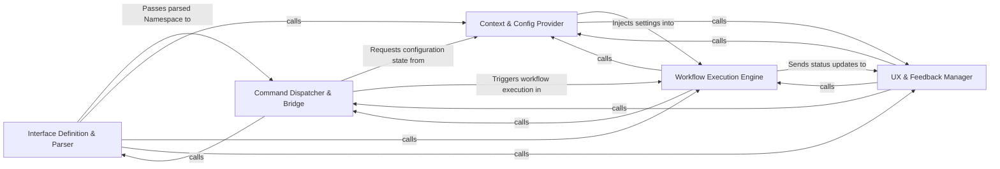

## Details

Acts as the primary interface for the user, defining CLI grammar, parsing arguments, and routing execution to appropriate command handlers.

### Interface Definition & Parser
Defines the CLI structure, commands, and global flags, ensuring input conforms to the application grammar.

**Related Classes/Methods**:

- `main.build_parser`:25-59
- `main.main`:78-91

**Source Files:**

- [`agents/change_status.py`](https://github.com/CodeBoarding/CodeBoarding/blob/main/.codeboardingagents/change_status.py)
  - `agents.change_status.ChangeStatus` ([L4-L9](https://github.com/CodeBoarding/CodeBoarding/blob/main/.codeboardingagents/change_status.py#L4-L9)) - Class
- [`codeboarding_cli/commands/full_analysis.py`](https://github.com/CodeBoarding/CodeBoarding/blob/main/.codeboardingcodeboarding_cli/commands/full_analysis.py)
  - `codeboarding_cli.commands.full_analysis._run_local` ([L78-L113](https://github.com/CodeBoarding/CodeBoarding/blob/main/.codeboardingcodeboarding_cli/commands/full_analysis.py#L78-L113)) - Function
  - `codeboarding_cli.commands.full_analysis._process_one_remote` ([L157-L206](https://github.com/CodeBoarding/CodeBoarding/blob/main/.codeboardingcodeboarding_cli/commands/full_analysis.py#L157-L206)) - Function
- [`constants.py`](https://github.com/CodeBoarding/CodeBoarding/blob/main/.codeboardingconstants.py)
  - `constants.AppConfig` ([L4-L8](https://github.com/CodeBoarding/CodeBoarding/blob/main/.codeboardingconstants.py#L4-L8)) - Class
- [`diagram_analysis/run_mode.py`](https://github.com/CodeBoarding/CodeBoarding/blob/main/.codeboardingdiagram_analysis/run_mode.py)
  - `diagram_analysis.run_mode.RunMode` ([L8-L10](https://github.com/CodeBoarding/CodeBoarding/blob/main/.codeboardingdiagram_analysis/run_mode.py#L8-L10)) - Class
- [`static_analyzer/engine/lsp_constants.py`](https://github.com/CodeBoarding/CodeBoarding/blob/main/.codeboardingstatic_analyzer/engine/lsp_constants.py)
  - `static_analyzer.engine.lsp_constants.EdgeStrategy` ([L29-L33](https://github.com/CodeBoarding/CodeBoarding/blob/main/.codeboardingstatic_analyzer/engine/lsp_constants.py#L29-L33)) - Class

### Command Dispatcher & Bridge
Maps parsed CLI arguments to specific executable logic and invokes command handlers.

**Related Classes/Methods**:

- `codeboarding_cli.commands.full_analysis.run_from_args`:69-75

**Source Files:**

- [`codeboarding_cli/commands/full_analysis.py`](https://github.com/CodeBoarding/CodeBoarding/blob/main/.codeboardingcodeboarding_cli/commands/full_analysis.py)
  - `codeboarding_cli.commands.full_analysis.add_arguments` ([L24-L50](https://github.com/CodeBoarding/CodeBoarding/blob/main/.codeboardingcodeboarding_cli/commands/full_analysis.py#L24-L50)) - Function
  - `codeboarding_cli.commands.full_analysis.validate_arguments` ([L53-L66](https://github.com/CodeBoarding/CodeBoarding/blob/main/.codeboardingcodeboarding_cli/commands/full_analysis.py#L53-L66)) - Function
  - `codeboarding_cli.commands.full_analysis.run_from_args` ([L69-L75](https://github.com/CodeBoarding/CodeBoarding/blob/main/.codeboardingcodeboarding_cli/commands/full_analysis.py#L69-L75)) - Function
  - `codeboarding_cli.commands.full_analysis._run_remote` ([L116-L154](https://github.com/CodeBoarding/CodeBoarding/blob/main/.codeboardingcodeboarding_cli/commands/full_analysis.py#L116-L154)) - Function

### Context & Config Provider
Resolves operational state by merging CLI flags, TOML files, and environment variables.

**Related Classes/Methods**: _None_

**Source Files:**

- [`codeboarding_cli/commands/partial_analysis.py`](https://github.com/CodeBoarding/CodeBoarding/blob/main/.codeboardingcodeboarding_cli/commands/partial_analysis.py)
  - `codeboarding_cli.commands.partial_analysis.add_arguments` ([L15-L26](https://github.com/CodeBoarding/CodeBoarding/blob/main/.codeboardingcodeboarding_cli/commands/partial_analysis.py#L15-L26)) - Function
  - `codeboarding_cli.commands.partial_analysis.validate_arguments` ([L29-L31](https://github.com/CodeBoarding/CodeBoarding/blob/main/.codeboardingcodeboarding_cli/commands/partial_analysis.py#L29-L31)) - Function
  - `codeboarding_cli.commands.partial_analysis.run_from_args` ([L34-L68](https://github.com/CodeBoarding/CodeBoarding/blob/main/.codeboardingcodeboarding_cli/commands/partial_analysis.py#L34-L68)) - Function
- [`codeboarding_workflows/orchestration.py`](https://github.com/CodeBoarding/CodeBoarding/blob/main/.codeboardingcodeboarding_workflows/orchestration.py)
  - `codeboarding_workflows.orchestration.run_analysis_pipeline` ([L25-L48](https://github.com/CodeBoarding/CodeBoarding/blob/main/.codeboardingcodeboarding_workflows/orchestration.py#L25-L48)) - Function

### Workflow Execution Engine
Orchestrates high-level agentic or analytical processes based on validated commands.

**Related Classes/Methods**: _None_

**Source Files:**

- [`codeboarding_workflows/sources/local.py`](https://github.com/CodeBoarding/CodeBoarding/blob/main/.codeboardingcodeboarding_workflows/sources/local.py)
  - `codeboarding_workflows.sources.local.local_source` ([L22-L23](https://github.com/CodeBoarding/CodeBoarding/blob/main/.codeboardingcodeboarding_workflows/sources/local.py#L22-L23)) - Function
- [`main.py`](https://github.com/CodeBoarding/CodeBoarding/blob/main/.codeboardingmain.py)
  - `main._build_shared_parser` ([L11-L22](https://github.com/CodeBoarding/CodeBoarding/blob/main/.codeboardingmain.py#L11-L22)) - Function
  - `main.build_parser` ([L25-L59](https://github.com/CodeBoarding/CodeBoarding/blob/main/.codeboardingmain.py#L25-L59)) - Function
  - `main._inject_default_subcommand` ([L62-L75](https://github.com/CodeBoarding/CodeBoarding/blob/main/.codeboardingmain.py#L62-L75)) - Function

### UX & Feedback Manager
Handles terminal presentation and real-time progress updates for long-running tasks.

**Related Classes/Methods**: _None_

**Source Files:**

- [`main.py`](https://github.com/CodeBoarding/CodeBoarding/blob/main/.codeboardingmain.py)
  - `main.main` ([L78-L91](https://github.com/CodeBoarding/CodeBoarding/blob/main/.codeboardingmain.py#L78-L91)) - Function
- [`repo_utils/ignore.py`](https://github.com/CodeBoarding/CodeBoarding/blob/main/.codeboardingrepo_utils/ignore.py)
  - `repo_utils.ignore.initialize_codeboardingignore` ([L332-L345](https://github.com/CodeBoarding/CodeBoarding/blob/main/.codeboardingrepo_utils/ignore.py#L332-L345)) - Function

### [FAQ](https://github.com/CodeBoarding/GeneratedOnBoardings/tree/main?tab=readme-ov-file#faq)