```mermaid
graph LR
    CLI_Bootstrap_Environment_Validator["CLI Bootstrap & Environment Validator"]
    Command_Strategy_Dispatcher["Command Strategy Dispatcher"]
    Analysis_Orchestrator["Analysis Orchestrator"]
    UX_Presentation_Layer["UX & Presentation Layer"]
    CLI_Bootstrap_Environment_Validator -- "initializes execution context for" --> Command_Strategy_Dispatcher
    CLI_Bootstrap_Environment_Validator -- "configures terminal output and UI state" --> UX_Presentation_Layer
    Command_Strategy_Dispatcher -- "triggers environment-specific execution loops" --> CLI_Bootstrap_Environment_Validator
    Command_Strategy_Dispatcher -- "delegates analysis parameters to" --> Analysis_Orchestrator
    Analysis_Orchestrator -- "streams progress updates and final results to" --> UX_Presentation_Layer
    click CLI_Bootstrap_Environment_Validator href "https://github.com/CodeBoarding/CodeBoarding/blob/main/.codeboarding/CLI_Bootstrap_Environment_Validator.md" "Details"
    click Command_Strategy_Dispatcher href "https://github.com/CodeBoarding/CodeBoarding/blob/main/.codeboarding/Command_Strategy_Dispatcher.md" "Details"
    click Analysis_Orchestrator href "https://github.com/CodeBoarding/CodeBoarding/blob/main/.codeboarding/Analysis_Orchestrator.md" "Details"
    click UX_Presentation_Layer href "https://github.com/CodeBoarding/CodeBoarding/blob/main/.codeboarding/UX_Presentation_Layer.md" "Details"
```

## Details

Acts as the primary interface between the user and the application, parsing command-line arguments and mapping them to execution strategies.

### CLI Bootstrap & Environment Validator [[Expand]](./CLI_Bootstrap_Environment_Validator.md)
Acts as the pre-flight controller, initializing the application environment and ensuring all external dependencies are present.

**Related Classes/Methods**:

- `main.main`:78-91

**Source Files:**

- [`codeboarding_cli/commands/full_analysis.py`](https://github.com/CodeBoarding/CodeBoarding/blob/main/.codeboardingcodeboarding_cli/commands/full_analysis.py)
  - `codeboarding_cli.commands.full_analysis._run_local` ([L79-L116](https://github.com/CodeBoarding/CodeBoarding/blob/main/.codeboardingcodeboarding_cli/commands/full_analysis.py#L79-L116)) - Function
  - `codeboarding_cli.commands.full_analysis._process_one_remote` ([L160-L209](https://github.com/CodeBoarding/CodeBoarding/blob/main/.codeboardingcodeboarding_cli/commands/full_analysis.py#L160-L209)) - Function
  - `codeboarding_cli.commands.full_analysis._process_one_remote.scope` ([L167-L203](https://github.com/CodeBoarding/CodeBoarding/blob/main/.codeboardingcodeboarding_cli/commands/full_analysis.py#L167-L203)) - Function
- [`main.py`](https://github.com/CodeBoarding/CodeBoarding/blob/main/.codeboardingmain.py)
  - `main.main` ([L78-L91](https://github.com/CodeBoarding/CodeBoarding/blob/main/.codeboardingmain.py#L78-L91)) - Function
- [`monitoring/context.py`](https://github.com/CodeBoarding/CodeBoarding/blob/main/.codeboardingmonitoring/context.py)
  - `monitoring.context.monitor_execution.DummyContext.step` ([L33-L34](https://github.com/CodeBoarding/CodeBoarding/blob/main/.codeboardingmonitoring/context.py#L33-L34)) - Method
  - `monitoring.context.monitor_execution.MonitorContext.step` ([L77-L81](https://github.com/CodeBoarding/CodeBoarding/blob/main/.codeboardingmonitoring/context.py#L77-L81)) - Method
- [`repo_utils/git_ops.py`](https://github.com/CodeBoarding/CodeBoarding/blob/main/.codeboardingrepo_utils/git_ops.py)
  - `repo_utils.git_ops.get_current_commit` ([L47-L64](https://github.com/CodeBoarding/CodeBoarding/blob/main/.codeboardingrepo_utils/git_ops.py#L47-L64)) - Function

### Command Strategy Dispatcher [[Expand]](./Command_Strategy_Dispatcher.md)
Maps parsed CLI arguments into specific execution strategies, acting as a bridge between user input and internal analysis parameters.

**Related Classes/Methods**:

- `codeboarding_cli.commands.full_analysis.run_from_args`:70-76
- `codeboarding_cli.commands.incremental_analysis.run_from_args`:45-126

**Source Files:**

- [`codeboarding_cli/commands/full_analysis.py`](https://github.com/CodeBoarding/CodeBoarding/blob/main/.codeboardingcodeboarding_cli/commands/full_analysis.py)
  - `codeboarding_cli.commands.full_analysis.add_arguments` ([L25-L51](https://github.com/CodeBoarding/CodeBoarding/blob/main/.codeboardingcodeboarding_cli/commands/full_analysis.py#L25-L51)) - Function
  - `codeboarding_cli.commands.full_analysis.validate_arguments` ([L54-L67](https://github.com/CodeBoarding/CodeBoarding/blob/main/.codeboardingcodeboarding_cli/commands/full_analysis.py#L54-L67)) - Function
  - `codeboarding_cli.commands.full_analysis.run_from_args` ([L70-L76](https://github.com/CodeBoarding/CodeBoarding/blob/main/.codeboardingcodeboarding_cli/commands/full_analysis.py#L70-L76)) - Function
  - `codeboarding_cli.commands.full_analysis._run_local.scope` ([L93-L104](https://github.com/CodeBoarding/CodeBoarding/blob/main/.codeboardingcodeboarding_cli/commands/full_analysis.py#L93-L104)) - Function
  - `codeboarding_cli.commands.full_analysis._run_remote` ([L119-L157](https://github.com/CodeBoarding/CodeBoarding/blob/main/.codeboardingcodeboarding_cli/commands/full_analysis.py#L119-L157)) - Function

### Analysis Orchestrator [[Expand]](./Analysis_Orchestrator.md)
The central execution engine that coordinates interactions between repository managers, LSP clients, and context builders.

**Related Classes/Methods**: _None_

**Source Files:**

- [`codeboarding_cli/commands/incremental_analysis.py`](https://github.com/CodeBoarding/CodeBoarding/blob/main/.codeboardingcodeboarding_cli/commands/incremental_analysis.py)
  - `codeboarding_cli.commands.incremental_analysis.add_arguments` ([L20-L37](https://github.com/CodeBoarding/CodeBoarding/blob/main/.codeboardingcodeboarding_cli/commands/incremental_analysis.py#L20-L37)) - Function
  - `codeboarding_cli.commands.incremental_analysis.validate_arguments` ([L40-L42](https://github.com/CodeBoarding/CodeBoarding/blob/main/.codeboardingcodeboarding_cli/commands/incremental_analysis.py#L40-L42)) - Function
  - `codeboarding_cli.commands.incremental_analysis.run_from_args` ([L45-L126](https://github.com/CodeBoarding/CodeBoarding/blob/main/.codeboardingcodeboarding_cli/commands/incremental_analysis.py#L45-L126)) - Function
  - `codeboarding_cli.commands.incremental_analysis._emit_error` ([L129-L136](https://github.com/CodeBoarding/CodeBoarding/blob/main/.codeboardingcodeboarding_cli/commands/incremental_analysis.py#L129-L136)) - Function
  - `codeboarding_cli.commands.incremental_analysis._emit` ([L139-L142](https://github.com/CodeBoarding/CodeBoarding/blob/main/.codeboardingcodeboarding_cli/commands/incremental_analysis.py#L139-L142)) - Function
- [`codeboarding_cli/commands/partial_analysis.py`](https://github.com/CodeBoarding/CodeBoarding/blob/main/.codeboardingcodeboarding_cli/commands/partial_analysis.py)
  - `codeboarding_cli.commands.partial_analysis.add_arguments` ([L17-L28](https://github.com/CodeBoarding/CodeBoarding/blob/main/.codeboardingcodeboarding_cli/commands/partial_analysis.py#L17-L28)) - Function

### UX & Presentation Layer [[Expand]](./UX_Presentation_Layer.md)
Manages user perception of the analysis process, handling real-time progress updates and final result rendering.

**Related Classes/Methods**: _None_

**Source Files:**

- [`codeboarding_cli/commands/partial_analysis.py`](https://github.com/CodeBoarding/CodeBoarding/blob/main/.codeboardingcodeboarding_cli/commands/partial_analysis.py)
  - `codeboarding_cli.commands.partial_analysis.validate_arguments` ([L31-L33](https://github.com/CodeBoarding/CodeBoarding/blob/main/.codeboardingcodeboarding_cli/commands/partial_analysis.py#L31-L33)) - Function
  - `codeboarding_cli.commands.partial_analysis.run_from_args` ([L36-L72](https://github.com/CodeBoarding/CodeBoarding/blob/main/.codeboardingcodeboarding_cli/commands/partial_analysis.py#L36-L72)) - Function
  - `codeboarding_cli.commands.partial_analysis.run_from_args.scope` ([L51-L59](https://github.com/CodeBoarding/CodeBoarding/blob/main/.codeboardingcodeboarding_cli/commands/partial_analysis.py#L51-L59)) - Function
- [`codeboarding_cli/view_instructions.py`](https://github.com/CodeBoarding/CodeBoarding/blob/main/.codeboardingcodeboarding_cli/view_instructions.py)
  - `codeboarding_cli.view_instructions.print_view_instructions` ([L20-L41](https://github.com/CodeBoarding/CodeBoarding/blob/main/.codeboardingcodeboarding_cli/view_instructions.py#L20-L41)) - Function
- [`main.py`](https://github.com/CodeBoarding/CodeBoarding/blob/main/.codeboardingmain.py)
  - `main._build_shared_parser` ([L11-L22](https://github.com/CodeBoarding/CodeBoarding/blob/main/.codeboardingmain.py#L11-L22)) - Function
  - `main.build_parser` ([L25-L59](https://github.com/CodeBoarding/CodeBoarding/blob/main/.codeboardingmain.py#L25-L59)) - Function
  - `main._inject_default_subcommand` ([L62-L75](https://github.com/CodeBoarding/CodeBoarding/blob/main/.codeboardingmain.py#L62-L75)) - Function

### [FAQ](https://github.com/CodeBoarding/GeneratedOnBoardings/tree/main?tab=readme-ov-file#faq)