```mermaid
graph LR
    CLI_Command_Dispatcher["CLI Command Dispatcher"]
    Environment_Plugin_Bootstrapper["Environment & Plugin Bootstrapper"]
    Analysis_Execution_Bridge["Analysis Execution Bridge"]
    Workflow_Orchestrator_Context_Manager["Workflow Orchestrator & Context Manager"]
    CLI_Command_Dispatcher -- "dispatches parsed arguments to command logic" --> Analysis_Execution_Bridge
    Environment_Plugin_Bootstrapper -- "configures global state and plugin registry" --> Workflow_Orchestrator_Context_Manager
    Analysis_Execution_Bridge -- "triggers runtime environment preparation" --> Environment_Plugin_Bootstrapper
    Analysis_Execution_Bridge -- "initiates orchestrated analysis pipeline" --> Workflow_Orchestrator_Context_Manager
    click CLI_Command_Dispatcher href "https://github.com/CodeBoarding/CodeBoarding/blob/main/.codeboarding/CLI_Command_Dispatcher.md" "Details"
    click Environment_Plugin_Bootstrapper href "https://github.com/CodeBoarding/CodeBoarding/blob/main/.codeboarding/Environment_Plugin_Bootstrapper.md" "Details"
    click Analysis_Execution_Bridge href "https://github.com/CodeBoarding/CodeBoarding/blob/main/.codeboarding/Analysis_Execution_Bridge.md" "Details"
    click Workflow_Orchestrator_Context_Manager href "https://github.com/CodeBoarding/CodeBoarding/blob/main/.codeboarding/Workflow_Orchestrator_Context_Manager.md" "Details"
```

## Details

Acts as the entry point for the system, responsible for parsing user intent, validating the local environment, and bootstrapping the necessary configurations for the analysis run.

### CLI Command Dispatcher [[Expand]](./CLI_Command_Dispatcher.md)
The primary entry point that defines the CLI interface, parses global and command-specific arguments, and routes execution to the appropriate analysis runner.

**Related Classes/Methods**:

- `main.main`:98-105
- `main._dispatch`:79-95
- `codeboarding_cli.commands.full_analysis.add_arguments`:25-51

**Source Files:**

- [`codeboarding_cli/commands/full_analysis.py`](https://github.com/CodeBoarding/CodeBoarding/blob/main/.codeboardingcodeboarding_cli/commands/full_analysis.py)
  - `codeboarding_cli.commands.full_analysis.add_arguments` ([L25-L51](https://github.com/CodeBoarding/CodeBoarding/blob/main/.codeboardingcodeboarding_cli/commands/full_analysis.py#L25-L51)) - Function
- [`codeboarding_cli/commands/incremental_analysis.py`](https://github.com/CodeBoarding/CodeBoarding/blob/main/.codeboardingcodeboarding_cli/commands/incremental_analysis.py)
  - `codeboarding_cli.commands.incremental_analysis.add_arguments` ([L18-L23](https://github.com/CodeBoarding/CodeBoarding/blob/main/.codeboardingcodeboarding_cli/commands/incremental_analysis.py#L18-L23)) - Function
- [`codeboarding_cli/commands/partial_analysis.py`](https://github.com/CodeBoarding/CodeBoarding/blob/main/.codeboardingcodeboarding_cli/commands/partial_analysis.py)
  - `codeboarding_cli.commands.partial_analysis.add_arguments` ([L17-L28](https://github.com/CodeBoarding/CodeBoarding/blob/main/.codeboardingcodeboarding_cli/commands/partial_analysis.py#L17-L28)) - Function
- [`main.py`](https://github.com/CodeBoarding/CodeBoarding/blob/main/.codeboardingmain.py)
  - `main._build_shared_parser` ([L12-L23](https://github.com/CodeBoarding/CodeBoarding/blob/main/.codeboardingmain.py#L12-L23)) - Function
  - `main.build_parser` ([L26-L60](https://github.com/CodeBoarding/CodeBoarding/blob/main/.codeboardingmain.py#L26-L60)) - Function
  - `main._inject_default_subcommand` ([L63-L76](https://github.com/CodeBoarding/CodeBoarding/blob/main/.codeboardingmain.py#L63-L76)) - Function
  - `main._dispatch` ([L79-L95](https://github.com/CodeBoarding/CodeBoarding/blob/main/.codeboardingmain.py#L79-L95)) - Function
  - `main.main` ([L98-L105](https://github.com/CodeBoarding/CodeBoarding/blob/main/.codeboardingmain.py#L98-L105)) - Function

### Environment & Plugin Bootstrapper [[Expand]](./Environment_Plugin_Bootstrapper.md)
Responsible for pre-flight operations, including loading user configurations, initializing LLM providers, and dynamically loading plugins to ensure system state validity.

**Related Classes/Methods**:

- `codeboarding_cli.bootstrap.bootstrap_environment`:29-44
- `user_config.UserConfig.apply_to_env`:120-125
- `agents.llm_config.configure_models`:54-80
- `core.plugin_loader.load_plugins`:17-46

**Source Files:**

- [`agents/llm_config.py`](https://github.com/CodeBoarding/CodeBoarding/blob/main/.codeboardingagents/llm_config.py)
  - `agents.llm_config.configure_models` ([L54-L80](https://github.com/CodeBoarding/CodeBoarding/blob/main/.codeboardingagents/llm_config.py#L54-L80)) - Function
- [`codeboarding_cli/bootstrap.py`](https://github.com/CodeBoarding/CodeBoarding/blob/main/.codeboardingcodeboarding_cli/bootstrap.py)
  - `codeboarding_cli.bootstrap.bootstrap_environment` ([L29-L44](https://github.com/CodeBoarding/CodeBoarding/blob/main/.codeboardingcodeboarding_cli/bootstrap.py#L29-L44)) - Function
- [`core/plugin_loader.py`](https://github.com/CodeBoarding/CodeBoarding/blob/main/.codeboardingcore/plugin_loader.py)
  - `core.plugin_loader.load_plugins` ([L17-L46](https://github.com/CodeBoarding/CodeBoarding/blob/main/.codeboardingcore/plugin_loader.py#L17-L46)) - Function
- [`diagram_analysis/__init__.py`](https://github.com/CodeBoarding/CodeBoarding/blob/main/.codeboardingdiagram_analysis/__init__.py)
  - `diagram_analysis.__init__.__getattr__` ([L6-L26](https://github.com/CodeBoarding/CodeBoarding/blob/main/.codeboardingdiagram_analysis/__init__.py#L6-L26)) - Function
- [`user_config.py`](https://github.com/CodeBoarding/CodeBoarding/blob/main/.codeboardinguser_config.py)
  - `user_config.UserConfig.apply_to_env` ([L120-L125](https://github.com/CodeBoarding/CodeBoarding/blob/main/.codeboardinguser_config.py#L120-L125)) - Method
  - `user_config.ensure_config_template` ([L165-L171](https://github.com/CodeBoarding/CodeBoarding/blob/main/.codeboardinguser_config.py#L165-L171)) - Function
  - `user_config._append_commented_key` ([L174-L183](https://github.com/CodeBoarding/CodeBoarding/blob/main/.codeboardinguser_config.py#L174-L183)) - Function

### Analysis Execution Bridge [[Expand]](./Analysis_Execution_Bridge.md)
Bridges the gap between CLI commands and the workflow engine by resolving repository paths and translating flags into parameters for the orchestration pipeline.

**Related Classes/Methods**:

- `codeboarding_cli.commands.full_analysis.run_from_args`:70-76
- `codeboarding_cli.commands.incremental_analysis.run_from_args`:31-85
- `codeboarding_cli.bootstrap.resolve_local_run_paths`:17-26

**Source Files:**

- [`codeboarding_cli/bootstrap.py`](https://github.com/CodeBoarding/CodeBoarding/blob/main/.codeboardingcodeboarding_cli/bootstrap.py)
  - `codeboarding_cli.bootstrap.resolve_local_run_paths` ([L17-L26](https://github.com/CodeBoarding/CodeBoarding/blob/main/.codeboardingcodeboarding_cli/bootstrap.py#L17-L26)) - Function
- [`codeboarding_cli/commands/full_analysis.py`](https://github.com/CodeBoarding/CodeBoarding/blob/main/.codeboardingcodeboarding_cli/commands/full_analysis.py)
  - `codeboarding_cli.commands.full_analysis.validate_arguments` ([L54-L67](https://github.com/CodeBoarding/CodeBoarding/blob/main/.codeboardingcodeboarding_cli/commands/full_analysis.py#L54-L67)) - Function
  - `codeboarding_cli.commands.full_analysis.run_from_args` ([L70-L76](https://github.com/CodeBoarding/CodeBoarding/blob/main/.codeboardingcodeboarding_cli/commands/full_analysis.py#L70-L76)) - Function
  - `codeboarding_cli.commands.full_analysis._run_local` ([L79-L113](https://github.com/CodeBoarding/CodeBoarding/blob/main/.codeboardingcodeboarding_cli/commands/full_analysis.py#L79-L113)) - Function
  - `codeboarding_cli.commands.full_analysis._run_remote` ([L116-L154](https://github.com/CodeBoarding/CodeBoarding/blob/main/.codeboardingcodeboarding_cli/commands/full_analysis.py#L116-L154)) - Function
  - `codeboarding_cli.commands.full_analysis._process_one_remote` ([L157-L203](https://github.com/CodeBoarding/CodeBoarding/blob/main/.codeboardingcodeboarding_cli/commands/full_analysis.py#L157-L203)) - Function
- [`codeboarding_cli/commands/incremental_analysis.py`](https://github.com/CodeBoarding/CodeBoarding/blob/main/.codeboardingcodeboarding_cli/commands/incremental_analysis.py)
  - `codeboarding_cli.commands.incremental_analysis.validate_arguments` ([L26-L28](https://github.com/CodeBoarding/CodeBoarding/blob/main/.codeboardingcodeboarding_cli/commands/incremental_analysis.py#L26-L28)) - Function
  - `codeboarding_cli.commands.incremental_analysis.run_from_args` ([L31-L85](https://github.com/CodeBoarding/CodeBoarding/blob/main/.codeboardingcodeboarding_cli/commands/incremental_analysis.py#L31-L85)) - Function
  - `codeboarding_cli.commands.incremental_analysis._emit_error` ([L88-L95](https://github.com/CodeBoarding/CodeBoarding/blob/main/.codeboardingcodeboarding_cli/commands/incremental_analysis.py#L88-L95)) - Function
  - `codeboarding_cli.commands.incremental_analysis._emit` ([L98-L101](https://github.com/CodeBoarding/CodeBoarding/blob/main/.codeboardingcodeboarding_cli/commands/incremental_analysis.py#L98-L101)) - Function
- [`codeboarding_cli/commands/partial_analysis.py`](https://github.com/CodeBoarding/CodeBoarding/blob/main/.codeboardingcodeboarding_cli/commands/partial_analysis.py)
  - `codeboarding_cli.commands.partial_analysis.validate_arguments` ([L31-L33](https://github.com/CodeBoarding/CodeBoarding/blob/main/.codeboardingcodeboarding_cli/commands/partial_analysis.py#L31-L33)) - Function
  - `codeboarding_cli.commands.partial_analysis.run_from_args` ([L36-L69](https://github.com/CodeBoarding/CodeBoarding/blob/main/.codeboardingcodeboarding_cli/commands/partial_analysis.py#L36-L69)) - Function
- [`codeboarding_cli/view_instructions.py`](https://github.com/CodeBoarding/CodeBoarding/blob/main/.codeboardingcodeboarding_cli/view_instructions.py)
  - `codeboarding_cli.view_instructions.print_view_instructions` ([L20-L41](https://github.com/CodeBoarding/CodeBoarding/blob/main/.codeboardingcodeboarding_cli/view_instructions.py#L20-L41)) - Function
- [`codeboarding_workflows/sources/local.py`](https://github.com/CodeBoarding/CodeBoarding/blob/main/.codeboardingcodeboarding_workflows/sources/local.py)
  - `codeboarding_workflows.sources.local.local_source` ([L22-L23](https://github.com/CodeBoarding/CodeBoarding/blob/main/.codeboardingcodeboarding_workflows/sources/local.py#L22-L23)) - Function
- [`diagram_analysis/run_context.py`](https://github.com/CodeBoarding/CodeBoarding/blob/main/.codeboardingdiagram_analysis/run_context.py)
  - `diagram_analysis.run_context.RunPaths` ([L13-L18](https://github.com/CodeBoarding/CodeBoarding/blob/main/.codeboardingdiagram_analysis/run_context.py#L13-L18)) - Class
- [`repo_utils/ignore.py`](https://github.com/CodeBoarding/CodeBoarding/blob/main/.codeboardingrepo_utils/ignore.py)
  - `repo_utils.ignore.initialize_codeboardingignore` ([L334-L347](https://github.com/CodeBoarding/CodeBoarding/blob/main/.codeboardingrepo_utils/ignore.py#L334-L347)) - Function
- [`utils.py`](https://github.com/CodeBoarding/CodeBoarding/blob/main/.codeboardingutils.py)
  - `utils.monitoring_enabled` ([L78-L80](https://github.com/CodeBoarding/CodeBoarding/blob/main/.codeboardingutils.py#L78-L80)) - Function

### Workflow Orchestrator & Context Manager [[Expand]](./Workflow_Orchestrator_Context_Manager.md)
Manages the high-level execution lifecycle, initializes the RunContext, manages state persistence, and triggers analysis and AI reasoning pipelines.

**Related Classes/Methods**:

- `codeboarding_workflows.orchestration.run_analysis_pipeline`:25-48
- `caching.cache.BaseCache.load_most_recent_run`:231-257

**Source Files:**

- [`caching/cache.py`](https://github.com/CodeBoarding/CodeBoarding/blob/main/.codeboardingcaching/cache.py)
  - `caching.cache.BaseCache.load_most_recent_run` ([L231-L257](https://github.com/CodeBoarding/CodeBoarding/blob/main/.codeboardingcaching/cache.py#L231-L257)) - Method
- [`caching/details_cache.py`](https://github.com/CodeBoarding/CodeBoarding/blob/main/.codeboardingcaching/details_cache.py)
  - `caching.details_cache.FinalAnalysisCache` ([L18-L34](https://github.com/CodeBoarding/CodeBoarding/blob/main/.codeboardingcaching/details_cache.py#L18-L34)) - Class
  - `caching.details_cache.ClusterCache` ([L37-L53](https://github.com/CodeBoarding/CodeBoarding/blob/main/.codeboardingcaching/details_cache.py#L37-L53)) - Class
  - `caching.details_cache.prune_details_caches` ([L56-L58](https://github.com/CodeBoarding/CodeBoarding/blob/main/.codeboardingcaching/details_cache.py#L56-L58)) - Function
- [`codeboarding_workflows/orchestration.py`](https://github.com/CodeBoarding/CodeBoarding/blob/main/.codeboardingcodeboarding_workflows/orchestration.py)
  - `codeboarding_workflows.orchestration.run_analysis_pipeline` ([L25-L48](https://github.com/CodeBoarding/CodeBoarding/blob/main/.codeboardingcodeboarding_workflows/orchestration.py#L25-L48)) - Function
- [`diagram_analysis/run_context.py`](https://github.com/CodeBoarding/CodeBoarding/blob/main/.codeboardingdiagram_analysis/run_context.py)
  - `diagram_analysis.run_context.RunContext` ([L22-L49](https://github.com/CodeBoarding/CodeBoarding/blob/main/.codeboardingdiagram_analysis/run_context.py#L22-L49)) - Class
  - `diagram_analysis.run_context.RunContext.resolve` ([L30-L45](https://github.com/CodeBoarding/CodeBoarding/blob/main/.codeboardingdiagram_analysis/run_context.py#L30-L45)) - Method
  - `diagram_analysis.run_context.RunContext.finalize` ([L47-L49](https://github.com/CodeBoarding/CodeBoarding/blob/main/.codeboardingdiagram_analysis/run_context.py#L47-L49)) - Method
  - `diagram_analysis.run_context._load_existing_run_id` ([L52-L69](https://github.com/CodeBoarding/CodeBoarding/blob/main/.codeboardingdiagram_analysis/run_context.py#L52-L69)) - Function
- [`monitoring/paths.py`](https://github.com/CodeBoarding/CodeBoarding/blob/main/.codeboardingmonitoring/paths.py)
  - `monitoring.paths.generate_log_path` ([L25-L27](https://github.com/CodeBoarding/CodeBoarding/blob/main/.codeboardingmonitoring/paths.py#L25-L27)) - Function
- [`utils.py`](https://github.com/CodeBoarding/CodeBoarding/blob/main/.codeboardingutils.py)
  - `utils.generate_run_id` ([L97-L98](https://github.com/CodeBoarding/CodeBoarding/blob/main/.codeboardingutils.py#L97-L98)) - Function

### [FAQ](https://github.com/CodeBoarding/GeneratedOnBoardings/tree/main?tab=readme-ov-file#faq)