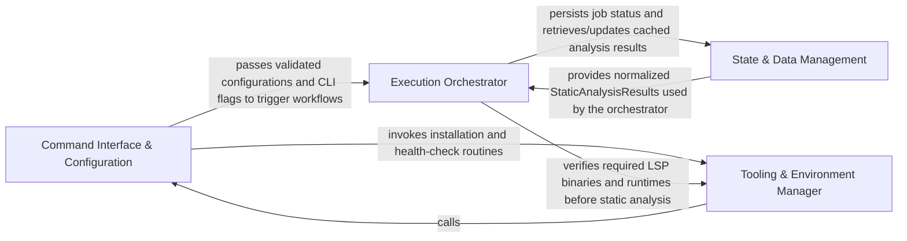

## Details

The entry point and lifecycle manager that handles user configuration, environment setup, and coordinates high-level execution between analysis and generation phases.

### Command Interface & Configuration
Handles initial interaction with the user: parsing CLI arguments, loading project-specific configurations, and managing LLM provider credentials and analysis parameters.

**Related Classes/Methods**:

- `main.main`:408-563
- `user_config.UserConfig`:89-98
- `main.define_cli_arguments`:356-405

**Source Files:**

- [`caching/cache.py`](https://github.com/CodeBoarding/CodeBoarding/blob/main/.codeboardingcaching/cache.py)
  - `caching.cache.ModelSettings.canonical_json` ([L284-L286](https://github.com/CodeBoarding/CodeBoarding/blob/main/.codeboardingcaching/cache.py#L284-L286)) - Method
  - `caching.cache.ModelSettings.signature` ([L288-L289](https://github.com/CodeBoarding/CodeBoarding/blob/main/.codeboardingcaching/cache.py#L288-L289)) - Method
- [`constants.py`](https://github.com/CodeBoarding/CodeBoarding/blob/main/.codeboardingconstants.py)
  - `constants.AppConfig` ([L4-L8](https://github.com/CodeBoarding/CodeBoarding/blob/main/.codeboardingconstants.py#L4-L8)) - Class
- [`core/plugin_loader.py`](https://github.com/CodeBoarding/CodeBoarding/blob/main/.codeboardingcore/plugin_loader.py)
  - `core.plugin_loader.load_plugins` ([L17-L46](https://github.com/CodeBoarding/CodeBoarding/blob/main/.codeboardingcore/plugin_loader.py#L17-L46)) - Function
- [`health/constants.py`](https://github.com/CodeBoarding/CodeBoarding/blob/main/.codeboardinghealth/constants.py)
  - `health.constants.HealthConfig` ([L4-L19](https://github.com/CodeBoarding/CodeBoarding/blob/main/.codeboardinghealth/constants.py#L4-L19)) - Class
- [`main.py`](https://github.com/CodeBoarding/CodeBoarding/blob/main/.codeboardingmain.py)
  - `main.validate_arguments` ([L343-L353](https://github.com/CodeBoarding/CodeBoarding/blob/main/.codeboardingmain.py#L343-L353)) - Function
  - `main.define_cli_arguments` ([L356-L405](https://github.com/CodeBoarding/CodeBoarding/blob/main/.codeboardingmain.py#L356-L405)) - Function
  - `main.main` ([L408-L563](https://github.com/CodeBoarding/CodeBoarding/blob/main/.codeboardingmain.py#L408-L563)) - Function
- [`monitoring/context.py`](https://github.com/CodeBoarding/CodeBoarding/blob/main/.codeboardingmonitoring/context.py)
  - `monitoring.context.monitor_execution` ([L19-L128](https://github.com/CodeBoarding/CodeBoarding/blob/main/.codeboardingmonitoring/context.py#L19-L128)) - Function
  - `monitoring.context.monitor_execution.DummyContext` ([L32-L37](https://github.com/CodeBoarding/CodeBoarding/blob/main/.codeboardingmonitoring/context.py#L32-L37)) - Class
  - `monitoring.context.monitor_execution.DummyContext.step` ([L33-L34](https://github.com/CodeBoarding/CodeBoarding/blob/main/.codeboardingmonitoring/context.py#L33-L34)) - Method
  - `monitoring.context.monitor_execution.MonitorContext` ([L73-L91](https://github.com/CodeBoarding/CodeBoarding/blob/main/.codeboardingmonitoring/context.py#L73-L91)) - Class
  - `monitoring.context.monitor_execution.MonitorContext.step` ([L77-L81](https://github.com/CodeBoarding/CodeBoarding/blob/main/.codeboardingmonitoring/context.py#L77-L81)) - Method
  - `monitoring.context.monitor_execution.MonitorContext.end_step` ([L83-L87](https://github.com/CodeBoarding/CodeBoarding/blob/main/.codeboardingmonitoring/context.py#L83-L87)) - Method
  - `monitoring.context.monitor_execution.MonitorContext.close` ([L89-L91](https://github.com/CodeBoarding/CodeBoarding/blob/main/.codeboardingmonitoring/context.py#L89-L91)) - Method
- [`monitoring/paths.py`](https://github.com/CodeBoarding/CodeBoarding/blob/main/.codeboardingmonitoring/paths.py)
  - `monitoring.paths.get_monitoring_base_dir` ([L7-L8](https://github.com/CodeBoarding/CodeBoarding/blob/main/.codeboardingmonitoring/paths.py#L7-L8)) - Function
  - `monitoring.paths.get_monitoring_run_dir` ([L11-L18](https://github.com/CodeBoarding/CodeBoarding/blob/main/.codeboardingmonitoring/paths.py#L11-L18)) - Function
  - `monitoring.paths.get_latest_run_dir` ([L26-L46](https://github.com/CodeBoarding/CodeBoarding/blob/main/.codeboardingmonitoring/paths.py#L26-L46)) - Function
- [`static_analyzer/engine/lsp_constants.py`](https://github.com/CodeBoarding/CodeBoarding/blob/main/.codeboardingstatic_analyzer/engine/lsp_constants.py)
  - `static_analyzer.engine.lsp_constants.EdgeStrategy` ([L29-L33](https://github.com/CodeBoarding/CodeBoarding/blob/main/.codeboardingstatic_analyzer/engine/lsp_constants.py#L29-L33)) - Class
- [`user_config.py`](https://github.com/CodeBoarding/CodeBoarding/blob/main/.codeboardinguser_config.py)
  - `user_config.ProviderUserConfig` ([L66-L79](https://github.com/CodeBoarding/CodeBoarding/blob/main/.codeboardinguser_config.py#L66-L79)) - Class
  - `user_config.LLMUserConfig` ([L83-L85](https://github.com/CodeBoarding/CodeBoarding/blob/main/.codeboardinguser_config.py#L83-L85)) - Class
  - `user_config.UserConfig` ([L89-L98](https://github.com/CodeBoarding/CodeBoarding/blob/main/.codeboardinguser_config.py#L89-L98)) - Class
  - `user_config.UserConfig.apply_to_env` ([L93-L98](https://github.com/CodeBoarding/CodeBoarding/blob/main/.codeboardinguser_config.py#L93-L98)) - Method
  - `user_config.load_user_config` ([L101-L130](https://github.com/CodeBoarding/CodeBoarding/blob/main/.codeboardinguser_config.py#L101-L130)) - Function
  - `user_config.ensure_config_template` ([L133-L138](https://github.com/CodeBoarding/CodeBoarding/blob/main/.codeboardinguser_config.py#L133-L138)) - Function
- [`utils.py`](https://github.com/CodeBoarding/CodeBoarding/blob/main/.codeboardingutils.py)
  - `utils.get_project_root` ([L34-L39](https://github.com/CodeBoarding/CodeBoarding/blob/main/.codeboardingutils.py#L34-L39)) - Function
  - `utils.monitoring_enabled` ([L53-L55](https://github.com/CodeBoarding/CodeBoarding/blob/main/.codeboardingutils.py#L53-L55)) - Function

### Execution Orchestrator
Sequences the high-level workflow for local and remote repositories, manages the RunContext to track execution metadata, and uses the MetaAgent for project scoping and job tracking.

**Related Classes/Methods**:

- `main.process_local_repository`:267-321
- `github_action.generate_analysis`:119-173
- `diagram_analysis.run_context.RunContext`:13-40
- `agents.meta_agent.MetaAgent`:18-66

**Source Files:**

- [`agents/meta_agent.py`](https://github.com/CodeBoarding/CodeBoarding/blob/main/.codeboardingagents/meta_agent.py)
  - `agents.meta_agent.MetaAgent` ([L18-L66](https://github.com/CodeBoarding/CodeBoarding/blob/main/.codeboardingagents/meta_agent.py#L18-L66)) - Class
  - `agents.meta_agent.MetaAgent.__init__` ([L20-L48](https://github.com/CodeBoarding/CodeBoarding/blob/main/.codeboardingagents/meta_agent.py#L20-L48)) - Method
  - `agents.meta_agent.MetaAgent.analyze_project_metadata` ([L51-L66](https://github.com/CodeBoarding/CodeBoarding/blob/main/.codeboardingagents/meta_agent.py#L51-L66)) - Method
- [`caching/cache.py`](https://github.com/CodeBoarding/CodeBoarding/blob/main/.codeboardingcaching/cache.py)
  - `caching.cache.BaseCache._open_sqlite` ([L65-L73](https://github.com/CodeBoarding/CodeBoarding/blob/main/.codeboardingcaching/cache.py#L65-L73)) - Method
  - `caching.cache.BaseCache._configure_sqlite_connection` ([L76-L83](https://github.com/CodeBoarding/CodeBoarding/blob/main/.codeboardingcaching/cache.py#L76-L83)) - Method
  - `caching.cache.BaseCache._open_sqlite_unlocked` ([L85-L119](https://github.com/CodeBoarding/CodeBoarding/blob/main/.codeboardingcaching/cache.py#L85-L119)) - Method
  - `caching.cache.BaseCache._reset_if_incompatible_schema` ([L121-L135](https://github.com/CodeBoarding/CodeBoarding/blob/main/.codeboardingcaching/cache.py#L121-L135)) - Method
  - `caching.cache.BaseCache.signature` ([L137-L139](https://github.com/CodeBoarding/CodeBoarding/blob/main/.codeboardingcaching/cache.py#L137-L139)) - Method
  - `caching.cache.BaseCache._lookup` ([L141-L157](https://github.com/CodeBoarding/CodeBoarding/blob/main/.codeboardingcaching/cache.py#L141-L157)) - Method
  - `caching.cache.BaseCache._upsert_conn` ([L159-L174](https://github.com/CodeBoarding/CodeBoarding/blob/main/.codeboardingcaching/cache.py#L159-L174)) - Method
  - `caching.cache.BaseCache._clear_conn` ([L176-L183](https://github.com/CodeBoarding/CodeBoarding/blob/main/.codeboardingcaching/cache.py#L176-L183)) - Method
  - `caching.cache.BaseCache.load` ([L185-L197](https://github.com/CodeBoarding/CodeBoarding/blob/main/.codeboardingcaching/cache.py#L185-L197)) - Method
  - `caching.cache.BaseCache.store` ([L199-L216](https://github.com/CodeBoarding/CodeBoarding/blob/main/.codeboardingcaching/cache.py#L199-L216)) - Method
  - `caching.cache.BaseCache.clear` ([L218-L229](https://github.com/CodeBoarding/CodeBoarding/blob/main/.codeboardingcaching/cache.py#L218-L229)) - Method
  - `caching.cache.BaseCache.load_most_recent_run` ([L231-L257](https://github.com/CodeBoarding/CodeBoarding/blob/main/.codeboardingcaching/cache.py#L231-L257)) - Method
- [`caching/details_cache.py`](https://github.com/CodeBoarding/CodeBoarding/blob/main/.codeboardingcaching/details_cache.py)
  - `caching.details_cache.FinalAnalysisCache` ([L18-L34](https://github.com/CodeBoarding/CodeBoarding/blob/main/.codeboardingcaching/details_cache.py#L18-L34)) - Class
  - `caching.details_cache.ClusterCache` ([L37-L53](https://github.com/CodeBoarding/CodeBoarding/blob/main/.codeboardingcaching/details_cache.py#L37-L53)) - Class
  - `caching.details_cache.prune_details_caches` ([L56-L58](https://github.com/CodeBoarding/CodeBoarding/blob/main/.codeboardingcaching/details_cache.py#L56-L58)) - Function
- [`caching/meta_cache.py`](https://github.com/CodeBoarding/CodeBoarding/blob/main/.codeboardingcaching/meta_cache.py)
  - `caching.meta_cache.MetaCache` ([L40-L111](https://github.com/CodeBoarding/CodeBoarding/blob/main/.codeboardingcaching/meta_cache.py#L40-L111)) - Class
- [`diagram_analysis/run_context.py`](https://github.com/CodeBoarding/CodeBoarding/blob/main/.codeboardingdiagram_analysis/run_context.py)
  - `diagram_analysis.run_context.RunContext` ([L13-L40](https://github.com/CodeBoarding/CodeBoarding/blob/main/.codeboardingdiagram_analysis/run_context.py#L13-L40)) - Class
  - `diagram_analysis.run_context.RunContext.resolve` ([L21-L36](https://github.com/CodeBoarding/CodeBoarding/blob/main/.codeboardingdiagram_analysis/run_context.py#L21-L36)) - Method
  - `diagram_analysis.run_context.RunContext.finalize` ([L38-L40](https://github.com/CodeBoarding/CodeBoarding/blob/main/.codeboardingdiagram_analysis/run_context.py#L38-L40)) - Method
  - `diagram_analysis.run_context._load_existing_run_id` ([L43-L57](https://github.com/CodeBoarding/CodeBoarding/blob/main/.codeboardingdiagram_analysis/run_context.py#L43-L57)) - Function
- [`duckdb_crud.py`](https://github.com/CodeBoarding/CodeBoarding/blob/main/.codeboardingduckdb_crud.py)
  - `duckdb_crud._connect` ([L11-L12](https://github.com/CodeBoarding/CodeBoarding/blob/main/.codeboardingduckdb_crud.py#L11-L12)) - Function
  - `duckdb_crud.init_db` ([L16-L45](https://github.com/CodeBoarding/CodeBoarding/blob/main/.codeboardingduckdb_crud.py#L16-L45)) - Function
  - `duckdb_crud.insert_job` ([L49-L65](https://github.com/CodeBoarding/CodeBoarding/blob/main/.codeboardingduckdb_crud.py#L49-L65)) - Function
  - `duckdb_crud.update_job` ([L68-L77](https://github.com/CodeBoarding/CodeBoarding/blob/main/.codeboardingduckdb_crud.py#L68-L77)) - Function
  - `duckdb_crud.fetch_job` ([L80-L99](https://github.com/CodeBoarding/CodeBoarding/blob/main/.codeboardingduckdb_crud.py#L80-L99)) - Function
  - `duckdb_crud.fetch_all_jobs` ([L102-L125](https://github.com/CodeBoarding/CodeBoarding/blob/main/.codeboardingduckdb_crud.py#L102-L125)) - Function
- [`github_action.py`](https://github.com/CodeBoarding/CodeBoarding/blob/main/.codeboardinggithub_action.py)
  - `github_action._load_all_analyses` ([L21-L45](https://github.com/CodeBoarding/CodeBoarding/blob/main/.codeboardinggithub_action.py#L21-L45)) - Function
  - `github_action.generate_markdown` ([L48-L61](https://github.com/CodeBoarding/CodeBoarding/blob/main/.codeboardinggithub_action.py#L48-L61)) - Function
  - `github_action.generate_html` ([L64-L75](https://github.com/CodeBoarding/CodeBoarding/blob/main/.codeboardinggithub_action.py#L64-L75)) - Function
  - `github_action.generate_mdx` ([L78-L91](https://github.com/CodeBoarding/CodeBoarding/blob/main/.codeboardinggithub_action.py#L78-L91)) - Function
  - `github_action.generate_rst` ([L94-L107](https://github.com/CodeBoarding/CodeBoarding/blob/main/.codeboardinggithub_action.py#L94-L107)) - Function
  - `github_action._seed_existing_analysis` ([L110-L116](https://github.com/CodeBoarding/CodeBoarding/blob/main/.codeboardinggithub_action.py#L110-L116)) - Function
  - `github_action.generate_analysis` ([L119-L173](https://github.com/CodeBoarding/CodeBoarding/blob/main/.codeboardinggithub_action.py#L119-L173)) - Function
- [`main.py`](https://github.com/CodeBoarding/CodeBoarding/blob/main/.codeboardingmain.py)
  - `main.onboarding_materials_exist` ([L42-L48](https://github.com/CodeBoarding/CodeBoarding/blob/main/.codeboardingmain.py#L42-L48)) - Function
  - `main.generate_analysis` ([L51-L72](https://github.com/CodeBoarding/CodeBoarding/blob/main/.codeboardingmain.py#L51-L72)) - Function
  - `main.generate_markdown_docs` ([L75-L120](https://github.com/CodeBoarding/CodeBoarding/blob/main/.codeboardingmain.py#L75-L120)) - Function
  - `main.partial_update` ([L123-L181](https://github.com/CodeBoarding/CodeBoarding/blob/main/.codeboardingmain.py#L123-L181)) - Function
  - `main.generate_docs_remote` ([L184-L204](https://github.com/CodeBoarding/CodeBoarding/blob/main/.codeboardingmain.py#L184-L204)) - Function
  - `main.process_remote_repository` ([L207-L264](https://github.com/CodeBoarding/CodeBoarding/blob/main/.codeboardingmain.py#L207-L264)) - Function
  - `main.process_local_repository` ([L267-L321](https://github.com/CodeBoarding/CodeBoarding/blob/main/.codeboardingmain.py#L267-L321)) - Function
  - `main.copy_files` ([L324-L340](https://github.com/CodeBoarding/CodeBoarding/blob/main/.codeboardingmain.py#L324-L340)) - Function
- [`monitoring/context.py`](https://github.com/CodeBoarding/CodeBoarding/blob/main/.codeboardingmonitoring/context.py)
  - `monitoring.context.monitor_execution.DummyContext.end_step` ([L36-L37](https://github.com/CodeBoarding/CodeBoarding/blob/main/.codeboardingmonitoring/context.py#L36-L37)) - Method
  - `monitoring.context.monitor_execution.MonitorContext.__init__` ([L74-L75](https://github.com/CodeBoarding/CodeBoarding/blob/main/.codeboardingmonitoring/context.py#L74-L75)) - Method
  - `monitoring.context.trace` ([L131-L173](https://github.com/CodeBoarding/CodeBoarding/blob/main/.codeboardingmonitoring/context.py#L131-L173)) - Function
  - `monitoring.context.trace._create_wrapper` ([L139-L161](https://github.com/CodeBoarding/CodeBoarding/blob/main/.codeboardingmonitoring/context.py#L139-L161)) - Function
  - `monitoring.context.trace._create_wrapper.wrapper` ([L141-L159](https://github.com/CodeBoarding/CodeBoarding/blob/main/.codeboardingmonitoring/context.py#L141-L159)) - Function
  - `monitoring.context.trace.decorator` ([L169-L171](https://github.com/CodeBoarding/CodeBoarding/blob/main/.codeboardingmonitoring/context.py#L169-L171)) - Function
- [`monitoring/paths.py`](https://github.com/CodeBoarding/CodeBoarding/blob/main/.codeboardingmonitoring/paths.py)
  - `monitoring.paths.generate_log_path` ([L21-L23](https://github.com/CodeBoarding/CodeBoarding/blob/main/.codeboardingmonitoring/paths.py#L21-L23)) - Function
- [`output_generators/sphinx.py`](https://github.com/CodeBoarding/CodeBoarding/blob/main/.codeboardingoutput_generators/sphinx.py)
  - `output_generators.sphinx.generated_mermaid_str` ([L8-L43](https://github.com/CodeBoarding/CodeBoarding/blob/main/.codeboardingoutput_generators/sphinx.py#L8-L43)) - Function
  - `output_generators.sphinx.generate_rst` ([L46-L155](https://github.com/CodeBoarding/CodeBoarding/blob/main/.codeboardingoutput_generators/sphinx.py#L46-L155)) - Function
  - `output_generators.sphinx.generate_rst_file` ([L158-L183](https://github.com/CodeBoarding/CodeBoarding/blob/main/.codeboardingoutput_generators/sphinx.py#L158-L183)) - Function
  - `output_generators.sphinx.component_header` ([L186-L197](https://github.com/CodeBoarding/CodeBoarding/blob/main/.codeboardingoutput_generators/sphinx.py#L186-L197)) - Function
- [`static_analyzer/analysis_result.py`](https://github.com/CodeBoarding/CodeBoarding/blob/main/.codeboardingstatic_analyzer/analysis_result.py)
  - `static_analyzer.analysis_result.StaticAnalysisResults` ([L226-L450](https://github.com/CodeBoarding/CodeBoarding/blob/main/.codeboardingstatic_analyzer/analysis_result.py#L226-L450)) - Class
- [`utils.py`](https://github.com/CodeBoarding/CodeBoarding/blob/main/.codeboardingutils.py)
  - `utils.CFGGenerationError` ([L12-L13](https://github.com/CodeBoarding/CodeBoarding/blob/main/.codeboardingutils.py#L12-L13)) - Class
  - `utils.create_temp_repo_folder` ([L16-L20](https://github.com/CodeBoarding/CodeBoarding/blob/main/.codeboardingutils.py#L16-L20)) - Function
  - `utils.remove_temp_repo_folder` ([L23-L27](https://github.com/CodeBoarding/CodeBoarding/blob/main/.codeboardingutils.py#L23-L27)) - Function
  - `utils.sanitize` ([L87-L89](https://github.com/CodeBoarding/CodeBoarding/blob/main/.codeboardingutils.py#L87-L89)) - Function
  - `utils.generate_run_id` ([L92-L93](https://github.com/CodeBoarding/CodeBoarding/blob/main/.codeboardingutils.py#L92-L93)) - Function

### Tooling & Environment Manager
Manages lifecycle of external dependencies (LSP binaries, Node.js runtimes), verifying, downloading, and installing necessary static analysis tools defined in the manifest.

**Related Classes/Methods**:

- `install.run_install`:631-676
- `install.ensure_tools`:595-628
- `tool_registry.manifest`

**Source Files:**

- [`install.py`](https://github.com/CodeBoarding/CodeBoarding/blob/main/.codeboardinginstall.py)
  - `install.LanguageSupportCheck` ([L37-L53](https://github.com/CodeBoarding/CodeBoarding/blob/main/.codeboardinginstall.py#L37-L53)) - Class
  - `install.LanguageSupportCheck.evaluate` ([L45-L53](https://github.com/CodeBoarding/CodeBoarding/blob/main/.codeboardinginstall.py#L45-L53)) - Method
  - `install.check_npm` ([L56-L76](https://github.com/CodeBoarding/CodeBoarding/blob/main/.codeboardinginstall.py#L56-L76)) - Function
  - `install.bootstrapped_npm_cli_path` ([L79-L81](https://github.com/CodeBoarding/CodeBoarding/blob/main/.codeboardinginstall.py#L79-L81)) - Function
  - `install.extract_tarball_safely` ([L84-L92](https://github.com/CodeBoarding/CodeBoarding/blob/main/.codeboardinginstall.py#L84-L92)) - Function
  - `install.bootstrap_npm` ([L95-L144](https://github.com/CodeBoarding/CodeBoarding/blob/main/.codeboardinginstall.py#L95-L144)) - Function
  - `install.is_non_interactive_mode` ([L147-L153](https://github.com/CodeBoarding/CodeBoarding/blob/main/.codeboardinginstall.py#L147-L153)) - Function
  - `install.ensure_node_runtime` ([L156-L209](https://github.com/CodeBoarding/CodeBoarding/blob/main/.codeboardinginstall.py#L156-L209)) - Function
  - `install.resolve_missing_npm` ([L212-L237](https://github.com/CodeBoarding/CodeBoarding/blob/main/.codeboardinginstall.py#L212-L237)) - Function
  - `install.resolve_npm_availability` ([L240-L247](https://github.com/CodeBoarding/CodeBoarding/blob/main/.codeboardinginstall.py#L240-L247)) - Function
  - `install.parse_args` ([L250-L263](https://github.com/CodeBoarding/CodeBoarding/blob/main/.codeboardinginstall.py#L250-L263)) - Function
  - `install.get_platform_bin_dir` ([L266-L268](https://github.com/CodeBoarding/CodeBoarding/blob/main/.codeboardinginstall.py#L266-L268)) - Function
  - `install.install_node_servers` ([L271-L296](https://github.com/CodeBoarding/CodeBoarding/blob/main/.codeboardinginstall.py#L271-L296)) - Function
  - `install.BinaryStatus` ([L303-L308](https://github.com/CodeBoarding/CodeBoarding/blob/main/.codeboardinginstall.py#L303-L308)) - Class
  - `install.verify_binary` ([L311-L336](https://github.com/CodeBoarding/CodeBoarding/blob/main/.codeboardinginstall.py#L311-L336)) - Function
  - `install.install_vcpp_redistributable` ([L339-L406](https://github.com/CodeBoarding/CodeBoarding/blob/main/.codeboardinginstall.py#L339-L406)) - Function
  - `install.resolve_missing_vcpp` ([L409-L430](https://github.com/CodeBoarding/CodeBoarding/blob/main/.codeboardinginstall.py#L409-L430)) - Function
  - `install.download_binaries` ([L433-L472](https://github.com/CodeBoarding/CodeBoarding/blob/main/.codeboardinginstall.py#L433-L472)) - Function
  - `install.download_jdtls` ([L475-L483](https://github.com/CodeBoarding/CodeBoarding/blob/main/.codeboardinginstall.py#L475-L483)) - Function
  - `install.install_pre_commit_hooks` ([L486-L521](https://github.com/CodeBoarding/CodeBoarding/blob/main/.codeboardinginstall.py#L486-L521)) - Function
  - `install.print_language_support_summary` ([L524-L592](https://github.com/CodeBoarding/CodeBoarding/blob/main/.codeboardinginstall.py#L524-L592)) - Function
  - `install.ensure_tools` ([L595-L628](https://github.com/CodeBoarding/CodeBoarding/blob/main/.codeboardinginstall.py#L595-L628)) - Function
  - `install.run_install` ([L631-L676](https://github.com/CodeBoarding/CodeBoarding/blob/main/.codeboardinginstall.py#L631-L676)) - Function
  - `install.run_install.unified_progress` ([L662-L666](https://github.com/CodeBoarding/CodeBoarding/blob/main/.codeboardinginstall.py#L662-L666)) - Function
  - `install.main` ([L679-L704](https://github.com/CodeBoarding/CodeBoarding/blob/main/.codeboardinginstall.py#L679-L704)) - Function
- [`static_analyzer/engine/adapters/java_adapter.py`](https://github.com/CodeBoarding/CodeBoarding/blob/main/.codeboardingstatic_analyzer/engine/adapters/java_adapter.py)
  - `static_analyzer.engine.adapters.java_adapter.JavaAdapter.get_lsp_command` ([L51-L71](https://github.com/CodeBoarding/CodeBoarding/blob/main/.codeboardingstatic_analyzer/engine/adapters/java_adapter.py#L51-L71)) - Method
  - `static_analyzer.engine.adapters.java_adapter.JavaAdapter._find_jdtls_root` ([L74-L103](https://github.com/CodeBoarding/CodeBoarding/blob/main/.codeboardingstatic_analyzer/engine/adapters/java_adapter.py#L74-L103)) - Method
  - `static_analyzer.engine.adapters.java_adapter.JavaAdapter._calculate_heap_size` ([L106-L131](https://github.com/CodeBoarding/CodeBoarding/blob/main/.codeboardingstatic_analyzer/engine/adapters/java_adapter.py#L106-L131)) - Method
- [`static_analyzer/java_utils.py`](https://github.com/CodeBoarding/CodeBoarding/blob/main/.codeboardingstatic_analyzer/java_utils.py)
  - `static_analyzer.java_utils.get_java_version` ([L12-L34](https://github.com/CodeBoarding/CodeBoarding/blob/main/.codeboardingstatic_analyzer/java_utils.py#L12-L34)) - Function
  - `static_analyzer.java_utils.detect_java_installations` ([L37-L92](https://github.com/CodeBoarding/CodeBoarding/blob/main/.codeboardingstatic_analyzer/java_utils.py#L37-L92)) - Function
  - `static_analyzer.java_utils.find_java_21_or_later` ([L95-L137](https://github.com/CodeBoarding/CodeBoarding/blob/main/.codeboardingstatic_analyzer/java_utils.py#L95-L137)) - Function
  - `static_analyzer.java_utils.get_jdtls_config_dir` ([L140-L159](https://github.com/CodeBoarding/CodeBoarding/blob/main/.codeboardingstatic_analyzer/java_utils.py#L140-L159)) - Function
  - `static_analyzer.java_utils.find_launcher_jar` ([L162-L183](https://github.com/CodeBoarding/CodeBoarding/blob/main/.codeboardingstatic_analyzer/java_utils.py#L162-L183)) - Function
  - `static_analyzer.java_utils.create_jdtls_command` ([L186-L244](https://github.com/CodeBoarding/CodeBoarding/blob/main/.codeboardingstatic_analyzer/java_utils.py#L186-L244)) - Function
- [`tool_registry/installers.py`](https://github.com/CodeBoarding/CodeBoarding/blob/main/.codeboardingtool_registry/installers.py)
  - `tool_registry.installers.asset_url` ([L47-L53](https://github.com/CodeBoarding/CodeBoarding/blob/main/.codeboardingtool_registry/installers.py#L47-L53)) - Function
  - `tool_registry.installers.resolve_native_asset_name` ([L56-L78](https://github.com/CodeBoarding/CodeBoarding/blob/main/.codeboardingtool_registry/installers.py#L56-L78)) - Function
  - `tool_registry.installers._is_compressed_asset` ([L81-L84](https://github.com/CodeBoarding/CodeBoarding/blob/main/.codeboardingtool_registry/installers.py#L81-L84)) - Function
  - `tool_registry.installers._extract_compressed_binary` ([L87-L133](https://github.com/CodeBoarding/CodeBoarding/blob/main/.codeboardingtool_registry/installers.py#L87-L133)) - Function
  - `tool_registry.installers.download_asset` ([L136-L159](https://github.com/CodeBoarding/CodeBoarding/blob/main/.codeboardingtool_registry/installers.py#L136-L159)) - Function
  - `tool_registry.installers.install_native_tools` ([L165-L254](https://github.com/CodeBoarding/CodeBoarding/blob/main/.codeboardingtool_registry/installers.py#L165-L254)) - Function
  - `tool_registry.installers.install_node_tools` ([L260-L300](https://github.com/CodeBoarding/CodeBoarding/blob/main/.codeboardingtool_registry/installers.py#L260-L300)) - Function
  - `tool_registry.installers.install_archive_tool` ([L306-L340](https://github.com/CodeBoarding/CodeBoarding/blob/main/.codeboardingtool_registry/installers.py#L306-L340)) - Function
  - `tool_registry.installers.install_tools` ([L346-L365](https://github.com/CodeBoarding/CodeBoarding/blob/main/.codeboardingtool_registry/installers.py#L346-L365)) - Function
  - `tool_registry.installers.embedded_node_is_healthy` ([L376-L402](https://github.com/CodeBoarding/CodeBoarding/blob/main/.codeboardingtool_registry/installers.py#L376-L402)) - Function
  - `tool_registry.installers.initialize_nodeenv_globals` ([L405-L428](https://github.com/CodeBoarding/CodeBoarding/blob/main/.codeboardingtool_registry/installers.py#L405-L428)) - Function
  - `tool_registry.installers.nodeenv_needs_unofficial_builds` ([L431-L446](https://github.com/CodeBoarding/CodeBoarding/blob/main/.codeboardingtool_registry/installers.py#L431-L446)) - Function
  - `tool_registry.installers.install_embedded_node` ([L449-L531](https://github.com/CodeBoarding/CodeBoarding/blob/main/.codeboardingtool_registry/installers.py#L449-L531)) - Function
- [`tool_registry/manifest.py`](https://github.com/CodeBoarding/CodeBoarding/blob/main/.codeboardingtool_registry/manifest.py)
  - `tool_registry.manifest.installed_version` ([L37-L41](https://github.com/CodeBoarding/CodeBoarding/blob/main/.codeboardingtool_registry/manifest.py#L37-L41)) - Function
  - `tool_registry.manifest.manifest_path` ([L44-L45](https://github.com/CodeBoarding/CodeBoarding/blob/main/.codeboardingtool_registry/manifest.py#L44-L45)) - Function
  - `tool_registry.manifest.read_manifest` ([L48-L52](https://github.com/CodeBoarding/CodeBoarding/blob/main/.codeboardingtool_registry/manifest.py#L48-L52)) - Function
  - `tool_registry.manifest.npm_specs_fingerprint` ([L55-L65](https://github.com/CodeBoarding/CodeBoarding/blob/main/.codeboardingtool_registry/manifest.py#L55-L65)) - Function
  - `tool_registry.manifest.tools_fingerprint` ([L68-L83](https://github.com/CodeBoarding/CodeBoarding/blob/main/.codeboardingtool_registry/manifest.py#L68-L83)) - Function
  - `tool_registry.manifest.write_manifest` ([L86-L108](https://github.com/CodeBoarding/CodeBoarding/blob/main/.codeboardingtool_registry/manifest.py#L86-L108)) - Function
  - `tool_registry.manifest.needs_install` ([L111-L120](https://github.com/CodeBoarding/CodeBoarding/blob/main/.codeboardingtool_registry/manifest.py#L111-L120)) - Function
  - `tool_registry.manifest.acquire_lock` ([L126-L152](https://github.com/CodeBoarding/CodeBoarding/blob/main/.codeboardingtool_registry/manifest.py#L126-L152)) - Function
  - `tool_registry.manifest.build_config` ([L158-L178](https://github.com/CodeBoarding/CodeBoarding/blob/main/.codeboardingtool_registry/manifest.py#L158-L178)) - Function
  - `tool_registry.manifest.resolve_config` ([L181-L221](https://github.com/CodeBoarding/CodeBoarding/blob/main/.codeboardingtool_registry/manifest.py#L181-L221)) - Function
  - `tool_registry.manifest.resolve_config_from_path` ([L224-L247](https://github.com/CodeBoarding/CodeBoarding/blob/main/.codeboardingtool_registry/manifest.py#L224-L247)) - Function
  - `tool_registry.manifest.has_required_tools` ([L250-L303](https://github.com/CodeBoarding/CodeBoarding/blob/main/.codeboardingtool_registry/manifest.py#L250-L303)) - Function
- [`tool_registry/paths.py`](https://github.com/CodeBoarding/CodeBoarding/blob/main/.codeboardingtool_registry/paths.py)
  - `tool_registry.paths.exe_suffix` ([L29-L31](https://github.com/CodeBoarding/CodeBoarding/blob/main/.codeboardingtool_registry/paths.py#L29-L31)) - Function
  - `tool_registry.paths.platform_bin_dir` ([L34-L40](https://github.com/CodeBoarding/CodeBoarding/blob/main/.codeboardingtool_registry/paths.py#L34-L40)) - Function
  - `tool_registry.paths.user_data_dir` ([L46-L48](https://github.com/CodeBoarding/CodeBoarding/blob/main/.codeboardingtool_registry/paths.py#L46-L48)) - Function
  - `tool_registry.paths.get_servers_dir` ([L51-L53](https://github.com/CodeBoarding/CodeBoarding/blob/main/.codeboardingtool_registry/paths.py#L51-L53)) - Function
  - `tool_registry.paths.nodeenv_root_dir` ([L59-L61](https://github.com/CodeBoarding/CodeBoarding/blob/main/.codeboardingtool_registry/paths.py#L59-L61)) - Function
  - `tool_registry.paths.nodeenv_bin_dir` ([L64-L67](https://github.com/CodeBoarding/CodeBoarding/blob/main/.codeboardingtool_registry/paths.py#L64-L67)) - Function
  - `tool_registry.paths.embedded_node_path` ([L70-L74](https://github.com/CodeBoarding/CodeBoarding/blob/main/.codeboardingtool_registry/paths.py#L70-L74)) - Function
  - `tool_registry.paths.embedded_npm_path` ([L77-L81](https://github.com/CodeBoarding/CodeBoarding/blob/main/.codeboardingtool_registry/paths.py#L77-L81)) - Function
  - `tool_registry.paths.embedded_npm_cli_path` ([L84-L87](https://github.com/CodeBoarding/CodeBoarding/blob/main/.codeboardingtool_registry/paths.py#L84-L87)) - Function
  - `tool_registry.paths.node_version_tuple` ([L94-L140](https://github.com/CodeBoarding/CodeBoarding/blob/main/.codeboardingtool_registry/paths.py#L94-L140)) - Function
  - `tool_registry.paths.node_is_acceptable` ([L143-L164](https://github.com/CodeBoarding/CodeBoarding/blob/main/.codeboardingtool_registry/paths.py#L143-L164)) - Function
  - `tool_registry.paths.preferred_node_path` ([L170-L185](https://github.com/CodeBoarding/CodeBoarding/blob/main/.codeboardingtool_registry/paths.py#L170-L185)) - Function
  - `tool_registry.paths.sibling_npm_path` ([L188-L199](https://github.com/CodeBoarding/CodeBoarding/blob/main/.codeboardingtool_registry/paths.py#L188-L199)) - Function
  - `tool_registry.paths.preferred_npm_command` ([L202-L220](https://github.com/CodeBoarding/CodeBoarding/blob/main/.codeboardingtool_registry/paths.py#L202-L220)) - Function
  - `tool_registry.paths.npm_subprocess_env` ([L223-L232](https://github.com/CodeBoarding/CodeBoarding/blob/main/.codeboardingtool_registry/paths.py#L223-L232)) - Function
  - `tool_registry.paths.ensure_node_on_path` ([L235-L264](https://github.com/CodeBoarding/CodeBoarding/blob/main/.codeboardingtool_registry/paths.py#L235-L264)) - Function
- [`tool_registry/registry.py`](https://github.com/CodeBoarding/CodeBoarding/blob/main/.codeboardingtool_registry/registry.py)
  - `tool_registry.registry.ToolKind` ([L56-L61](https://github.com/CodeBoarding/CodeBoarding/blob/main/.codeboardingtool_registry/registry.py#L56-L61)) - Class
  - `tool_registry.registry.ConfigSection` ([L64-L68](https://github.com/CodeBoarding/CodeBoarding/blob/main/.codeboardingtool_registry/registry.py#L64-L68)) - Class
  - `tool_registry.registry.ToolSource` ([L72-L75](https://github.com/CodeBoarding/CodeBoarding/blob/main/.codeboardingtool_registry/registry.py#L72-L75)) - Class
  - `tool_registry.registry.GitHubToolSource` ([L79-L100](https://github.com/CodeBoarding/CodeBoarding/blob/main/.codeboardingtool_registry/registry.py#L79-L100)) - Class
  - `tool_registry.registry.UpstreamToolSource` ([L104-L108](https://github.com/CodeBoarding/CodeBoarding/blob/main/.codeboardingtool_registry/registry.py#L104-L108)) - Class
  - `tool_registry.registry.ToolDependency` ([L112-L137](https://github.com/CodeBoarding/CodeBoarding/blob/main/.codeboardingtool_registry/registry.py#L112-L137)) - Class
  - `tool_registry.registry.ToolDependency.is_available_on_host` ([L125-L137](https://github.com/CodeBoarding/CodeBoarding/blob/main/.codeboardingtool_registry/registry.py#L125-L137)) - Method
- [`utils.py`](https://github.com/CodeBoarding/CodeBoarding/blob/main/.codeboardingutils.py)
  - `utils.get_config` ([L58-L64](https://github.com/CodeBoarding/CodeBoarding/blob/main/.codeboardingutils.py#L58-L64)) - Function
- [`vscode_constants.py`](https://github.com/CodeBoarding/CodeBoarding/blob/main/.codeboardingvscode_constants.py)
  - `vscode_constants.get_bin_path` ([L5-L12](https://github.com/CodeBoarding/CodeBoarding/blob/main/.codeboardingvscode_constants.py#L5-L12)) - Function
  - `vscode_constants.update_command_paths` ([L15-L62](https://github.com/CodeBoarding/CodeBoarding/blob/main/.codeboardingvscode_constants.py#L15-L62)) - Function
  - `vscode_constants.find_runnable` ([L65-L69](https://github.com/CodeBoarding/CodeBoarding/blob/main/.codeboardingvscode_constants.py#L65-L69)) - Function
  - `vscode_constants.update_config` ([L72-L74](https://github.com/CodeBoarding/CodeBoarding/blob/main/.codeboardingvscode_constants.py#L72-L74)) - Function

### State & Data Management
Provides persistence and incremental analysis infrastructure: normalizes static analysis results and manages cache layers to reduce redundant LLM calls and re-scanning.

**Related Classes/Methods**:

- `caching.cache.BaseCache`:30-268
- `static_analyzer.analysis_result.StaticAnalysisResults`:226-450
- `duckdb_crud.insert_job`:49-65

**Source Files:**

- [`caching/cache.py`](https://github.com/CodeBoarding/CodeBoarding/blob/main/.codeboardingcaching/cache.py)
  - `caching.cache.BaseCache` ([L30-L268](https://github.com/CodeBoarding/CodeBoarding/blob/main/.codeboardingcaching/cache.py#L30-L268)) - Class
  - `caching.cache.BaseCache.__init__` ([L36-L63](https://github.com/CodeBoarding/CodeBoarding/blob/main/.codeboardingcaching/cache.py#L36-L63)) - Method
  - `caching.cache.BaseCache.close` ([L259-L268](https://github.com/CodeBoarding/CodeBoarding/blob/main/.codeboardingcaching/cache.py#L259-L268)) - Method
  - `caching.cache.ModelSettings` ([L271-L310](https://github.com/CodeBoarding/CodeBoarding/blob/main/.codeboardingcaching/cache.py#L271-L310)) - Class
  - `caching.cache.ModelSettings.from_chat_model` ([L292-L310](https://github.com/CodeBoarding/CodeBoarding/blob/main/.codeboardingcaching/cache.py#L292-L310)) - Method
- [`caching/details_cache.py`](https://github.com/CodeBoarding/CodeBoarding/blob/main/.codeboardingcaching/details_cache.py)
  - `caching.details_cache.DetailsCacheKey` ([L12-L15](https://github.com/CodeBoarding/CodeBoarding/blob/main/.codeboardingcaching/details_cache.py#L12-L15)) - Class
  - `caching.details_cache.FinalAnalysisCache.__init__` ([L24-L30](https://github.com/CodeBoarding/CodeBoarding/blob/main/.codeboardingcaching/details_cache.py#L24-L30)) - Method
  - `caching.details_cache.FinalAnalysisCache.build_key` ([L33-L34](https://github.com/CodeBoarding/CodeBoarding/blob/main/.codeboardingcaching/details_cache.py#L33-L34)) - Method
  - `caching.details_cache.ClusterCache.__init__` ([L43-L49](https://github.com/CodeBoarding/CodeBoarding/blob/main/.codeboardingcaching/details_cache.py#L43-L49)) - Method
  - `caching.details_cache.ClusterCache.build_key` ([L52-L53](https://github.com/CodeBoarding/CodeBoarding/blob/main/.codeboardingcaching/details_cache.py#L52-L53)) - Method
- [`caching/meta_cache.py`](https://github.com/CodeBoarding/CodeBoarding/blob/main/.codeboardingcaching/meta_cache.py)
  - `caching.meta_cache.MetaCacheKey` ([L29-L37](https://github.com/CodeBoarding/CodeBoarding/blob/main/.codeboardingcaching/meta_cache.py#L29-L37)) - Class
  - `caching.meta_cache.MetaCache.__init__` ([L46-L55](https://github.com/CodeBoarding/CodeBoarding/blob/main/.codeboardingcaching/meta_cache.py#L46-L55)) - Method
  - `caching.meta_cache.MetaCache.discover_metadata_files` ([L57-L69](https://github.com/CodeBoarding/CodeBoarding/blob/main/.codeboardingcaching/meta_cache.py#L57-L69)) - Method
  - `caching.meta_cache.MetaCache.build_key` ([L71-L94](https://github.com/CodeBoarding/CodeBoarding/blob/main/.codeboardingcaching/meta_cache.py#L71-L94)) - Method
  - `caching.meta_cache.MetaCache._compute_metadata_content_hash` ([L96-L111](https://github.com/CodeBoarding/CodeBoarding/blob/main/.codeboardingcaching/meta_cache.py#L96-L111)) - Method
- [`static_analyzer/analysis_result.py`](https://github.com/CodeBoarding/CodeBoarding/blob/main/.codeboardingstatic_analyzer/analysis_result.py)
  - `static_analyzer.analysis_result._strip_java_generics` ([L38-L89](https://github.com/CodeBoarding/CodeBoarding/blob/main/.codeboardingstatic_analyzer/analysis_result.py#L38-L89)) - Function
  - `static_analyzer.analysis_result._strip_java_generics._replace_in_parens` ([L72-L78](https://github.com/CodeBoarding/CodeBoarding/blob/main/.codeboardingstatic_analyzer/analysis_result.py#L72-L78)) - Function
  - `static_analyzer.analysis_result._strip_java_generics._replace_in_parens._subst` ([L75-L76](https://github.com/CodeBoarding/CodeBoarding/blob/main/.codeboardingstatic_analyzer/analysis_result.py#L75-L76)) - Function
  - `static_analyzer.analysis_result._reference_key` ([L92-L120](https://github.com/CodeBoarding/CodeBoarding/blob/main/.codeboardingstatic_analyzer/analysis_result.py#L92-L120)) - Function
  - `static_analyzer.analysis_result.StaticAnalysisCache` ([L123-L223](https://github.com/CodeBoarding/CodeBoarding/blob/main/.codeboardingstatic_analyzer/analysis_result.py#L123-L223)) - Class
  - `static_analyzer.analysis_result.StaticAnalysisCache.__init__` ([L124-L126](https://github.com/CodeBoarding/CodeBoarding/blob/main/.codeboardingstatic_analyzer/analysis_result.py#L124-L126)) - Method
  - `static_analyzer.analysis_result.StaticAnalysisCache._to_relative` ([L128-L129](https://github.com/CodeBoarding/CodeBoarding/blob/main/.codeboardingstatic_analyzer/analysis_result.py#L128-L129)) - Method
  - `static_analyzer.analysis_result.StaticAnalysisCache._to_absolute` ([L131-L132](https://github.com/CodeBoarding/CodeBoarding/blob/main/.codeboardingstatic_analyzer/analysis_result.py#L131-L132)) - Method
  - `static_analyzer.analysis_result.StaticAnalysisCache._relativize` ([L134-L160](https://github.com/CodeBoarding/CodeBoarding/blob/main/.codeboardingstatic_analyzer/analysis_result.py#L134-L160)) - Method
  - `static_analyzer.analysis_result.StaticAnalysisCache._absolutize` ([L162-L187](https://github.com/CodeBoarding/CodeBoarding/blob/main/.codeboardingstatic_analyzer/analysis_result.py#L162-L187)) - Method
  - `static_analyzer.analysis_result.StaticAnalysisCache.get` ([L189-L203](https://github.com/CodeBoarding/CodeBoarding/blob/main/.codeboardingstatic_analyzer/analysis_result.py#L189-L203)) - Method
  - `static_analyzer.analysis_result.StaticAnalysisCache.save` ([L205-L223](https://github.com/CodeBoarding/CodeBoarding/blob/main/.codeboardingstatic_analyzer/analysis_result.py#L205-L223)) - Method
  - `static_analyzer.analysis_result.StaticAnalysisResults.__init__` ([L227-L229](https://github.com/CodeBoarding/CodeBoarding/blob/main/.codeboardingstatic_analyzer/analysis_result.py#L227-L229)) - Method
  - `static_analyzer.analysis_result.StaticAnalysisResults.add_class_hierarchy` ([L231-L252](https://github.com/CodeBoarding/CodeBoarding/blob/main/.codeboardingstatic_analyzer/analysis_result.py#L231-L252)) - Method
  - `static_analyzer.analysis_result.StaticAnalysisResults.add_cfg` ([L254-L277](https://github.com/CodeBoarding/CodeBoarding/blob/main/.codeboardingstatic_analyzer/analysis_result.py#L254-L277)) - Method
  - `static_analyzer.analysis_result.StaticAnalysisResults.add_package_dependencies` ([L279-L295](https://github.com/CodeBoarding/CodeBoarding/blob/main/.codeboardingstatic_analyzer/analysis_result.py#L279-L295)) - Method
  - `static_analyzer.analysis_result.StaticAnalysisResults.add_references` ([L297-L314](https://github.com/CodeBoarding/CodeBoarding/blob/main/.codeboardingstatic_analyzer/analysis_result.py#L297-L314)) - Method
  - `static_analyzer.analysis_result.StaticAnalysisResults.get_cfg` ([L316-L325](https://github.com/CodeBoarding/CodeBoarding/blob/main/.codeboardingstatic_analyzer/analysis_result.py#L316-L325)) - Method
  - `static_analyzer.analysis_result.StaticAnalysisResults.get_hierarchy` ([L327-L343](https://github.com/CodeBoarding/CodeBoarding/blob/main/.codeboardingstatic_analyzer/analysis_result.py#L327-L343)) - Method
  - `static_analyzer.analysis_result.StaticAnalysisResults.get_package_dependencies` ([L345-L354](https://github.com/CodeBoarding/CodeBoarding/blob/main/.codeboardingstatic_analyzer/analysis_result.py#L345-L354)) - Method
  - `static_analyzer.analysis_result.StaticAnalysisResults.get_reference` ([L356-L385](https://github.com/CodeBoarding/CodeBoarding/blob/main/.codeboardingstatic_analyzer/analysis_result.py#L356-L385)) - Method
  - `static_analyzer.analysis_result.StaticAnalysisResults.get_loose_reference` ([L387-L403](https://github.com/CodeBoarding/CodeBoarding/blob/main/.codeboardingstatic_analyzer/analysis_result.py#L387-L403)) - Method
  - `static_analyzer.analysis_result.StaticAnalysisResults.get_languages` ([L405-L411](https://github.com/CodeBoarding/CodeBoarding/blob/main/.codeboardingstatic_analyzer/analysis_result.py#L405-L411)) - Method
  - `static_analyzer.analysis_result.StaticAnalysisResults.add_source_files` ([L413-L428](https://github.com/CodeBoarding/CodeBoarding/blob/main/.codeboardingstatic_analyzer/analysis_result.py#L413-L428)) - Method
  - `static_analyzer.analysis_result.StaticAnalysisResults.get_source_files` ([L430-L439](https://github.com/CodeBoarding/CodeBoarding/blob/main/.codeboardingstatic_analyzer/analysis_result.py#L430-L439)) - Method
  - `static_analyzer.analysis_result.StaticAnalysisResults.get_all_source_files` ([L441-L450](https://github.com/CodeBoarding/CodeBoarding/blob/main/.codeboardingstatic_analyzer/analysis_result.py#L441-L450)) - Method
- [`static_analyzer/engine/adapters/java_adapter.py`](https://github.com/CodeBoarding/CodeBoarding/blob/main/.codeboardingstatic_analyzer/engine/adapters/java_adapter.py)
  - `static_analyzer.engine.adapters.java_adapter.JavaAdapter` ([L25-L300](https://github.com/CodeBoarding/CodeBoarding/blob/main/.codeboardingstatic_analyzer/engine/adapters/java_adapter.py#L25-L300)) - Class
  - `static_analyzer.engine.adapters.java_adapter.JavaAdapter.wait_for_workspace_ready` ([L28-L33](https://github.com/CodeBoarding/CodeBoarding/blob/main/.codeboardingstatic_analyzer/engine/adapters/java_adapter.py#L28-L33)) - Method
  - `static_analyzer.engine.adapters.java_adapter.JavaAdapter.language` ([L36-L37](https://github.com/CodeBoarding/CodeBoarding/blob/main/.codeboardingstatic_analyzer/engine/adapters/java_adapter.py#L36-L37)) - Method
  - `static_analyzer.engine.adapters.java_adapter.JavaAdapter.file_extensions` ([L40-L41](https://github.com/CodeBoarding/CodeBoarding/blob/main/.codeboardingstatic_analyzer/engine/adapters/java_adapter.py#L40-L41)) - Method
  - `static_analyzer.engine.adapters.java_adapter.JavaAdapter.lsp_command` ([L44-L45](https://github.com/CodeBoarding/CodeBoarding/blob/main/.codeboardingstatic_analyzer/engine/adapters/java_adapter.py#L44-L45)) - Method
  - `static_analyzer.engine.adapters.java_adapter.JavaAdapter.language_id` ([L48-L49](https://github.com/CodeBoarding/CodeBoarding/blob/main/.codeboardingstatic_analyzer/engine/adapters/java_adapter.py#L48-L49)) - Method
  - `static_analyzer.engine.adapters.java_adapter.JavaAdapter.build_qualified_name` ([L133-L158](https://github.com/CodeBoarding/CodeBoarding/blob/main/.codeboardingstatic_analyzer/engine/adapters/java_adapter.py#L133-L158)) - Method
  - `static_analyzer.engine.adapters.java_adapter.JavaAdapter._clean_symbol_name` ([L161-L199](https://github.com/CodeBoarding/CodeBoarding/blob/main/.codeboardingstatic_analyzer/engine/adapters/java_adapter.py#L161-L199)) - Method
  - `static_analyzer.engine.adapters.java_adapter.JavaAdapter._strip_generics` ([L202-L213](https://github.com/CodeBoarding/CodeBoarding/blob/main/.codeboardingstatic_analyzer/engine/adapters/java_adapter.py#L202-L213)) - Method
  - `static_analyzer.engine.adapters.java_adapter.JavaAdapter._split_params` ([L216-L235](https://github.com/CodeBoarding/CodeBoarding/blob/main/.codeboardingstatic_analyzer/engine/adapters/java_adapter.py#L216-L235)) - Method
  - `static_analyzer.engine.adapters.java_adapter.JavaAdapter.extract_package` ([L237-L267](https://github.com/CodeBoarding/CodeBoarding/blob/main/.codeboardingstatic_analyzer/engine/adapters/java_adapter.py#L237-L267)) - Method
  - `static_analyzer.engine.adapters.java_adapter.JavaAdapter.get_workspace_settings` ([L269-L281](https://github.com/CodeBoarding/CodeBoarding/blob/main/.codeboardingstatic_analyzer/engine/adapters/java_adapter.py#L269-L281)) - Method
  - `static_analyzer.engine.adapters.java_adapter.JavaAdapter.edge_strategy` ([L284-L286](https://github.com/CodeBoarding/CodeBoarding/blob/main/.codeboardingstatic_analyzer/engine/adapters/java_adapter.py#L284-L286)) - Method
  - `static_analyzer.engine.adapters.java_adapter.JavaAdapter.should_track_for_edges` ([L288-L289](https://github.com/CodeBoarding/CodeBoarding/blob/main/.codeboardingstatic_analyzer/engine/adapters/java_adapter.py#L288-L289)) - Method
  - `static_analyzer.engine.adapters.java_adapter.JavaAdapter.get_package_for_file` ([L291-L294](https://github.com/CodeBoarding/CodeBoarding/blob/main/.codeboardingstatic_analyzer/engine/adapters/java_adapter.py#L291-L294)) - Method
  - `static_analyzer.engine.adapters.java_adapter.JavaAdapter.get_all_packages` ([L296-L300](https://github.com/CodeBoarding/CodeBoarding/blob/main/.codeboardingstatic_analyzer/engine/adapters/java_adapter.py#L296-L300)) - Method
- [`utils.py`](https://github.com/CodeBoarding/CodeBoarding/blob/main/.codeboardingutils.py)
  - `utils.get_cache_dir` ([L30-L31](https://github.com/CodeBoarding/CodeBoarding/blob/main/.codeboardingutils.py#L30-L31)) - Function
  - `utils.fingerprint_file` ([L42-L50](https://github.com/CodeBoarding/CodeBoarding/blob/main/.codeboardingutils.py#L42-L50)) - Function
  - `utils.to_relative_path` ([L67-L73](https://github.com/CodeBoarding/CodeBoarding/blob/main/.codeboardingutils.py#L67-L73)) - Function
  - `utils.to_absolute_path` ([L76-L84](https://github.com/CodeBoarding/CodeBoarding/blob/main/.codeboardingutils.py#L76-L84)) - Function

### [FAQ](https://github.com/CodeBoarding/GeneratedOnBoardings/tree/main?tab=readme-ov-file#faq)