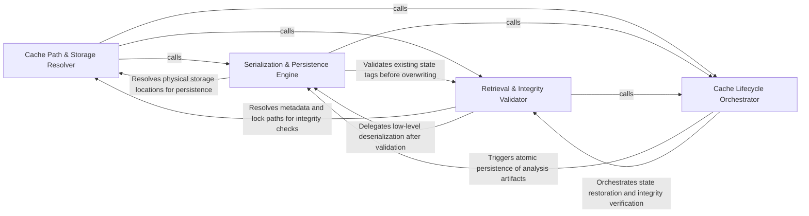

## Details

Orchestrates the high-level operations of the cache, including loading, saving, and flushing analysis data. It manages the mapping between analysis states and physical storage locations using SHA-based identifiers.

### Cache Path & Storage Resolver
Manages the physical organization of the cache on disk by generating deterministic file paths based on SHA identifiers.

**Related Classes/Methods**: _None_

**Source Files:**

- [`diagram_analysis/diagram_generator.py`](https://github.com/CodeBoarding/CodeBoarding/blob/main/.codeboardingdiagram_analysis/diagram_generator.py)
  - `diagram_analysis.diagram_generator.DiagramGenerator._persist_static_analysis_artifact` ([L310-L317](https://github.com/CodeBoarding/CodeBoarding/blob/main/.codeboardingdiagram_analysis/diagram_generator.py#L310-L317)) - Method
- [`static_analyzer/__init__.py`](https://github.com/CodeBoarding/CodeBoarding/blob/main/.codeboardingstatic_analyzer/__init__.py)
  - `static_analyzer.__init__.StaticAnalyzer.__exit__` ([L206-L207](https://github.com/CodeBoarding/CodeBoarding/blob/main/.codeboardingstatic_analyzer/__init__.py#L206-L207)) - Method
  - `static_analyzer.__init__.StaticAnalyzer.flush_cache` ([L332-L353](https://github.com/CodeBoarding/CodeBoarding/blob/main/.codeboardingstatic_analyzer/__init__.py#L332-L353)) - Method
  - `static_analyzer.__init__.StaticAnalyzer.load_cached_analysis` ([L373-L409](https://github.com/CodeBoarding/CodeBoarding/blob/main/.codeboardingstatic_analyzer/__init__.py#L373-L409)) - Method

### Serialization & Persistence Engine
Handles the low-level transformation of in-memory analysis data into persistent formats and ensures graph relationships are preserved.

**Related Classes/Methods**: _None_

**Source Files:**

- [`static_analyzer/__init__.py`](https://github.com/CodeBoarding/CodeBoarding/blob/main/.codeboardingstatic_analyzer/__init__.py)
  - `static_analyzer.__init__.StaticAnalyzer.stop_clients` ([L311-L330](https://github.com/CodeBoarding/CodeBoarding/blob/main/.codeboardingstatic_analyzer/__init__.py#L311-L330)) - Method
- [`static_analyzer/analysis_cache.py`](https://github.com/CodeBoarding/CodeBoarding/blob/main/.codeboardingstatic_analyzer/analysis_cache.py)
  - `static_analyzer.analysis_cache.StaticAnalysisCache` ([L60-L276](https://github.com/CodeBoarding/CodeBoarding/blob/main/.codeboardingstatic_analyzer/analysis_cache.py#L60-L276)) - Class
  - `static_analyzer.analysis_cache.StaticAnalysisCache.__init__` ([L69-L71](https://github.com/CodeBoarding/CodeBoarding/blob/main/.codeboardingstatic_analyzer/analysis_cache.py#L69-L71)) - Method
  - `static_analyzer.analysis_cache.StaticAnalysisCache._legacy_pkl_path` ([L145-L146](https://github.com/CodeBoarding/CodeBoarding/blob/main/.codeboardingstatic_analyzer/analysis_cache.py#L145-L146)) - Method
  - `static_analyzer.analysis_cache.StaticAnalysisCache._get_unlocked` ([L183-L217](https://github.com/CodeBoarding/CodeBoarding/blob/main/.codeboardingstatic_analyzer/analysis_cache.py#L183-L217)) - Method

### Retrieval & Integrity Validator
Manages the restoration of analysis states from disk and performs integrity checks by validating SHA signatures.

**Related Classes/Methods**:

- `static_analyzer.analysis_cache.StaticAnalysisCache.load_with_sha`:148-167

**Source Files:**

- [`static_analyzer/analysis_cache.py`](https://github.com/CodeBoarding/CodeBoarding/blob/main/.codeboardingstatic_analyzer/analysis_cache.py)
  - `static_analyzer.analysis_cache.StaticAnalysisCache.lock_path` ([L112-L113](https://github.com/CodeBoarding/CodeBoarding/blob/main/.codeboardingstatic_analyzer/analysis_cache.py#L112-L113)) - Method
  - `static_analyzer.analysis_cache.StaticAnalysisCache._read_tag_sha_unlocked` ([L131-L143](https://github.com/CodeBoarding/CodeBoarding/blob/main/.codeboardingstatic_analyzer/analysis_cache.py#L131-L143)) - Method
  - `static_analyzer.analysis_cache.StaticAnalysisCache.load_with_sha` ([L148-L167](https://github.com/CodeBoarding/CodeBoarding/blob/main/.codeboardingstatic_analyzer/analysis_cache.py#L148-L167)) - Method
  - `static_analyzer.analysis_cache.StaticAnalysisCache.get` ([L169-L181](https://github.com/CodeBoarding/CodeBoarding/blob/main/.codeboardingstatic_analyzer/analysis_cache.py#L169-L181)) - Method

### Cache Lifecycle Orchestrator
Provides high-level control logic for the StaticAnalyzer, coordinating maintenance tasks and lifecycle transitions.

**Related Classes/Methods**: _None_

**Source Files:**

- [`static_analyzer/analysis_cache.py`](https://github.com/CodeBoarding/CodeBoarding/blob/main/.codeboardingstatic_analyzer/analysis_cache.py)
  - `static_analyzer.analysis_cache.StaticAnalysisCache.pkl_path` ([L104-L105](https://github.com/CodeBoarding/CodeBoarding/blob/main/.codeboardingstatic_analyzer/analysis_cache.py#L104-L105)) - Method
  - `static_analyzer.analysis_cache.StaticAnalysisCache.sha_path` ([L108-L109](https://github.com/CodeBoarding/CodeBoarding/blob/main/.codeboardingstatic_analyzer/analysis_cache.py#L108-L109)) - Method
  - `static_analyzer.analysis_cache.StaticAnalysisCache.read_tag_sha` ([L115-L129](https://github.com/CodeBoarding/CodeBoarding/blob/main/.codeboardingstatic_analyzer/analysis_cache.py#L115-L129)) - Method
  - `static_analyzer.analysis_cache.StaticAnalysisCache.save` ([L219-L276](https://github.com/CodeBoarding/CodeBoarding/blob/main/.codeboardingstatic_analyzer/analysis_cache.py#L219-L276)) - Method

### [FAQ](https://github.com/CodeBoarding/GeneratedOnBoardings/tree/main?tab=readme-ov-file#faq)