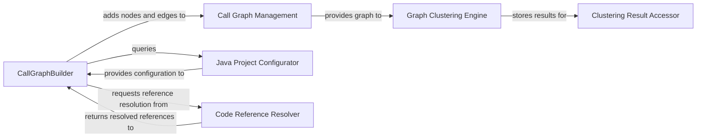

## Details

Constructs and maintains the call graph of the analyzed codebase by processing structural and semantic information obtained from the LSPClient.

### CallGraphBuilder
Orchestrates the construction of the call graph by integrating structural and semantic information obtained from various sources, such as LSP clients and language‑specific configurators. It populates the core graph data structure.

**Related Classes/Methods**:

- <a href="https://github.com/CodeBoarding/CodeBoarding/blob/main/.codeboardingstatic_analyzer/java_config_scanner.py" target="_blank" rel="noopener noreferrer">`repos.codeboarding.static_analysis.CallGraphBuilder`</a>

### Call Graph Management
Provides the foundational data structure for the call graph, offering interfaces for adding nodes and edges, querying graph elements, and initiating graph‑wide operations like clustering. It serves as the central repository for the graph's state.

**Related Classes/Methods**:

- <a href="https://github.com/CodeBoarding/CodeBoarding/blob/main/.codeboardingstatic_analyzer/graph.py" target="_blank" rel="noopener noreferrer">`static_analyzer.graph.CallGraph`</a>

### Java Project Configurator
Specializes in scanning Java projects to identify build systems (e.g., Maven, Gradle) and extract configuration details, providing language‑specific context for accurate call graph construction.

**Related Classes/Methods**:

- <a href="https://github.com/CodeBoarding/CodeBoarding/blob/main/.codeboardingstatic_analyzer/java_config_scanner.py" target="_blank" rel="noopener noreferrer">`static_analyzer.java_config_scanner.JavaConfigScanner`</a>

### Code Reference Resolver
Normalizes and resolves code references across the codebase, ensuring that all links within the call graph are accurate and consistent regardless of their original format or location.

**Related Classes/Methods**:

- <a href="https://github.com/CodeBoarding/CodeBoarding/blob/main/.codeboardingstatic_analyzer/reference_resolve_mixin.py" target="_blank" rel="noopener noreferrer">`static_analyzer.reference_resolve_mixin.ReferenceResolverMixin`</a>

### Graph Clustering Engine
Applies algorithms to group related nodes within the call graph, transforming the detailed, raw graph into a more abstract and manageable representation for documentation and visualization.

**Related Classes/Methods**:

- <a href="https://github.com/CodeBoarding/CodeBoarding/blob/main/.codeboardingstatic_analyzer/graph.py" target="_blank" rel="noopener noreferrer">`static_analyzer.graph._adaptive_clustering`</a>
- <a href="https://github.com/CodeBoarding/CodeBoarding/blob/main/.codeboardingstatic_analyzer/graph.py" target="_blank" rel="noopener noreferrer">`static_analyzer.graph._balance_clusters`</a>

### Clustering Result Accessor
Offers a standardized interface for retrieving and interpreting the outcomes of the graph clustering process, enabling access by file, cluster ID, or other criteria.

**Related Classes/Methods**:

- <a href="https://github.com/CodeBoarding/CodeBoarding/blob/main/.codeboardingstatic_analyzer/graph.py" target="_blank" rel="noopener noreferrer">`static_analyzer.graph.ClusterResult`</a>

### [FAQ](https://github.com/CodeBoarding/GeneratedOnBoardings/tree/main?tab=readme-ov-file#faq)