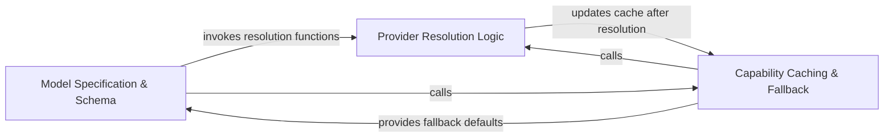

## Details

Dynamically probes and caches technical specifications of models, focusing on context windows and token limits.

### Model Specification & Schema
Defines the standardized data structures and primary interface for model constraints, acting as the formal contract for token limit handling.

**Related Classes/Methods**:

- `agents.model_capabilities.get_context_window`:30-44

**Source Files:**

- [`agents/model_capabilities.py`](https://github.com/CodeBoarding/CodeBoarding/blob/main/.codeboardingagents/model_capabilities.py)
  - `agents.model_capabilities.ContextWindow` ([L24-L27](https://github.com/CodeBoarding/CodeBoarding/blob/main/.codeboardingagents/model_capabilities.py#L24-L27)) - Class
  - `agents.model_capabilities._ollama_show` ([L94-L124](https://github.com/CodeBoarding/CodeBoarding/blob/main/.codeboardingagents/model_capabilities.py#L94-L124)) - Function
  - `agents.model_capabilities._load` ([L184-L203](https://github.com/CodeBoarding/CodeBoarding/blob/main/.codeboardingagents/model_capabilities.py#L184-L203)) - Function
  - `agents.model_capabilities._normalize` ([L216-L221](https://github.com/CodeBoarding/CodeBoarding/blob/main/.codeboardingagents/model_capabilities.py#L216-L221)) - Function

### Provider Resolution Logic
Implements dynamic discovery by querying external provider registries to extract real-time specifications for active models.

**Related Classes/Methods**:

- `agents.model_capabilities._resolve_litellm`:148-159
- `agents.model_capabilities._resolve_ollama`:82-91

**Source Files:**

- [`agents/model_capabilities.py`](https://github.com/CodeBoarding/CodeBoarding/blob/main/.codeboardingagents/model_capabilities.py)
  - `agents.model_capabilities._resolve_env` ([L47-L61](https://github.com/CodeBoarding/CodeBoarding/blob/main/.codeboardingagents/model_capabilities.py#L47-L61)) - Function
  - `agents.model_capabilities._parse_num_ctx` ([L127-L130](https://github.com/CodeBoarding/CodeBoarding/blob/main/.codeboardingagents/model_capabilities.py#L127-L130)) - Function
  - `agents.model_capabilities._openrouter_id` ([L174-L180](https://github.com/CodeBoarding/CodeBoarding/blob/main/.codeboardingagents/model_capabilities.py#L174-L180)) - Function
  - `agents.model_capabilities._read_cache` ([L206-L213](https://github.com/CodeBoarding/CodeBoarding/blob/main/.codeboardingagents/model_capabilities.py#L206-L213)) - Function

### Capability Caching & Fallback
Manages the lifecycle of discovered specifications, optimizing performance via in-memory caching and providing hardcoded defaults for stability.

**Related Classes/Methods**: _None_

**Source Files:**

- [`agents/model_capabilities.py`](https://github.com/CodeBoarding/CodeBoarding/blob/main/.codeboardingagents/model_capabilities.py)
  - `agents.model_capabilities.get_context_window` ([L30-L44](https://github.com/CodeBoarding/CodeBoarding/blob/main/.codeboardingagents/model_capabilities.py#L30-L44)) - Function
  - `agents.model_capabilities._resolve_ollama` ([L82-L91](https://github.com/CodeBoarding/CodeBoarding/blob/main/.codeboardingagents/model_capabilities.py#L82-L91)) - Function
  - `agents.model_capabilities._resolve_modelsdev` ([L133-L145](https://github.com/CodeBoarding/CodeBoarding/blob/main/.codeboardingagents/model_capabilities.py#L133-L145)) - Function
  - `agents.model_capabilities._resolve_litellm` ([L148-L159](https://github.com/CodeBoarding/CodeBoarding/blob/main/.codeboardingagents/model_capabilities.py#L148-L159)) - Function
  - `agents.model_capabilities._resolve_openrouter` ([L162-L171](https://github.com/CodeBoarding/CodeBoarding/blob/main/.codeboardingagents/model_capabilities.py#L162-L171)) - Function
- [`utils.py`](https://github.com/CodeBoarding/CodeBoarding/blob/main/.codeboardingutils.py)
  - `utils.get_cache_dir` ([L34-L41](https://github.com/CodeBoarding/CodeBoarding/blob/main/.codeboardingutils.py#L34-L41)) - Function

### [FAQ](https://github.com/CodeBoarding/GeneratedOnBoardings/tree/main?tab=readme-ov-file#faq)