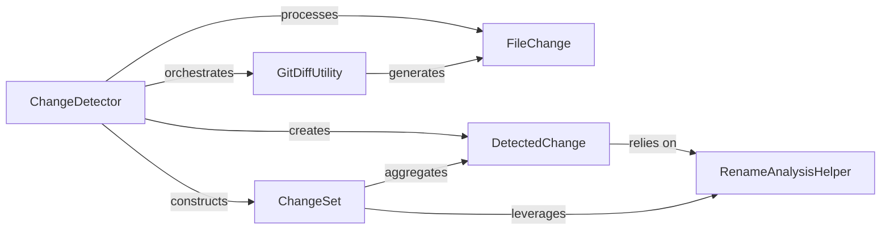

## Details

Identifies modifications, additions, and deletions of files between different commits within a repository. It utilizes low-level Git diff utilities to provide a precise list of changed files, enabling focused analysis on only the relevant parts of the codebase.

### ChangeDetector
The primary orchestrator of the change detection process. It initiates Git diff operations, parses the raw output, and constructs a high‑level ChangeSet object containing detailed DetectedChange instances. It serves as the main entry point for clients seeking repository change information.

**Related Classes/Methods**:

- <a href="https://github.com/CodeBoarding/CodeBoarding/blob/main/.codeboardingrepo_utils/change_detector.py" target="_blank" rel="noopener noreferrer">`repos.codeboarding.repository.ChangeDetector`</a>
- <a href="https://github.com/CodeBoarding/CodeBoarding/blob/main/.codeboardingrepo_utils/change_detector.py" target="_blank" rel="noopener noreferrer">`repos.codeboarding.repository.ChangeDetector.detect_changes`</a>
- <a href="https://github.com/CodeBoarding/CodeBoarding/blob/main/.codeboardingrepo_utils/change_detector.py" target="_blank" rel="noopener noreferrer">`repos.codeboarding.repository.ChangeDetector.detect_changes_from_commit`</a>
- <a href="https://github.com/CodeBoarding/CodeBoarding/blob/main/.codeboardingrepo_utils/change_detector.py" target="_blank" rel="noopener noreferrer">`repos.codeboarding.repository.ChangeDetector.detect_uncommitted_changes`</a>

### GitDiffUtility
Provides a low‑level abstraction for executing Git diff commands and parsing their raw output. It transforms raw Git CLI responses into structured FileChange objects, acting as the interface to the version control system.

**Related Classes/Methods**:

- <a href="https://github.com/CodeBoarding/CodeBoarding/blob/main/.codeboardingrepo_utils/git_diff.py" target="_blank" rel="noopener noreferrer">`repo_utils.git_diff.get_git_diff`</a>

### FileChange
A data model representing granular modifications within a single file, derived directly from the raw output of a Git diff. It captures details like lines added, deleted, or modified within a file.

**Related Classes/Methods**:

- <a href="https://github.com/CodeBoarding/CodeBoarding/blob/main/.codeboardingrepo_utils/git_diff.py" target="_blank" rel="noopener noreferrer">`repo_utils.git_diff.FileChange`</a>

### DetectedChange
Represents a single, semantic file change event (e.g., file added, deleted, modified, or renamed). It encapsulates the change type, old and new file paths, and a flag indicating structural changes, often leveraging RenameAnalysisHelper.

**Related Classes/Methods**:

- <a href="https://github.com/CodeBoarding/CodeBoarding/blob/main/.codeboardingrepo_utils/change_detector.py" target="_blank" rel="noopener noreferrer">`repo_utils.change_detector.DetectedChange`</a>

### RenameAnalysisHelper
A utility component providing specialized functions for identifying and categorizing file renames. It assists DetectedChange and ChangeSet in accurately distinguishing renames from simple deletions and additions.

**Related Classes/Methods**:

- <a href="https://github.com/CodeBoarding/CodeBoarding/blob/main/.codeboardingrepo_utils/change_detector.py" target="_blank" rel="noopener noreferrer">`repo_utils.change_detector.RenameAnalysisHelper.has_only_renames`</a>
- <a href="https://github.com/CodeBoarding/CodeBoarding/blob/main/.codeboardingrepo_utils/change_detector.py" target="_blank" rel="noopener noreferrer">`repo_utils.change_detector.RenameAnalysisHelper.is_rename`</a>
- <a href="https://github.com/CodeBoarding/CodeBoarding/blob/main/.codeboardingrepo_utils/change_detector.py" target="_blank" rel="noopener noreferrer">`repo_utils.change_detector.RenameAnalysisHelper.renames`</a>

### ChangeSet
A comprehensive container for a collection of DetectedChange objects, representing all identified modifications within a specific scope. It offers methods for querying and filtering changes based on type or other attributes, providing a structured, queryable model of repository modifications.

**Related Classes/Methods**:

- <a href="https://github.com/CodeBoarding/CodeBoarding/blob/main/.codeboardingrepo_utils/change_detector.py" target="_blank" rel="noopener noreferrer">`repo_utils.change_detector.ChangeSet`</a>

### [FAQ](https://github.com/CodeBoarding/GeneratedOnBoardings/tree/main?tab=readme-ov-file#faq)