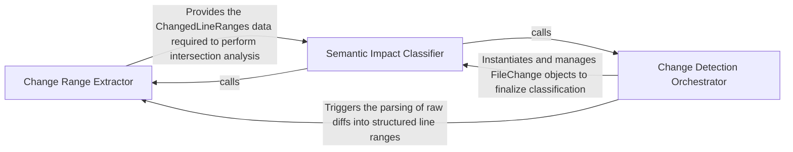

## Details

Provides the semantic domain model for changes by mapping line-level diffs to specific code ranges and classifying the status of methods or classes.

### Change Range Extractor
Responsible for parsing raw diff outputs and calculating the precise line ranges that have been added, modified, or deleted.

**Related Classes/Methods**: _None_

**Source Files:**

- [`repo_utils/change_detector.py`](https://github.com/CodeBoarding/CodeBoarding/blob/main/.codeboardingrepo_utils/change_detector.py)
  - `repo_utils.change_detector.ChangedLineRanges` ([L57-L67](https://github.com/CodeBoarding/CodeBoarding/blob/main/.codeboardingrepo_utils/change_detector.py#L57-L67)) - Class
  - `repo_utils.change_detector.FileChange.changed_line_ranges` ([L96-L177](https://github.com/CodeBoarding/CodeBoarding/blob/main/.codeboardingrepo_utils/change_detector.py#L96-L177)) - Method
  - `repo_utils.change_detector.FileChange.changed_line_ranges._flush` ([L122-L149](https://github.com/CodeBoarding/CodeBoarding/blob/main/.codeboardingrepo_utils/change_detector.py#L122-L149)) - Function

### Semantic Impact Classifier
Maps physical line changes to the project's logical structure by intersecting changed ranges with symbol definitions to classify method and class statuses.

**Related Classes/Methods**:

- `repo_utils.change_detector.FileChange`:71-220
- `repo_utils.change_detector.FileChange.classify_method_statuses`:179-220

**Source Files:**

- [`repo_utils/change_detector.py`](https://github.com/CodeBoarding/CodeBoarding/blob/main/.codeboardingrepo_utils/change_detector.py)
  - `repo_utils.change_detector.FileChange.classify_method_statuses` ([L179-L220](https://github.com/CodeBoarding/CodeBoarding/blob/main/.codeboardingrepo_utils/change_detector.py#L179-L220)) - Method
  - `repo_utils.change_detector._fully_inside` ([L305-L315](https://github.com/CodeBoarding/CodeBoarding/blob/main/.codeboardingrepo_utils/change_detector.py#L305-L315)) - Function

### Change Detection Orchestrator
Manages the end-to-end lifecycle of change analysis across a repository, coordinating extraction and classification to produce a unified impact model.

**Related Classes/Methods**: _None_

**Source Files:**

- [`repo_utils/change_detector.py`](https://github.com/CodeBoarding/CodeBoarding/blob/main/.codeboardingrepo_utils/change_detector.py)
  - `repo_utils.change_detector._overlaps` ([L298-L302](https://github.com/CodeBoarding/CodeBoarding/blob/main/.codeboardingrepo_utils/change_detector.py#L298-L302)) - Function

### [FAQ](https://github.com/CodeBoarding/GeneratedOnBoardings/tree/main?tab=readme-ov-file#faq)