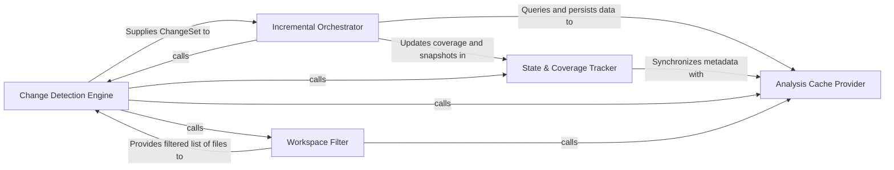

## Details

Responsible for identifying repository modifications and maintaining the file coverage map to enable surgical incremental updates.

### Change Detection Engine
Interfaces with the version control system to identify modified, added, or deleted files and parses these deltas into structured change sets.

**Related Classes/Methods**:

- `repo_utils.change_detector.ChangeSet`:224-292

**Source Files:**

- [`agents/validation.py`](https://github.com/CodeBoarding/CodeBoarding/blob/main/.codeboardingagents/validation.py)
  - `agents.validation.validate_file_classifications` ([L450-L510](https://github.com/CodeBoarding/CodeBoarding/blob/main/.codeboardingagents/validation.py#L450-L510)) - Function
- [`diagram_analysis/file_coverage.py`](https://github.com/CodeBoarding/CodeBoarding/blob/main/.codeboardingdiagram_analysis/file_coverage.py)
  - `diagram_analysis.file_coverage.FileCoverage.build` ([L40-L75](https://github.com/CodeBoarding/CodeBoarding/blob/main/.codeboardingdiagram_analysis/file_coverage.py#L40-L75)) - Method
  - `diagram_analysis.file_coverage.FileCoverage._apply_changes` ([L135-L173](https://github.com/CodeBoarding/CodeBoarding/blob/main/.codeboardingdiagram_analysis/file_coverage.py#L135-L173)) - Method

### Incremental Orchestrator
The central logic controller that coordinates the lifecycle of an incremental update, managing the invalidation of stale CFG nodes and the merging of new analysis results.

**Related Classes/Methods**: _None_

**Source Files:**

- [`diagram_analysis/file_coverage.py`](https://github.com/CodeBoarding/CodeBoarding/blob/main/.codeboardingdiagram_analysis/file_coverage.py)
  - `diagram_analysis.file_coverage.FileCoverage.update` ([L77-L133](https://github.com/CodeBoarding/CodeBoarding/blob/main/.codeboardingdiagram_analysis/file_coverage.py#L77-L133)) - Method
- [`repo_utils/__init__.py`](https://github.com/CodeBoarding/CodeBoarding/blob/main/.codeboardingrepo_utils/__init__.py)
  - `repo_utils.__init__.normalize_path` ([L235-L261](https://github.com/CodeBoarding/CodeBoarding/blob/main/.codeboardingrepo_utils/__init__.py#L235-L261)) - Function
  - `repo_utils.__init__.normalize_paths` ([L264-L274](https://github.com/CodeBoarding/CodeBoarding/blob/main/.codeboardingrepo_utils/__init__.py#L264-L274)) - Function
- [`repo_utils/change_detector.py`](https://github.com/CodeBoarding/CodeBoarding/blob/main/.codeboardingrepo_utils/change_detector.py)
  - `repo_utils.change_detector.ChangeSet.added_files` ([L247-L248](https://github.com/CodeBoarding/CodeBoarding/blob/main/.codeboardingrepo_utils/change_detector.py#L247-L248)) - Method

### State & Coverage Tracker
Maintains the source of truth for what has been analyzed, tracking file-level coverage and managing snapshots of the project structure.

**Related Classes/Methods**:

- `diagram_analysis.file_coverage.FileCoverage`:23-212

**Source Files:**

- [`repo_utils/change_detector.py`](https://github.com/CodeBoarding/CodeBoarding/blob/main/.codeboardingrepo_utils/change_detector.py)
  - `repo_utils.change_detector.ChangeSet.get_file` ([L237-L241](https://github.com/CodeBoarding/CodeBoarding/blob/main/.codeboardingrepo_utils/change_detector.py#L237-L241)) - Method
  - `repo_utils.change_detector.ChangeSet.deleted_files` ([L255-L256](https://github.com/CodeBoarding/CodeBoarding/blob/main/.codeboardingrepo_utils/change_detector.py#L255-L256)) - Method
  - `repo_utils.change_detector.ChangeSet.has_renames_or_copies` ([L263-L264](https://github.com/CodeBoarding/CodeBoarding/blob/main/.codeboardingrepo_utils/change_detector.py#L263-L264)) - Method
  - `repo_utils.change_detector.ChangeSet.file_status` ([L266-L277](https://github.com/CodeBoarding/CodeBoarding/blob/main/.codeboardingrepo_utils/change_detector.py#L266-L277)) - Method

### Workspace Filter
Enforces inclusion/exclusion boundaries based on .gitignore and project configuration to ensure the analysis scope remains relevant.

**Related Classes/Methods**:

- `repo_utils.ignore.RepoIgnoreManager`:164-329

**Source Files:**

- [`repo_utils/change_detector.py`](https://github.com/CodeBoarding/CodeBoarding/blob/main/.codeboardingrepo_utils/change_detector.py)
  - `repo_utils.change_detector.ChangeSet.modified_files` ([L251-L252](https://github.com/CodeBoarding/CodeBoarding/blob/main/.codeboardingrepo_utils/change_detector.py#L251-L252)) - Method
  - `repo_utils.change_detector.ChangeSet.renames` ([L259-L261](https://github.com/CodeBoarding/CodeBoarding/blob/main/.codeboardingrepo_utils/change_detector.py#L259-L261)) - Method

### Analysis Cache Provider
Handles the persistence and retrieval of static analysis data, using SHA-based validation to ensure cached results match the current file state.

**Related Classes/Methods**: _None_

**Source Files:**

- [`repo_utils/change_detector.py`](https://github.com/CodeBoarding/CodeBoarding/blob/main/.codeboardingrepo_utils/change_detector.py)
  - `repo_utils.change_detector.ChangeType.from_status_code` ([L38-L42](https://github.com/CodeBoarding/CodeBoarding/blob/main/.codeboardingrepo_utils/change_detector.py#L38-L42)) - Method
  - `repo_utils.change_detector.FileChange.change_type` ([L82-L83](https://github.com/CodeBoarding/CodeBoarding/blob/main/.codeboardingrepo_utils/change_detector.py#L82-L83)) - Method
  - `repo_utils.change_detector.FileChange.is_rename` ([L85-L86](https://github.com/CodeBoarding/CodeBoarding/blob/main/.codeboardingrepo_utils/change_detector.py#L85-L86)) - Method
  - `repo_utils.change_detector.FileChange.is_content_change` ([L88-L90](https://github.com/CodeBoarding/CodeBoarding/blob/main/.codeboardingrepo_utils/change_detector.py#L88-L90)) - Method
  - `repo_utils.change_detector.FileChange.is_structural` ([L92-L94](https://github.com/CodeBoarding/CodeBoarding/blob/main/.codeboardingrepo_utils/change_detector.py#L92-L94)) - Method
- [`repo_utils/ignore.py`](https://github.com/CodeBoarding/CodeBoarding/blob/main/.codeboardingrepo_utils/ignore.py)
  - `repo_utils.ignore.RepoIgnoreManager.categorize_file` ([L301-L329](https://github.com/CodeBoarding/CodeBoarding/blob/main/.codeboardingrepo_utils/ignore.py#L301-L329)) - Method

### [FAQ](https://github.com/CodeBoarding/GeneratedOnBoardings/tree/main?tab=readme-ov-file#faq)