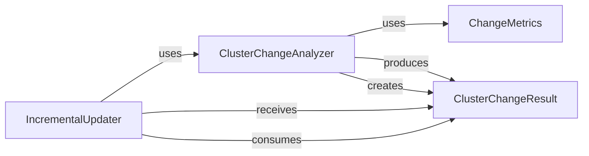

## Details

Identifies and analyzes logical code clusters that have been modified, providing precise information on which parts require re-analysis.

### IncrementalUpdater
Orchestrates the overall incremental update process for diagram analysis. It identifies affected components, applies necessary changes, and ensures that only modified parts trigger re-analysis, optimizing performance.

**Related Classes/Methods**:

- <a href="https://github.com/CodeBoarding/CodeBoarding/blob/main/.codeboardingdiagram_analysis/incremental/updater.py" target="_blank" rel="noopener noreferrer">`diagram_analysis.incremental.updater.IncrementalUpdater`</a>

### ClusterChangeAnalyzer
The core engine for detecting, classifying, and quantifying structural changes within logical code clusters. It analyzes differences between code versions and identifies the nature of modifications.

**Related Classes/Methods**:

- <a href="https://github.com/CodeBoarding/CodeBoarding/blob/main/.codeboardingstatic_analyzer/cluster_change_analyzer.py" target="_blank" rel="noopener noreferrer">`static_analyzer.cluster_change_analyzer.ClusterChangeAnalyzer`</a>

### ClusterChangeResult
A data transfer object (DTO) that encapsulates the outcome of a cluster change analysis. It contains information such as matched clusters, classified changes, and associated quantitative metrics.

**Related Classes/Methods**:

- <a href="https://github.com/CodeBoarding/CodeBoarding/blob/main/.codeboardingstatic_analyzer/cluster_change_analyzer.py" target="_blank" rel="noopener noreferrer">`static_analyzer.cluster_change_analyzer.ClusterChangeResult`</a>

### ChangeMetrics
Responsible for calculating specific quantitative metrics related to code changes, such as node movement ratios. These metrics provide numerical insights into the extent and type of modifications.

**Related Classes/Methods**:

- <a href="https://github.com/CodeBoarding/CodeBoarding/blob/main/.codeboardingstatic_analyzer/cluster_change_analyzer.py" target="_blank" rel="noopener noreferrer">`static_analyzer.cluster_change_analyzer.ChangeMetrics`</a>

### [FAQ](https://github.com/CodeBoarding/GeneratedOnBoardings/tree/main?tab=readme-ov-file#faq)