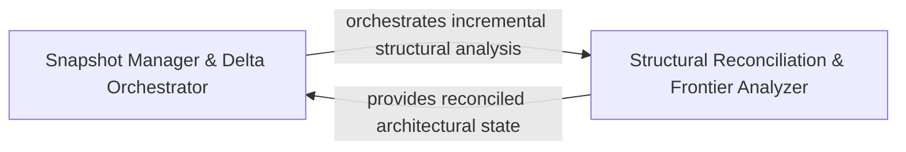

## Details

The core engine for calculating architectural shifts between versions, materializing snapshots, and calculating structural differences at language and cluster levels.

### Snapshot Manager & Delta Orchestrator
Acts as the primary coordinator for capturing architectural states and calculating high-level differences. It manages the creation of ClusterSnapshot objects and orchestrates the StructuralClusterDiff process.

**Related Classes/Methods**:

- `diagram_analysis.cluster_snapshot.ClusterSnapshot`:30-37
- `diagram_analysis.cluster_delta.StructuralClusterDiff`:113-118
- `diagram_analysis.cluster_delta.ClusterDelta`:55-63
- `agents.cluster_methods_mixin.scoped_snapshot_from_lineage`:76-97
- `diagram_analysis.cluster_snapshot.snapshot_from_cluster_results`:86-101

**Source Files:**

- [`agents/cluster_methods_mixin.py`](https://github.com/CodeBoarding/CodeBoarding/blob/main/.codeboardingagents/cluster_methods_mixin.py)
  - `agents.cluster_methods_mixin.scoped_snapshot_from_lineage` ([L76-L97](https://github.com/CodeBoarding/CodeBoarding/blob/main/.codeboardingagents/cluster_methods_mixin.py#L76-L97)) - Function
  - `agents.cluster_methods_mixin.ClusterMethodsMixin._create_strict_component_subgraph` ([L309-L357](https://github.com/CodeBoarding/CodeBoarding/blob/main/.codeboardingagents/cluster_methods_mixin.py#L309-L357)) - Method
  - `agents.cluster_methods_mixin.ClusterMethodsMixin._build_undirected_graphs` ([L380-L400](https://github.com/CodeBoarding/CodeBoarding/blob/main/.codeboardingagents/cluster_methods_mixin.py#L380-L400)) - Method
- [`agents/incremental_agent.py`](https://github.com/CodeBoarding/CodeBoarding/blob/main/.codeboardingagents/incremental_agent.py)
  - `agents.incremental_agent._cfg_graphs_for_cluster_results` ([L828-L835](https://github.com/CodeBoarding/CodeBoarding/blob/main/.codeboardingagents/incremental_agent.py#L828-L835)) - Function
- [`diagram_analysis/cluster_delta.py`](https://github.com/CodeBoarding/CodeBoarding/blob/main/.codeboardingdiagram_analysis/cluster_delta.py)
  - `diagram_analysis.cluster_delta.LanguageDelta.affected_cluster_ids` ([L50-L51](https://github.com/CodeBoarding/CodeBoarding/blob/main/.codeboardingdiagram_analysis/cluster_delta.py#L50-L51)) - Method
  - `diagram_analysis.cluster_delta.ClusterDelta` ([L55-L63](https://github.com/CodeBoarding/CodeBoarding/blob/main/.codeboardingdiagram_analysis/cluster_delta.py#L55-L63)) - Class
  - `diagram_analysis.cluster_delta.ClusterDelta.has_changes` ([L59-L60](https://github.com/CodeBoarding/CodeBoarding/blob/main/.codeboardingdiagram_analysis/cluster_delta.py#L59-L60)) - Method
  - `diagram_analysis.cluster_delta.StructuralClusterDiff` ([L113-L118](https://github.com/CodeBoarding/CodeBoarding/blob/main/.codeboardingdiagram_analysis/cluster_delta.py#L113-L118)) - Class
  - `diagram_analysis.cluster_delta.compute_cluster_delta` ([L255-L296](https://github.com/CodeBoarding/CodeBoarding/blob/main/.codeboardingdiagram_analysis/cluster_delta.py#L255-L296)) - Function
  - `diagram_analysis.cluster_delta.structural_diff_from_delta` ([L299-L332](https://github.com/CodeBoarding/CodeBoarding/blob/main/.codeboardingdiagram_analysis/cluster_delta.py#L299-L332)) - Function
  - `diagram_analysis.cluster_delta._changeset_to_path_set` ([L335-L342](https://github.com/CodeBoarding/CodeBoarding/blob/main/.codeboardingdiagram_analysis/cluster_delta.py#L335-L342)) - Function
- [`diagram_analysis/cluster_snapshot.py`](https://github.com/CodeBoarding/CodeBoarding/blob/main/.codeboardingdiagram_analysis/cluster_snapshot.py)
  - `diagram_analysis.cluster_snapshot.ClusterSnapshotEntry` ([L22-L26](https://github.com/CodeBoarding/CodeBoarding/blob/main/.codeboardingdiagram_analysis/cluster_snapshot.py#L22-L26)) - Class
  - `diagram_analysis.cluster_snapshot.ClusterSnapshot` ([L30-L37](https://github.com/CodeBoarding/CodeBoarding/blob/main/.codeboardingdiagram_analysis/cluster_snapshot.py#L30-L37)) - Class
  - `diagram_analysis.cluster_snapshot.ClusterSnapshot.get_language` ([L33-L34](https://github.com/CodeBoarding/CodeBoarding/blob/main/.codeboardingdiagram_analysis/cluster_snapshot.py#L33-L34)) - Method
  - `diagram_analysis.cluster_snapshot.ClusterSnapshot.all_cluster_ids` ([L36-L37](https://github.com/CodeBoarding/CodeBoarding/blob/main/.codeboardingdiagram_analysis/cluster_snapshot.py#L36-L37)) - Method
  - `diagram_analysis.cluster_snapshot.snapshot_from_static_analysis` ([L40-L59](https://github.com/CodeBoarding/CodeBoarding/blob/main/.codeboardingdiagram_analysis/cluster_snapshot.py#L40-L59)) - Function
  - `diagram_analysis.cluster_snapshot._entries_from_cfg_cache` ([L62-L83](https://github.com/CodeBoarding/CodeBoarding/blob/main/.codeboardingdiagram_analysis/cluster_snapshot.py#L62-L83)) - Function
  - `diagram_analysis.cluster_snapshot.snapshot_from_cluster_results` ([L86-L101](https://github.com/CodeBoarding/CodeBoarding/blob/main/.codeboardingdiagram_analysis/cluster_snapshot.py#L86-L101)) - Function
- [`diagram_analysis/diagram_generator.py`](https://github.com/CodeBoarding/CodeBoarding/blob/main/.codeboardingdiagram_analysis/diagram_generator.py)
  - `diagram_analysis.diagram_generator.DiagramGenerator._seed_incremental_cluster_cache` ([L869-L884](https://github.com/CodeBoarding/CodeBoarding/blob/main/.codeboardingdiagram_analysis/diagram_generator.py#L869-L884)) - Method
  - `diagram_analysis.diagram_generator._build_scope_incremental_inputs` ([L1697-L1727](https://github.com/CodeBoarding/CodeBoarding/blob/main/.codeboardingdiagram_analysis/diagram_generator.py#L1697-L1727)) - Function
  - `diagram_analysis.diagram_generator.scoped_snapshot_for_component` ([L1730-L1744](https://github.com/CodeBoarding/CodeBoarding/blob/main/.codeboardingdiagram_analysis/diagram_generator.py#L1730-L1744)) - Function
- [`static_analyzer/analysis_result.py`](https://github.com/CodeBoarding/CodeBoarding/blob/main/.codeboardingstatic_analyzer/analysis_result.py)
  - `static_analyzer.analysis_result.StaticAnalysisResults.get_cfg` ([L206-L211](https://github.com/CodeBoarding/CodeBoarding/blob/main/.codeboardingstatic_analyzer/analysis_result.py#L206-L211)) - Method
- [`static_analyzer/cluster_helpers.py`](https://github.com/CodeBoarding/CodeBoarding/blob/main/.codeboardingstatic_analyzer/cluster_helpers.py)
  - `static_analyzer.cluster_helpers.build_all_cluster_results` ([L48-L65](https://github.com/CodeBoarding/CodeBoarding/blob/main/.codeboardingstatic_analyzer/cluster_helpers.py#L48-L65)) - Function
  - `static_analyzer.cluster_helpers._sync_cluster_cache` ([L68-L76](https://github.com/CodeBoarding/CodeBoarding/blob/main/.codeboardingstatic_analyzer/cluster_helpers.py#L68-L76)) - Function
  - `static_analyzer.cluster_helpers.reindex_across_languages` ([L79-L102](https://github.com/CodeBoarding/CodeBoarding/blob/main/.codeboardingstatic_analyzer/cluster_helpers.py#L79-L102)) - Function
  - `static_analyzer.cluster_helpers.reindex_cluster_result` ([L105-L125](https://github.com/CodeBoarding/CodeBoarding/blob/main/.codeboardingstatic_analyzer/cluster_helpers.py#L105-L125)) - Function
- [`static_analyzer/constants.py`](https://github.com/CodeBoarding/CodeBoarding/blob/main/.codeboardingstatic_analyzer/constants.py)
  - `static_analyzer.constants.Language` ([L10-L26](https://github.com/CodeBoarding/CodeBoarding/blob/main/.codeboardingstatic_analyzer/constants.py#L10-L26)) - Class
- [`static_analyzer/graph.py`](https://github.com/CodeBoarding/CodeBoarding/blob/main/.codeboardingstatic_analyzer/graph.py)
  - `static_analyzer.graph.CallGraph.record_cluster_paths` ([L374-L376](https://github.com/CodeBoarding/CodeBoarding/blob/main/.codeboardingstatic_analyzer/graph.py#L374-L376)) - Method
  - `static_analyzer.graph.CallGraph.to_networkx` ([L381-L393](https://github.com/CodeBoarding/CodeBoarding/blob/main/.codeboardingstatic_analyzer/graph.py#L381-L393)) - Method
  - `static_analyzer.graph.CallGraph.clustering_networkx` ([L395-L413](https://github.com/CodeBoarding/CodeBoarding/blob/main/.codeboardingstatic_analyzer/graph.py#L395-L413)) - Method

### Structural Reconciliation & Frontier Analyzer
Handles the low-level mechanics of structural evolution, including language-specific delta calculation and the reconciliation of partitions using seeded community detection to identify the affected frontier.

**Related Classes/Methods**:

- `diagram_analysis.cluster_delta._affected_frontier`:782-820
- `diagram_analysis.cluster_delta.LanguageDelta`:42-51
- `static_analyzer.leiden_utils.find_partition_seeded`:66-103
- `diagram_analysis.cluster_delta._reconcile_seeded_partition`:823-868
- `diagram_analysis.cluster_delta._materialize_cluster_result`:915-940

**Source Files:**

- [`agents/cluster_methods_mixin.py`](https://github.com/CodeBoarding/CodeBoarding/blob/main/.codeboardingagents/cluster_methods_mixin.py)
  - `agents.cluster_methods_mixin.ClusterMethodsMixin._expand_to_method_level_clusters` ([L253-L307](https://github.com/CodeBoarding/CodeBoarding/blob/main/.codeboardingagents/cluster_methods_mixin.py#L253-L307)) - Method
- [`diagram_analysis/cluster_delta.py`](https://github.com/CodeBoarding/CodeBoarding/blob/main/.codeboardingdiagram_analysis/cluster_delta.py)
  - `diagram_analysis.cluster_delta.LanguageDelta` ([L42-L51](https://github.com/CodeBoarding/CodeBoarding/blob/main/.codeboardingdiagram_analysis/cluster_delta.py#L42-L51)) - Class
  - `diagram_analysis.cluster_delta._delta_for_language` ([L581-L665](https://github.com/CodeBoarding/CodeBoarding/blob/main/.codeboardingdiagram_analysis/cluster_delta.py#L581-L665)) - Function
  - `diagram_analysis.cluster_delta._flavor_b_seeded` ([L671-L779](https://github.com/CodeBoarding/CodeBoarding/blob/main/.codeboardingdiagram_analysis/cluster_delta.py#L671-L779)) - Function
  - `diagram_analysis.cluster_delta._affected_frontier` ([L782-L820](https://github.com/CodeBoarding/CodeBoarding/blob/main/.codeboardingdiagram_analysis/cluster_delta.py#L782-L820)) - Function
  - `diagram_analysis.cluster_delta._reconcile_seeded_partition` ([L823-L868](https://github.com/CodeBoarding/CodeBoarding/blob/main/.codeboardingdiagram_analysis/cluster_delta.py#L823-L868)) - Function
  - `diagram_analysis.cluster_delta._absorb_new_file_overlap_clusters` ([L871-L902](https://github.com/CodeBoarding/CodeBoarding/blob/main/.codeboardingdiagram_analysis/cluster_delta.py#L871-L902)) - Function
  - `diagram_analysis.cluster_delta._files_for_members` ([L905-L912](https://github.com/CodeBoarding/CodeBoarding/blob/main/.codeboardingdiagram_analysis/cluster_delta.py#L905-L912)) - Function
  - `diagram_analysis.cluster_delta._materialize_cluster_result` ([L915-L940](https://github.com/CodeBoarding/CodeBoarding/blob/main/.codeboardingdiagram_analysis/cluster_delta.py#L915-L940)) - Function
- [`static_analyzer/graph.py`](https://github.com/CodeBoarding/CodeBoarding/blob/main/.codeboardingstatic_analyzer/graph.py)
  - `static_analyzer.graph.ClusterResult` ([L74-L99](https://github.com/CodeBoarding/CodeBoarding/blob/main/.codeboardingstatic_analyzer/graph.py#L74-L99)) - Class
  - `static_analyzer.graph.ClusterResult.get_cluster_ids` ([L82-L83](https://github.com/CodeBoarding/CodeBoarding/blob/main/.codeboardingstatic_analyzer/graph.py#L82-L83)) - Method
  - `static_analyzer.graph.ClusterResult.get_files_for_cluster` ([L85-L86](https://github.com/CodeBoarding/CodeBoarding/blob/main/.codeboardingstatic_analyzer/graph.py#L85-L86)) - Method
  - `static_analyzer.graph.ClusterResult.get_clusters_for_file` ([L88-L89](https://github.com/CodeBoarding/CodeBoarding/blob/main/.codeboardingstatic_analyzer/graph.py#L88-L89)) - Method
  - `static_analyzer.graph.ClusterResult.visit_paths` ([L94-L99](https://github.com/CodeBoarding/CodeBoarding/blob/main/.codeboardingstatic_analyzer/graph.py#L94-L99)) - Method
  - `static_analyzer.graph.Edge.visit_paths` ([L138-L142](https://github.com/CodeBoarding/CodeBoarding/blob/main/.codeboardingstatic_analyzer/graph.py#L138-L142)) - Method
  - `static_analyzer.graph.CallGraph.visit_paths` ([L366-L372](https://github.com/CodeBoarding/CodeBoarding/blob/main/.codeboardingstatic_analyzer/graph.py#L366-L372)) - Method
- [`static_analyzer/language_results.py`](https://github.com/CodeBoarding/CodeBoarding/blob/main/.codeboardingstatic_analyzer/language_results.py)
  - `static_analyzer.language_results.ControlFlowGraph` ([L21-L63](https://github.com/CodeBoarding/CodeBoarding/blob/main/.codeboardingstatic_analyzer/language_results.py#L21-L63)) - Class
  - `static_analyzer.language_results.ControlFlowGraph.visit_paths` ([L60-L63](https://github.com/CodeBoarding/CodeBoarding/blob/main/.codeboardingstatic_analyzer/language_results.py#L60-L63)) - Method
- [`static_analyzer/leiden_utils.py`](https://github.com/CodeBoarding/CodeBoarding/blob/main/.codeboardingstatic_analyzer/leiden_utils.py)
  - `static_analyzer.leiden_utils.nx_to_ig` ([L15-L23](https://github.com/CodeBoarding/CodeBoarding/blob/main/.codeboardingstatic_analyzer/leiden_utils.py#L15-L23)) - Function
  - `static_analyzer.leiden_utils.find_partition_seeded` ([L66-L103](https://github.com/CodeBoarding/CodeBoarding/blob/main/.codeboardingstatic_analyzer/leiden_utils.py#L66-L103)) - Function

### [FAQ](https://github.com/CodeBoarding/GeneratedOnBoardings/tree/main?tab=readme-ov-file#faq)