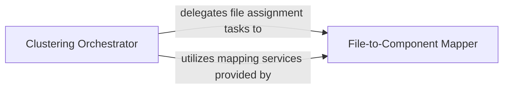

## Details

Provides reusable utility functions for manipulating and processing clusters of code entities, supporting assignment, representation building, and data integrity maintenance.

### Clustering Orchestrator
Orchestrates the overall process of defining, refining, and managing code clusters. Provides high-level control over cluster creation, validation, representation, ensures uniqueness of assignments and entities, sanitizes identifiers, and manages the lifecycle of clusters.

**Related Classes/Methods**:

- <a href="https://github.com/CodeBoarding/CodeBoarding/blob/main/.codeboardingagents/cluster_methods_mixin.py" target="_blank" rel="noopener noreferrer">`agents.cluster_methods_mixin.ClusterMethodsMixin`</a>

### File-to-Component Mapper
Manages the concrete assignment of individual source code files to specific code components or clusters, linking physical file structure to logical component organization and ensuring consistency and accuracy.

**Related Classes/Methods**:

- <a href="https://github.com/CodeBoarding/CodeBoarding/blob/main/.codeboardingagents/cluster_methods_mixin.py" target="_blank" rel="noopener noreferrer">`agents.cluster_methods_mixin.FileAssignmentHandler`</a>

### [FAQ](https://github.com/CodeBoarding/GeneratedOnBoardings/tree/main?tab=readme-ov-file#faq)