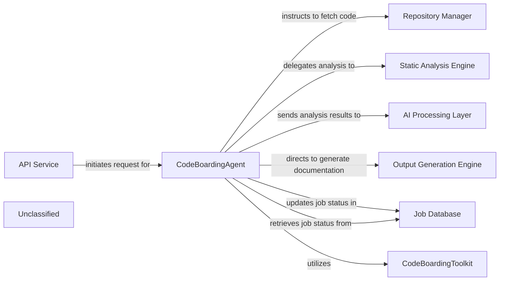

## Details

The CodeBoarding system is designed around a central `CodeBoardingAgent` that orchestrates the entire code analysis and documentation workflow. External requests are received via an `API Service`, which initiates the agent's operations. The `CodeBoardingAgent` first interacts with the `Repository Manager` to fetch source code. This code is then processed by the `Static Analysis Engine` for foundational analysis, with results subsequently interpreted by the `AI Processing Layer` using LLMs to derive high-level insights. Finally, the `Output Generation Engine` formats these insights into various documentation outputs. Throughout this process, the `CodeBoardingAgent` maintains job state and data integrity by interacting with a `Job Database` and utilizes a `CodeBoardingToolkit` for specialized analytical tasks.

### CodeBoardingAgent [[Expand]](./CodeBoardingAgent.md)
The primary orchestrator for all code analysis and documentation generation tasks. It manages the overall workflow, delegates specific analytical and generative tasks, and coordinates the sequence of operations from code retrieval to final documentation.

**Related Classes/Methods**:

- <a href="https://github.com/CodeBoarding/CodeBoarding/blob/main/.codeboardingagents/agent.py" target="_blank" rel="noopener noreferrer">`agents.agent.CodeBoardingAgent`</a>

### API Service
The external entry point for analysis requests, responsible for receiving user commands and initiating the code analysis workflow within the system.

**Related Classes/Methods**:

- `conceptual.APIService`

### Repository Manager
Manages the fetching and preparation of source code from various repositories, making it available for subsequent analysis steps.

**Related Classes/Methods**:

- `repo_utils.RepositoryManager`:1-10

### Static Analysis Engine [[Expand]](./Static_Analysis_Engine.md)
Performs foundational code analysis, extracting structural, syntactic, and semantic information from the source code.

**Related Classes/Methods**:

- <a href="https://github.com/CodeBoarding/CodeBoarding/blob/main/.codeboardingstatic_analyzer/scanner.py" target="_blank" rel="noopener noreferrer">`static_analyzer.scanner.StaticAnalysisEngine`</a>

### AI Processing Layer [[Expand]](./AI_Processing_Layer.md)
Utilizes Large Language Models (LLMs) to interpret the results from the Static Analysis Engine, generating higher-level insights, summaries, and contextual understanding of the code.

**Related Classes/Methods**:

- `conceptual.AIProcessingLayer`:1-10

### Output Generation Engine [[Expand]](./Output_Generation_Engine.md)
Formats the interpreted data and insights into various desired documentation outputs, such as Markdown, diagrams (e.g., Mermaid.js), or other structured formats.

**Related Classes/Methods**:

- <a href="https://github.com/CodeBoarding/CodeBoarding/blob/main/.codeboardingoutput_generators/__init__.py" target="_blank" rel="noopener noreferrer">`output_generators.OutputGenerationEngine`</a>

### Job Database
Persists the state of ongoing analysis jobs, stores intermediate results, and archives final documentation, ensuring job tracking and data integrity.

**Related Classes/Methods**:

- `conceptual.JobDatabase`:1-10

### CodeBoardingToolkit [[Expand]](./CodeBoardingToolkit.md)
Provides a collection of specialized tools and utilities that the CodeBoardingAgent leverages to perform specific operations, enhancing its capabilities.

**Related Classes/Methods**:

- <a href="https://github.com/CodeBoarding/CodeBoarding/blob/main/.codeboardingagents/tools/toolkit.py#L20-L117" target="_blank" rel="noopener noreferrer">`agents.tools.toolkit.CodeBoardingToolkit`:20-117</a>

### Unclassified
Component for all unclassified files and utility functions (Utility functions/External Libraries/Dependencies)

**Related Classes/Methods**: _None_

### [FAQ](https://github.com/CodeBoarding/GeneratedOnBoardings/tree/main?tab=readme-ov-file#faq)
