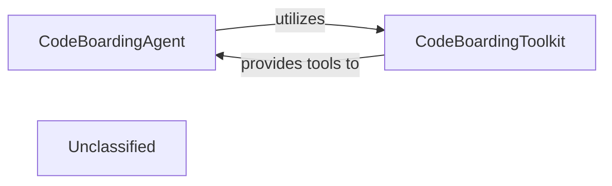

## Details

The `CodeBoardingAgent` acts as the intelligent core of the code inspection subsystem, orchestrating the analysis process. It leverages the `CodeBoardingToolkit` to access a suite of specialized tools for in-depth code examination. This interaction allows the agent to dynamically select and apply the most relevant analysis capabilities, transforming raw code data into structured insights. The `CodeBoardingToolkit`, in turn, provides the foundational static analysis functionalities, making it a critical dependency for the agent's operations.

### CodeBoardingAgent [[Expand]](./CodeBoardingAgent.md)
This component acts as the orchestrator for code inspection. It interprets the specific requirements for a code analysis task, intelligently selects and applies the necessary tools from the `CodeBoardingToolkit`, and then synthesizes the raw analysis results into a structured report or actionable data. It embodies the "AI Interpretation Layer" aspect by making decisions on how to analyze code.

**Related Classes/Methods**:

- <a href="https://github.com/CodeBoarding/CodeBoarding/blob/main/.codeboardingagents/agent.py#L36-L341" target="_blank" rel="noopener noreferrer">`CodeBoardingAgent`:36-341</a>

### CodeBoardingToolkit [[Expand]](./CodeBoardingToolkit.md)
This component is a library of specialized utilities and functionalities designed for in-depth code analysis. It provides the foundational capabilities for parsing code constructs, identifying patterns, extracting semantic information, and preparing code snippets for further processing. It serves as the "Static Analysis Engine" component, offering the granular tools for code examination.

**Related Classes/Methods**:

- <a href="https://github.com/CodeBoarding/CodeBoarding/blob/main/.codeboardingagents/tools/toolkit.py#L20-L117" target="_blank" rel="noopener noreferrer">`CodeBoardingToolkit`:20-117</a>

### Unclassified
Component for all unclassified files and utility functions (Utility functions/External Libraries/Dependencies)

**Related Classes/Methods**: _None_

### [FAQ](https://github.com/CodeBoarding/GeneratedOnBoardings/tree/main?tab=readme-ov-file#faq)
