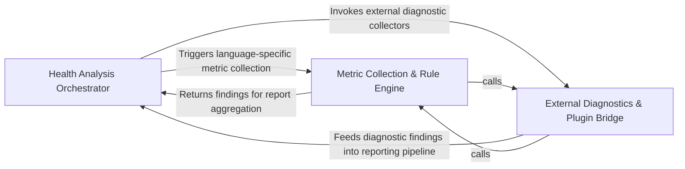

## Details

Performs static analysis to calculate maintainability metrics, architectural violations, and code quality scores.

### Health Analysis Orchestrator [[Expand]](./Health_Analysis_Orchestrator.md)
Acts as the central control plane for the health subsystem, managing the lifecycle of health check runs and aggregating metrics into a structured report.

**Related Classes/Methods**:

- `health.runner.run_health_checks`:193-242
- `health.models.HealthReport`:122-135
- `health.config.load_health_config`:128-172
- `health_main._run_health_checks`:74-94

**Source Files:**

- [`diagram_analysis/diagram_generator.py`](https://github.com/CodeBoarding/CodeBoarding/blob/main/.codeboardingdiagram_analysis/diagram_generator.py)
  - `diagram_analysis.diagram_generator.DiagramGenerator._run_health_report` ([L148-L166](https://github.com/CodeBoarding/CodeBoarding/blob/main/.codeboardingdiagram_analysis/diagram_generator.py#L148-L166)) - Method
  - `diagram_analysis.diagram_generator.DiagramGenerator.pre_analysis.get_static_with_new_analyzer` ([L284-L293](https://github.com/CodeBoarding/CodeBoarding/blob/main/.codeboardingdiagram_analysis/diagram_generator.py#L284-L293)) - Function
- [`health/config.py`](https://github.com/CodeBoarding/CodeBoarding/blob/main/.codeboardinghealth/config.py)
  - `health.config._initialize_template` ([L76-L83](https://github.com/CodeBoarding/CodeBoarding/blob/main/.codeboardinghealth/config.py#L76-L83)) - Function
  - `health.config.initialize_health_dir` ([L86-L97](https://github.com/CodeBoarding/CodeBoarding/blob/main/.codeboardinghealth/config.py#L86-L97)) - Function
  - `health.config._load_health_exclude_patterns` ([L100-L125](https://github.com/CodeBoarding/CodeBoarding/blob/main/.codeboardinghealth/config.py#L100-L125)) - Function
  - `health.config.load_health_config` ([L128-L172](https://github.com/CodeBoarding/CodeBoarding/blob/main/.codeboardinghealth/config.py#L128-L172)) - Function
- [`health/models.py`](https://github.com/CodeBoarding/CodeBoarding/blob/main/.codeboardinghealth/models.py)
  - `health.models.FileHealthSummary` ([L110-L119](https://github.com/CodeBoarding/CodeBoarding/blob/main/.codeboardinghealth/models.py#L110-L119)) - Class
  - `health.models.HealthReport` ([L122-L135](https://github.com/CodeBoarding/CodeBoarding/blob/main/.codeboardinghealth/models.py#L122-L135)) - Class
  - `health.models.HealthCheckConfig` ([L138-L186](https://github.com/CodeBoarding/CodeBoarding/blob/main/.codeboardinghealth/models.py#L138-L186)) - Class
- [`health/runner.py`](https://github.com/CodeBoarding/CodeBoarding/blob/main/.codeboardinghealth/runner.py)
  - `health.runner._relativize_path` ([L66-L68](https://github.com/CodeBoarding/CodeBoarding/blob/main/.codeboardinghealth/runner.py#L66-L68)) - Function
  - `health.runner._compute_overall_score` ([L134-L142](https://github.com/CodeBoarding/CodeBoarding/blob/main/.codeboardinghealth/runner.py#L134-L142)) - Function
  - `health.runner._aggregate_file_summaries` ([L145-L171](https://github.com/CodeBoarding/CodeBoarding/blob/main/.codeboardinghealth/runner.py#L145-L171)) - Function
  - `health.runner._relativize_report_paths` ([L174-L190](https://github.com/CodeBoarding/CodeBoarding/blob/main/.codeboardinghealth/runner.py#L174-L190)) - Function
  - `health.runner.run_health_checks` ([L193-L242](https://github.com/CodeBoarding/CodeBoarding/blob/main/.codeboardinghealth/runner.py#L193-L242)) - Function
- [`health_main.py`](https://github.com/CodeBoarding/CodeBoarding/blob/main/.codeboardinghealth_main.py)
  - `health_main.run_health_check_local` ([L29-L49](https://github.com/CodeBoarding/CodeBoarding/blob/main/.codeboardinghealth_main.py#L29-L49)) - Function
  - `health_main.run_health_check_remote` ([L52-L71](https://github.com/CodeBoarding/CodeBoarding/blob/main/.codeboardinghealth_main.py#L52-L71)) - Function
  - `health_main._run_health_checks` ([L74-L94](https://github.com/CodeBoarding/CodeBoarding/blob/main/.codeboardinghealth_main.py#L74-L94)) - Function
  - `health_main.main` ([L97-L148](https://github.com/CodeBoarding/CodeBoarding/blob/main/.codeboardinghealth_main.py#L97-L148)) - Function
- [`logging_config.py`](https://github.com/CodeBoarding/CodeBoarding/blob/main/.codeboardinglogging_config.py)
  - `logging_config.setup_logging` ([L14-L71](https://github.com/CodeBoarding/CodeBoarding/blob/main/.codeboardinglogging_config.py#L14-L71)) - Function
  - `logging_config.add_file_handler` ([L74-L95](https://github.com/CodeBoarding/CodeBoarding/blob/main/.codeboardinglogging_config.py#L74-L95)) - Function
  - `logging_config._resolve_log_path` ([L98-L120](https://github.com/CodeBoarding/CodeBoarding/blob/main/.codeboardinglogging_config.py#L98-L120)) - Function
  - `logging_config._fix_console_encoding` ([L123-L136](https://github.com/CodeBoarding/CodeBoarding/blob/main/.codeboardinglogging_config.py#L123-L136)) - Function
- [`static_analyzer/__init__.py`](https://github.com/CodeBoarding/CodeBoarding/blob/main/.codeboardingstatic_analyzer/__init__.py)
  - `static_analyzer.__init__.StaticAnalyzer` ([L169-L771](https://github.com/CodeBoarding/CodeBoarding/blob/main/.codeboardingstatic_analyzer/__init__.py#L169-L771)) - Class
  - `static_analyzer.__init__.get_static_analysis` ([L774-L802](https://github.com/CodeBoarding/CodeBoarding/blob/main/.codeboardingstatic_analyzer/__init__.py#L774-L802)) - Function
- [`utils.py`](https://github.com/CodeBoarding/CodeBoarding/blob/main/.codeboardingutils.py)
  - `utils.get_artifact_dir` ([L44-L52](https://github.com/CodeBoarding/CodeBoarding/blob/main/.codeboardingutils.py#L44-L52)) - Function
- [`vscode_constants.py`](https://github.com/CodeBoarding/CodeBoarding/blob/main/.codeboardingvscode_constants.py)
  - `vscode_constants.get_bin_path` ([L5-L12](https://github.com/CodeBoarding/CodeBoarding/blob/main/.codeboardingvscode_constants.py#L5-L12)) - Function
  - `vscode_constants.update_command_paths` ([L15-L62](https://github.com/CodeBoarding/CodeBoarding/blob/main/.codeboardingvscode_constants.py#L15-L62)) - Function
  - `vscode_constants.update_config` ([L72-L74](https://github.com/CodeBoarding/CodeBoarding/blob/main/.codeboardingvscode_constants.py#L72-L74)) - Function

### Metric Collection & Rule Engine [[Expand]](./Metric_Collection_Rule_Engine.md)
The core analytical engine that implements software engineering metrics to detect structural smells and calculate quantitative health scores.

**Related Classes/Methods**:

- `health.checks.cohesion.check_component_cohesion`:9-99
- `health.checks.coupling.collect_coupling_values`:15-32
- `health.checks.god_class.check_god_classes`:67-167
- `health.runner._collect_checks_for_language`:71-131

**Source Files:**

- [`health/checks/circular_deps.py`](https://github.com/CodeBoarding/CodeBoarding/blob/main/.codeboardinghealth/checks/circular_deps.py)
  - `health.checks.circular_deps.check_circular_dependencies` ([L10-L48](https://github.com/CodeBoarding/CodeBoarding/blob/main/.codeboardinghealth/checks/circular_deps.py#L10-L48)) - Function
- [`health/checks/cohesion.py`](https://github.com/CodeBoarding/CodeBoarding/blob/main/.codeboardinghealth/checks/cohesion.py)
  - `health.checks.cohesion.check_component_cohesion` ([L9-L99](https://github.com/CodeBoarding/CodeBoarding/blob/main/.codeboardinghealth/checks/cohesion.py#L9-L99)) - Function
- [`health/checks/coupling.py`](https://github.com/CodeBoarding/CodeBoarding/blob/main/.codeboardinghealth/checks/coupling.py)
  - `health.checks.coupling.collect_coupling_values` ([L15-L32](https://github.com/CodeBoarding/CodeBoarding/blob/main/.codeboardinghealth/checks/coupling.py#L15-L32)) - Function
  - `health.checks.coupling.check_fan_out` ([L35-L85](https://github.com/CodeBoarding/CodeBoarding/blob/main/.codeboardinghealth/checks/coupling.py#L35-L85)) - Function
  - `health.checks.coupling.check_fan_in` ([L88-L140](https://github.com/CodeBoarding/CodeBoarding/blob/main/.codeboardinghealth/checks/coupling.py#L88-L140)) - Function
- [`health/checks/function_size.py`](https://github.com/CodeBoarding/CodeBoarding/blob/main/.codeboardinghealth/checks/function_size.py)
  - `health.checks.function_size.collect_function_sizes` ([L16-L25](https://github.com/CodeBoarding/CodeBoarding/blob/main/.codeboardinghealth/checks/function_size.py#L16-L25)) - Function
  - `health.checks.function_size.check_function_size` ([L28-L85](https://github.com/CodeBoarding/CodeBoarding/blob/main/.codeboardinghealth/checks/function_size.py#L28-L85)) - Function
- [`health/checks/god_class.py`](https://github.com/CodeBoarding/CodeBoarding/blob/main/.codeboardinghealth/checks/god_class.py)
  - `health.checks.god_class._group_methods_by_class` ([L16-L27](https://github.com/CodeBoarding/CodeBoarding/blob/main/.codeboardinghealth/checks/god_class.py#L16-L27)) - Function
  - `health.checks.god_class.collect_god_class_values` ([L30-L64](https://github.com/CodeBoarding/CodeBoarding/blob/main/.codeboardinghealth/checks/god_class.py#L30-L64)) - Function
  - `health.checks.god_class.check_god_classes` ([L67-L167](https://github.com/CodeBoarding/CodeBoarding/blob/main/.codeboardinghealth/checks/god_class.py#L67-L167)) - Function
- [`health/checks/inheritance.py`](https://github.com/CodeBoarding/CodeBoarding/blob/main/.codeboardinghealth/checks/inheritance.py)
  - `health.checks.inheritance._compute_inheritance_depths` ([L15-L50](https://github.com/CodeBoarding/CodeBoarding/blob/main/.codeboardinghealth/checks/inheritance.py#L15-L50)) - Function
  - `health.checks.inheritance.check_inheritance_depth` ([L53-L104](https://github.com/CodeBoarding/CodeBoarding/blob/main/.codeboardinghealth/checks/inheritance.py#L53-L104)) - Function
- [`health/checks/instability.py`](https://github.com/CodeBoarding/CodeBoarding/blob/main/.codeboardinghealth/checks/instability.py)
  - `health.checks.instability.check_package_instability` ([L8-L77](https://github.com/CodeBoarding/CodeBoarding/blob/main/.codeboardinghealth/checks/instability.py#L8-L77)) - Function
- [`health/checks/unused_code_diagnostics.py`](https://github.com/CodeBoarding/CodeBoarding/blob/main/.codeboardinghealth/checks/unused_code_diagnostics.py)
  - `health.checks.unused_code_diagnostics.FileDiagnostic` ([L131-L135](https://github.com/CodeBoarding/CodeBoarding/blob/main/.codeboardinghealth/checks/unused_code_diagnostics.py#L131-L135)) - Class
  - `health.checks.unused_code_diagnostics.LSPDiagnosticsCollector` ([L138-L262](https://github.com/CodeBoarding/CodeBoarding/blob/main/.codeboardinghealth/checks/unused_code_diagnostics.py#L138-L262)) - Class
  - `health.checks.unused_code_diagnostics.LSPDiagnosticsCollector.add_diagnostic` ([L145-L146](https://github.com/CodeBoarding/CodeBoarding/blob/main/.codeboardinghealth/checks/unused_code_diagnostics.py#L145-L146)) - Method
- [`health/models.py`](https://github.com/CodeBoarding/CodeBoarding/blob/main/.codeboardinghealth/models.py)
  - `health.models.Severity` ([L10-L15](https://github.com/CodeBoarding/CodeBoarding/blob/main/.codeboardinghealth/models.py#L10-L15)) - Class
  - `health.models.FindingEntity` ([L18-L39](https://github.com/CodeBoarding/CodeBoarding/blob/main/.codeboardinghealth/models.py#L18-L39)) - Class
  - `health.models.FindingGroup` ([L42-L48](https://github.com/CodeBoarding/CodeBoarding/blob/main/.codeboardinghealth/models.py#L42-L48)) - Class
  - `health.models.BaseCheckSummary` ([L51-L60](https://github.com/CodeBoarding/CodeBoarding/blob/main/.codeboardinghealth/models.py#L51-L60)) - Class
  - `health.models.StandardCheckSummary` ([L63-L85](https://github.com/CodeBoarding/CodeBoarding/blob/main/.codeboardinghealth/models.py#L63-L85)) - Class
  - `health.models.StandardCheckSummary.findings` ([L76-L85](https://github.com/CodeBoarding/CodeBoarding/blob/main/.codeboardinghealth/models.py#L76-L85)) - Method
  - `health.models.CircularDependencyCheck` ([L88-L103](https://github.com/CodeBoarding/CodeBoarding/blob/main/.codeboardinghealth/models.py#L88-L103)) - Class
  - `health.models.CircularDependencyCheck.score` ([L97-L103](https://github.com/CodeBoarding/CodeBoarding/blob/main/.codeboardinghealth/models.py#L97-L103)) - Method
- [`health/runner.py`](https://github.com/CodeBoarding/CodeBoarding/blob/main/.codeboardinghealth/runner.py)
  - `health.runner._matches_exclude_pattern` ([L34-L41](https://github.com/CodeBoarding/CodeBoarding/blob/main/.codeboardinghealth/runner.py#L34-L41)) - Function
  - `health.runner._apply_exclude_patterns` ([L44-L63](https://github.com/CodeBoarding/CodeBoarding/blob/main/.codeboardinghealth/runner.py#L44-L63)) - Function
  - `health.runner._collect_checks_for_language` ([L71-L131](https://github.com/CodeBoarding/CodeBoarding/blob/main/.codeboardinghealth/runner.py#L71-L131)) - Function
- [`repo_utils/ignore.py`](https://github.com/CodeBoarding/CodeBoarding/blob/main/.codeboardingrepo_utils/ignore.py)
  - `repo_utils.ignore.RepoIgnoreManager.should_skip_file` ([L290-L299](https://github.com/CodeBoarding/CodeBoarding/blob/main/.codeboardingrepo_utils/ignore.py#L290-L299)) - Method
- [`static_analyzer/cluster_helpers.py`](https://github.com/CodeBoarding/CodeBoarding/blob/main/.codeboardingstatic_analyzer/cluster_helpers.py)
  - `static_analyzer.cluster_helpers.get_files_for_cluster_ids` ([L494-L509](https://github.com/CodeBoarding/CodeBoarding/blob/main/.codeboardingstatic_analyzer/cluster_helpers.py#L494-L509)) - Function
- [`static_analyzer/graph.py`](https://github.com/CodeBoarding/CodeBoarding/blob/main/.codeboardingstatic_analyzer/graph.py)
  - `static_analyzer.graph.ClusterResult.get_files_for_cluster` ([L60-L61](https://github.com/CodeBoarding/CodeBoarding/blob/main/.codeboardingstatic_analyzer/graph.py#L60-L61)) - Method
- [`static_analyzer/node.py`](https://github.com/CodeBoarding/CodeBoarding/blob/main/.codeboardingstatic_analyzer/node.py)
  - `static_analyzer.node.Node.is_class` ([L37-L39](https://github.com/CodeBoarding/CodeBoarding/blob/main/.codeboardingstatic_analyzer/node.py#L37-L39)) - Method
  - `static_analyzer.node.Node.is_data` ([L41-L43](https://github.com/CodeBoarding/CodeBoarding/blob/main/.codeboardingstatic_analyzer/node.py#L41-L43)) - Method

### External Diagnostics & Plugin Bridge [[Expand]](./External_Diagnostics_Plugin_Bridge.md)
Manages the integration of health data from external tools, LSP diagnostics, and extensible third-party plugins.

**Related Classes/Methods**:

- `health.checks.unused_code_diagnostics.LSPDiagnosticsCollector`:138-262
- `core.registry.Registry`:12-46
- `core.__init__.run_plugin_health_checks`:58-74

**Source Files:**

- [`core/__init__.py`](https://github.com/CodeBoarding/CodeBoarding/blob/main/.codeboardingcore/__init__.py)
  - `core.__init__.Registries` ([L30-L38](https://github.com/CodeBoarding/CodeBoarding/blob/main/.codeboardingcore/__init__.py#L30-L38)) - Class
  - `core.__init__.get_registries` ([L44-L49](https://github.com/CodeBoarding/CodeBoarding/blob/main/.codeboardingcore/__init__.py#L44-L49)) - Function
  - `core.__init__.run_plugin_health_checks` ([L58-L74](https://github.com/CodeBoarding/CodeBoarding/blob/main/.codeboardingcore/__init__.py#L58-L74)) - Function
  - `core.__init__.load_plugin_tools` ([L77-L89](https://github.com/CodeBoarding/CodeBoarding/blob/main/.codeboardingcore/__init__.py#L77-L89)) - Function
- [`core/registry.py`](https://github.com/CodeBoarding/CodeBoarding/blob/main/.codeboardingcore/registry.py)
  - `core.registry.Registry.all` ([L35-L37](https://github.com/CodeBoarding/CodeBoarding/blob/main/.codeboardingcore/registry.py#L35-L37)) - Method
- [`health/checks/unused_code_diagnostics.py`](https://github.com/CodeBoarding/CodeBoarding/blob/main/.codeboardinghealth/checks/unused_code_diagnostics.py)
  - `health.checks.unused_code_diagnostics.DeadCodeCategory` ([L31-L41](https://github.com/CodeBoarding/CodeBoarding/blob/main/.codeboardinghealth/checks/unused_code_diagnostics.py#L31-L41)) - Class
  - `health.checks.unused_code_diagnostics.DiagnosticIssue` ([L45-L54](https://github.com/CodeBoarding/CodeBoarding/blob/main/.codeboardinghealth/checks/unused_code_diagnostics.py#L45-L54)) - Class
  - `health.checks.unused_code_diagnostics.LSPDiagnosticsCollector.__init__` ([L141-L143](https://github.com/CodeBoarding/CodeBoarding/blob/main/.codeboardinghealth/checks/unused_code_diagnostics.py#L141-L143)) - Method
  - `health.checks.unused_code_diagnostics.LSPDiagnosticsCollector.process_diagnostics` ([L148-L183](https://github.com/CodeBoarding/CodeBoarding/blob/main/.codeboardinghealth/checks/unused_code_diagnostics.py#L148-L183)) - Method
  - `health.checks.unused_code_diagnostics.LSPDiagnosticsCollector._convert_to_issue` ([L185-L213](https://github.com/CodeBoarding/CodeBoarding/blob/main/.codeboardinghealth/checks/unused_code_diagnostics.py#L185-L213)) - Method
  - `health.checks.unused_code_diagnostics.LSPDiagnosticsCollector._categorize_diagnostic` ([L215-L235](https://github.com/CodeBoarding/CodeBoarding/blob/main/.codeboardinghealth/checks/unused_code_diagnostics.py#L215-L235)) - Method
  - `health.checks.unused_code_diagnostics.LSPDiagnosticsCollector._categorize_by_message` ([L237-L243](https://github.com/CodeBoarding/CodeBoarding/blob/main/.codeboardinghealth/checks/unused_code_diagnostics.py#L237-L243)) - Method
  - `health.checks.unused_code_diagnostics.LSPDiagnosticsCollector._map_severity` ([L245-L253](https://github.com/CodeBoarding/CodeBoarding/blob/main/.codeboardinghealth/checks/unused_code_diagnostics.py#L245-L253)) - Method
  - `health.checks.unused_code_diagnostics.LSPDiagnosticsCollector.get_issues_by_category` ([L255-L262](https://github.com/CodeBoarding/CodeBoarding/blob/main/.codeboardinghealth/checks/unused_code_diagnostics.py#L255-L262)) - Method
  - `health.checks.unused_code_diagnostics.check_unused_code_diagnostics` ([L265-L340](https://github.com/CodeBoarding/CodeBoarding/blob/main/.codeboardinghealth/checks/unused_code_diagnostics.py#L265-L340)) - Function
  - `health.checks.unused_code_diagnostics.get_category_description` ([L343-L355](https://github.com/CodeBoarding/CodeBoarding/blob/main/.codeboardinghealth/checks/unused_code_diagnostics.py#L343-L355)) - Function

### [FAQ](https://github.com/CodeBoarding/GeneratedOnBoardings/tree/main?tab=readme-ov-file#faq)