```mermaid
graph LR
    Project_Scanner_Configurer["Project Scanner & Configurer"]
    LSP_Client_Core["LSP Client Core"]
    Language_Specific_LSP_Adapters["Language-Specific LSP Adapters"]
    LSP_Environment_Manager["LSP Environment Manager"]
    Code_Graph_Reference_Management["Code Graph & Reference Management"]
    Analysis_Results_Repository["Analysis Results Repository"]
    Incremental_Analysis_Manager["Incremental Analysis Manager"]
    Cluster_Change_Analyzer["Cluster Change Analyzer"]
    Project_Scanner_Configurer -- "configures" --> LSP_Environment_Manager
    Project_Scanner_Configurer -- "provides language settings to" --> Language_Specific_LSP_Adapters
    LSP_Environment_Manager -- "manages LSP setup for" --> Language_Specific_LSP_Adapters
    Language_Specific_LSP_Adapters -- "uses" --> LSP_Client_Core
    LSP_Client_Core -- "provides code intelligence to" --> Code_Graph_Reference_Management
    Code_Graph_Reference_Management -- "stores results in" --> Analysis_Results_Repository
    Analysis_Results_Repository -- "provides analysis data to" --> Incremental_Analysis_Manager
    Incremental_Analysis_Manager -- "informs" --> Code_Graph_Reference_Management
    Incremental_Analysis_Manager -- "provides change context to" --> Cluster_Change_Analyzer
    Cluster_Change_Analyzer -- "queries" --> Analysis_Results_Repository
```

## Details

This component performs deep code understanding by leveraging Language Server Protocol (LSP) clients for various languages. It extracts Control Flow Graphs (CFGs), class hierarchies, and diagnostics, manages analysis caching, and clusters code entities to identify relationships and track changes.

### Project Scanner & Configurer
Scans the project to identify relevant files, determines programming languages, and builds language-specific configurations required for LSP clients and analysis. This component is essential for the initial setup and context building for the entire static analysis pipeline.

**Related Classes/Methods**:

- <a href="https://github.com/CodeBoarding/CodeBoarding/blob/main/.codeboardingstatic_analyzer/__init__.py" target="_blank" rel="noopener noreferrer">`static_analyzer.project_scanner.ProjectScanner`</a>
- <a href="https://github.com/CodeBoarding/CodeBoarding/blob/main/.codeboardingstatic_analyzer/__init__.py" target="_blank" rel="noopener noreferrer">`static_analyzer.project_scanner.LanguageDetector`</a>
- <a href="https://github.com/CodeBoarding/CodeBoarding/blob/main/.codeboardingstatic_analyzer/__init__.py" target="_blank" rel="noopener noreferrer">`static_analyzer.project_scanner.LSPConfigurationBuilder`</a>

### LSP Client Core
Provides the foundational communication layer for interacting with Language Server Protocol (LSP) servers, handling message passing, requests, and notifications to extract raw code intelligence data.

**Related Classes/Methods**:

- <a href="https://github.com/CodeBoarding/CodeBoarding/blob/main/.codeboardingstatic_analyzer/lsp_client/client.py" target="_blank" rel="noopener noreferrer">`static_analyzer.lsp_client.client.LSPClient`</a>

### Language-Specific LSP Adapters
Extends the `LSP Client Core` to provide specialized initialization, configuration, and interaction logic tailored for specific programming languages (e.g., Java, TypeScript), adapting to their unique LSP server requirements.

**Related Classes/Methods**:

- <a href="https://github.com/CodeBoarding/CodeBoarding/blob/main/.codeboardingstatic_analyzer/java_utils.py" target="_blank" rel="noopener noreferrer">`static_analyzer.lsp_client.adapters.JavaLSPAdapter`</a>
- <a href="https://github.com/CodeBoarding/CodeBoarding/blob/main/.codeboardingstatic_analyzer/java_utils.py" target="_blank" rel="noopener noreferrer">`static_analyzer.lsp_client.adapters.TypeScriptLSPAdapter`</a>
- <a href="https://github.com/CodeBoarding/CodeBoarding/blob/main/.codeboardingstatic_analyzer/java_utils.py" target="_blank" rel="noopener noreferrer">`static_analyzer.lsp_client.adapters.LSPAdapterFactory`</a>

### LSP Environment Manager
Manages the setup and configuration of language-specific LSP environments, including detecting language installations and retrieving necessary settings for LSP server operation.

**Related Classes/Methods**:

- <a href="https://github.com/CodeBoarding/CodeBoarding/blob/main/.codeboardingstatic_analyzer/lsp_client/language_settings.py" target="_blank" rel="noopener noreferrer">`static_analyzer.lsp_environment.EnvironmentDetector`</a>
- <a href="https://github.com/CodeBoarding/CodeBoarding/blob/main/.codeboardingstatic_analyzer/lsp_client/language_settings.py" target="_blank" rel="noopener noreferrer">`static_analyzer.lsp_environment.LanguageConfigManager`</a>
- <a href="https://github.com/CodeBoarding/CodeBoarding/blob/main/.codeboardingstatic_analyzer/lsp_client/language_settings.py" target="_blank" rel="noopener noreferrer">`static_analyzer.lsp_environment.LSPEnvironment`</a>

### Code Graph & Reference Management
Processes raw code intelligence data from LSP clients to construct and manage the project's call graph, representing function/method calls, class hierarchies, and relationships. It also performs initial clustering of code entities and ensures the accuracy and integrity of the graph by resolving all identified code references.

**Related Classes/Methods**:

- <a href="https://github.com/CodeBoarding/CodeBoarding/blob/main/.codeboardingstatic_analyzer/graph.py" target="_blank" rel="noopener noreferrer">`static_analyzer.graph.CallGraph`</a>
- <a href="https://github.com/CodeBoarding/CodeBoarding/blob/main/.codeboardingstatic_analyzer/graph.py" target="_blank" rel="noopener noreferrer">`static_analyzer.graph.ReferenceResolver`</a>
- <a href="https://github.com/CodeBoarding/CodeBoarding/blob/main/.codeboardingstatic_analyzer/graph.py" target="_blank" rel="noopener noreferrer">`static_analyzer.graph.EntityLinker`</a>
- <a href="https://github.com/CodeBoarding/CodeBoarding/blob/main/.codeboardingstatic_analyzer/graph.py" target="_blank" rel="noopener noreferrer">`static_analyzer.graph.CallGraphBuilder`</a>

### Analysis Results Repository
Aggregates, stores, and provides access to all static analysis outputs, including the call graph, class hierarchies, diagnostics, and other extracted code intelligence data.

**Related Classes/Methods**:

- <a href="https://github.com/CodeBoarding/CodeBoarding/blob/main/.codeboardingstatic_analyzer/analysis_result.py" target="_blank" rel="noopener noreferrer">`static_analyzer.analysis_result.StaticAnalysisResults`</a>

### Incremental Analysis Manager
Optimizes analysis performance by managing the incremental analysis workflow, leveraging Git diffs to identify changes, and caching previous analysis results to avoid redundant computations.

**Related Classes/Methods**:

- <a href="https://github.com/CodeBoarding/CodeBoarding/blob/main/.codeboardingstatic_analyzer/analysis_cache.py" target="_blank" rel="noopener noreferrer">`static_analyzer.analysis_cache.AnalysisCacheManager`</a>

### Cluster Change Analyzer
Evaluates and classifies structural changes within code clusters between different analysis runs, providing insights into the evolution of the codebase's modularity and identifying significant architectural shifts.

**Related Classes/Methods**:

- <a href="https://github.com/CodeBoarding/CodeBoarding/blob/main/.codeboardingstatic_analyzer/cluster_change_analyzer.py" target="_blank" rel="noopener noreferrer">`static_analyzer.cluster_change_analyzer.ClusterChangeAnalyzer`</a>

### [FAQ](https://github.com/CodeBoarding/GeneratedOnBoardings/tree/main?tab=readme-ov-file#faq)
