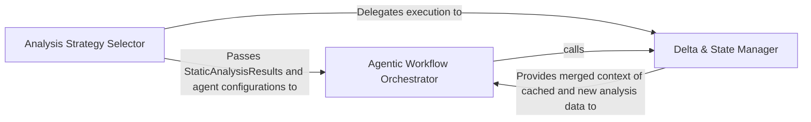

## Details

Maps parsed CLI arguments into specific execution strategies, acting as a bridge between user input and internal analysis parameters.

### Analysis Strategy Selector
Acts as the primary entry point, branching the execution flow based on user flags and repository metadata to ensure the static analysis engine is correctly configured.

**Related Classes/Methods**:

- `codeboarding_cli.commands.full_analysis.run_from_args`:70-76

**Source Files:**

- [`codeboarding_cli/commands/full_analysis.py`](https://github.com/CodeBoarding/CodeBoarding/blob/main/.codeboardingcodeboarding_cli/commands/full_analysis.py)
  - `codeboarding_cli.commands.full_analysis.add_arguments` ([L25-L51](https://github.com/CodeBoarding/CodeBoarding/blob/main/.codeboardingcodeboarding_cli/commands/full_analysis.py#L25-L51)) - Function
  - `codeboarding_cli.commands.full_analysis._run_local.scope` ([L93-L104](https://github.com/CodeBoarding/CodeBoarding/blob/main/.codeboardingcodeboarding_cli/commands/full_analysis.py#L93-L104)) - Function

### Delta & State Manager
Manages incremental updates by comparing current filesystem states against stored artifacts to minimize processing time and LLM token usage.

**Related Classes/Methods**: _None_

**Source Files:**

- [`codeboarding_cli/commands/full_analysis.py`](https://github.com/CodeBoarding/CodeBoarding/blob/main/.codeboardingcodeboarding_cli/commands/full_analysis.py)
  - `codeboarding_cli.commands.full_analysis.validate_arguments` ([L54-L67](https://github.com/CodeBoarding/CodeBoarding/blob/main/.codeboardingcodeboarding_cli/commands/full_analysis.py#L54-L67)) - Function
  - `codeboarding_cli.commands.full_analysis._run_remote` ([L119-L157](https://github.com/CodeBoarding/CodeBoarding/blob/main/.codeboardingcodeboarding_cli/commands/full_analysis.py#L119-L157)) - Function

### Agentic Workflow Orchestrator
Bridges static analysis data and the AI reasoning layer by transforming analysis outputs into structured formats for the AbstractionAgent.

**Related Classes/Methods**: _None_

**Source Files:**

- [`codeboarding_cli/commands/full_analysis.py`](https://github.com/CodeBoarding/CodeBoarding/blob/main/.codeboardingcodeboarding_cli/commands/full_analysis.py)
  - `codeboarding_cli.commands.full_analysis.run_from_args` ([L70-L76](https://github.com/CodeBoarding/CodeBoarding/blob/main/.codeboardingcodeboarding_cli/commands/full_analysis.py#L70-L76)) - Function

### [FAQ](https://github.com/CodeBoarding/GeneratedOnBoardings/tree/main?tab=readme-ov-file#faq)