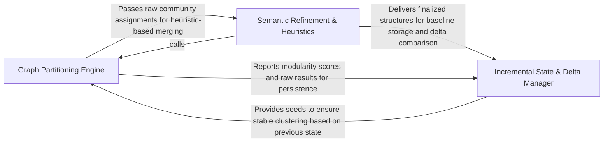

## Details

Applies mathematical clustering to the call graph to identify logical modules.

### Graph Partitioning Engine [[Expand]](./Graph_Partitioning_Engine.md)
Executes mathematical clustering algorithms on the call graph to identify initial logical boundaries and evaluates partitioning strategies using modularity scoring.

**Related Classes/Methods**:

- `static_analyzer.graph.detect_communities`:21-34
- `static_analyzer.leiden_utils.find_partition`:37-63
- `static_analyzer.graph.CallGraph._score_clustering`:453-484
- `static_analyzer.graph.CallGraph._try_all_algorithms`:508-526

**Source Files:**

- [`static_analyzer/cluster_helpers.py`](https://github.com/CodeBoarding/CodeBoarding/blob/main/.codeboardingstatic_analyzer/cluster_helpers.py)
  - `static_analyzer.cluster_helpers._detect_communities` ([L195-L232](https://github.com/CodeBoarding/CodeBoarding/blob/main/.codeboardingstatic_analyzer/cluster_helpers.py#L195-L232)) - Function
- [`static_analyzer/graph.py`](https://github.com/CodeBoarding/CodeBoarding/blob/main/.codeboardingstatic_analyzer/graph.py)
  - `static_analyzer.graph.detect_communities` ([L21-L34](https://github.com/CodeBoarding/CodeBoarding/blob/main/.codeboardingstatic_analyzer/graph.py#L21-L34)) - Function
  - `static_analyzer.graph.CallGraph._get_abstract_node_name` ([L429-L439](https://github.com/CodeBoarding/CodeBoarding/blob/main/.codeboardingstatic_analyzer/graph.py#L429-L439)) - Method
  - `static_analyzer.graph.CallGraph._cluster_with_algorithm` ([L441-L451](https://github.com/CodeBoarding/CodeBoarding/blob/main/.codeboardingstatic_analyzer/graph.py#L441-L451)) - Method
  - `static_analyzer.graph.CallGraph._score_clustering` ([L453-L484](https://github.com/CodeBoarding/CodeBoarding/blob/main/.codeboardingstatic_analyzer/graph.py#L453-L484)) - Method
  - `static_analyzer.graph.CallGraph._cluster_at_level` ([L486-L506](https://github.com/CodeBoarding/CodeBoarding/blob/main/.codeboardingstatic_analyzer/graph.py#L486-L506)) - Method
  - `static_analyzer.graph.CallGraph._try_all_algorithms` ([L508-L526](https://github.com/CodeBoarding/CodeBoarding/blob/main/.codeboardingstatic_analyzer/graph.py#L508-L526)) - Method
  - `static_analyzer.graph.CallGraph._map_candidates_to_original` ([L528-L552](https://github.com/CodeBoarding/CodeBoarding/blob/main/.codeboardingstatic_analyzer/graph.py#L528-L552)) - Method
- [`static_analyzer/leiden_utils.py`](https://github.com/CodeBoarding/CodeBoarding/blob/main/.codeboardingstatic_analyzer/leiden_utils.py)
  - `static_analyzer.leiden_utils.partition_to_clusters` ([L26-L34](https://github.com/CodeBoarding/CodeBoarding/blob/main/.codeboardingstatic_analyzer/leiden_utils.py#L26-L34)) - Function
  - `static_analyzer.leiden_utils.find_partition` ([L37-L63](https://github.com/CodeBoarding/CodeBoarding/blob/main/.codeboardingstatic_analyzer/leiden_utils.py#L37-L63)) - Function

### Semantic Refinement & Heuristics [[Expand]](./Semantic_Refinement_Heuristics.md)
Post-processes raw mathematical clusters to align with software engineering patterns by merging small fragments and ensuring logical coherence for LLM consumption.

**Related Classes/Methods**:

- `static_analyzer.cluster_helpers.merge_clusters`:432-470
- `static_analyzer.cluster_helpers._absorb_small_communities`:346-378
- `agents.cluster_methods_mixin.ClusterMethodsMixin`:64-853
- `static_analyzer.graph.CallGraph.to_cluster_string`:377-427

**Source Files:**

- [`agents/cluster_methods_mixin.py`](https://github.com/CodeBoarding/CodeBoarding/blob/main/.codeboardingagents/cluster_methods_mixin.py)
  - `agents.cluster_methods_mixin.ClusterMethodsMixin` ([L64-L853](https://github.com/CodeBoarding/CodeBoarding/blob/main/.codeboardingagents/cluster_methods_mixin.py#L64-L853)) - Class
  - `agents.cluster_methods_mixin.ClusterMethodsMixin._expand_to_method_level_clusters` ([L345-L399](https://github.com/CodeBoarding/CodeBoarding/blob/main/.codeboardingagents/cluster_methods_mixin.py#L345-L399)) - Method
  - `agents.cluster_methods_mixin.ClusterMethodsMixin._create_strict_component_subgraph` ([L401-L480](https://github.com/CodeBoarding/CodeBoarding/blob/main/.codeboardingagents/cluster_methods_mixin.py#L401-L480)) - Method
- [`static_analyzer/cfg_skip_planner.py`](https://github.com/CodeBoarding/CodeBoarding/blob/main/.codeboardingstatic_analyzer/cfg_skip_planner.py)
  - `static_analyzer.cfg_skip_planner.ContextBudgetExceededError.__init__` ([L38-L40](https://github.com/CodeBoarding/CodeBoarding/blob/main/.codeboardingstatic_analyzer/cfg_skip_planner.py#L38-L40)) - Method
  - `static_analyzer.cfg_skip_planner.plan_skip_set.render` ([L188-L189](https://github.com/CodeBoarding/CodeBoarding/blob/main/.codeboardingstatic_analyzer/cfg_skip_planner.py#L188-L189)) - Function
- [`static_analyzer/cluster_helpers.py`](https://github.com/CodeBoarding/CodeBoarding/blob/main/.codeboardingstatic_analyzer/cluster_helpers.py)
  - `static_analyzer.cluster_helpers.enforce_cross_language_budget` ([L106-L146](https://github.com/CodeBoarding/CodeBoarding/blob/main/.codeboardingstatic_analyzer/cluster_helpers.py#L106-L146)) - Function
  - `static_analyzer.cluster_helpers._build_node_to_cluster_lookup` ([L154-L160](https://github.com/CodeBoarding/CodeBoarding/blob/main/.codeboardingstatic_analyzer/cluster_helpers.py#L154-L160)) - Function
  - `static_analyzer.cluster_helpers._build_meta_graph` ([L163-L187](https://github.com/CodeBoarding/CodeBoarding/blob/main/.codeboardingstatic_analyzer/cluster_helpers.py#L163-L187)) - Function
  - `static_analyzer.cluster_helpers._community_files` ([L240-L245](https://github.com/CodeBoarding/CodeBoarding/blob/main/.codeboardingstatic_analyzer/cluster_helpers.py#L240-L245)) - Function
  - `static_analyzer.cluster_helpers._find_nearest_by_graph_distance` ([L248-L288](https://github.com/CodeBoarding/CodeBoarding/blob/main/.codeboardingstatic_analyzer/cluster_helpers.py#L248-L288)) - Function
  - `static_analyzer.cluster_helpers._find_nearest_by_file_overlap` ([L291-L312](https://github.com/CodeBoarding/CodeBoarding/blob/main/.codeboardingstatic_analyzer/cluster_helpers.py#L291-L312)) - Function
  - `static_analyzer.cluster_helpers.reindex_cluster_result` ([L315-L343](https://github.com/CodeBoarding/CodeBoarding/blob/main/.codeboardingstatic_analyzer/cluster_helpers.py#L315-L343)) - Function
  - `static_analyzer.cluster_helpers._absorb_small_communities` ([L346-L378](https://github.com/CodeBoarding/CodeBoarding/blob/main/.codeboardingstatic_analyzer/cluster_helpers.py#L346-L378)) - Function
  - `static_analyzer.cluster_helpers._build_merged_cluster_result` ([L386-L424](https://github.com/CodeBoarding/CodeBoarding/blob/main/.codeboardingstatic_analyzer/cluster_helpers.py#L386-L424)) - Function
  - `static_analyzer.cluster_helpers.merge_clusters` ([L432-L470](https://github.com/CodeBoarding/CodeBoarding/blob/main/.codeboardingstatic_analyzer/cluster_helpers.py#L432-L470)) - Function
- [`static_analyzer/graph.py`](https://github.com/CodeBoarding/CodeBoarding/blob/main/.codeboardingstatic_analyzer/graph.py)
  - `static_analyzer.graph.CallGraph.to_networkx` ([L255-L267](https://github.com/CodeBoarding/CodeBoarding/blob/main/.codeboardingstatic_analyzer/graph.py#L255-L267)) - Method
  - `static_analyzer.graph.CallGraph.cluster` ([L269-L331](https://github.com/CodeBoarding/CodeBoarding/blob/main/.codeboardingstatic_analyzer/graph.py#L269-L331)) - Method
  - `static_analyzer.graph.CallGraph.to_cluster_string` ([L377-L427](https://github.com/CodeBoarding/CodeBoarding/blob/main/.codeboardingstatic_analyzer/graph.py#L377-L427)) - Method
  - `static_analyzer.graph.CallGraph._coverage` ([L554-L559](https://github.com/CodeBoarding/CodeBoarding/blob/main/.codeboardingstatic_analyzer/graph.py#L554-L559)) - Method
  - `static_analyzer.graph.CallGraph._common_dot_prefix` ([L595-L608](https://github.com/CodeBoarding/CodeBoarding/blob/main/.codeboardingstatic_analyzer/graph.py#L595-L608)) - Method
  - `static_analyzer.graph.CallGraph.__cluster_str` ([L611-L700](https://github.com/CodeBoarding/CodeBoarding/blob/main/.codeboardingstatic_analyzer/graph.py#L611-L700)) - Method
  - `static_analyzer.graph.CallGraph.__non_cluster_str` ([L703-L723](https://github.com/CodeBoarding/CodeBoarding/blob/main/.codeboardingstatic_analyzer/graph.py#L703-L723)) - Method

### Incremental State & Delta Manager [[Expand]](./Incremental_State_Delta_Manager.md)
Manages the persistence, reconciliation, and temporal evolution of partitions across analysis runs to maintain architectural stability using seeded clustering and delta tracking.

**Related Classes/Methods**:

- `static_analyzer.graph.ClusterResult`:49-67
- `diagram_analysis.cluster_delta.LanguageDelta`:32-42
- `static_analyzer.leiden_utils.find_partition_seeded`:66-103
- `diagram_analysis.cluster_delta._reconcile_seeded_partition`:380-427

**Source Files:**

- [`diagram_analysis/cluster_delta.py`](https://github.com/CodeBoarding/CodeBoarding/blob/main/.codeboardingdiagram_analysis/cluster_delta.py)
  - `diagram_analysis.cluster_delta.LanguageDelta` ([L32-L42](https://github.com/CodeBoarding/CodeBoarding/blob/main/.codeboardingdiagram_analysis/cluster_delta.py#L32-L42)) - Class
  - `diagram_analysis.cluster_delta._delta_for_language` ([L103-L186](https://github.com/CodeBoarding/CodeBoarding/blob/main/.codeboardingdiagram_analysis/cluster_delta.py#L103-L186)) - Function
  - `diagram_analysis.cluster_delta._delta_for_language._fresh_file` ([L126-L131](https://github.com/CodeBoarding/CodeBoarding/blob/main/.codeboardingdiagram_analysis/cluster_delta.py#L126-L131)) - Function
  - `diagram_analysis.cluster_delta._flavor_b_seeded` ([L192-L292](https://github.com/CodeBoarding/CodeBoarding/blob/main/.codeboardingdiagram_analysis/cluster_delta.py#L192-L292)) - Function
  - `diagram_analysis.cluster_delta._affected_frontier` ([L295-L333](https://github.com/CodeBoarding/CodeBoarding/blob/main/.codeboardingdiagram_analysis/cluster_delta.py#L295-L333)) - Function
  - `diagram_analysis.cluster_delta._absorb_orphans_by_file` ([L336-L377](https://github.com/CodeBoarding/CodeBoarding/blob/main/.codeboardingdiagram_analysis/cluster_delta.py#L336-L377)) - Function
  - `diagram_analysis.cluster_delta._reconcile_seeded_partition` ([L380-L427](https://github.com/CodeBoarding/CodeBoarding/blob/main/.codeboardingdiagram_analysis/cluster_delta.py#L380-L427)) - Function
  - `diagram_analysis.cluster_delta._materialize_cluster_result` ([L430-L455](https://github.com/CodeBoarding/CodeBoarding/blob/main/.codeboardingdiagram_analysis/cluster_delta.py#L430-L455)) - Function
- [`static_analyzer/graph.py`](https://github.com/CodeBoarding/CodeBoarding/blob/main/.codeboardingstatic_analyzer/graph.py)
  - `static_analyzer.graph.ClusterResult` ([L49-L67](https://github.com/CodeBoarding/CodeBoarding/blob/main/.codeboardingstatic_analyzer/graph.py#L49-L67)) - Class
  - `static_analyzer.graph.ClusterResult.get_nodes_for_cluster` ([L66-L67](https://github.com/CodeBoarding/CodeBoarding/blob/main/.codeboardingstatic_analyzer/graph.py#L66-L67)) - Method
  - `static_analyzer.graph.Edge.__init__` ([L71-L73](https://github.com/CodeBoarding/CodeBoarding/blob/main/.codeboardingstatic_analyzer/graph.py#L71-L73)) - Method
  - `static_analyzer.graph.Edge.__repr__` ([L81-L82](https://github.com/CodeBoarding/CodeBoarding/blob/main/.codeboardingstatic_analyzer/graph.py#L81-L82)) - Method
  - `static_analyzer.graph.CallGraph.__init__` ([L86-L108](https://github.com/CodeBoarding/CodeBoarding/blob/main/.codeboardingstatic_analyzer/graph.py#L86-L108)) - Method
  - `static_analyzer.graph.CallGraph._build_result` ([L561-L592](https://github.com/CodeBoarding/CodeBoarding/blob/main/.codeboardingstatic_analyzer/graph.py#L561-L592)) - Method
  - `static_analyzer.graph.CallGraph.__str__` ([L725-L730](https://github.com/CodeBoarding/CodeBoarding/blob/main/.codeboardingstatic_analyzer/graph.py#L725-L730)) - Method
- [`static_analyzer/leiden_utils.py`](https://github.com/CodeBoarding/CodeBoarding/blob/main/.codeboardingstatic_analyzer/leiden_utils.py)
  - `static_analyzer.leiden_utils.nx_to_ig` ([L15-L23](https://github.com/CodeBoarding/CodeBoarding/blob/main/.codeboardingstatic_analyzer/leiden_utils.py#L15-L23)) - Function
  - `static_analyzer.leiden_utils.find_partition_seeded` ([L66-L103](https://github.com/CodeBoarding/CodeBoarding/blob/main/.codeboardingstatic_analyzer/leiden_utils.py#L66-L103)) - Function

### [FAQ](https://github.com/CodeBoarding/GeneratedOnBoardings/tree/main?tab=readme-ov-file#faq)