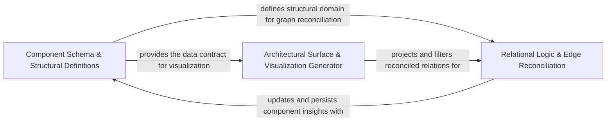

## Details

Defines the structural schema for architectural components, including their public API surfaces, file memberships, and inter-component relationships.

### Component Schema & Structural Definitions
Defines the core Pydantic models and data structures that represent the codebase's architectural building blocks, establishing the schema for file classifications and component boundaries.

**Related Classes/Methods**:

- `agents.agent_responses.CFGComponent`:700-716
- `agents.agent_responses.Component`:455-506
- `agents.agent_responses.FileClassification`:798-805
- `agents.agent_responses.CFGAnalysisInsights`:719-731
- `agents.agent_responses.ScopeOperation`:842-872

**Source Files:**

- [`agents/agent_responses.py`](https://github.com/CodeBoarding/CodeBoarding/blob/main/.codeboardingagents/agent_responses.py)
  - `agents.agent_responses.LLMBaseModel` ([L24-L129](https://github.com/CodeBoarding/CodeBoarding/blob/main/.codeboardingagents/agent_responses.py#L24-L129)) - Class
  - `agents.agent_responses.LLMBaseModel.llm_str` ([L28-L29](https://github.com/CodeBoarding/CodeBoarding/blob/main/.codeboardingagents/agent_responses.py#L28-L29)) - Method
  - `agents.agent_responses.LLMBaseModel._is_field_hidden` ([L32-L38](https://github.com/CodeBoarding/CodeBoarding/blob/main/.codeboardingagents/agent_responses.py#L32-L38)) - Method
  - `agents.agent_responses.LLMBaseModel._excluded_fields` ([L41-L50](https://github.com/CodeBoarding/CodeBoarding/blob/main/.codeboardingagents/agent_responses.py#L41-L50)) - Method
  - `agents.agent_responses.LLMBaseModel._resolve_excluded_by_title` ([L53-L72](https://github.com/CodeBoarding/CodeBoarding/blob/main/.codeboardingagents/agent_responses.py#L53-L72)) - Method
  - `agents.agent_responses.LLMBaseModel._resolve_excluded_by_title.walk` ([L57-L69](https://github.com/CodeBoarding/CodeBoarding/blob/main/.codeboardingagents/agent_responses.py#L57-L69)) - Function
  - `agents.agent_responses.LLMBaseModel._extractor_fields` ([L75-L94](https://github.com/CodeBoarding/CodeBoarding/blob/main/.codeboardingagents/agent_responses.py#L75-L94)) - Method
  - `agents.agent_responses.LLMBaseModel.extractor_str` ([L97-L104](https://github.com/CodeBoarding/CodeBoarding/blob/main/.codeboardingagents/agent_responses.py#L97-L104)) - Method
  - `agents.agent_responses.LLMBaseModel.model_json_schema` ([L107-L129](https://github.com/CodeBoarding/CodeBoarding/blob/main/.codeboardingagents/agent_responses.py#L107-L129)) - Method
  - `agents.agent_responses.SourceCodeReference` ([L132-L171](https://github.com/CodeBoarding/CodeBoarding/blob/main/.codeboardingagents/agent_responses.py#L132-L171)) - Class
  - `agents.agent_responses.SourceCodeReference.__str__` ([L163-L171](https://github.com/CodeBoarding/CodeBoarding/blob/main/.codeboardingagents/agent_responses.py#L163-L171)) - Method
  - `agents.agent_responses.RelationEdge` ([L186-L245](https://github.com/CodeBoarding/CodeBoarding/blob/main/.codeboardingagents/agent_responses.py#L186-L245)) - Class
  - `agents.agent_responses.RelationEdge.from_dict` ([L200-L211](https://github.com/CodeBoarding/CodeBoarding/blob/main/.codeboardingagents/agent_responses.py#L200-L211)) - Method
  - `agents.agent_responses.RelationEdge.from_edge` ([L214-L229](https://github.com/CodeBoarding/CodeBoarding/blob/main/.codeboardingagents/agent_responses.py#L214-L229)) - Method
  - `agents.agent_responses._relation_endpoint_from_key` ([L248-L267](https://github.com/CodeBoarding/CodeBoarding/blob/main/.codeboardingagents/agent_responses.py#L248-L267)) - Function
  - `agents.agent_responses.Relation.llm_str` ([L324-L325](https://github.com/CodeBoarding/CodeBoarding/blob/main/.codeboardingagents/agent_responses.py#L324-L325)) - Method
  - `agents.agent_responses.Component` ([L455-L506](https://github.com/CodeBoarding/CodeBoarding/blob/main/.codeboardingagents/agent_responses.py#L455-L506)) - Class
  - `agents.agent_responses.Component.file_paths` ([L492-L494](https://github.com/CodeBoarding/CodeBoarding/blob/main/.codeboardingagents/agent_responses.py#L492-L494)) - Method
  - `agents.agent_responses.ComponentApiSurfaces` ([L590-L598](https://github.com/CodeBoarding/CodeBoarding/blob/main/.codeboardingagents/agent_responses.py#L590-L598)) - Class
  - `agents.agent_responses.ComponentRelations` ([L601-L609](https://github.com/CodeBoarding/CodeBoarding/blob/main/.codeboardingagents/agent_responses.py#L601-L609)) - Class
  - `agents.agent_responses.ComponentRelations.llm_str` ([L606-L609](https://github.com/CodeBoarding/CodeBoarding/blob/main/.codeboardingagents/agent_responses.py#L606-L609)) - Method
  - `agents.agent_responses.CFGComponent` ([L700-L716](https://github.com/CodeBoarding/CodeBoarding/blob/main/.codeboardingagents/agent_responses.py#L700-L716)) - Class
  - `agents.agent_responses.CFGComponent.llm_str` ([L709-L716](https://github.com/CodeBoarding/CodeBoarding/blob/main/.codeboardingagents/agent_responses.py#L709-L716)) - Method
  - `agents.agent_responses.CFGAnalysisInsights` ([L719-L731](https://github.com/CodeBoarding/CodeBoarding/blob/main/.codeboardingagents/agent_responses.py#L719-L731)) - Class
  - `agents.agent_responses.CFGAnalysisInsights.llm_str` ([L725-L731](https://github.com/CodeBoarding/CodeBoarding/blob/main/.codeboardingagents/agent_responses.py#L725-L731)) - Method
  - `agents.agent_responses.ExpandComponent` ([L734-L741](https://github.com/CodeBoarding/CodeBoarding/blob/main/.codeboardingagents/agent_responses.py#L734-L741)) - Class
  - `agents.agent_responses.ExpandComponent.llm_str` ([L740-L741](https://github.com/CodeBoarding/CodeBoarding/blob/main/.codeboardingagents/agent_responses.py#L740-L741)) - Method
  - `agents.agent_responses.ValidationInsights` ([L744-L754](https://github.com/CodeBoarding/CodeBoarding/blob/main/.codeboardingagents/agent_responses.py#L744-L754)) - Class
  - `agents.agent_responses.ValidationInsights.llm_str` ([L753-L754](https://github.com/CodeBoarding/CodeBoarding/blob/main/.codeboardingagents/agent_responses.py#L753-L754)) - Method
  - `agents.agent_responses.UpdateAnalysis` ([L757-L766](https://github.com/CodeBoarding/CodeBoarding/blob/main/.codeboardingagents/agent_responses.py#L757-L766)) - Class
  - `agents.agent_responses.UpdateAnalysis.llm_str` ([L765-L766](https://github.com/CodeBoarding/CodeBoarding/blob/main/.codeboardingagents/agent_responses.py#L765-L766)) - Method
  - `agents.agent_responses.FileClassification` ([L798-L805](https://github.com/CodeBoarding/CodeBoarding/blob/main/.codeboardingagents/agent_responses.py#L798-L805)) - Class
  - `agents.agent_responses.FileClassification.llm_str` ([L804-L805](https://github.com/CodeBoarding/CodeBoarding/blob/main/.codeboardingagents/agent_responses.py#L804-L805)) - Method
  - `agents.agent_responses.ComponentFiles` ([L808-L820](https://github.com/CodeBoarding/CodeBoarding/blob/main/.codeboardingagents/agent_responses.py#L808-L820)) - Class
  - `agents.agent_responses.ComponentFiles.llm_str` ([L815-L820](https://github.com/CodeBoarding/CodeBoarding/blob/main/.codeboardingagents/agent_responses.py#L815-L820)) - Method
  - `agents.agent_responses.ScopedClusterRef` ([L830-L839](https://github.com/CodeBoarding/CodeBoarding/blob/main/.codeboardingagents/agent_responses.py#L830-L839)) - Class
  - `agents.agent_responses.ScopedClusterRef.llm_str` ([L837-L839](https://github.com/CodeBoarding/CodeBoarding/blob/main/.codeboardingagents/agent_responses.py#L837-L839)) - Method
  - `agents.agent_responses.ScopeOperation` ([L842-L872](https://github.com/CodeBoarding/CodeBoarding/blob/main/.codeboardingagents/agent_responses.py#L842-L872)) - Class
  - `agents.agent_responses.ScopeOperation.llm_str` ([L865-L872](https://github.com/CodeBoarding/CodeBoarding/blob/main/.codeboardingagents/agent_responses.py#L865-L872)) - Method
  - `agents.agent_responses.ScopeUpdateDecision` ([L875-L883](https://github.com/CodeBoarding/CodeBoarding/blob/main/.codeboardingagents/agent_responses.py#L875-L883)) - Class
  - `agents.agent_responses.ScopeUpdateDecision.llm_str` ([L880-L883](https://github.com/CodeBoarding/CodeBoarding/blob/main/.codeboardingagents/agent_responses.py#L880-L883)) - Method
  - `agents.agent_responses.FilePath` ([L886-L900](https://github.com/CodeBoarding/CodeBoarding/blob/main/.codeboardingagents/agent_responses.py#L886-L900)) - Class
  - `agents.agent_responses.FilePath.llm_str` ([L899-L900](https://github.com/CodeBoarding/CodeBoarding/blob/main/.codeboardingagents/agent_responses.py#L899-L900)) - Method
- [`diagram_analysis/analysis_json.py`](https://github.com/CodeBoarding/CodeBoarding/blob/main/.codeboardingdiagram_analysis/analysis_json.py)
  - `diagram_analysis.analysis_json.ComponentJson` ([L46-L70](https://github.com/CodeBoarding/CodeBoarding/blob/main/.codeboardingdiagram_analysis/analysis_json.py#L46-L70)) - Class
  - `diagram_analysis.analysis_json._extract_analysis_recursive` ([L582-L673](https://github.com/CodeBoarding/CodeBoarding/blob/main/.codeboardingdiagram_analysis/analysis_json.py#L582-L673)) - Function

### Architectural Surface & Visualization Generator
Responsible for defining the public API surfaces of components and transforming internal models into human-readable and interactive formats like HTML, Markdown, and Cytoscape.

**Related Classes/Methods**:

- `agents.agent_responses.ComponentApiSurface`:553-587
- `output_generators.html.generate_html`:59-125
- `output_generators.html_template._generate_cytoscape_script`:317-360
- `output_generators.markdown.generate_markdown`:43-122

**Source Files:**

- [`agents/agent_responses.py`](https://github.com/CodeBoarding/CodeBoarding/blob/main/.codeboardingagents/agent_responses.py)
  - `agents.agent_responses.SourceCodeReference.llm_str` ([L153-L161](https://github.com/CodeBoarding/CodeBoarding/blob/main/.codeboardingagents/agent_responses.py#L153-L161)) - Method
  - `agents.agent_responses.ComponentApiSurface` ([L553-L587](https://github.com/CodeBoarding/CodeBoarding/blob/main/.codeboardingagents/agent_responses.py#L553-L587)) - Class
  - `agents.agent_responses.ComponentApiSurface.llm_str` ([L575-L587](https://github.com/CodeBoarding/CodeBoarding/blob/main/.codeboardingagents/agent_responses.py#L575-L587)) - Method
- [`output_generators/html.py`](https://github.com/CodeBoarding/CodeBoarding/blob/main/.codeboardingoutput_generators/html.py)
  - `output_generators.html.generate_cytoscape_data` ([L10-L56](https://github.com/CodeBoarding/CodeBoarding/blob/main/.codeboardingoutput_generators/html.py#L10-L56)) - Function
  - `output_generators.html.generate_html` ([L59-L125](https://github.com/CodeBoarding/CodeBoarding/blob/main/.codeboardingoutput_generators/html.py#L59-L125)) - Function
  - `output_generators.html.generate_html_file` ([L128-L152](https://github.com/CodeBoarding/CodeBoarding/blob/main/.codeboardingoutput_generators/html.py#L128-L152)) - Function
  - `output_generators.html.component_header_html` ([L155-L163](https://github.com/CodeBoarding/CodeBoarding/blob/main/.codeboardingoutput_generators/html.py#L155-L163)) - Function
- [`output_generators/html_template.py`](https://github.com/CodeBoarding/CodeBoarding/blob/main/.codeboardingoutput_generators/html_template.py)
  - `output_generators.html_template._generate_css_styles` ([L4-L86](https://github.com/CodeBoarding/CodeBoarding/blob/main/.codeboardingoutput_generators/html_template.py#L4-L86)) - Function
  - `output_generators.html_template._generate_html_body` ([L89-L122](https://github.com/CodeBoarding/CodeBoarding/blob/main/.codeboardingoutput_generators/html_template.py#L89-L122)) - Function
  - `output_generators.html_template._get_library_checks` ([L125-L145](https://github.com/CodeBoarding/CodeBoarding/blob/main/.codeboardingoutput_generators/html_template.py#L125-L145)) - Function
  - `output_generators.html_template._get_dagre_registration` ([L148-L159](https://github.com/CodeBoarding/CodeBoarding/blob/main/.codeboardingoutput_generators/html_template.py#L148-L159)) - Function
  - `output_generators.html_template._get_cytoscape_style` ([L162-L221](https://github.com/CodeBoarding/CodeBoarding/blob/main/.codeboardingoutput_generators/html_template.py#L162-L221)) - Function
  - `output_generators.html_template._get_layout_config` ([L224-L235](https://github.com/CodeBoarding/CodeBoarding/blob/main/.codeboardingoutput_generators/html_template.py#L224-L235)) - Function
  - `output_generators.html_template._get_event_handlers` ([L238-L285](https://github.com/CodeBoarding/CodeBoarding/blob/main/.codeboardingoutput_generators/html_template.py#L238-L285)) - Function
  - `output_generators.html_template._get_control_functions` ([L288-L314](https://github.com/CodeBoarding/CodeBoarding/blob/main/.codeboardingoutput_generators/html_template.py#L288-L314)) - Function
  - `output_generators.html_template._generate_cytoscape_script` ([L317-L360](https://github.com/CodeBoarding/CodeBoarding/blob/main/.codeboardingoutput_generators/html_template.py#L317-L360)) - Function
  - `output_generators.html_template.populate_html_template` ([L363-L385](https://github.com/CodeBoarding/CodeBoarding/blob/main/.codeboardingoutput_generators/html_template.py#L363-L385)) - Function
- [`output_generators/markdown.py`](https://github.com/CodeBoarding/CodeBoarding/blob/main/.codeboardingoutput_generators/markdown.py)
  - `output_generators.markdown.generated_mermaid_str` ([L9-L40](https://github.com/CodeBoarding/CodeBoarding/blob/main/.codeboardingoutput_generators/markdown.py#L9-L40)) - Function
  - `output_generators.markdown.generate_markdown` ([L43-L122](https://github.com/CodeBoarding/CodeBoarding/blob/main/.codeboardingoutput_generators/markdown.py#L43-L122)) - Function
  - `output_generators.markdown.generate_markdown_file` ([L125-L146](https://github.com/CodeBoarding/CodeBoarding/blob/main/.codeboardingoutput_generators/markdown.py#L125-L146)) - Function
  - `output_generators.markdown.component_header` ([L149-L157](https://github.com/CodeBoarding/CodeBoarding/blob/main/.codeboardingoutput_generators/markdown.py#L149-L157)) - Function
- [`output_generators/mdx.py`](https://github.com/CodeBoarding/CodeBoarding/blob/main/.codeboardingoutput_generators/mdx.py)
  - `output_generators.mdx.generated_mermaid_str` ([L8-L35](https://github.com/CodeBoarding/CodeBoarding/blob/main/.codeboardingoutput_generators/mdx.py#L8-L35)) - Function
  - `output_generators.mdx.generate_frontmatter` ([L38-L49](https://github.com/CodeBoarding/CodeBoarding/blob/main/.codeboardingoutput_generators/mdx.py#L38-L49)) - Function
  - `output_generators.mdx.generate_mdx` ([L52-L158](https://github.com/CodeBoarding/CodeBoarding/blob/main/.codeboardingoutput_generators/mdx.py#L52-L158)) - Function
  - `output_generators.mdx.generate_mdx_file` ([L161-L183](https://github.com/CodeBoarding/CodeBoarding/blob/main/.codeboardingoutput_generators/mdx.py#L161-L183)) - Function
  - `output_generators.mdx.component_header` ([L186-L194](https://github.com/CodeBoarding/CodeBoarding/blob/main/.codeboardingoutput_generators/mdx.py#L186-L194)) - Function
- [`output_generators/sphinx.py`](https://github.com/CodeBoarding/CodeBoarding/blob/main/.codeboardingoutput_generators/sphinx.py)
  - `output_generators.sphinx.generated_mermaid_str` ([L8-L43](https://github.com/CodeBoarding/CodeBoarding/blob/main/.codeboardingoutput_generators/sphinx.py#L8-L43)) - Function
  - `output_generators.sphinx.generate_rst` ([L46-L159](https://github.com/CodeBoarding/CodeBoarding/blob/main/.codeboardingoutput_generators/sphinx.py#L46-L159)) - Function
  - `output_generators.sphinx.generate_rst_file` ([L162-L187](https://github.com/CodeBoarding/CodeBoarding/blob/main/.codeboardingoutput_generators/sphinx.py#L162-L187)) - Function
  - `output_generators.sphinx.component_header` ([L190-L201](https://github.com/CodeBoarding/CodeBoarding/blob/main/.codeboardingoutput_generators/sphinx.py#L190-L201)) - Function
- [`static_analyzer/constants.py`](https://github.com/CodeBoarding/CodeBoarding/blob/main/.codeboardingstatic_analyzer/constants.py)
  - `static_analyzer.constants.ClusteringConfig` ([L58-L92](https://github.com/CodeBoarding/CodeBoarding/blob/main/.codeboardingstatic_analyzer/constants.py#L58-L92)) - Class
  - `static_analyzer.constants.NodeType` ([L95-L146](https://github.com/CodeBoarding/CodeBoarding/blob/main/.codeboardingstatic_analyzer/constants.py#L95-L146)) - Class
  - `static_analyzer.constants.NodeType.label` ([L132-L134](https://github.com/CodeBoarding/CodeBoarding/blob/main/.codeboardingstatic_analyzer/constants.py#L132-L134)) - Method
  - `static_analyzer.constants.NodeType.from_name` ([L137-L146](https://github.com/CodeBoarding/CodeBoarding/blob/main/.codeboardingstatic_analyzer/constants.py#L137-L146)) - Method
- [`static_analyzer/engine/result_converter.py`](https://github.com/CodeBoarding/CodeBoarding/blob/main/.codeboardingstatic_analyzer/engine/result_converter.py)
  - `static_analyzer.engine.result_converter._map_symbol_kind` ([L204-L213](https://github.com/CodeBoarding/CodeBoarding/blob/main/.codeboardingstatic_analyzer/engine/result_converter.py#L204-L213)) - Function
- [`static_analyzer/node.py`](https://github.com/CodeBoarding/CodeBoarding/blob/main/.codeboardingstatic_analyzer/node.py)
  - `static_analyzer.node.Node.__init__` ([L12-L27](https://github.com/CodeBoarding/CodeBoarding/blob/main/.codeboardingstatic_analyzer/node.py#L12-L27)) - Method
- [`utils.py`](https://github.com/CodeBoarding/CodeBoarding/blob/main/.codeboardingutils.py)
  - `utils.sanitize` ([L92-L94](https://github.com/CodeBoarding/CodeBoarding/blob/main/.codeboardingutils.py#L92-L94)) - Function

### Relational Logic & Edge Reconciliation
Manages the logic of inter-component relationships, ensuring that low-level code calls are correctly mapped to high-level component relations during codebase evolution.

**Related Classes/Methods**:

- `agents.agent_responses.Relation`:270-386
- `agents.relation_edges.preserve_unchanged_relations`:189-275
- `agents.relation_edges.append_or_merge_relation`:9-23
- `codeboarding_workflows.rendering.project_relations_to_level`:35-62

**Source Files:**

- [`agents/agent_responses.py`](https://github.com/CodeBoarding/CodeBoarding/blob/main/.codeboardingagents/agent_responses.py)
  - `agents.agent_responses.RelationEdge.identity` ([L234-L245](https://github.com/CodeBoarding/CodeBoarding/blob/main/.codeboardingagents/agent_responses.py#L234-L245)) - Method
  - `agents.agent_responses.Relation` ([L270-L386](https://github.com/CodeBoarding/CodeBoarding/blob/main/.codeboardingagents/agent_responses.py#L270-L386)) - Class
  - `agents.agent_responses.Relation.from_edges` ([L301-L322](https://github.com/CodeBoarding/CodeBoarding/blob/main/.codeboardingagents/agent_responses.py#L301-L322)) - Method
  - `agents.agent_responses.Relation.pair_key` ([L327-L332](https://github.com/CodeBoarding/CodeBoarding/blob/main/.codeboardingagents/agent_responses.py#L327-L332)) - Method
  - `agents.agent_responses.Relation.with_merged_edges` ([L334-L346](https://github.com/CodeBoarding/CodeBoarding/blob/main/.codeboardingagents/agent_responses.py#L334-L346)) - Method
  - `agents.agent_responses.Relation.merge_edges_from` ([L348-L354](https://github.com/CodeBoarding/CodeBoarding/blob/main/.codeboardingagents/agent_responses.py#L348-L354)) - Method
  - `agents.agent_responses.Relation._merge_edges` ([L357-L362](https://github.com/CodeBoarding/CodeBoarding/blob/main/.codeboardingagents/agent_responses.py#L357-L362)) - Method
  - `agents.agent_responses.Relation._unique_edges` ([L365-L374](https://github.com/CodeBoarding/CodeBoarding/blob/main/.codeboardingagents/agent_responses.py#L365-L374)) - Method
  - `agents.agent_responses.Relation.edge_count` ([L377-L378](https://github.com/CodeBoarding/CodeBoarding/blob/main/.codeboardingagents/agent_responses.py#L377-L378)) - Method
  - `agents.agent_responses.Relation.analysis_dump` ([L380-L386](https://github.com/CodeBoarding/CodeBoarding/blob/main/.codeboardingagents/agent_responses.py#L380-L386)) - Method
- [`agents/relation_edges.py`](https://github.com/CodeBoarding/CodeBoarding/blob/main/.codeboardingagents/relation_edges.py)
  - `agents.relation_edges.append_or_merge_relation` ([L9-L23](https://github.com/CodeBoarding/CodeBoarding/blob/main/.codeboardingagents/relation_edges.py#L9-L23)) - Function
  - `agents.relation_edges._is_internal_self_relation` ([L55-L69](https://github.com/CodeBoarding/CodeBoarding/blob/main/.codeboardingagents/relation_edges.py#L55-L69)) - Function
  - `agents.relation_edges.drop_internal_self_relations` ([L72-L74](https://github.com/CodeBoarding/CodeBoarding/blob/main/.codeboardingagents/relation_edges.py#L72-L74)) - Function
  - `agents.relation_edges._relation_backing_survives` ([L77-L90](https://github.com/CodeBoarding/CodeBoarding/blob/main/.codeboardingagents/relation_edges.py#L77-L90)) - Function
  - `agents.relation_edges._backing_edge_pairs` ([L93-L96](https://github.com/CodeBoarding/CodeBoarding/blob/main/.codeboardingagents/relation_edges.py#L93-L96)) - Function
  - `agents.relation_edges._relation_edges_unmoved` ([L99-L108](https://github.com/CodeBoarding/CodeBoarding/blob/main/.codeboardingagents/relation_edges.py#L99-L108)) - Function
  - `agents.relation_edges._edge_touches_changed_method` ([L111-L112](https://github.com/CodeBoarding/CodeBoarding/blob/main/.codeboardingagents/relation_edges.py#L111-L112)) - Function
  - `agents.relation_edges._restore_baseline_orientation` ([L115-L143](https://github.com/CodeBoarding/CodeBoarding/blob/main/.codeboardingagents/relation_edges.py#L115-L143)) - Function
  - `agents.relation_edges._filter_edges_touched_by_change` ([L146-L159](https://github.com/CodeBoarding/CodeBoarding/blob/main/.codeboardingagents/relation_edges.py#L146-L159)) - Function
  - `agents.relation_edges._reconcile_unchanged_edges` ([L162-L186](https://github.com/CodeBoarding/CodeBoarding/blob/main/.codeboardingagents/relation_edges.py#L162-L186)) - Function
  - `agents.relation_edges._reconcile_unchanged_edges.split` ([L176-L179](https://github.com/CodeBoarding/CodeBoarding/blob/main/.codeboardingagents/relation_edges.py#L176-L179)) - Function
  - `agents.relation_edges.preserve_unchanged_relations` ([L189-L275](https://github.com/CodeBoarding/CodeBoarding/blob/main/.codeboardingagents/relation_edges.py#L189-L275)) - Function
  - `agents.relation_edges.preserve_unchanged_relations.touches_change` ([L222-L223](https://github.com/CodeBoarding/CodeBoarding/blob/main/.codeboardingagents/relation_edges.py#L222-L223)) - Function
- [`codeboarding_workflows/rendering.py`](https://github.com/CodeBoarding/CodeBoarding/blob/main/.codeboardingcodeboarding_workflows/rendering.py)
  - `codeboarding_workflows.rendering._ancestor_in_level` ([L27-L32](https://github.com/CodeBoarding/CodeBoarding/blob/main/.codeboardingcodeboarding_workflows/rendering.py#L27-L32)) - Function
  - `codeboarding_workflows.rendering.project_relations_to_level` ([L35-L62](https://github.com/CodeBoarding/CodeBoarding/blob/main/.codeboardingcodeboarding_workflows/rendering.py#L35-L62)) - Function
- [`diagram_analysis/diagram_generator.py`](https://github.com/CodeBoarding/CodeBoarding/blob/main/.codeboardingdiagram_analysis/diagram_generator.py)
  - `diagram_analysis.diagram_generator.DiagramGenerator.rebuild_global_relations` ([L1156-L1210](https://github.com/CodeBoarding/CodeBoarding/blob/main/.codeboardingdiagram_analysis/diagram_generator.py#L1156-L1210)) - Method
- [`static_analyzer/cluster_relations.py`](https://github.com/CodeBoarding/CodeBoarding/blob/main/.codeboardingstatic_analyzer/cluster_relations.py)
  - `static_analyzer.cluster_relations.build_global_node_to_component_map` ([L44-L54](https://github.com/CodeBoarding/CodeBoarding/blob/main/.codeboardingstatic_analyzer/cluster_relations.py#L44-L54)) - Function
  - `static_analyzer.cluster_relations._qnames_match` ([L57-L67](https://github.com/CodeBoarding/CodeBoarding/blob/main/.codeboardingstatic_analyzer/cluster_relations.py#L57-L67)) - Function
  - `static_analyzer.cluster_relations.build_owner_index` ([L70-L80](https://github.com/CodeBoarding/CodeBoarding/blob/main/.codeboardingstatic_analyzer/cluster_relations.py#L70-L80)) - Function
  - `static_analyzer.cluster_relations._endpoint_owner` ([L83-L91](https://github.com/CodeBoarding/CodeBoarding/blob/main/.codeboardingstatic_analyzer/cluster_relations.py#L83-L91)) - Function
  - `static_analyzer.cluster_relations.edge_crosses_components` ([L94-L113](https://github.com/CodeBoarding/CodeBoarding/blob/main/.codeboardingstatic_analyzer/cluster_relations.py#L94-L113)) - Function
  - `static_analyzer.cluster_relations.prune_ungrounded_edges` ([L116-L195](https://github.com/CodeBoarding/CodeBoarding/blob/main/.codeboardingstatic_analyzer/cluster_relations.py#L116-L195)) - Function
  - `static_analyzer.cluster_relations.prune_ungrounded_edges.find_relation_pair_for_edge` ([L142-L159](https://github.com/CodeBoarding/CodeBoarding/blob/main/.codeboardingstatic_analyzer/cluster_relations.py#L142-L159)) - Function
  - `static_analyzer.cluster_relations.drop_reverse_duplicates` ([L198-L254](https://github.com/CodeBoarding/CodeBoarding/blob/main/.codeboardingstatic_analyzer/cluster_relations.py#L198-L254)) - Function
  - `static_analyzer.cluster_relations.ground_relation_edges` ([L257-L294](https://github.com/CodeBoarding/CodeBoarding/blob/main/.codeboardingstatic_analyzer/cluster_relations.py#L257-L294)) - Function
  - `static_analyzer.cluster_relations.iter_ancestor_ids` ([L338-L342](https://github.com/CodeBoarding/CodeBoarding/blob/main/.codeboardingstatic_analyzer/cluster_relations.py#L338-L342)) - Function
  - `static_analyzer.cluster_relations._collect_component_names` ([L350-L356](https://github.com/CodeBoarding/CodeBoarding/blob/main/.codeboardingstatic_analyzer/cluster_relations.py#L350-L356)) - Function
  - `static_analyzer.cluster_relations._collect_authoritative_relations` ([L359-L372](https://github.com/CodeBoarding/CodeBoarding/blob/main/.codeboardingstatic_analyzer/cluster_relations.py#L359-L372)) - Function
  - `static_analyzer.cluster_relations._ancestor_relation` ([L375-L387](https://github.com/CodeBoarding/CodeBoarding/blob/main/.codeboardingstatic_analyzer/cluster_relations.py#L375-L387)) - Function
  - `static_analyzer.cluster_relations._relation_key_edges_for_pair` ([L390-L403](https://github.com/CodeBoarding/CodeBoarding/blob/main/.codeboardingstatic_analyzer/cluster_relations.py#L390-L403)) - Function
  - `static_analyzer.cluster_relations.build_global_relations` ([L406-L480](https://github.com/CodeBoarding/CodeBoarding/blob/main/.codeboardingstatic_analyzer/cluster_relations.py#L406-L480)) - Function
  - `static_analyzer.cluster_relations.merge_relations` ([L483-L582](https://github.com/CodeBoarding/CodeBoarding/blob/main/.codeboardingstatic_analyzer/cluster_relations.py#L483-L582)) - Function

### [FAQ](https://github.com/CodeBoarding/GeneratedOnBoardings/tree/main?tab=readme-ov-file#faq)