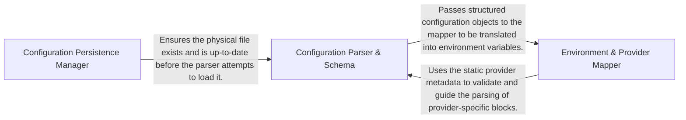

## Details

Handles the ingestion and application of user-specific settings, parsing configuration files and injecting values into the process environment.

### Configuration Persistence Manager
Handles the physical lifecycle of the configuration file on the user's filesystem, ensuring default templates exist and performing safe updates.

**Related Classes/Methods**:

- `user_config.ensure_config_template`:163-169
- `user_config._append_commented_key`:172-181

**Source Files:**

- [`repo_utils/__init__.py`](https://github.com/CodeBoarding/CodeBoarding/blob/main/.codeboardingrepo_utils/__init__.py)
  - `repo_utils.__init__.require_git_import.decorator.wrapper` ([L39-L53](https://github.com/CodeBoarding/CodeBoarding/blob/main/.codeboardingrepo_utils/__init__.py#L39-L53)) - Function

### Configuration Parser & Schema
Reads the TOML configuration and deserializes it into structured, type-safe Python objects, managing the hierarchy of settings.

**Related Classes/Methods**:

- `user_config.UserConfig`:114-123

**Source Files:**

- [`user_config.py`](https://github.com/CodeBoarding/CodeBoarding/blob/main/.codeboardinguser_config.py)
  - `user_config.UserConfig.apply_to_env` ([L118-L123](https://github.com/CodeBoarding/CodeBoarding/blob/main/.codeboardinguser_config.py#L118-L123)) - Method

### Environment & Provider Mapper
Acts as the translation layer between the internal configuration schema and external environment requirements, injecting values into the process environment.

**Related Classes/Methods**:

- `user_config.UserConfig.apply_to_env`:118-123

**Source Files:**

- [`user_config.py`](https://github.com/CodeBoarding/CodeBoarding/blob/main/.codeboardinguser_config.py)
  - `user_config.ensure_config_template` ([L163-L169](https://github.com/CodeBoarding/CodeBoarding/blob/main/.codeboardinguser_config.py#L163-L169)) - Function
  - `user_config._append_commented_key` ([L172-L181](https://github.com/CodeBoarding/CodeBoarding/blob/main/.codeboardinguser_config.py#L172-L181)) - Function

### [FAQ](https://github.com/CodeBoarding/GeneratedOnBoardings/tree/main?tab=readme-ov-file#faq)