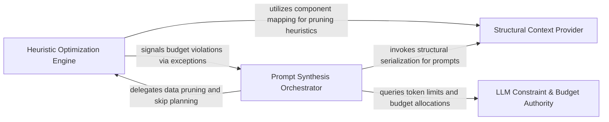

## Details

The core logic engine that calculates token budgets for analysis clusters and dynamically determines which parts of the static analysis must be omitted or truncated.

### LLM Constraint & Budget Authority
Acts as the source of truth for execution limits, retrieving model-specific context windows and calculating available budgets for analysis clusters.

**Related Classes/Methods**:

- `agents.cluster_budget.ClusterPromptBudget`:10-21
- `agents.llm_config.get_current_agent_context_window`:431-445
- `agents.cluster_methods_mixin.ClusterMethodsMixin._cluster_prompt_budget`:304-306

**Source Files:**

- [`agents/cluster_budget.py`](https://github.com/CodeBoarding/CodeBoarding/blob/main/.codeboardingagents/cluster_budget.py)
  - `agents.cluster_budget.ClusterPromptBudget` ([L10-L21](https://github.com/CodeBoarding/CodeBoarding/blob/main/.codeboardingagents/cluster_budget.py#L10-L21)) - Class
  - `agents.cluster_budget.ClusterPromptBudget.available_chars` ([L18-L21](https://github.com/CodeBoarding/CodeBoarding/blob/main/.codeboardingagents/cluster_budget.py#L18-L21)) - Method
- [`agents/cluster_methods_mixin.py`](https://github.com/CodeBoarding/CodeBoarding/blob/main/.codeboardingagents/cluster_methods_mixin.py)
  - `agents.cluster_methods_mixin.ClusterMethodsMixin._cluster_prompt_budget` ([L430-L432](https://github.com/CodeBoarding/CodeBoarding/blob/main/.codeboardingagents/cluster_methods_mixin.py#L430-L432)) - Method
- [`agents/llm_config.py`](https://github.com/CodeBoarding/CodeBoarding/blob/main/.codeboardingagents/llm_config.py)
  - `agents.llm_config.get_current_agent_context_window` ([L431-L445](https://github.com/CodeBoarding/CodeBoarding/blob/main/.codeboardingagents/llm_config.py#L431-L445)) - Function

### Structural Context Provider
Extracts and maps raw structural data, including Control Flow Graphs (CFGs) and component mappings, to serve as input for the budgeting and pruning process.

**Related Classes/Methods**:

- `static_analyzer.analysis_result.StaticAnalysisResults.available_cfgs`:213-219
- `static_analyzer.cluster_relations.build_node_to_component_map`:30-41
- `agents.cluster_methods_mixin.ClusterMethodsMixin.build_scope_cfg_string`:888-921

**Source Files:**

- [`agents/cluster_methods_mixin.py`](https://github.com/CodeBoarding/CodeBoarding/blob/main/.codeboardingagents/cluster_methods_mixin.py)
  - `agents.cluster_methods_mixin.ClusterMethodsMixin.build_static_relations` ([L987-L1007](https://github.com/CodeBoarding/CodeBoarding/blob/main/.codeboardingagents/cluster_methods_mixin.py#L987-L1007)) - Method
  - `agents.cluster_methods_mixin.ClusterMethodsMixin.build_scope_cfg_string` ([L1016-L1049](https://github.com/CodeBoarding/CodeBoarding/blob/main/.codeboardingagents/cluster_methods_mixin.py#L1016-L1049)) - Method
- [`static_analyzer/analysis_result.py`](https://github.com/CodeBoarding/CodeBoarding/blob/main/.codeboardingstatic_analyzer/analysis_result.py)
  - `static_analyzer.analysis_result.StaticAnalysisResults.available_cfgs` ([L213-L219](https://github.com/CodeBoarding/CodeBoarding/blob/main/.codeboardingstatic_analyzer/analysis_result.py#L213-L219)) - Method
- [`static_analyzer/cluster_relations.py`](https://github.com/CodeBoarding/CodeBoarding/blob/main/.codeboardingstatic_analyzer/cluster_relations.py)
  - `static_analyzer.cluster_relations.build_node_to_component_map` ([L30-L41](https://github.com/CodeBoarding/CodeBoarding/blob/main/.codeboardingstatic_analyzer/cluster_relations.py#L30-L41)) - Function

### Heuristic Optimization Engine
The core logic engine that calculates 'peel orders' and uses greedy-fit algorithms to prune data while minimizing information loss.

**Related Classes/Methods**:

- `static_analyzer.cfg_skip_planner.plan_skip_set`:139-214
- `static_analyzer.cfg_skip_planner._compute_peel_order`:43-60
- `static_analyzer.cfg_skip_planner.ContextBudgetExceededError`:27-40

**Source Files:**

- [`static_analyzer/cfg_skip_planner.py`](https://github.com/CodeBoarding/CodeBoarding/blob/main/.codeboardingstatic_analyzer/cfg_skip_planner.py)
  - `static_analyzer.cfg_skip_planner.ContextBudgetExceededError` ([L27-L40](https://github.com/CodeBoarding/CodeBoarding/blob/main/.codeboardingstatic_analyzer/cfg_skip_planner.py#L27-L40)) - Class
  - `static_analyzer.cfg_skip_planner._compute_peel_order` ([L43-L60](https://github.com/CodeBoarding/CodeBoarding/blob/main/.codeboardingstatic_analyzer/cfg_skip_planner.py#L43-L60)) - Function
  - `static_analyzer.cfg_skip_planner._build_allowed_skip_list` ([L63-L79](https://github.com/CodeBoarding/CodeBoarding/blob/main/.codeboardingstatic_analyzer/cfg_skip_planner.py#L63-L79)) - Function
  - `static_analyzer.cfg_skip_planner._select_high_savings_fit` ([L82-L122](https://github.com/CodeBoarding/CodeBoarding/blob/main/.codeboardingstatic_analyzer/cfg_skip_planner.py#L82-L122)) - Function
  - `static_analyzer.cfg_skip_planner._minimize_skip_set` ([L125-L136](https://github.com/CodeBoarding/CodeBoarding/blob/main/.codeboardingstatic_analyzer/cfg_skip_planner.py#L125-L136)) - Function
  - `static_analyzer.cfg_skip_planner.plan_skip_set` ([L139-L214](https://github.com/CodeBoarding/CodeBoarding/blob/main/.codeboardingstatic_analyzer/cfg_skip_planner.py#L139-L214)) - Function

### Prompt Synthesis Orchestrator
Manages the lifecycle of prompt generation, handling budget error feedback, triggering re-planning, and rendering the final truncated strings.

**Related Classes/Methods**:

- `agents.cluster_methods_mixin.ClusterMethodsMixin._plan_skip_sets`:191-267
- `agents.cluster_methods_mixin.ClusterMethodsMixin._build_cluster_string`:115-153
- `agents.cluster_methods_mixin.ClusterMethodsMixin._render_cluster_string`:155-189

**Source Files:**

- [`agents/cluster_methods_mixin.py`](https://github.com/CodeBoarding/CodeBoarding/blob/main/.codeboardingagents/cluster_methods_mixin.py)
  - `agents.cluster_methods_mixin._RenderedClusterString` ([L104-L107](https://github.com/CodeBoarding/CodeBoarding/blob/main/.codeboardingagents/cluster_methods_mixin.py#L104-L107)) - Class
  - `agents.cluster_methods_mixin._describe_window` ([L134-L136](https://github.com/CodeBoarding/CodeBoarding/blob/main/.codeboardingagents/cluster_methods_mixin.py#L134-L136)) - Function
  - `agents.cluster_methods_mixin._window_telemetry` ([L139-L145](https://github.com/CodeBoarding/CodeBoarding/blob/main/.codeboardingagents/cluster_methods_mixin.py#L139-L145)) - Function
  - `agents.cluster_methods_mixin.ClusterMethodsMixin._build_cluster_string` ([L241-L279](https://github.com/CodeBoarding/CodeBoarding/blob/main/.codeboardingagents/cluster_methods_mixin.py#L241-L279)) - Method
  - `agents.cluster_methods_mixin.ClusterMethodsMixin._render_cluster_string` ([L281-L315](https://github.com/CodeBoarding/CodeBoarding/blob/main/.codeboardingagents/cluster_methods_mixin.py#L281-L315)) - Method
  - `agents.cluster_methods_mixin.ClusterMethodsMixin._plan_skip_sets` ([L317-L393](https://github.com/CodeBoarding/CodeBoarding/blob/main/.codeboardingagents/cluster_methods_mixin.py#L317-L393)) - Method
  - `agents.cluster_methods_mixin.ClusterMethodsMixin._language_budget_targets` ([L396-L405](https://github.com/CodeBoarding/CodeBoarding/blob/main/.codeboardingagents/cluster_methods_mixin.py#L396-L405)) - Method
  - `agents.cluster_methods_mixin.ClusterMethodsMixin._raise_cluster_budget_error` ([L408-L427](https://github.com/CodeBoarding/CodeBoarding/blob/main/.codeboardingagents/cluster_methods_mixin.py#L408-L427)) - Method
  - `agents.cluster_methods_mixin.ClusterMethodsMixin._ensure_unique_key_entities` ([L434-L481](https://github.com/CodeBoarding/CodeBoarding/blob/main/.codeboardingagents/cluster_methods_mixin.py#L434-L481)) - Method
  - `agents.cluster_methods_mixin.ClusterMethodsMixin._resolve_cluster_ids_from_groups` ([L483-L498](https://github.com/CodeBoarding/CodeBoarding/blob/main/.codeboardingagents/cluster_methods_mixin.py#L483-L498)) - Method
- [`agents/llm_config.py`](https://github.com/CodeBoarding/CodeBoarding/blob/main/.codeboardingagents/llm_config.py)
  - `agents.llm_config.get_current_agent_model_ref` ([L448-L454](https://github.com/CodeBoarding/CodeBoarding/blob/main/.codeboardingagents/llm_config.py#L448-L454)) - Function
- [`static_analyzer/graph.py`](https://github.com/CodeBoarding/CodeBoarding/blob/main/.codeboardingstatic_analyzer/graph.py)
  - `static_analyzer.graph.ClusterResult.get_cluster_ids` ([L80-L81](https://github.com/CodeBoarding/CodeBoarding/blob/main/.codeboardingstatic_analyzer/graph.py#L80-L81)) - Method

### [FAQ](https://github.com/CodeBoarding/GeneratedOnBoardings/tree/main?tab=readme-ov-file#faq)