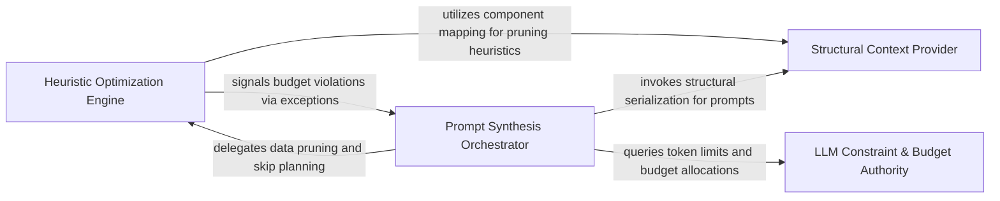

```mermaid
graph LR
    LLM_Constraint_Budget_Authority["LLM Constraint & Budget Authority"]
    Structural_Context_Provider["Structural Context Provider"]
    Heuristic_Optimization_Engine["Heuristic Optimization Engine"]
    Prompt_Synthesis_Orchestrator["Prompt Synthesis Orchestrator"]
    Heuristic_Optimization_Engine -- "utilizes component mapping for pruning heuristics" --> Structural_Context_Provider
    Heuristic_Optimization_Engine -- "signals budget violations via exceptions" --> Prompt_Synthesis_Orchestrator
    Prompt_Synthesis_Orchestrator -- "queries token limits and budget allocations" --> LLM_Constraint_Budget_Authority
    Prompt_Synthesis_Orchestrator -- "invokes structural serialization for prompts" --> Structural_Context_Provider
    Prompt_Synthesis_Orchestrator -- "delegates data pruning and skip planning" --> Heuristic_Optimization_Engine
```

## Details

The core logic engine that calculates token budgets for analysis clusters and dynamically determines which parts of the static analysis must be omitted or truncated.

### LLM Constraint & Budget Authority
Acts as the source of truth for execution limits, retrieving model-specific context windows and calculating available budgets for analysis clusters.

**Related Classes/Methods**:

- `agents.llm_config.get_current_agent_context_window`:431-445
- `agents.cluster_methods_mixin.ClusterMethodsMixin._cluster_prompt_budget`:304-306

**Source Files:**

- [`agents/cluster_methods_mixin.py`](https://github.com/CodeBoarding/CodeBoarding/blob/main/.codeboardingagents/cluster_methods_mixin.py)
  - `agents.cluster_methods_mixin.ClusterMethodsMixin._cluster_prompt_budget` ([L430-L432](https://github.com/CodeBoarding/CodeBoarding/blob/main/.codeboardingagents/cluster_methods_mixin.py#L430-L432)) - Method
- [`agents/llm_config.py`](https://github.com/CodeBoarding/CodeBoarding/blob/main/.codeboardingagents/llm_config.py)
  - `agents.llm_config.get_current_agent_context_window` ([L431-L445](https://github.com/CodeBoarding/CodeBoarding/blob/main/.codeboardingagents/llm_config.py#L431-L445)) - Function

### Structural Context Provider
Extracts and maps raw structural data, including Control Flow Graphs (CFGs) and component mappings, to serve as input for the budgeting and pruning process.

**Related Classes/Methods**:

- `static_analyzer.analysis_result.StaticAnalysisResults.available_cfgs`:213-219
- `static_analyzer.cluster_relations.build_node_to_component_map`:30-41
- `agents.cluster_methods_mixin.ClusterMethodsMixin.build_scope_cfg_string`:888-921

**Source Files:**

- [`agents/cluster_methods_mixin.py`](https://github.com/CodeBoarding/CodeBoarding/blob/main/.codeboardingagents/cluster_methods_mixin.py)
  - `agents.cluster_methods_mixin.ClusterMethodsMixin.build_static_relations` ([L690-L710](https://github.com/CodeBoarding/CodeBoarding/blob/main/.codeboardingagents/cluster_methods_mixin.py#L690-L710)) - Method
  - `agents.cluster_methods_mixin.ClusterMethodsMixin.build_scope_cfg_string` ([L719-L752](https://github.com/CodeBoarding/CodeBoarding/blob/main/.codeboardingagents/cluster_methods_mixin.py#L719-L752)) - Method
- [`static_analyzer/analysis_result.py`](https://github.com/CodeBoarding/CodeBoarding/blob/main/.codeboardingstatic_analyzer/analysis_result.py)
  - `static_analyzer.analysis_result.StaticAnalysisResults.available_cfgs` ([L213-L219](https://github.com/CodeBoarding/CodeBoarding/blob/main/.codeboardingstatic_analyzer/analysis_result.py#L213-L219)) - Method
- [`static_analyzer/cluster_relations.py`](https://github.com/CodeBoarding/CodeBoarding/blob/main/.codeboardingstatic_analyzer/cluster_relations.py)
  - `static_analyzer.cluster_relations.build_node_to_component_map` ([L30-L41](https://github.com/CodeBoarding/CodeBoarding/blob/main/.codeboardingstatic_analyzer/cluster_relations.py#L30-L41)) - Function

### Heuristic Optimization Engine
The core logic engine that calculates 'peel orders' and uses greedy-fit algorithms to prune data while minimizing information loss.

**Related Classes/Methods**: _None_

### Prompt Synthesis Orchestrator
Manages the lifecycle of prompt generation, handling budget error feedback, triggering re-planning, and rendering the final truncated strings.

**Related Classes/Methods**:

- `agents.cluster_methods_mixin.ClusterMethodsMixin._plan_skip_sets`:191-267
- `agents.cluster_methods_mixin.ClusterMethodsMixin._build_cluster_string`:115-153
- `agents.cluster_methods_mixin.ClusterMethodsMixin._render_cluster_string`:155-189

**Source Files:**

- [`agents/cluster_methods_mixin.py`](https://github.com/CodeBoarding/CodeBoarding/blob/main/.codeboardingagents/cluster_methods_mixin.py)
  - `agents.cluster_methods_mixin.ClusterMethodsMixin._language_budget_targets` ([L0-L0](https://github.com/CodeBoarding/CodeBoarding/blob/main/.codeboardingagents/cluster_methods_mixin.py#L0-L0)) - Method
  - `agents.cluster_methods_mixin.ClusterMethodsMixin._render_cluster_string` ([L0-L0](https://github.com/CodeBoarding/CodeBoarding/blob/main/.codeboardingagents/cluster_methods_mixin.py#L0-L0)) - Method
  - `agents.cluster_methods_mixin._RenderedClusterString` ([L0-L0](https://github.com/CodeBoarding/CodeBoarding/blob/main/.codeboardingagents/cluster_methods_mixin.py#L0-L0)) - Class
  - `agents.cluster_methods_mixin._describe_window` ([L0-L0](https://github.com/CodeBoarding/CodeBoarding/blob/main/.codeboardingagents/cluster_methods_mixin.py#L0-L0)) - Function
  - `agents.cluster_methods_mixin._window_telemetry` ([L0-L0](https://github.com/CodeBoarding/CodeBoarding/blob/main/.codeboardingagents/cluster_methods_mixin.py#L0-L0)) - Function
  - `agents.cluster_methods_mixin.ClusterMethodsMixin._ensure_unique_key_entities` ([L187-L234](https://github.com/CodeBoarding/CodeBoarding/blob/main/.codeboardingagents/cluster_methods_mixin.py#L187-L234)) - Method
  - `agents.cluster_methods_mixin.ClusterMethodsMixin._resolve_cluster_ids_from_groups` ([L236-L251](https://github.com/CodeBoarding/CodeBoarding/blob/main/.codeboardingagents/cluster_methods_mixin.py#L236-L251)) - Method
  - `agents.cluster_methods_mixin.ClusterMethodsMixin._build_cluster_string` ([L241-L279](https://github.com/CodeBoarding/CodeBoarding/blob/main/.codeboardingagents/cluster_methods_mixin.py#L241-L279)) - Method
  - `agents.cluster_methods_mixin.ClusterMethodsMixin._plan_skip_sets` ([L317-L393](https://github.com/CodeBoarding/CodeBoarding/blob/main/.codeboardingagents/cluster_methods_mixin.py#L317-L393)) - Method
  - `agents.cluster_methods_mixin.ClusterMethodsMixin._raise_cluster_budget_error` ([L408-L427](https://github.com/CodeBoarding/CodeBoarding/blob/main/.codeboardingagents/cluster_methods_mixin.py#L408-L427)) - Method
- [`agents/llm_config.py`](https://github.com/CodeBoarding/CodeBoarding/blob/main/.codeboardingagents/llm_config.py)
  - `agents.llm_config.get_current_agent_model_ref` ([L448-L454](https://github.com/CodeBoarding/CodeBoarding/blob/main/.codeboardingagents/llm_config.py#L448-L454)) - Function
- [`static_analyzer/graph.py`](https://github.com/CodeBoarding/CodeBoarding/blob/main/.codeboardingstatic_analyzer/graph.py)
  - `static_analyzer.graph.ClusterResult.get_cluster_ids` ([L82-L83](https://github.com/CodeBoarding/CodeBoarding/blob/main/.codeboardingstatic_analyzer/graph.py#L82-L83)) - Method

### [FAQ](https://github.com/CodeBoarding/GeneratedOnBoardings/tree/main?tab=readme-ov-file#faq)