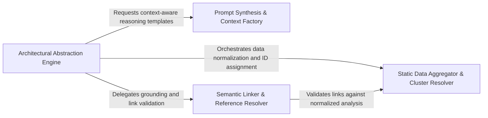

## Details

Prepares the mental model for the agents by translating complex static analysis results into LLM-readable context strings.

### Static Data Aggregator & Cluster Resolver
Ingestion gateway that transforms raw multi-language static analysis outputs into a unified internal representation, resolving file-to-method mappings.

**Related Classes/Methods**: _None_

**Source Files:**

- [`agents/agent_responses.py`](https://github.com/CodeBoarding/CodeBoarding/blob/main/.codeboardingagents/agent_responses.py)
  - `agents.agent_responses.assign_relation_ids` ([L646-L659](https://github.com/CodeBoarding/CodeBoarding/blob/main/.codeboardingagents/agent_responses.py#L646-L659)) - Function
  - `agents.agent_responses.FileClassification.llm_str` ([L789-L790](https://github.com/CodeBoarding/CodeBoarding/blob/main/.codeboardingagents/agent_responses.py#L789-L790)) - Method

### Prompt Synthesis & Context Factory
Manages the LLM's mental model by translating technical data into structured natural language instructions and system messages optimized for architectural reasoning.

**Related Classes/Methods**: _None_

**Source Files:**

- [`agents/agent_responses.py`](https://github.com/CodeBoarding/CodeBoarding/blob/main/.codeboardingagents/agent_responses.py)
  - `agents.agent_responses.ValidationInsights.llm_str` ([L738-L739](https://github.com/CodeBoarding/CodeBoarding/blob/main/.codeboardingagents/agent_responses.py#L738-L739)) - Method
  - `agents.agent_responses.FilePath.llm_str` ([L895-L896](https://github.com/CodeBoarding/CodeBoarding/blob/main/.codeboardingagents/agent_responses.py#L895-L896)) - Method
- [`agents/details_agent.py`](https://github.com/CodeBoarding/CodeBoarding/blob/main/.codeboardingagents/details_agent.py)
  - `agents.details_agent.DetailsAgent.__init__` ([L46-L84](https://github.com/CodeBoarding/CodeBoarding/blob/main/.codeboardingagents/details_agent.py#L46-L84)) - Method

### Architectural Abstraction Engine
Orchestrates the transition from raw code clusters to formal architectural components, managing analysis lifecycle and component ID assignment.

**Related Classes/Methods**:

- `agents.agent_responses.assign_component_ids`:612-643

**Source Files:**

- [`agents/agent_responses.py`](https://github.com/CodeBoarding/CodeBoarding/blob/main/.codeboardingagents/agent_responses.py)
  - `agents.agent_responses.SourceCodeReference.__str__` ([L163-L171](https://github.com/CodeBoarding/CodeBoarding/blob/main/.codeboardingagents/agent_responses.py#L163-L171)) - Method
  - `agents.agent_responses.assign_component_ids` ([L612-L643](https://github.com/CodeBoarding/CodeBoarding/blob/main/.codeboardingagents/agent_responses.py#L612-L643)) - Function
- [`agents/details_agent.py`](https://github.com/CodeBoarding/CodeBoarding/blob/main/.codeboardingagents/details_agent.py)
  - `agents.details_agent.DetailsAgent.run` ([L225-L292](https://github.com/CodeBoarding/CodeBoarding/blob/main/.codeboardingagents/details_agent.py#L225-L292)) - Method

### Semantic Linker & Reference Resolver
Performs final grounding of the architecture by validating call graph links and ensuring accuracy of source code references.

**Related Classes/Methods**: _None_

**Source Files:**

- [`agents/agent_responses.py`](https://github.com/CodeBoarding/CodeBoarding/blob/main/.codeboardingagents/agent_responses.py)
  - `agents.agent_responses.UpdateAnalysis.llm_str` ([L750-L751](https://github.com/CodeBoarding/CodeBoarding/blob/main/.codeboardingagents/agent_responses.py#L750-L751)) - Method
- [`agents/details_agent.py`](https://github.com/CodeBoarding/CodeBoarding/blob/main/.codeboardingagents/details_agent.py)
  - `agents.details_agent.DetailsAgent.step_api_surfaces` ([L178-L185](https://github.com/CodeBoarding/CodeBoarding/blob/main/.codeboardingagents/details_agent.py#L178-L185)) - Method

### [FAQ](https://github.com/CodeBoarding/GeneratedOnBoardings/tree/main?tab=readme-ov-file#faq)