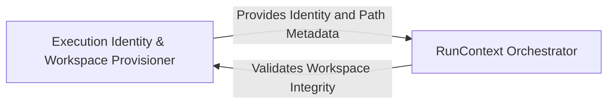

## Details

Responsible for the creation and maintenance of the RunContext, which acts as the source of truth for a single execution, handling path resolution and workspace isolation.

### Execution Identity & Workspace Provisioner
Responsible for generating unique session identifiers and provisioning the physical directory structure on the host filesystem to ensure workspace isolation.

**Related Classes/Methods**:

- `utils.generate_run_id`:113-114
- `monitoring.paths.get_monitoring_run_dir`:15-22

**Source Files:**

- [`diagram_analysis/run_context.py`](https://github.com/CodeBoarding/CodeBoarding/blob/main/.codeboardingdiagram_analysis/run_context.py)
  - `diagram_analysis.run_context.RunContext.resolve` ([L21-L36](https://github.com/CodeBoarding/CodeBoarding/blob/main/.codeboardingdiagram_analysis/run_context.py#L21-L36)) - Method
- [`monitoring/paths.py`](https://github.com/CodeBoarding/CodeBoarding/blob/main/.codeboardingmonitoring/paths.py)
  - `monitoring.paths.get_latest_run_dir` ([L30-L50](https://github.com/CodeBoarding/CodeBoarding/blob/main/.codeboardingmonitoring/paths.py#L30-L50)) - Function
- [`utils.py`](https://github.com/CodeBoarding/CodeBoarding/blob/main/.codeboardingutils.py)
  - `utils.generate_run_id` ([L113-L114](https://github.com/CodeBoarding/CodeBoarding/blob/main/.codeboardingutils.py#L113-L114)) - Function

### RunContext Orchestrator
The central state container that encapsulates environment configuration and provides a unified interface for resolving project-relative paths to absolute system paths.

**Related Classes/Methods**:

- `diagram_analysis.run_context.RunContext`:13-40

**Source Files:**

- [`monitoring/paths.py`](https://github.com/CodeBoarding/CodeBoarding/blob/main/.codeboardingmonitoring/paths.py)
  - `monitoring.paths.get_monitoring_base_dir` ([L8-L12](https://github.com/CodeBoarding/CodeBoarding/blob/main/.codeboardingmonitoring/paths.py#L8-L12)) - Function
  - `monitoring.paths.get_monitoring_run_dir` ([L15-L22](https://github.com/CodeBoarding/CodeBoarding/blob/main/.codeboardingmonitoring/paths.py#L15-L22)) - Function
  - `monitoring.paths.generate_log_path` ([L25-L27](https://github.com/CodeBoarding/CodeBoarding/blob/main/.codeboardingmonitoring/paths.py#L25-L27)) - Function
- [`utils.py`](https://github.com/CodeBoarding/CodeBoarding/blob/main/.codeboardingutils.py)
  - `utils.get_project_root` ([L55-L60](https://github.com/CodeBoarding/CodeBoarding/blob/main/.codeboardingutils.py#L55-L60)) - Function

### [FAQ](https://github.com/CodeBoarding/GeneratedOnBoardings/tree/main?tab=readme-ov-file#faq)