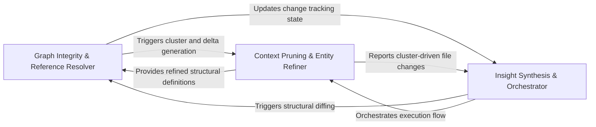

## Details

Post-processes the graph after deltas are identified to ensure the LLM context window is clean and maintains graph integrity.

### Graph Integrity & Reference Resolver
Ensures the structural validity of the graph after delta identification by correcting source code line mappings and indexing relationship endpoints.

**Related Classes/Methods**: _None_

**Source Files:**

- [`diagram_analysis/cluster_delta.py`](https://github.com/CodeBoarding/CodeBoarding/blob/main/.codeboardingdiagram_analysis/cluster_delta.py)
  - `diagram_analysis.cluster_delta.ClusterRef` ([L67-L70](https://github.com/CodeBoarding/CodeBoarding/blob/main/.codeboardingdiagram_analysis/cluster_delta.py#L67-L70)) - Class
  - `diagram_analysis.cluster_delta.ClusterMemberDelta` ([L74-L85](https://github.com/CodeBoarding/CodeBoarding/blob/main/.codeboardingdiagram_analysis/cluster_delta.py#L74-L85)) - Class
  - `diagram_analysis.cluster_delta.ClusterReshape` ([L89-L94](https://github.com/CodeBoarding/CodeBoarding/blob/main/.codeboardingdiagram_analysis/cluster_delta.py#L89-L94)) - Class
  - `diagram_analysis.cluster_delta.LanguageStructuralDiff` ([L98-L109](https://github.com/CodeBoarding/CodeBoarding/blob/main/.codeboardingdiagram_analysis/cluster_delta.py#L98-L109)) - Class
  - `diagram_analysis.cluster_delta._structural_diff_for_language` ([L324-L433](https://github.com/CodeBoarding/CodeBoarding/blob/main/.codeboardingdiagram_analysis/cluster_delta.py#L324-L433)) - Function
  - `diagram_analysis.cluster_delta._build_member_delta` ([L487-L515](https://github.com/CodeBoarding/CodeBoarding/blob/main/.codeboardingdiagram_analysis/cluster_delta.py#L487-L515)) - Function

### Context Pruning & Entity Refiner
Acts as the primary filter for the LLM context window by deduplicating entities, resolving cluster IDs, and pruning redundant data points.

**Related Classes/Methods**: _None_

**Source Files:**

- [`diagram_analysis/cluster_delta.py`](https://github.com/CodeBoarding/CodeBoarding/blob/main/.codeboardingdiagram_analysis/cluster_delta.py)
  - `diagram_analysis.cluster_delta._build_new_cluster_delta` ([L466-L484](https://github.com/CodeBoarding/CodeBoarding/blob/main/.codeboardingdiagram_analysis/cluster_delta.py#L466-L484)) - Function
  - `diagram_analysis.cluster_delta._build_reshape` ([L518-L557](https://github.com/CodeBoarding/CodeBoarding/blob/main/.codeboardingdiagram_analysis/cluster_delta.py#L518-L557)) - Function

### Insight Synthesis & Orchestrator
Manages the high-level execution flow, orchestrates API surface analysis, assigns component IDs, and serializes the graph for prompt injection.

**Related Classes/Methods**: _None_

**Source Files:**

- [`diagram_analysis/cluster_delta.py`](https://github.com/CodeBoarding/CodeBoarding/blob/main/.codeboardingdiagram_analysis/cluster_delta.py)
  - `diagram_analysis.cluster_delta._dirty_files` ([L348-L363](https://github.com/CodeBoarding/CodeBoarding/blob/main/.codeboardingdiagram_analysis/cluster_delta.py#L348-L363)) - Function

### [FAQ](https://github.com/CodeBoarding/GeneratedOnBoardings/tree/main?tab=readme-ov-file#faq)