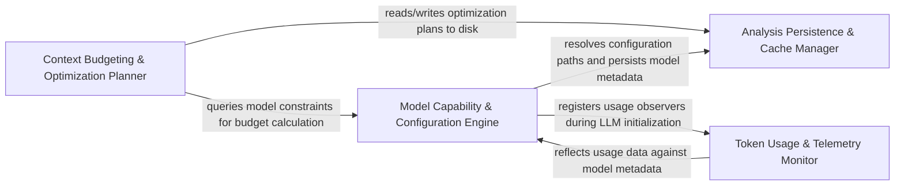

## Details

Manages physical constraints of LLM interactions by calculating cluster budgets for context windows and maintaining a caching layer for analysis results.

### Model Capability & Configuration Engine [[Expand]](./Model_Capability_Configuration_Engine.md)
Acts as the hardware-abstraction layer for the subsystem, resolving model-specific constraints by merging user-defined configurations with provider-specific metadata.

**Related Classes/Methods**:

- `agents.model_capabilities.get_context_window`:30-44
- `agents.llm_config.initialize_agent_llm`:425-428

**Source Files:**

- [`agents/llm_config.py`](https://github.com/CodeBoarding/CodeBoarding/blob/main/.codeboardingagents/llm_config.py)
  - `agents.llm_config._model_accepts_temperature` ([L39-L42](https://github.com/CodeBoarding/CodeBoarding/blob/main/.codeboardingagents/llm_config.py#L39-L42)) - Function
  - `agents.llm_config.LLMConfig` ([L84-L140](https://github.com/CodeBoarding/CodeBoarding/blob/main/.codeboardingagents/llm_config.py#L84-L140)) - Class
  - `agents.llm_config.LLMConfig.get_api_key` ([L119-L120](https://github.com/CodeBoarding/CodeBoarding/blob/main/.codeboardingagents/llm_config.py#L119-L120)) - Method
  - `agents.llm_config.LLMConfig.has_real_api_key` ([L122-L128](https://github.com/CodeBoarding/CodeBoarding/blob/main/.codeboardingagents/llm_config.py#L122-L128)) - Method
  - `agents.llm_config.LLMConfig.is_selected_by_env` ([L130-L132](https://github.com/CodeBoarding/CodeBoarding/blob/main/.codeboardingagents/llm_config.py#L130-L132)) - Method
  - `agents.llm_config.LLMConfig.get_resolved_extra_args` ([L134-L140](https://github.com/CodeBoarding/CodeBoarding/blob/main/.codeboardingagents/llm_config.py#L134-L140)) - Method
  - `agents.llm_config._all_selection_envs` ([L318-L319](https://github.com/CodeBoarding/CodeBoarding/blob/main/.codeboardingagents/llm_config.py#L318-L319)) - Function
  - `agents.llm_config._unselected_key_hints` ([L322-L329](https://github.com/CodeBoarding/CodeBoarding/blob/main/.codeboardingagents/llm_config.py#L322-L329)) - Function
  - `agents.llm_config.selected_providers` ([L332-L334](https://github.com/CodeBoarding/CodeBoarding/blob/main/.codeboardingagents/llm_config.py#L332-L334)) - Function
  - `agents.llm_config._initialize_llm` ([L337-L373](https://github.com/CodeBoarding/CodeBoarding/blob/main/.codeboardingagents/llm_config.py#L337-L373)) - Function
  - `agents.llm_config._resolve_selected_provider` ([L376-L385](https://github.com/CodeBoarding/CodeBoarding/blob/main/.codeboardingagents/llm_config.py#L376-L385)) - Function
  - `agents.llm_config.LLMConfigError` ([L388-L389](https://github.com/CodeBoarding/CodeBoarding/blob/main/.codeboardingagents/llm_config.py#L388-L389)) - Class
  - `agents.llm_config.validate_api_key_provided` ([L392-L422](https://github.com/CodeBoarding/CodeBoarding/blob/main/.codeboardingagents/llm_config.py#L392-L422)) - Function
  - `agents.llm_config.initialize_agent_llm` ([L425-L428](https://github.com/CodeBoarding/CodeBoarding/blob/main/.codeboardingagents/llm_config.py#L425-L428)) - Function
  - `agents.llm_config.current_provider_key_context` ([L457-L471](https://github.com/CodeBoarding/CodeBoarding/blob/main/.codeboardingagents/llm_config.py#L457-L471)) - Function
  - `agents.llm_config.initialize_parsing_llm` ([L474-L476](https://github.com/CodeBoarding/CodeBoarding/blob/main/.codeboardingagents/llm_config.py#L474-L476)) - Function
  - `agents.llm_config.initialize_llms` ([L479-L482](https://github.com/CodeBoarding/CodeBoarding/blob/main/.codeboardingagents/llm_config.py#L479-L482)) - Function
  - `agents.llm_config.supports_prompt_caching` ([L485-L491](https://github.com/CodeBoarding/CodeBoarding/blob/main/.codeboardingagents/llm_config.py#L485-L491)) - Function
- [`agents/model_capabilities.py`](https://github.com/CodeBoarding/CodeBoarding/blob/main/.codeboardingagents/model_capabilities.py)
  - `agents.model_capabilities.ContextWindow` ([L24-L27](https://github.com/CodeBoarding/CodeBoarding/blob/main/.codeboardingagents/model_capabilities.py#L24-L27)) - Class
  - `agents.model_capabilities.get_context_window` ([L30-L44](https://github.com/CodeBoarding/CodeBoarding/blob/main/.codeboardingagents/model_capabilities.py#L30-L44)) - Function
  - `agents.model_capabilities._resolve_env` ([L47-L61](https://github.com/CodeBoarding/CodeBoarding/blob/main/.codeboardingagents/model_capabilities.py#L47-L61)) - Function
  - `agents.model_capabilities._resolve_user_config` ([L64-L70](https://github.com/CodeBoarding/CodeBoarding/blob/main/.codeboardingagents/model_capabilities.py#L64-L70)) - Function
  - `agents.model_capabilities._user_context_window_override` ([L74-L79](https://github.com/CodeBoarding/CodeBoarding/blob/main/.codeboardingagents/model_capabilities.py#L74-L79)) - Function
  - `agents.model_capabilities._resolve_ollama` ([L82-L91](https://github.com/CodeBoarding/CodeBoarding/blob/main/.codeboardingagents/model_capabilities.py#L82-L91)) - Function
  - `agents.model_capabilities._ollama_show` ([L94-L124](https://github.com/CodeBoarding/CodeBoarding/blob/main/.codeboardingagents/model_capabilities.py#L94-L124)) - Function
  - `agents.model_capabilities._parse_num_ctx` ([L127-L130](https://github.com/CodeBoarding/CodeBoarding/blob/main/.codeboardingagents/model_capabilities.py#L127-L130)) - Function
  - `agents.model_capabilities._resolve_modelsdev` ([L133-L145](https://github.com/CodeBoarding/CodeBoarding/blob/main/.codeboardingagents/model_capabilities.py#L133-L145)) - Function
  - `agents.model_capabilities._resolve_litellm` ([L148-L159](https://github.com/CodeBoarding/CodeBoarding/blob/main/.codeboardingagents/model_capabilities.py#L148-L159)) - Function
  - `agents.model_capabilities._resolve_openrouter` ([L162-L171](https://github.com/CodeBoarding/CodeBoarding/blob/main/.codeboardingagents/model_capabilities.py#L162-L171)) - Function
  - `agents.model_capabilities._openrouter_id` ([L174-L180](https://github.com/CodeBoarding/CodeBoarding/blob/main/.codeboardingagents/model_capabilities.py#L174-L180)) - Function
  - `agents.model_capabilities._load` ([L184-L203](https://github.com/CodeBoarding/CodeBoarding/blob/main/.codeboardingagents/model_capabilities.py#L184-L203)) - Function
  - `agents.model_capabilities._read_cache` ([L206-L213](https://github.com/CodeBoarding/CodeBoarding/blob/main/.codeboardingagents/model_capabilities.py#L206-L213)) - Function
  - `agents.model_capabilities._normalize` ([L216-L221](https://github.com/CodeBoarding/CodeBoarding/blob/main/.codeboardingagents/model_capabilities.py#L216-L221)) - Function
- [`agents/prompts/prompt_factory.py`](https://github.com/CodeBoarding/CodeBoarding/blob/main/.codeboardingagents/prompts/prompt_factory.py)
  - `agents.prompts.prompt_factory.LLMType.from_model_name` ([L33-L49](https://github.com/CodeBoarding/CodeBoarding/blob/main/.codeboardingagents/prompts/prompt_factory.py#L33-L49)) - Method
- [`user_config.py`](https://github.com/CodeBoarding/CodeBoarding/blob/main/.codeboardinguser_config.py)
  - `user_config.ProviderUserConfig` ([L88-L105](https://github.com/CodeBoarding/CodeBoarding/blob/main/.codeboardinguser_config.py#L88-L105)) - Class
  - `user_config.LLMUserConfig` ([L109-L112](https://github.com/CodeBoarding/CodeBoarding/blob/main/.codeboardinguser_config.py#L109-L112)) - Class
  - `user_config.UserConfig` ([L116-L125](https://github.com/CodeBoarding/CodeBoarding/blob/main/.codeboardinguser_config.py#L116-L125)) - Class
  - `user_config.load_user_config` ([L128-L162](https://github.com/CodeBoarding/CodeBoarding/blob/main/.codeboardinguser_config.py#L128-L162)) - Function

### Context Budgeting & Optimization Planner [[Expand]](./Context_Budgeting_Optimization_Planner.md)
The core logic engine that calculates token budgets for analysis clusters and dynamically determines which parts of the static analysis must be omitted or truncated.

**Related Classes/Methods**:

- `agents.cluster_budget.ClusterPromptBudget`:10-21
- `static_analyzer.cfg_skip_planner.plan_skip_set`:139-214
- `static_analyzer.cfg_skip_planner.ContextBudgetExceededError`:27-40

**Source Files:**

- [`agents/cluster_budget.py`](https://github.com/CodeBoarding/CodeBoarding/blob/main/.codeboardingagents/cluster_budget.py)
  - `agents.cluster_budget.ClusterPromptBudget` ([L10-L21](https://github.com/CodeBoarding/CodeBoarding/blob/main/.codeboardingagents/cluster_budget.py#L10-L21)) - Class
  - `agents.cluster_budget.ClusterPromptBudget.available_chars` ([L18-L21](https://github.com/CodeBoarding/CodeBoarding/blob/main/.codeboardingagents/cluster_budget.py#L18-L21)) - Method
- [`agents/cluster_methods_mixin.py`](https://github.com/CodeBoarding/CodeBoarding/blob/main/.codeboardingagents/cluster_methods_mixin.py)
  - `agents.cluster_methods_mixin._RenderedClusterString` ([L49-L52](https://github.com/CodeBoarding/CodeBoarding/blob/main/.codeboardingagents/cluster_methods_mixin.py#L49-L52)) - Class
  - `agents.cluster_methods_mixin._describe_window` ([L79-L81](https://github.com/CodeBoarding/CodeBoarding/blob/main/.codeboardingagents/cluster_methods_mixin.py#L79-L81)) - Function
  - `agents.cluster_methods_mixin._window_telemetry` ([L84-L90](https://github.com/CodeBoarding/CodeBoarding/blob/main/.codeboardingagents/cluster_methods_mixin.py#L84-L90)) - Function
  - `agents.cluster_methods_mixin.ClusterMethodsMixin._build_cluster_string` ([L115-L153](https://github.com/CodeBoarding/CodeBoarding/blob/main/.codeboardingagents/cluster_methods_mixin.py#L115-L153)) - Method
  - `agents.cluster_methods_mixin.ClusterMethodsMixin._render_cluster_string` ([L155-L189](https://github.com/CodeBoarding/CodeBoarding/blob/main/.codeboardingagents/cluster_methods_mixin.py#L155-L189)) - Method
  - `agents.cluster_methods_mixin.ClusterMethodsMixin._plan_skip_sets` ([L191-L267](https://github.com/CodeBoarding/CodeBoarding/blob/main/.codeboardingagents/cluster_methods_mixin.py#L191-L267)) - Method
  - `agents.cluster_methods_mixin.ClusterMethodsMixin._language_budget_targets` ([L270-L279](https://github.com/CodeBoarding/CodeBoarding/blob/main/.codeboardingagents/cluster_methods_mixin.py#L270-L279)) - Method
  - `agents.cluster_methods_mixin.ClusterMethodsMixin._raise_cluster_budget_error` ([L282-L301](https://github.com/CodeBoarding/CodeBoarding/blob/main/.codeboardingagents/cluster_methods_mixin.py#L282-L301)) - Method
  - `agents.cluster_methods_mixin.ClusterMethodsMixin._cluster_prompt_budget` ([L304-L306](https://github.com/CodeBoarding/CodeBoarding/blob/main/.codeboardingagents/cluster_methods_mixin.py#L304-L306)) - Method
  - `agents.cluster_methods_mixin.ClusterMethodsMixin._ensure_unique_key_entities` ([L308-L355](https://github.com/CodeBoarding/CodeBoarding/blob/main/.codeboardingagents/cluster_methods_mixin.py#L308-L355)) - Method
  - `agents.cluster_methods_mixin.ClusterMethodsMixin._resolve_cluster_ids_from_groups` ([L357-L372](https://github.com/CodeBoarding/CodeBoarding/blob/main/.codeboardingagents/cluster_methods_mixin.py#L357-L372)) - Method
  - `agents.cluster_methods_mixin.ClusterMethodsMixin.build_static_relations` ([L859-L879](https://github.com/CodeBoarding/CodeBoarding/blob/main/.codeboardingagents/cluster_methods_mixin.py#L859-L879)) - Method
  - `agents.cluster_methods_mixin.ClusterMethodsMixin.build_scope_cfg_string` ([L888-L921](https://github.com/CodeBoarding/CodeBoarding/blob/main/.codeboardingagents/cluster_methods_mixin.py#L888-L921)) - Method
- [`agents/llm_config.py`](https://github.com/CodeBoarding/CodeBoarding/blob/main/.codeboardingagents/llm_config.py)
  - `agents.llm_config.get_current_agent_context_window` ([L431-L445](https://github.com/CodeBoarding/CodeBoarding/blob/main/.codeboardingagents/llm_config.py#L431-L445)) - Function
  - `agents.llm_config.get_current_agent_model_ref` ([L448-L454](https://github.com/CodeBoarding/CodeBoarding/blob/main/.codeboardingagents/llm_config.py#L448-L454)) - Function
- [`static_analyzer/analysis_result.py`](https://github.com/CodeBoarding/CodeBoarding/blob/main/.codeboardingstatic_analyzer/analysis_result.py)
  - `static_analyzer.analysis_result.StaticAnalysisResults.available_cfgs` ([L213-L219](https://github.com/CodeBoarding/CodeBoarding/blob/main/.codeboardingstatic_analyzer/analysis_result.py#L213-L219)) - Method
- [`static_analyzer/cfg_skip_planner.py`](https://github.com/CodeBoarding/CodeBoarding/blob/main/.codeboardingstatic_analyzer/cfg_skip_planner.py)
  - `static_analyzer.cfg_skip_planner.ContextBudgetExceededError` ([L27-L40](https://github.com/CodeBoarding/CodeBoarding/blob/main/.codeboardingstatic_analyzer/cfg_skip_planner.py#L27-L40)) - Class
  - `static_analyzer.cfg_skip_planner._compute_peel_order` ([L43-L60](https://github.com/CodeBoarding/CodeBoarding/blob/main/.codeboardingstatic_analyzer/cfg_skip_planner.py#L43-L60)) - Function
  - `static_analyzer.cfg_skip_planner._build_allowed_skip_list` ([L63-L79](https://github.com/CodeBoarding/CodeBoarding/blob/main/.codeboardingstatic_analyzer/cfg_skip_planner.py#L63-L79)) - Function
  - `static_analyzer.cfg_skip_planner._select_high_savings_fit` ([L82-L122](https://github.com/CodeBoarding/CodeBoarding/blob/main/.codeboardingstatic_analyzer/cfg_skip_planner.py#L82-L122)) - Function
  - `static_analyzer.cfg_skip_planner._minimize_skip_set` ([L125-L136](https://github.com/CodeBoarding/CodeBoarding/blob/main/.codeboardingstatic_analyzer/cfg_skip_planner.py#L125-L136)) - Function
  - `static_analyzer.cfg_skip_planner.plan_skip_set` ([L139-L214](https://github.com/CodeBoarding/CodeBoarding/blob/main/.codeboardingstatic_analyzer/cfg_skip_planner.py#L139-L214)) - Function
- [`static_analyzer/cluster_relations.py`](https://github.com/CodeBoarding/CodeBoarding/blob/main/.codeboardingstatic_analyzer/cluster_relations.py)
  - `static_analyzer.cluster_relations.build_node_to_component_map` ([L30-L41](https://github.com/CodeBoarding/CodeBoarding/blob/main/.codeboardingstatic_analyzer/cluster_relations.py#L30-L41)) - Function
- [`static_analyzer/graph.py`](https://github.com/CodeBoarding/CodeBoarding/blob/main/.codeboardingstatic_analyzer/graph.py)
  - `static_analyzer.graph.ClusterResult.get_cluster_ids` ([L60-L61](https://github.com/CodeBoarding/CodeBoarding/blob/main/.codeboardingstatic_analyzer/graph.py#L60-L61)) - Method

### Analysis Persistence & Cache Manager [[Expand]](./Analysis_Persistence_Cache_Manager.md)
Manages the lifecycle of analysis results on disk, providing specialized caching for intermediate cluster details and final analysis outputs.

**Related Classes/Methods**: _None_

**Source Files:**

- [`caching/cache.py`](https://github.com/CodeBoarding/CodeBoarding/blob/main/.codeboardingcaching/cache.py)
  - `caching.cache.BaseCache` ([L30-L268](https://github.com/CodeBoarding/CodeBoarding/blob/main/.codeboardingcaching/cache.py#L30-L268)) - Class
  - `caching.cache.BaseCache.__init__` ([L36-L63](https://github.com/CodeBoarding/CodeBoarding/blob/main/.codeboardingcaching/cache.py#L36-L63)) - Method
  - `caching.cache.BaseCache._open_sqlite` ([L65-L73](https://github.com/CodeBoarding/CodeBoarding/blob/main/.codeboardingcaching/cache.py#L65-L73)) - Method
  - `caching.cache.BaseCache._configure_sqlite_connection` ([L76-L83](https://github.com/CodeBoarding/CodeBoarding/blob/main/.codeboardingcaching/cache.py#L76-L83)) - Method
  - `caching.cache.BaseCache._open_sqlite_unlocked` ([L85-L119](https://github.com/CodeBoarding/CodeBoarding/blob/main/.codeboardingcaching/cache.py#L85-L119)) - Method
  - `caching.cache.BaseCache._reset_if_incompatible_schema` ([L121-L135](https://github.com/CodeBoarding/CodeBoarding/blob/main/.codeboardingcaching/cache.py#L121-L135)) - Method
  - `caching.cache.BaseCache.signature` ([L137-L139](https://github.com/CodeBoarding/CodeBoarding/blob/main/.codeboardingcaching/cache.py#L137-L139)) - Method
  - `caching.cache.BaseCache._lookup` ([L141-L157](https://github.com/CodeBoarding/CodeBoarding/blob/main/.codeboardingcaching/cache.py#L141-L157)) - Method
  - `caching.cache.BaseCache._upsert_conn` ([L159-L174](https://github.com/CodeBoarding/CodeBoarding/blob/main/.codeboardingcaching/cache.py#L159-L174)) - Method
  - `caching.cache.BaseCache._clear_conn` ([L176-L183](https://github.com/CodeBoarding/CodeBoarding/blob/main/.codeboardingcaching/cache.py#L176-L183)) - Method
  - `caching.cache.BaseCache.load` ([L185-L197](https://github.com/CodeBoarding/CodeBoarding/blob/main/.codeboardingcaching/cache.py#L185-L197)) - Method
  - `caching.cache.BaseCache.store` ([L199-L216](https://github.com/CodeBoarding/CodeBoarding/blob/main/.codeboardingcaching/cache.py#L199-L216)) - Method
  - `caching.cache.BaseCache.clear` ([L218-L229](https://github.com/CodeBoarding/CodeBoarding/blob/main/.codeboardingcaching/cache.py#L218-L229)) - Method
  - `caching.cache.BaseCache.close` ([L259-L268](https://github.com/CodeBoarding/CodeBoarding/blob/main/.codeboardingcaching/cache.py#L259-L268)) - Method
  - `caching.cache.ModelSettings` ([L271-L310](https://github.com/CodeBoarding/CodeBoarding/blob/main/.codeboardingcaching/cache.py#L271-L310)) - Class
- [`caching/details_cache.py`](https://github.com/CodeBoarding/CodeBoarding/blob/main/.codeboardingcaching/details_cache.py)
  - `caching.details_cache.DetailsCacheKey` ([L12-L15](https://github.com/CodeBoarding/CodeBoarding/blob/main/.codeboardingcaching/details_cache.py#L12-L15)) - Class
  - `caching.details_cache.FinalAnalysisCache.__init__` ([L24-L30](https://github.com/CodeBoarding/CodeBoarding/blob/main/.codeboardingcaching/details_cache.py#L24-L30)) - Method
  - `caching.details_cache.FinalAnalysisCache.build_key` ([L33-L34](https://github.com/CodeBoarding/CodeBoarding/blob/main/.codeboardingcaching/details_cache.py#L33-L34)) - Method
  - `caching.details_cache.ClusterCache.__init__` ([L43-L49](https://github.com/CodeBoarding/CodeBoarding/blob/main/.codeboardingcaching/details_cache.py#L43-L49)) - Method
  - `caching.details_cache.ClusterCache.build_key` ([L52-L53](https://github.com/CodeBoarding/CodeBoarding/blob/main/.codeboardingcaching/details_cache.py#L52-L53)) - Method
- [`caching/meta_cache.py`](https://github.com/CodeBoarding/CodeBoarding/blob/main/.codeboardingcaching/meta_cache.py)
  - `caching.meta_cache.MetaCache.__init__` ([L46-L55](https://github.com/CodeBoarding/CodeBoarding/blob/main/.codeboardingcaching/meta_cache.py#L46-L55)) - Method
- [`utils.py`](https://github.com/CodeBoarding/CodeBoarding/blob/main/.codeboardingutils.py)
  - `utils.get_cache_dir` ([L38-L45](https://github.com/CodeBoarding/CodeBoarding/blob/main/.codeboardingutils.py#L38-L45)) - Function

### Token Usage & Telemetry Monitor [[Expand]](./Token_Usage_Telemetry_Monitor.md)
Provides real-time feedback on actual token consumption and tool invocation to validate budget planner effectiveness and provide performance metrics.

**Related Classes/Methods**:

- `monitoring.callbacks.MonitoringCallback._extract_usage`:106-163

**Source Files:**

- [`monitoring/callbacks.py`](https://github.com/CodeBoarding/CodeBoarding/blob/main/.codeboardingmonitoring/callbacks.py)
  - `monitoring.callbacks.MonitoringCallback.__init__` ([L21-L26](https://github.com/CodeBoarding/CodeBoarding/blob/main/.codeboardingmonitoring/callbacks.py#L21-L26)) - Method
  - `monitoring.callbacks.MonitoringCallback.model_name` ([L33-L35](https://github.com/CodeBoarding/CodeBoarding/blob/main/.codeboardingmonitoring/callbacks.py#L33-L35)) - Method
  - `monitoring.callbacks.MonitoringCallback.stats` ([L38-L41](https://github.com/CodeBoarding/CodeBoarding/blob/main/.codeboardingmonitoring/callbacks.py#L38-L41)) - Method
  - `monitoring.callbacks.MonitoringCallback.on_llm_end` ([L43-L62](https://github.com/CodeBoarding/CodeBoarding/blob/main/.codeboardingmonitoring/callbacks.py#L43-L62)) - Method
  - `monitoring.callbacks.MonitoringCallback.on_tool_start` ([L64-L79](https://github.com/CodeBoarding/CodeBoarding/blob/main/.codeboardingmonitoring/callbacks.py#L64-L79)) - Method
  - `monitoring.callbacks.MonitoringCallback.on_tool_end` ([L81-L89](https://github.com/CodeBoarding/CodeBoarding/blob/main/.codeboardingmonitoring/callbacks.py#L81-L89)) - Method
  - `monitoring.callbacks.MonitoringCallback.on_tool_error` ([L91-L104](https://github.com/CodeBoarding/CodeBoarding/blob/main/.codeboardingmonitoring/callbacks.py#L91-L104)) - Method
  - `monitoring.callbacks.MonitoringCallback._extract_usage` ([L106-L163](https://github.com/CodeBoarding/CodeBoarding/blob/main/.codeboardingmonitoring/callbacks.py#L106-L163)) - Method
  - `monitoring.callbacks.MonitoringCallback._extract_usage._coerce_int` ([L107-L111](https://github.com/CodeBoarding/CodeBoarding/blob/main/.codeboardingmonitoring/callbacks.py#L107-L111)) - Function
  - `monitoring.callbacks.MonitoringCallback._extract_usage._extract_usage_from_mapping` ([L113-L131](https://github.com/CodeBoarding/CodeBoarding/blob/main/.codeboardingmonitoring/callbacks.py#L113-L131)) - Function

### [FAQ](https://github.com/CodeBoarding/GeneratedOnBoardings/tree/main?tab=readme-ov-file#faq)