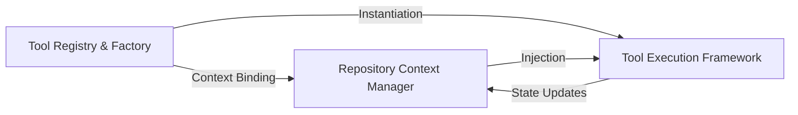

## Details

Centralizes tool instantiation and maintains the shared RepoContext state to manage repository lifecycle and tool registration.

### Repository Context Manager
Manages the 'Source of Truth' for a repository analysis session, encapsulating codebase state, analysis results, and session metadata.

**Related Classes/Methods**: _None_

**Source Files:**

- [`agents/tools/base.py`](https://github.com/CodeBoarding/CodeBoarding/blob/main/.codeboardingagents/tools/base.py)
  - `agents.tools.base.BaseRepoTool.ignore_manager` ([L73-L74](https://github.com/CodeBoarding/CodeBoarding/blob/main/.codeboardingagents/tools/base.py#L73-L74)) - Method

### Tool Registry & Factory
Acts as the central directory for all available capabilities, mapping unique tool identifiers to concrete implementations and handling instantiation.

**Related Classes/Methods**: _None_

**Source Files:**

- [`agents/tools/read_file_structure.py`](https://github.com/CodeBoarding/CodeBoarding/blob/main/.codeboardingagents/tools/read_file_structure.py)
  - `agents.tools.read_file_structure.FileStructureTool.cached_dirs` ([L34-L37](https://github.com/CodeBoarding/CodeBoarding/blob/main/.codeboardingagents/tools/read_file_structure.py#L34-L37)) - Method

### Tool Execution Framework
Defines the standard interface and lifecycle for repository-aware tools, ensuring they receive shared context and return standardized outputs.

**Related Classes/Methods**:

- `agents.tools.base.BaseRepoTool`:57-96

**Source Files:**

- [`agents/tools/base.py`](https://github.com/CodeBoarding/CodeBoarding/blob/main/.codeboardingagents/tools/base.py)
  - `agents.tools.base.BaseRepoTool.is_subsequence` ([L80-L96](https://github.com/CodeBoarding/CodeBoarding/blob/main/.codeboardingagents/tools/base.py#L80-L96)) - Method
- [`agents/tools/read_file_structure.py`](https://github.com/CodeBoarding/CodeBoarding/blob/main/.codeboardingagents/tools/read_file_structure.py)
  - `agents.tools.read_file_structure.get_tree_string` ([L104-L155](https://github.com/CodeBoarding/CodeBoarding/blob/main/.codeboardingagents/tools/read_file_structure.py#L104-L155)) - Function

### [FAQ](https://github.com/CodeBoarding/GeneratedOnBoardings/tree/main?tab=readme-ov-file#faq)