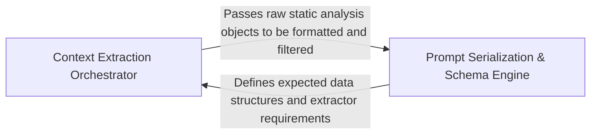

## Details

Transforms raw static analysis data and repository metadata into structured, LLM-readable prompts.

### Context Extraction Orchestrator
Acts as the primary interface for gathering repository metadata, coordinating specialized tools to extract control flow graphs, method invocations, and package relationships.

**Related Classes/Methods**:

- `agents.tools.toolkit.CodeBoardingToolkit`:19-111
- `agents.tools.read_cfg.GetCFGTool`:8-61
- `agents.tools.get_method_invocations.MethodInvocationsTool`:14-47
- `agents.tools.read_packages.PackageRelationsTool`:26-60

**Source Files:**

- [`agents/retry.py`](https://github.com/CodeBoarding/CodeBoarding/blob/main/.codeboardingagents/retry.py)
  - `agents.retry.default_backoff` ([L58-L61](https://github.com/CodeBoarding/CodeBoarding/blob/main/.codeboardingagents/retry.py#L58-L61)) - Function
  - `agents.retry.with_retries` ([L68-L118](https://github.com/CodeBoarding/CodeBoarding/blob/main/.codeboardingagents/retry.py#L68-L118)) - Function
- [`agents/tools/get_external_deps.py`](https://github.com/CodeBoarding/CodeBoarding/blob/main/.codeboardingagents/tools/get_external_deps.py)
  - `agents.tools.get_external_deps.ExternalDepsTool` ([L15-L47](https://github.com/CodeBoarding/CodeBoarding/blob/main/.codeboardingagents/tools/get_external_deps.py#L15-L47)) - Class
- [`agents/tools/get_method_invocations.py`](https://github.com/CodeBoarding/CodeBoarding/blob/main/.codeboardingagents/tools/get_method_invocations.py)
  - `agents.tools.get_method_invocations.MethodInvocationsTool` ([L14-L47](https://github.com/CodeBoarding/CodeBoarding/blob/main/.codeboardingagents/tools/get_method_invocations.py#L14-L47)) - Class
- [`agents/tools/read_cfg.py`](https://github.com/CodeBoarding/CodeBoarding/blob/main/.codeboardingagents/tools/read_cfg.py)
  - `agents.tools.read_cfg.GetCFGTool` ([L8-L61](https://github.com/CodeBoarding/CodeBoarding/blob/main/.codeboardingagents/tools/read_cfg.py#L8-L61)) - Class
- [`agents/tools/read_docs.py`](https://github.com/CodeBoarding/CodeBoarding/blob/main/.codeboardingagents/tools/read_docs.py)
  - `agents.tools.read_docs.ReadDocsTool` ([L22-L132](https://github.com/CodeBoarding/CodeBoarding/blob/main/.codeboardingagents/tools/read_docs.py#L22-L132)) - Class
- [`agents/tools/read_file.py`](https://github.com/CodeBoarding/CodeBoarding/blob/main/.codeboardingagents/tools/read_file.py)
  - `agents.tools.read_file.ReadFileTool` ([L19-L90](https://github.com/CodeBoarding/CodeBoarding/blob/main/.codeboardingagents/tools/read_file.py#L19-L90)) - Class
- [`agents/tools/read_file_structure.py`](https://github.com/CodeBoarding/CodeBoarding/blob/main/.codeboardingagents/tools/read_file_structure.py)
  - `agents.tools.read_file_structure.FileStructureTool` ([L22-L101](https://github.com/CodeBoarding/CodeBoarding/blob/main/.codeboardingagents/tools/read_file_structure.py#L22-L101)) - Class
- [`agents/tools/read_packages.py`](https://github.com/CodeBoarding/CodeBoarding/blob/main/.codeboardingagents/tools/read_packages.py)
  - `agents.tools.read_packages.PackageRelationsTool` ([L26-L60](https://github.com/CodeBoarding/CodeBoarding/blob/main/.codeboardingagents/tools/read_packages.py#L26-L60)) - Class
- [`agents/tools/read_source.py`](https://github.com/CodeBoarding/CodeBoarding/blob/main/.codeboardingagents/tools/read_source.py)
  - `agents.tools.read_source.CodeReferenceReader` ([L25-L85](https://github.com/CodeBoarding/CodeBoarding/blob/main/.codeboardingagents/tools/read_source.py#L25-L85)) - Class
- [`agents/tools/read_structure.py`](https://github.com/CodeBoarding/CodeBoarding/blob/main/.codeboardingagents/tools/read_structure.py)
  - `agents.tools.read_structure.CodeStructureTool` ([L14-L49](https://github.com/CodeBoarding/CodeBoarding/blob/main/.codeboardingagents/tools/read_structure.py#L14-L49)) - Class
- [`agents/tools/toolkit.py`](https://github.com/CodeBoarding/CodeBoarding/blob/main/.codeboardingagents/tools/toolkit.py)
  - `agents.tools.toolkit.CodeBoardingToolkit` ([L19-L111](https://github.com/CodeBoarding/CodeBoarding/blob/main/.codeboardingagents/tools/toolkit.py#L19-L111)) - Class
  - `agents.tools.toolkit.CodeBoardingToolkit.__init__` ([L25-L27](https://github.com/CodeBoarding/CodeBoarding/blob/main/.codeboardingagents/tools/toolkit.py#L25-L27)) - Method
  - `agents.tools.toolkit.CodeBoardingToolkit.read_source_reference` ([L30-L33](https://github.com/CodeBoarding/CodeBoarding/blob/main/.codeboardingagents/tools/toolkit.py#L30-L33)) - Method
  - `agents.tools.toolkit.CodeBoardingToolkit.read_packages` ([L36-L39](https://github.com/CodeBoarding/CodeBoarding/blob/main/.codeboardingagents/tools/toolkit.py#L36-L39)) - Method
  - `agents.tools.toolkit.CodeBoardingToolkit.read_structure` ([L42-L45](https://github.com/CodeBoarding/CodeBoarding/blob/main/.codeboardingagents/tools/toolkit.py#L42-L45)) - Method
  - `agents.tools.toolkit.CodeBoardingToolkit.read_file_structure` ([L48-L51](https://github.com/CodeBoarding/CodeBoarding/blob/main/.codeboardingagents/tools/toolkit.py#L48-L51)) - Method
  - `agents.tools.toolkit.CodeBoardingToolkit.read_cfg` ([L54-L57](https://github.com/CodeBoarding/CodeBoarding/blob/main/.codeboardingagents/tools/toolkit.py#L54-L57)) - Method
  - `agents.tools.toolkit.CodeBoardingToolkit.read_method_invocations` ([L60-L63](https://github.com/CodeBoarding/CodeBoarding/blob/main/.codeboardingagents/tools/toolkit.py#L60-L63)) - Method
  - `agents.tools.toolkit.CodeBoardingToolkit.read_file` ([L66-L69](https://github.com/CodeBoarding/CodeBoarding/blob/main/.codeboardingagents/tools/toolkit.py#L66-L69)) - Method
  - `agents.tools.toolkit.CodeBoardingToolkit.read_docs` ([L72-L75](https://github.com/CodeBoarding/CodeBoarding/blob/main/.codeboardingagents/tools/toolkit.py#L72-L75)) - Method
  - `agents.tools.toolkit.CodeBoardingToolkit.external_deps` ([L78-L81](https://github.com/CodeBoarding/CodeBoarding/blob/main/.codeboardingagents/tools/toolkit.py#L78-L81)) - Method
  - `agents.tools.toolkit.CodeBoardingToolkit.get_agent_tools` ([L83-L93](https://github.com/CodeBoarding/CodeBoarding/blob/main/.codeboardingagents/tools/toolkit.py#L83-L93)) - Method
  - `agents.tools.toolkit.CodeBoardingToolkit.get_all_tools` ([L95-L111](https://github.com/CodeBoarding/CodeBoarding/blob/main/.codeboardingagents/tools/toolkit.py#L95-L111)) - Method

### Prompt Serialization & Schema Engine
Responsible for transforming internal Python models into concise, LLM-readable text formats by applying filtering logic to exclude redundant metadata.

**Related Classes/Methods**:

- `agents.agent_responses.LLMBaseModel`:15-120
- `agents.agent_responses.LLMBaseModel.extractor_str`:88-95
- `agents.agent_responses.LLMBaseModel._resolve_excluded_by_title`:44-63

**Source Files:**

- [`agents/agent_responses.py`](https://github.com/CodeBoarding/CodeBoarding/blob/main/.codeboardingagents/agent_responses.py)
  - `agents.agent_responses.LLMBaseModel.llm_str` ([L19-L20](https://github.com/CodeBoarding/CodeBoarding/blob/main/.codeboardingagents/agent_responses.py#L19-L20)) - Method
  - `agents.agent_responses.LLMBaseModel._is_field_hidden` ([L23-L29](https://github.com/CodeBoarding/CodeBoarding/blob/main/.codeboardingagents/agent_responses.py#L23-L29)) - Method
  - `agents.agent_responses.LLMBaseModel._excluded_fields` ([L32-L41](https://github.com/CodeBoarding/CodeBoarding/blob/main/.codeboardingagents/agent_responses.py#L32-L41)) - Method
  - `agents.agent_responses.LLMBaseModel._resolve_excluded_by_title` ([L44-L63](https://github.com/CodeBoarding/CodeBoarding/blob/main/.codeboardingagents/agent_responses.py#L44-L63)) - Method
  - `agents.agent_responses.LLMBaseModel._resolve_excluded_by_title.walk` ([L48-L60](https://github.com/CodeBoarding/CodeBoarding/blob/main/.codeboardingagents/agent_responses.py#L48-L60)) - Function
  - `agents.agent_responses.LLMBaseModel._extractor_fields` ([L66-L85](https://github.com/CodeBoarding/CodeBoarding/blob/main/.codeboardingagents/agent_responses.py#L66-L85)) - Method
  - `agents.agent_responses.LLMBaseModel.extractor_str` ([L88-L95](https://github.com/CodeBoarding/CodeBoarding/blob/main/.codeboardingagents/agent_responses.py#L88-L95)) - Method
  - `agents.agent_responses.ExpandComponent.llm_str` ([L479-L480](https://github.com/CodeBoarding/CodeBoarding/blob/main/.codeboardingagents/agent_responses.py#L479-L480)) - Method
  - `agents.agent_responses.FileClassification.llm_str` ([L543-L544](https://github.com/CodeBoarding/CodeBoarding/blob/main/.codeboardingagents/agent_responses.py#L543-L544)) - Method
  - `agents.agent_responses.FilePath.llm_str` ([L586-L587](https://github.com/CodeBoarding/CodeBoarding/blob/main/.codeboardingagents/agent_responses.py#L586-L587)) - Method

### [FAQ](https://github.com/CodeBoarding/GeneratedOnBoardings/tree/main?tab=readme-ov-file#faq)