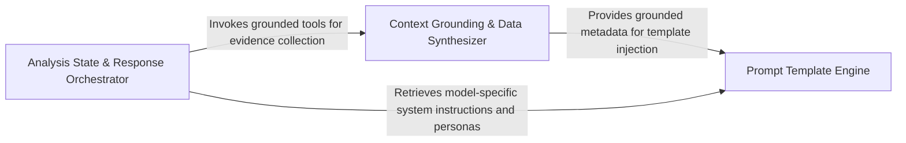

## Details

Aggregates multi-modal repository data into structured prompts, acting as a context window manager for the LLM.

### Prompt Template Engine
Acts as the system message architect, defining personas, constraints, and output schemas while providing a factory interface for injecting project metadata into standardized prompts.

**Related Classes/Methods**: _None_

**Source Files:**

- [`agents/tools/base.py`](https://github.com/CodeBoarding/CodeBoarding/blob/main/.codeboardingagents/tools/base.py)
  - `agents.tools.base.RepoContext.get_directories` ([L38-L42](https://github.com/CodeBoarding/CodeBoarding/blob/main/.codeboardingagents/tools/base.py#L38-L42)) - Method
  - `agents.tools.base.RepoContext._ensure_cache` ([L44-L47](https://github.com/CodeBoarding/CodeBoarding/blob/main/.codeboardingagents/tools/base.py#L44-L47)) - Method

### Context Grounding & Data Synthesizer
Aggregates evidence from static analysis to ground prompts, resolving source code references and packaging file-level details for the LLM context window.

**Related Classes/Methods**: _None_

**Source Files:**

- [`agents/tools/base.py`](https://github.com/CodeBoarding/CodeBoarding/blob/main/.codeboardingagents/tools/base.py)
  - `agents.tools.base.RepoContext.get_files` ([L32-L36](https://github.com/CodeBoarding/CodeBoarding/blob/main/.codeboardingagents/tools/base.py#L32-L36)) - Method
- [`agents/tools/get_external_deps.py`](https://github.com/CodeBoarding/CodeBoarding/blob/main/.codeboardingagents/tools/get_external_deps.py)
  - `agents.tools.get_external_deps.ExternalDepsInput` ([L11-L12](https://github.com/CodeBoarding/CodeBoarding/blob/main/.codeboardingagents/tools/get_external_deps.py#L11-L12)) - Class
  - `agents.tools.get_external_deps.ExternalDepsTool._run` ([L24-L47](https://github.com/CodeBoarding/CodeBoarding/blob/main/.codeboardingagents/tools/get_external_deps.py#L24-L47)) - Method

### Analysis State & Response Orchestrator
Manages the iterative analysis flow, acting as a state machine that handles transitions between analysis phases and parses structured LLM outputs into internal models.

**Related Classes/Methods**: _None_

**Source Files:**

- [`agents/tools/read_docs.py`](https://github.com/CodeBoarding/CodeBoarding/blob/main/.codeboardingagents/tools/read_docs.py)
  - `agents.tools.read_docs.ReadDocsFile` ([L10-L19](https://github.com/CodeBoarding/CodeBoarding/blob/main/.codeboardingagents/tools/read_docs.py#L10-L19)) - Class
  - `agents.tools.read_docs.ReadDocsTool.cached_files` ([L36-L49](https://github.com/CodeBoarding/CodeBoarding/blob/main/.codeboardingagents/tools/read_docs.py#L36-L49)) - Method
  - `agents.tools.read_docs.ReadDocsTool._run` ([L51-L132](https://github.com/CodeBoarding/CodeBoarding/blob/main/.codeboardingagents/tools/read_docs.py#L51-L132)) - Method
- [`agents/tools/read_file.py`](https://github.com/CodeBoarding/CodeBoarding/blob/main/.codeboardingagents/tools/read_file.py)
  - `agents.tools.read_file.ReadFileInput` ([L10-L16](https://github.com/CodeBoarding/CodeBoarding/blob/main/.codeboardingagents/tools/read_file.py#L10-L16)) - Class
  - `agents.tools.read_file.ReadFileTool._run` ([L35-L90](https://github.com/CodeBoarding/CodeBoarding/blob/main/.codeboardingagents/tools/read_file.py#L35-L90)) - Method

### [FAQ](https://github.com/CodeBoarding/GeneratedOnBoardings/tree/main?tab=readme-ov-file#faq)