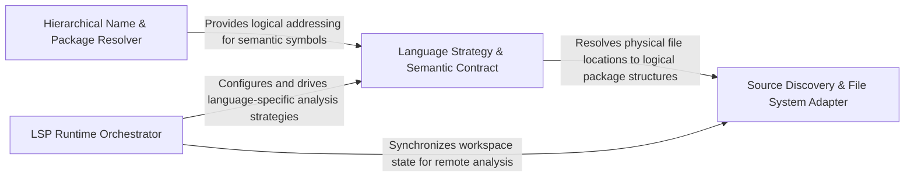

## Details

Defines the contract and shared logic for all language-specific implementations, providing foundational mechanisms for file system traversal and hierarchical package-based qualified name generation.

### Language Strategy & Semantic Contract
Defines the abstract interface and semantic rules for language-specific adapters, including symbol classification and edge-tracking strategies.

**Related Classes/Methods**: _None_

**Source Files:**

- [`static_analyzer/engine/adapters/csharp_adapter.py`](https://github.com/CodeBoarding/CodeBoarding/blob/main/.codeboardingstatic_analyzer/engine/adapters/csharp_adapter.py)
  - `static_analyzer.engine.adapters.csharp_adapter.CSharpAdapter.extract_package` ([L141-L146](https://github.com/CodeBoarding/CodeBoarding/blob/main/.codeboardingstatic_analyzer/engine/adapters/csharp_adapter.py#L141-L146)) - Method
  - `static_analyzer.engine.adapters.csharp_adapter.CSharpAdapter.get_all_packages` ([L270-L272](https://github.com/CodeBoarding/CodeBoarding/blob/main/.codeboardingstatic_analyzer/engine/adapters/csharp_adapter.py#L270-L272)) - Method
- [`static_analyzer/engine/adapters/php_adapter.py`](https://github.com/CodeBoarding/CodeBoarding/blob/main/.codeboardingstatic_analyzer/engine/adapters/php_adapter.py)
  - `static_analyzer.engine.adapters.php_adapter.PHPAdapter` ([L24-L82](https://github.com/CodeBoarding/CodeBoarding/blob/main/.codeboardingstatic_analyzer/engine/adapters/php_adapter.py#L24-L82)) - Class
  - `static_analyzer.engine.adapters.php_adapter.PHPAdapter.extract_package` ([L62-L63](https://github.com/CodeBoarding/CodeBoarding/blob/main/.codeboardingstatic_analyzer/engine/adapters/php_adapter.py#L62-L63)) - Method
- [`static_analyzer/engine/language_adapter.py`](https://github.com/CodeBoarding/CodeBoarding/blob/main/.codeboardingstatic_analyzer/engine/language_adapter.py)
  - `static_analyzer.engine.language_adapter.LanguageAdapter.build_qualified_name` ([L86-L106](https://github.com/CodeBoarding/CodeBoarding/blob/main/.codeboardingstatic_analyzer/engine/language_adapter.py#L86-L106)) - Method
  - `static_analyzer.engine.language_adapter.LanguageAdapter.build_edge_name` ([L330-L340](https://github.com/CodeBoarding/CodeBoarding/blob/main/.codeboardingstatic_analyzer/engine/language_adapter.py#L330-L340)) - Method
  - `static_analyzer.engine.language_adapter.LanguageAdapter._get_hierarchical_packages` ([L374-L382](https://github.com/CodeBoarding/CodeBoarding/blob/main/.codeboardingstatic_analyzer/engine/language_adapter.py#L374-L382)) - Method

### Hierarchical Name & Package Resolver
Transforms physical file paths and symbol metadata into logical Qualified Names (QNames) through package extraction and hierarchical mapping.

**Related Classes/Methods**: _None_

**Source Files:**

- [`static_analyzer/engine/adapters/php_adapter.py`](https://github.com/CodeBoarding/CodeBoarding/blob/main/.codeboardingstatic_analyzer/engine/adapters/php_adapter.py)
  - `static_analyzer.engine.adapters.php_adapter.PHPAdapter.language` ([L47-L48](https://github.com/CodeBoarding/CodeBoarding/blob/main/.codeboardingstatic_analyzer/engine/adapters/php_adapter.py#L47-L48)) - Method
  - `static_analyzer.engine.adapters.php_adapter.PHPAdapter.language_enum` ([L51-L52](https://github.com/CodeBoarding/CodeBoarding/blob/main/.codeboardingstatic_analyzer/engine/adapters/php_adapter.py#L51-L52)) - Method
  - `static_analyzer.engine.adapters.php_adapter.PHPAdapter.language_id` ([L59-L60](https://github.com/CodeBoarding/CodeBoarding/blob/main/.codeboardingstatic_analyzer/engine/adapters/php_adapter.py#L59-L60)) - Method
  - `static_analyzer.engine.adapters.php_adapter.PHPAdapter.get_lsp_init_options` ([L65-L66](https://github.com/CodeBoarding/CodeBoarding/blob/main/.codeboardingstatic_analyzer/engine/adapters/php_adapter.py#L65-L66)) - Method
  - `static_analyzer.engine.adapters.php_adapter.PHPAdapter.get_workspace_settings` ([L68-L76](https://github.com/CodeBoarding/CodeBoarding/blob/main/.codeboardingstatic_analyzer/engine/adapters/php_adapter.py#L68-L76)) - Method
  - `static_analyzer.engine.adapters.php_adapter.PHPAdapter.get_all_packages` ([L81-L82](https://github.com/CodeBoarding/CodeBoarding/blob/main/.codeboardingstatic_analyzer/engine/adapters/php_adapter.py#L81-L82)) - Method

### LSP Runtime Orchestrator
Manages the operational lifecycle of Language Server processes, including binary resolution, environment configuration, and workspace synchronization.

**Related Classes/Methods**: _None_

**Source Files:**

- [`static_analyzer/engine/adapters/php_adapter.py`](https://github.com/CodeBoarding/CodeBoarding/blob/main/.codeboardingstatic_analyzer/engine/adapters/php_adapter.py)
  - `static_analyzer.engine.adapters.php_adapter.PHPAdapter.lsp_command` ([L55-L56](https://github.com/CodeBoarding/CodeBoarding/blob/main/.codeboardingstatic_analyzer/engine/adapters/php_adapter.py#L55-L56)) - Method
- [`static_analyzer/engine/adapters/typescript_adapter.py`](https://github.com/CodeBoarding/CodeBoarding/blob/main/.codeboardingstatic_analyzer/engine/adapters/typescript_adapter.py)
  - `static_analyzer.engine.adapters.typescript_adapter.TypeScriptAdapter.language` ([L14-L15](https://github.com/CodeBoarding/CodeBoarding/blob/main/.codeboardingstatic_analyzer/engine/adapters/typescript_adapter.py#L14-L15)) - Method
  - `static_analyzer.engine.adapters.typescript_adapter.TypeScriptAdapter.language_enum` ([L18-L19](https://github.com/CodeBoarding/CodeBoarding/blob/main/.codeboardingstatic_analyzer/engine/adapters/typescript_adapter.py#L18-L19)) - Method
  - `static_analyzer.engine.adapters.typescript_adapter.TypeScriptAdapter.language_id` ([L26-L27](https://github.com/CodeBoarding/CodeBoarding/blob/main/.codeboardingstatic_analyzer/engine/adapters/typescript_adapter.py#L26-L27)) - Method
  - `static_analyzer.engine.adapters.typescript_adapter.TypeScriptAdapter.extract_package` ([L29-L30](https://github.com/CodeBoarding/CodeBoarding/blob/main/.codeboardingstatic_analyzer/engine/adapters/typescript_adapter.py#L29-L30)) - Method
  - `static_analyzer.engine.adapters.typescript_adapter.TypeScriptAdapter.get_all_packages` ([L32-L33](https://github.com/CodeBoarding/CodeBoarding/blob/main/.codeboardingstatic_analyzer/engine/adapters/typescript_adapter.py#L32-L33)) - Method

### Source Discovery & File System Adapter
Handles project directory traversal and filtering based on repository-level ignore rules to identify valid source files for analysis.

**Related Classes/Methods**: _None_

**Source Files:**

- [`static_analyzer/engine/adapters/typescript_adapter.py`](https://github.com/CodeBoarding/CodeBoarding/blob/main/.codeboardingstatic_analyzer/engine/adapters/typescript_adapter.py)
  - `static_analyzer.engine.adapters.typescript_adapter.TypeScriptAdapter.lsp_command` ([L22-L23](https://github.com/CodeBoarding/CodeBoarding/blob/main/.codeboardingstatic_analyzer/engine/adapters/typescript_adapter.py#L22-L23)) - Method
- [`static_analyzer/engine/language_adapter.py`](https://github.com/CodeBoarding/CodeBoarding/blob/main/.codeboardingstatic_analyzer/engine/language_adapter.py)
  - `static_analyzer.engine.language_adapter.LanguageAdapter._extract_deep_package` ([L360-L372](https://github.com/CodeBoarding/CodeBoarding/blob/main/.codeboardingstatic_analyzer/engine/language_adapter.py#L360-L372)) - Method

### [FAQ](https://github.com/CodeBoarding/GeneratedOnBoardings/tree/main?tab=readme-ov-file#faq)