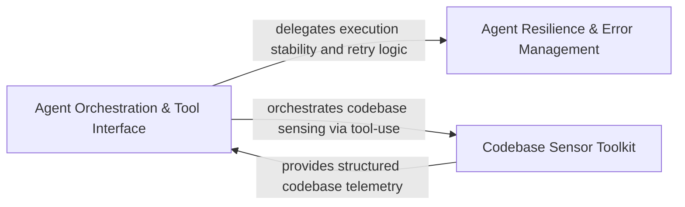

## Details

Provides the base execution environment for agents, including the primary loop, error handling, and filesystem/git interaction tools.

### Agent Resilience & Error Management
Manages the stability and fault tolerance of agent operations, providing specialized exception handling and retry strategies for LLM interactions.

**Related Classes/Methods**:

- `agents.retry.with_retries`:68-118
- `agents.llm_errors.LLMAuthError`:55-70
- `agents.agent.RepairValidationResult`:39-40
- `agents.retry.RetryDecision`:48-55

**Source Files:**

- [`agents/agent.py`](https://github.com/CodeBoarding/CodeBoarding/blob/main/.codeboardingagents/agent.py)
  - `agents.agent.RepairValidationResult` ([L39-L40](https://github.com/CodeBoarding/CodeBoarding/blob/main/.codeboardingagents/agent.py#L39-L40)) - Class
  - `agents.agent.RepairValidationResult.llm_str` ([L40-L40](https://github.com/CodeBoarding/CodeBoarding/blob/main/.codeboardingagents/agent.py#L40-L40)) - Method
  - `agents.agent.EmptyExtractorMessageError` ([L43-L44](https://github.com/CodeBoarding/CodeBoarding/blob/main/.codeboardingagents/agent.py#L43-L44)) - Class
  - `agents.agent._raise_if_auth_error` ([L47-L59](https://github.com/CodeBoarding/CodeBoarding/blob/main/.codeboardingagents/agent.py#L47-L59)) - Function
  - `agents.agent.CodeBoardingAgent` ([L62-L492](https://github.com/CodeBoarding/CodeBoarding/blob/main/.codeboardingagents/agent.py#L62-L492)) - Class
  - `agents.agent.CodeBoardingAgent._invoke` ([L128-L194](https://github.com/CodeBoarding/CodeBoarding/blob/main/.codeboardingagents/agent.py#L128-L194)) - Method
  - `agents.agent.CodeBoardingAgent._invoke.call_once` ([L143-L163](https://github.com/CodeBoarding/CodeBoarding/blob/main/.codeboardingagents/agent.py#L143-L163)) - Function
  - `agents.agent.CodeBoardingAgent._invoke.classify` ([L165-L179](https://github.com/CodeBoarding/CodeBoarding/blob/main/.codeboardingagents/agent.py#L165-L179)) - Function
  - `agents.agent.CodeBoardingAgent._invoke.on_exhausted` ([L181-L186](https://github.com/CodeBoarding/CodeBoarding/blob/main/.codeboardingagents/agent.py#L181-L186)) - Function
  - `agents.agent.CodeBoardingAgent._invoke_with_timeout` ([L196-L234](https://github.com/CodeBoarding/CodeBoarding/blob/main/.codeboardingagents/agent.py#L196-L234)) - Method
  - `agents.agent.CodeBoardingAgent._invoke_with_timeout.invoke_target` ([L204-L212](https://github.com/CodeBoarding/CodeBoarding/blob/main/.codeboardingagents/agent.py#L204-L212)) - Function
  - `agents.agent.CodeBoardingAgent._parse_invoke` ([L236-L244](https://github.com/CodeBoarding/CodeBoarding/blob/main/.codeboardingagents/agent.py#L236-L244)) - Method
  - `agents.agent.CodeBoardingAgent._repair_result` ([L246-L255](https://github.com/CodeBoarding/CodeBoarding/blob/main/.codeboardingagents/agent.py#L246-L255)) - Method
  - `agents.agent.CodeBoardingAgent._score_result` ([L257-L287](https://github.com/CodeBoarding/CodeBoarding/blob/main/.codeboardingagents/agent.py#L257-L287)) - Method
  - `agents.agent.CodeBoardingAgent._invoke_repair_validate` ([L289-L313](https://github.com/CodeBoarding/CodeBoarding/blob/main/.codeboardingagents/agent.py#L289-L313)) - Method
  - `agents.agent.CodeBoardingAgent._invoke_repair_validate.repair_candidate` ([L302-L303](https://github.com/CodeBoarding/CodeBoarding/blob/main/.codeboardingagents/agent.py#L302-L303)) - Function
  - `agents.agent.CodeBoardingAgent._invoke_validate` ([L315-L394](https://github.com/CodeBoarding/CodeBoarding/blob/main/.codeboardingagents/agent.py#L315-L394)) - Method
  - `agents.agent.CodeBoardingAgent._parse_response` ([L396-L444](https://github.com/CodeBoarding/CodeBoarding/blob/main/.codeboardingagents/agent.py#L396-L444)) - Method
  - `agents.agent.CodeBoardingAgent._parse_response.call_once` ([L411-L418](https://github.com/CodeBoarding/CodeBoarding/blob/main/.codeboardingagents/agent.py#L411-L418)) - Function
  - `agents.agent.CodeBoardingAgent._parse_response.classify` ([L420-L429](https://github.com/CodeBoarding/CodeBoarding/blob/main/.codeboardingagents/agent.py#L420-L429)) - Function
  - `agents.agent.CodeBoardingAgent._parse_response.on_exhausted` ([L431-L436](https://github.com/CodeBoarding/CodeBoarding/blob/main/.codeboardingagents/agent.py#L431-L436)) - Function
  - `agents.agent.CodeBoardingAgent._structured_parse` ([L446-L471](https://github.com/CodeBoarding/CodeBoarding/blob/main/.codeboardingagents/agent.py#L446-L471)) - Method
  - `agents.agent.CodeBoardingAgent._extractor_parse` ([L473-L492](https://github.com/CodeBoarding/CodeBoarding/blob/main/.codeboardingagents/agent.py#L473-L492)) - Method
- [`agents/llm_errors.py`](https://github.com/CodeBoarding/CodeBoarding/blob/main/.codeboardingagents/llm_errors.py)
  - `agents.llm_errors.LLMAuthError` ([L55-L70](https://github.com/CodeBoarding/CodeBoarding/blob/main/.codeboardingagents/llm_errors.py#L55-L70)) - Class
  - `agents.llm_errors.LLMAuthError.__init__` ([L66-L70](https://github.com/CodeBoarding/CodeBoarding/blob/main/.codeboardingagents/llm_errors.py#L66-L70)) - Method
  - `agents.llm_errors._status_code` ([L73-L82](https://github.com/CodeBoarding/CodeBoarding/blob/main/.codeboardingagents/llm_errors.py#L73-L82)) - Function
  - `agents.llm_errors._is_auth_failure` ([L85-L92](https://github.com/CodeBoarding/CodeBoarding/blob/main/.codeboardingagents/llm_errors.py#L85-L92)) - Function
  - `agents.llm_errors.detect_auth_error` ([L95-L125](https://github.com/CodeBoarding/CodeBoarding/blob/main/.codeboardingagents/llm_errors.py#L95-L125)) - Function
- [`agents/retry.py`](https://github.com/CodeBoarding/CodeBoarding/blob/main/.codeboardingagents/retry.py)
  - `agents.retry.RetryAction` ([L41-L44](https://github.com/CodeBoarding/CodeBoarding/blob/main/.codeboardingagents/retry.py#L41-L44)) - Class
  - `agents.retry.RetryDecision` ([L48-L55](https://github.com/CodeBoarding/CodeBoarding/blob/main/.codeboardingagents/retry.py#L48-L55)) - Class
  - `agents.retry.default_backoff` ([L58-L61](https://github.com/CodeBoarding/CodeBoarding/blob/main/.codeboardingagents/retry.py#L58-L61)) - Function
  - `agents.retry._default_classify` ([L64-L65](https://github.com/CodeBoarding/CodeBoarding/blob/main/.codeboardingagents/retry.py#L64-L65)) - Function
  - `agents.retry.with_retries` ([L68-L118](https://github.com/CodeBoarding/CodeBoarding/blob/main/.codeboardingagents/retry.py#L68-L118)) - Function
- [`agents/validation.py`](https://github.com/CodeBoarding/CodeBoarding/blob/main/.codeboardingagents/validation.py)
  - `agents.validation._effective_validation_score` ([L73-L77](https://github.com/CodeBoarding/CodeBoarding/blob/main/.codeboardingagents/validation.py#L73-L77)) - Function
  - `agents.validation.score_validation_results` ([L80-L99](https://github.com/CodeBoarding/CodeBoarding/blob/main/.codeboardingagents/validation.py#L80-L99)) - Function

### Agent Orchestration & Tool Interface
Defines primary agentic controllers and maps high-level goals to specific tool invocations, managing agent initialization and context.

**Related Classes/Methods**:

- `agents.agent.CodeBoardingAgent.read_structure_tool`:97-98
- `agents.agent.CodeBoardingAgent.component_bridge_edges_tool`:113-114

**Source Files:**

- [`agents/agent.py`](https://github.com/CodeBoarding/CodeBoarding/blob/main/.codeboardingagents/agent.py)
  - `agents.agent.CodeBoardingAgent.__init__` ([L63-L86](https://github.com/CodeBoarding/CodeBoarding/blob/main/.codeboardingagents/agent.py#L63-L86)) - Method
  - `agents.agent.CodeBoardingAgent.read_source_reference` ([L89-L90](https://github.com/CodeBoarding/CodeBoarding/blob/main/.codeboardingagents/agent.py#L89-L90)) - Method
  - `agents.agent.CodeBoardingAgent.read_packages_tool` ([L93-L94](https://github.com/CodeBoarding/CodeBoarding/blob/main/.codeboardingagents/agent.py#L93-L94)) - Method
  - `agents.agent.CodeBoardingAgent.read_structure_tool` ([L97-L98](https://github.com/CodeBoarding/CodeBoarding/blob/main/.codeboardingagents/agent.py#L97-L98)) - Method
  - `agents.agent.CodeBoardingAgent.read_file_structure` ([L101-L102](https://github.com/CodeBoarding/CodeBoarding/blob/main/.codeboardingagents/agent.py#L101-L102)) - Method
  - `agents.agent.CodeBoardingAgent.read_cfg_tool` ([L105-L106](https://github.com/CodeBoarding/CodeBoarding/blob/main/.codeboardingagents/agent.py#L105-L106)) - Method
  - `agents.agent.CodeBoardingAgent.read_method_invocations_tool` ([L109-L110](https://github.com/CodeBoarding/CodeBoarding/blob/main/.codeboardingagents/agent.py#L109-L110)) - Method
  - `agents.agent.CodeBoardingAgent.component_bridge_edges_tool` ([L113-L114](https://github.com/CodeBoarding/CodeBoarding/blob/main/.codeboardingagents/agent.py#L113-L114)) - Method
  - `agents.agent.CodeBoardingAgent.read_file_tool` ([L117-L118](https://github.com/CodeBoarding/CodeBoarding/blob/main/.codeboardingagents/agent.py#L117-L118)) - Method
  - `agents.agent.CodeBoardingAgent.read_docs` ([L121-L122](https://github.com/CodeBoarding/CodeBoarding/blob/main/.codeboardingagents/agent.py#L121-L122)) - Method
  - `agents.agent.CodeBoardingAgent.external_deps_tool` ([L125-L126](https://github.com/CodeBoarding/CodeBoarding/blob/main/.codeboardingagents/agent.py#L125-L126)) - Method
- [`agents/meta_agent.py`](https://github.com/CodeBoarding/CodeBoarding/blob/main/.codeboardingagents/meta_agent.py)
  - `agents.meta_agent.MetaAgent.__init__` ([L20-L48](https://github.com/CodeBoarding/CodeBoarding/blob/main/.codeboardingagents/meta_agent.py#L20-L48)) - Method
- [`agents/tools/get_method_invocations.py`](https://github.com/CodeBoarding/CodeBoarding/blob/main/.codeboardingagents/tools/get_method_invocations.py)
  - `agents.tools.get_method_invocations.MethodInvocationsInput` ([L10-L11](https://github.com/CodeBoarding/CodeBoarding/blob/main/.codeboardingagents/tools/get_method_invocations.py#L10-L11)) - Class
  - `agents.tools.get_method_invocations.MethodInvocationsTool` ([L14-L47](https://github.com/CodeBoarding/CodeBoarding/blob/main/.codeboardingagents/tools/get_method_invocations.py#L14-L47)) - Class
- [`agents/tools/read_cfg.py`](https://github.com/CodeBoarding/CodeBoarding/blob/main/.codeboardingagents/tools/read_cfg.py)
  - `agents.tools.read_cfg.GetCFGTool` ([L8-L61](https://github.com/CodeBoarding/CodeBoarding/blob/main/.codeboardingagents/tools/read_cfg.py#L8-L61)) - Class
- [`agents/tools/toolkit.py`](https://github.com/CodeBoarding/CodeBoarding/blob/main/.codeboardingagents/tools/toolkit.py)
  - `agents.tools.toolkit.CodeBoardingToolkit` ([L21-L128](https://github.com/CodeBoarding/CodeBoarding/blob/main/.codeboardingagents/tools/toolkit.py#L21-L128)) - Class
  - `agents.tools.toolkit.CodeBoardingToolkit.__init__` ([L27-L29](https://github.com/CodeBoarding/CodeBoarding/blob/main/.codeboardingagents/tools/toolkit.py#L27-L29)) - Method
  - `agents.tools.toolkit.CodeBoardingToolkit.read_source_reference` ([L32-L35](https://github.com/CodeBoarding/CodeBoarding/blob/main/.codeboardingagents/tools/toolkit.py#L32-L35)) - Method
  - `agents.tools.toolkit.CodeBoardingToolkit.read_packages` ([L38-L41](https://github.com/CodeBoarding/CodeBoarding/blob/main/.codeboardingagents/tools/toolkit.py#L38-L41)) - Method
  - `agents.tools.toolkit.CodeBoardingToolkit.read_structure` ([L44-L47](https://github.com/CodeBoarding/CodeBoarding/blob/main/.codeboardingagents/tools/toolkit.py#L44-L47)) - Method
  - `agents.tools.toolkit.CodeBoardingToolkit.read_file_structure` ([L50-L53](https://github.com/CodeBoarding/CodeBoarding/blob/main/.codeboardingagents/tools/toolkit.py#L50-L53)) - Method
  - `agents.tools.toolkit.CodeBoardingToolkit.read_cfg` ([L56-L59](https://github.com/CodeBoarding/CodeBoarding/blob/main/.codeboardingagents/tools/toolkit.py#L56-L59)) - Method
  - `agents.tools.toolkit.CodeBoardingToolkit.read_method_invocations` ([L62-L65](https://github.com/CodeBoarding/CodeBoarding/blob/main/.codeboardingagents/tools/toolkit.py#L62-L65)) - Method
  - `agents.tools.toolkit.CodeBoardingToolkit.component_bridge_edges` ([L68-L71](https://github.com/CodeBoarding/CodeBoarding/blob/main/.codeboardingagents/tools/toolkit.py#L68-L71)) - Method
  - `agents.tools.toolkit.CodeBoardingToolkit.read_file` ([L74-L77](https://github.com/CodeBoarding/CodeBoarding/blob/main/.codeboardingagents/tools/toolkit.py#L74-L77)) - Method
  - `agents.tools.toolkit.CodeBoardingToolkit.read_docs` ([L80-L83](https://github.com/CodeBoarding/CodeBoarding/blob/main/.codeboardingagents/tools/toolkit.py#L80-L83)) - Method
  - `agents.tools.toolkit.CodeBoardingToolkit.external_deps` ([L86-L89](https://github.com/CodeBoarding/CodeBoarding/blob/main/.codeboardingagents/tools/toolkit.py#L86-L89)) - Method
  - `agents.tools.toolkit.CodeBoardingToolkit.list_git_changes` ([L92-L95](https://github.com/CodeBoarding/CodeBoarding/blob/main/.codeboardingagents/tools/toolkit.py#L92-L95)) - Method
  - `agents.tools.toolkit.CodeBoardingToolkit.get_agent_tools` ([L97-L108](https://github.com/CodeBoarding/CodeBoarding/blob/main/.codeboardingagents/tools/toolkit.py#L97-L108)) - Method
  - `agents.tools.toolkit.CodeBoardingToolkit.get_all_tools` ([L110-L128](https://github.com/CodeBoarding/CodeBoarding/blob/main/.codeboardingagents/tools/toolkit.py#L110-L128)) - Method

### Codebase Sensor Toolkit
Implements concrete sensors for static analysis, including file structure reading, dependency extraction, and CFG analysis.

**Related Classes/Methods**:

- `agents.tools.base.BaseRepoTool`:64-103
- `agents.tools.read_file_structure.FileStructureTool`:22-101
- `agents.tools.read_packages.PackageRelationsTool`:26-60
- `agents.tools.read_source.CodeReferenceReader`:25-85
- `agents.tools.get_external_deps.ExternalDepsTool`:15-47

**Source Files:**

- [`agents/tools/base.py`](https://github.com/CodeBoarding/CodeBoarding/blob/main/.codeboardingagents/tools/base.py)
  - `agents.tools.base.RepoContext` ([L13-L61](https://github.com/CodeBoarding/CodeBoarding/blob/main/.codeboardingagents/tools/base.py#L13-L61)) - Class
  - `agents.tools.base.RepoContext.Config` ([L29-L30](https://github.com/CodeBoarding/CodeBoarding/blob/main/.codeboardingagents/tools/base.py#L29-L30)) - Class
  - `agents.tools.base.RepoContext.get_files` ([L32-L36](https://github.com/CodeBoarding/CodeBoarding/blob/main/.codeboardingagents/tools/base.py#L32-L36)) - Method
  - `agents.tools.base.RepoContext.get_directories` ([L38-L42](https://github.com/CodeBoarding/CodeBoarding/blob/main/.codeboardingagents/tools/base.py#L38-L42)) - Method
  - `agents.tools.base.RepoContext._ensure_cache` ([L44-L47](https://github.com/CodeBoarding/CodeBoarding/blob/main/.codeboardingagents/tools/base.py#L44-L47)) - Method
  - `agents.tools.base.RepoContext._perform_walk` ([L49-L61](https://github.com/CodeBoarding/CodeBoarding/blob/main/.codeboardingagents/tools/base.py#L49-L61)) - Method
  - `agents.tools.base.BaseRepoTool` ([L64-L103](https://github.com/CodeBoarding/CodeBoarding/blob/main/.codeboardingagents/tools/base.py#L64-L103)) - Class
  - `agents.tools.base.BaseRepoTool.Config` ([L72-L73](https://github.com/CodeBoarding/CodeBoarding/blob/main/.codeboardingagents/tools/base.py#L72-L73)) - Class
  - `agents.tools.base.BaseRepoTool.repo_dir` ([L76-L77](https://github.com/CodeBoarding/CodeBoarding/blob/main/.codeboardingagents/tools/base.py#L76-L77)) - Method
  - `agents.tools.base.BaseRepoTool.ignore_manager` ([L80-L81](https://github.com/CodeBoarding/CodeBoarding/blob/main/.codeboardingagents/tools/base.py#L80-L81)) - Method
  - `agents.tools.base.BaseRepoTool.is_subsequence` ([L87-L103](https://github.com/CodeBoarding/CodeBoarding/blob/main/.codeboardingagents/tools/base.py#L87-L103)) - Method
- [`agents/tools/get_external_deps.py`](https://github.com/CodeBoarding/CodeBoarding/blob/main/.codeboardingagents/tools/get_external_deps.py)
  - `agents.tools.get_external_deps.ExternalDepsInput` ([L11-L12](https://github.com/CodeBoarding/CodeBoarding/blob/main/.codeboardingagents/tools/get_external_deps.py#L11-L12)) - Class
  - `agents.tools.get_external_deps.ExternalDepsTool` ([L15-L47](https://github.com/CodeBoarding/CodeBoarding/blob/main/.codeboardingagents/tools/get_external_deps.py#L15-L47)) - Class
  - `agents.tools.get_external_deps.ExternalDepsTool._run` ([L24-L47](https://github.com/CodeBoarding/CodeBoarding/blob/main/.codeboardingagents/tools/get_external_deps.py#L24-L47)) - Method
- [`agents/tools/list_git_changes.py`](https://github.com/CodeBoarding/CodeBoarding/blob/main/.codeboardingagents/tools/list_git_changes.py)
  - `agents.tools.list_git_changes.ListGitChangesTool` ([L10-L27](https://github.com/CodeBoarding/CodeBoarding/blob/main/.codeboardingagents/tools/list_git_changes.py#L10-L27)) - Class
  - `agents.tools.list_git_changes.ListGitChangesTool._run` ([L16-L27](https://github.com/CodeBoarding/CodeBoarding/blob/main/.codeboardingagents/tools/list_git_changes.py#L16-L27)) - Method
- [`agents/tools/read_docs.py`](https://github.com/CodeBoarding/CodeBoarding/blob/main/.codeboardingagents/tools/read_docs.py)
  - `agents.tools.read_docs.ReadDocsFile` ([L10-L19](https://github.com/CodeBoarding/CodeBoarding/blob/main/.codeboardingagents/tools/read_docs.py#L10-L19)) - Class
  - `agents.tools.read_docs.ReadDocsTool` ([L22-L132](https://github.com/CodeBoarding/CodeBoarding/blob/main/.codeboardingagents/tools/read_docs.py#L22-L132)) - Class
  - `agents.tools.read_docs.ReadDocsTool.cached_files` ([L36-L49](https://github.com/CodeBoarding/CodeBoarding/blob/main/.codeboardingagents/tools/read_docs.py#L36-L49)) - Method
  - `agents.tools.read_docs.ReadDocsTool._run` ([L51-L132](https://github.com/CodeBoarding/CodeBoarding/blob/main/.codeboardingagents/tools/read_docs.py#L51-L132)) - Method
- [`agents/tools/read_file.py`](https://github.com/CodeBoarding/CodeBoarding/blob/main/.codeboardingagents/tools/read_file.py)
  - `agents.tools.read_file.ReadFileInput` ([L10-L16](https://github.com/CodeBoarding/CodeBoarding/blob/main/.codeboardingagents/tools/read_file.py#L10-L16)) - Class
  - `agents.tools.read_file.ReadFileTool` ([L19-L90](https://github.com/CodeBoarding/CodeBoarding/blob/main/.codeboardingagents/tools/read_file.py#L19-L90)) - Class
  - `agents.tools.read_file.ReadFileTool.cached_files` ([L31-L33](https://github.com/CodeBoarding/CodeBoarding/blob/main/.codeboardingagents/tools/read_file.py#L31-L33)) - Method
  - `agents.tools.read_file.ReadFileTool._run` ([L35-L90](https://github.com/CodeBoarding/CodeBoarding/blob/main/.codeboardingagents/tools/read_file.py#L35-L90)) - Method
- [`agents/tools/read_file_structure.py`](https://github.com/CodeBoarding/CodeBoarding/blob/main/.codeboardingagents/tools/read_file_structure.py)
  - `agents.tools.read_file_structure.DirInput` ([L12-L19](https://github.com/CodeBoarding/CodeBoarding/blob/main/.codeboardingagents/tools/read_file_structure.py#L12-L19)) - Class
  - `agents.tools.read_file_structure.FileStructureTool` ([L22-L101](https://github.com/CodeBoarding/CodeBoarding/blob/main/.codeboardingagents/tools/read_file_structure.py#L22-L101)) - Class
  - `agents.tools.read_file_structure.FileStructureTool.cached_dirs` ([L34-L37](https://github.com/CodeBoarding/CodeBoarding/blob/main/.codeboardingagents/tools/read_file_structure.py#L34-L37)) - Method
  - `agents.tools.read_file_structure.FileStructureTool._run` ([L39-L101](https://github.com/CodeBoarding/CodeBoarding/blob/main/.codeboardingagents/tools/read_file_structure.py#L39-L101)) - Method
  - `agents.tools.read_file_structure.get_tree_string` ([L104-L155](https://github.com/CodeBoarding/CodeBoarding/blob/main/.codeboardingagents/tools/read_file_structure.py#L104-L155)) - Function
- [`agents/tools/read_packages.py`](https://github.com/CodeBoarding/CodeBoarding/blob/main/.codeboardingagents/tools/read_packages.py)
  - `agents.tools.read_packages.PackageInput` ([L9-L15](https://github.com/CodeBoarding/CodeBoarding/blob/main/.codeboardingagents/tools/read_packages.py#L9-L15)) - Class
  - `agents.tools.read_packages.PackageRelationsTool` ([L26-L60](https://github.com/CodeBoarding/CodeBoarding/blob/main/.codeboardingagents/tools/read_packages.py#L26-L60)) - Class
- [`agents/tools/read_source.py`](https://github.com/CodeBoarding/CodeBoarding/blob/main/.codeboardingagents/tools/read_source.py)
  - `agents.tools.read_source.ModuleInput` ([L12-L22](https://github.com/CodeBoarding/CodeBoarding/blob/main/.codeboardingagents/tools/read_source.py#L12-L22)) - Class
  - `agents.tools.read_source.CodeReferenceReader` ([L25-L85](https://github.com/CodeBoarding/CodeBoarding/blob/main/.codeboardingagents/tools/read_source.py#L25-L85)) - Class
  - `agents.tools.read_source.CodeReferenceReader.read_file` ([L75-L85](https://github.com/CodeBoarding/CodeBoarding/blob/main/.codeboardingagents/tools/read_source.py#L75-L85)) - Method
- [`agents/tools/read_structure.py`](https://github.com/CodeBoarding/CodeBoarding/blob/main/.codeboardingagents/tools/read_structure.py)
  - `agents.tools.read_structure.ClassQualifiedName` ([L10-L11](https://github.com/CodeBoarding/CodeBoarding/blob/main/.codeboardingagents/tools/read_structure.py#L10-L11)) - Class
  - `agents.tools.read_structure.CodeStructureTool` ([L14-L49](https://github.com/CodeBoarding/CodeBoarding/blob/main/.codeboardingagents/tools/read_structure.py#L14-L49)) - Class

### [FAQ](https://github.com/CodeBoarding/GeneratedOnBoardings/tree/main?tab=readme-ov-file#faq)