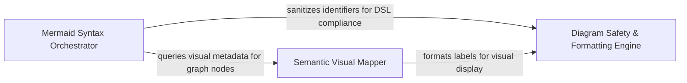

## Details

The foundational layer that transforms graph nodes and edges into Mermaid.js syntax and handles semantic mapping of static analysis types to human-readable labels.

### Mermaid Syntax Orchestrator
Primary engine for generating the structural layout of diagrams by translating logical graph structures into valid Mermaid.js DSL.

**Related Classes/Methods**: _None_

**Source Files:**

- [`output_generators/html.py`](https://github.com/CodeBoarding/CodeBoarding/blob/main/.codeboardingoutput_generators/html.py)
  - `output_generators.html.component_header_html` ([L155-L163](https://github.com/CodeBoarding/CodeBoarding/blob/main/.codeboardingoutput_generators/html.py#L155-L163)) - Function
- [`output_generators/mdx.py`](https://github.com/CodeBoarding/CodeBoarding/blob/main/.codeboardingoutput_generators/mdx.py)
  - `output_generators.mdx.generated_mermaid_str` ([L8-L35](https://github.com/CodeBoarding/CodeBoarding/blob/main/.codeboardingoutput_generators/mdx.py#L8-L35)) - Function

### Semantic Visual Mapper
Provides the visual vocabulary for diagrams by mapping internal static analysis types to human-readable labels and visual decorations.

**Related Classes/Methods**: _None_

**Source Files:**

- [`output_generators/markdown.py`](https://github.com/CodeBoarding/CodeBoarding/blob/main/.codeboardingoutput_generators/markdown.py)
  - `output_generators.markdown.generated_mermaid_str` ([L9-L40](https://github.com/CodeBoarding/CodeBoarding/blob/main/.codeboardingoutput_generators/markdown.py#L9-L40)) - Function
- [`static_analyzer/graph.py`](https://github.com/CodeBoarding/CodeBoarding/blob/main/.codeboardingstatic_analyzer/graph.py)
  - `static_analyzer.graph.CallGraph.__cluster_str` ([L763-L852](https://github.com/CodeBoarding/CodeBoarding/blob/main/.codeboardingstatic_analyzer/graph.py#L763-L852)) - Method

### Diagram Safety & Formatting Engine
Ensures technical integrity by sanitizing identifiers and qualified names to prevent syntax errors in the Mermaid.js parser.

**Related Classes/Methods**:

- `utils.sanitize`:92-94

**Source Files:**

- [`static_analyzer/constants.py`](https://github.com/CodeBoarding/CodeBoarding/blob/main/.codeboardingstatic_analyzer/constants.py)
  - `static_analyzer.constants.NodeType.label` ([L131-L133](https://github.com/CodeBoarding/CodeBoarding/blob/main/.codeboardingstatic_analyzer/constants.py#L131-L133)) - Method
- [`static_analyzer/graph.py`](https://github.com/CodeBoarding/CodeBoarding/blob/main/.codeboardingstatic_analyzer/graph.py)
  - `static_analyzer.graph.CallGraph._common_dot_prefix` ([L747-L760](https://github.com/CodeBoarding/CodeBoarding/blob/main/.codeboardingstatic_analyzer/graph.py#L747-L760)) - Method
- [`utils.py`](https://github.com/CodeBoarding/CodeBoarding/blob/main/.codeboardingutils.py)
  - `utils.sanitize` ([L92-L94](https://github.com/CodeBoarding/CodeBoarding/blob/main/.codeboardingutils.py#L92-L94)) - Function

### [FAQ](https://github.com/CodeBoarding/GeneratedOnBoardings/tree/main?tab=readme-ov-file#faq)