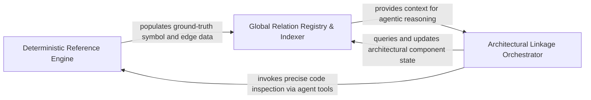

## Details

Ensures global consistency by resolving and validating references between different files and modules.

### Deterministic Reference Engine
Handles low-level, precise mapping of source code symbols, correcting line-number drifts and resolving physical call sites to their actual definitions.

**Related Classes/Methods**: _None_

**Source Files:**

- [`static_analyzer/engine/hierarchy_builder.py`](https://github.com/CodeBoarding/CodeBoarding/blob/main/.codeboardingstatic_analyzer/engine/hierarchy_builder.py)
  - `static_analyzer.engine.hierarchy_builder.HierarchyBuilder._link_hierarchy` ([L184-L200](https://github.com/CodeBoarding/CodeBoarding/blob/main/.codeboardingstatic_analyzer/engine/hierarchy_builder.py#L184-L200)) - Method

### Global Relation Registry & Indexer
Maintains the integrity of the architectural graph by managing unique component identification and ensuring relationship endpoints are valid, unique, and non-redundant.

**Related Classes/Methods**: _None_

**Source Files:**

- [`static_analyzer/engine/source_inspector.py`](https://github.com/CodeBoarding/CodeBoarding/blob/main/.codeboardingstatic_analyzer/engine/source_inspector.py)
  - `static_analyzer.engine.source_inspector.SourceInspector._smallest_named_node_covering_range` ([L339-L354](https://github.com/CodeBoarding/CodeBoarding/blob/main/.codeboardingstatic_analyzer/engine/source_inspector.py#L339-L354)) - Method

### Architectural Linkage Orchestrator
An agentic workflow component that analyzes relationships at a logical level, orchestrating the transition from code clusters to defined architectural components and validating API surfaces.

**Related Classes/Methods**: _None_

**Source Files:**

- [`static_analyzer/engine/source_inspector.py`](https://github.com/CodeBoarding/CodeBoarding/blob/main/.codeboardingstatic_analyzer/engine/source_inspector.py)
  - `static_analyzer.engine.source_inspector.SourceInspector.get_file_lines` ([L113-L121](https://github.com/CodeBoarding/CodeBoarding/blob/main/.codeboardingstatic_analyzer/engine/source_inspector.py#L113-L121)) - Method

### [FAQ](https://github.com/CodeBoarding/GeneratedOnBoardings/tree/main?tab=readme-ov-file#faq)