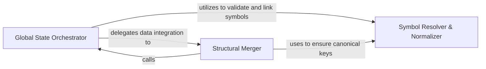

## Details

Handles the structural merging of analysis outputs into the global state, ensuring consistency in class hierarchies and dependencies.

### Global State Orchestrator
Acts as the primary entry point and container for all analysis data, managing the lifecycle of the StaticAnalysisResults object and coordinating the absorption of new data fragments.

**Related Classes/Methods**:

- `static_analyzer.analysis_result.StaticAnalysisResults`:166-317
- `static_analyzer.__init__.StaticAnalyzer._absorb_into_results`:666-673
- `static_analyzer.analysis_result.StaticAnalysisResults._bucket`:177-178

**Source Files:**

- [`static_analyzer/__init__.py`](https://github.com/CodeBoarding/CodeBoarding/blob/main/.codeboardingstatic_analyzer/__init__.py)
  - `static_analyzer.__init__.StaticAnalyzer._absorb_into_results` ([L666-L673](https://github.com/CodeBoarding/CodeBoarding/blob/main/.codeboardingstatic_analyzer/__init__.py#L666-L673)) - Method
- [`static_analyzer/analysis_result.py`](https://github.com/CodeBoarding/CodeBoarding/blob/main/.codeboardingstatic_analyzer/analysis_result.py)
  - `static_analyzer.analysis_result.StaticAnalysisResults._bucket` ([L177-L178](https://github.com/CodeBoarding/CodeBoarding/blob/main/.codeboardingstatic_analyzer/analysis_result.py#L177-L178)) - Method
  - `static_analyzer.analysis_result.StaticAnalysisResults.add_cfg` ([L188-L190](https://github.com/CodeBoarding/CodeBoarding/blob/main/.codeboardingstatic_analyzer/analysis_result.py#L188-L190)) - Method

### Structural Merger
Implements the logic for combining incremental analysis results, performing set-based unions and tree updates to reconcile class inheritance, call graph edges, and package-level relationships.

**Related Classes/Methods**:

- `static_analyzer.language_results.ClassHierarchy.merge`:44-52
- `static_analyzer.language_results.PackageDependencies.merge`:84-88

**Source Files:**

- [`static_analyzer/analysis_result.py`](https://github.com/CodeBoarding/CodeBoarding/blob/main/.codeboardingstatic_analyzer/analysis_result.py)
  - `static_analyzer.analysis_result.StaticAnalysisResults.add_class_hierarchy` ([L184-L186](https://github.com/CodeBoarding/CodeBoarding/blob/main/.codeboardingstatic_analyzer/analysis_result.py#L184-L186)) - Method
  - `static_analyzer.analysis_result.StaticAnalysisResults.add_package_dependencies` ([L192-L194](https://github.com/CodeBoarding/CodeBoarding/blob/main/.codeboardingstatic_analyzer/analysis_result.py#L192-L194)) - Method
  - `static_analyzer.analysis_result.StaticAnalysisResults.add_references` ([L196-L202](https://github.com/CodeBoarding/CodeBoarding/blob/main/.codeboardingstatic_analyzer/analysis_result.py#L196-L202)) - Method
  - `static_analyzer.analysis_result.StaticAnalysisResults.add_source_files` ([L301-L303](https://github.com/CodeBoarding/CodeBoarding/blob/main/.codeboardingstatic_analyzer/analysis_result.py#L301-L303)) - Method

### Symbol Resolver & Normalizer
Provides fuzzy matching and canonicalization logic to link symbols across different contexts, handling language-specific nuances to ensure references point to correct structural nodes.

**Related Classes/Methods**: _None_

**Source Files:**

- [`static_analyzer/language_results.py`](https://github.com/CodeBoarding/CodeBoarding/blob/main/.codeboardingstatic_analyzer/language_results.py)
  - `static_analyzer.language_results.ControlFlowGraph` ([L18-L37](https://github.com/CodeBoarding/CodeBoarding/blob/main/.codeboardingstatic_analyzer/language_results.py#L18-L37)) - Class
  - `static_analyzer.language_results.ClassHierarchy` ([L41-L59](https://github.com/CodeBoarding/CodeBoarding/blob/main/.codeboardingstatic_analyzer/language_results.py#L41-L59)) - Class
  - `static_analyzer.language_results.ClassHierarchy.merge` ([L44-L52](https://github.com/CodeBoarding/CodeBoarding/blob/main/.codeboardingstatic_analyzer/language_results.py#L44-L52)) - Method
  - `static_analyzer.language_results.References` ([L63-L77](https://github.com/CodeBoarding/CodeBoarding/blob/main/.codeboardingstatic_analyzer/language_results.py#L63-L77)) - Class
  - `static_analyzer.language_results.References.add` ([L66-L70](https://github.com/CodeBoarding/CodeBoarding/blob/main/.codeboardingstatic_analyzer/language_results.py#L66-L70)) - Method
  - `static_analyzer.language_results.PackageDependencies` ([L81-L95](https://github.com/CodeBoarding/CodeBoarding/blob/main/.codeboardingstatic_analyzer/language_results.py#L81-L95)) - Class
  - `static_analyzer.language_results.PackageDependencies.merge` ([L84-L88](https://github.com/CodeBoarding/CodeBoarding/blob/main/.codeboardingstatic_analyzer/language_results.py#L84-L88)) - Method
  - `static_analyzer.language_results.SourceFiles` ([L99-L110](https://github.com/CodeBoarding/CodeBoarding/blob/main/.codeboardingstatic_analyzer/language_results.py#L99-L110)) - Class
  - `static_analyzer.language_results.SourceFiles.extend` ([L102-L105](https://github.com/CodeBoarding/CodeBoarding/blob/main/.codeboardingstatic_analyzer/language_results.py#L102-L105)) - Method
  - `static_analyzer.language_results.LanguageResults` ([L114-L128](https://github.com/CodeBoarding/CodeBoarding/blob/main/.codeboardingstatic_analyzer/language_results.py#L114-L128)) - Class

### [FAQ](https://github.com/CodeBoarding/GeneratedOnBoardings/tree/main?tab=readme-ov-file#faq)