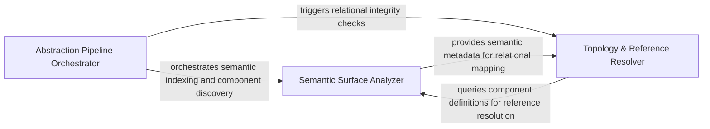

## Details

Analyzes AST-level changes to determine if the architectural signature of a component has shifted, moving beyond simple text-based diffs.

### Abstraction Pipeline Orchestrator
Manages the lifecycle and execution flow of the structural analysis process, initializing the agent environment and sequencing abstraction steps.

**Related Classes/Methods**: _None_

**Source Files:**

- [`agents/agent_responses.py`](https://github.com/CodeBoarding/CodeBoarding/blob/main/.codeboardingagents/agent_responses.py)
  - `agents.agent_responses.index_components_by_id` ([L673-L682](https://github.com/CodeBoarding/CodeBoarding/blob/main/.codeboardingagents/agent_responses.py#L673-L682)) - Function

### Semantic Surface Analyzer
Analyzes the public-facing API and semantic meaning of structural modifications using LLM-driven insights to produce structured architectural data.

**Related Classes/Methods**: _None_

**Source Files:**

- [`agents/agent_responses.py`](https://github.com/CodeBoarding/CodeBoarding/blob/main/.codeboardingagents/agent_responses.py)
  - `agents.agent_responses.iter_components` ([L662-L670](https://github.com/CodeBoarding/CodeBoarding/blob/main/.codeboardingagents/agent_responses.py#L662-L670)) - Function

### Topology & Reference Resolver
Handles the spatial and relational integrity of the architectural model, mapping component connections and resolving cluster memberships.

**Related Classes/Methods**: _None_

**Source Files:**

- [`agents/incremental_agent.py`](https://github.com/CodeBoarding/CodeBoarding/blob/main/.codeboardingagents/incremental_agent.py)
  - `agents.incremental_agent._collect_descendant_ids` ([L684-L701](https://github.com/CodeBoarding/CodeBoarding/blob/main/.codeboardingagents/incremental_agent.py#L684-L701)) - Function

### [FAQ](https://github.com/CodeBoarding/GeneratedOnBoardings/tree/main?tab=readme-ov-file#faq)