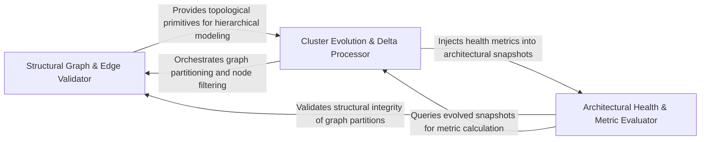

## Details

Manages the lifecycle of architectural clusters across versions, calculating structural differences and handling cluster merging during incremental analysis.

### Structural Graph & Edge Validator
Provides the foundational graph primitives and validation logic required to maintain a consistent architectural model, managing the call graph and ensuring edge validity after updates.

**Related Classes/Methods**:

- `static_analyzer.graph.CallGraph`:145-811
- `static_analyzer.analysis_cache._collect_invalidated_edge`:449-457
- `static_analyzer.node.Node`:9-69

**Source Files:**

- [`agents/validation.py`](https://github.com/CodeBoarding/CodeBoarding/blob/main/.codeboardingagents/validation.py)
  - `agents.validation._build_cluster_edge_lookup` ([L457-L484](https://github.com/CodeBoarding/CodeBoarding/blob/main/.codeboardingagents/validation.py#L457-L484)) - Function
  - `agents.validation._cluster_sets_have_edge` ([L498-L512](https://github.com/CodeBoarding/CodeBoarding/blob/main/.codeboardingagents/validation.py#L498-L512)) - Function
- [`static_analyzer/analysis_cache.py`](https://github.com/CodeBoarding/CodeBoarding/blob/main/.codeboardingstatic_analyzer/analysis_cache.py)
  - `static_analyzer.analysis_cache._collect_invalidated_edge` ([L449-L457](https://github.com/CodeBoarding/CodeBoarding/blob/main/.codeboardingstatic_analyzer/analysis_cache.py#L449-L457)) - Function
  - `static_analyzer.analysis_cache._validate_no_dangling_references` ([L460-L493](https://github.com/CodeBoarding/CodeBoarding/blob/main/.codeboardingstatic_analyzer/analysis_cache.py#L460-L493)) - Function
- [`static_analyzer/engine/result_converter.py`](https://github.com/CodeBoarding/CodeBoarding/blob/main/.codeboardingstatic_analyzer/engine/result_converter.py)
  - `static_analyzer.engine.result_converter.convert_to_codeboarding_format` ([L21-L164](https://github.com/CodeBoarding/CodeBoarding/blob/main/.codeboardingstatic_analyzer/engine/result_converter.py#L21-L164)) - Function
  - `static_analyzer.engine.result_converter._add_reference_edges` ([L167-L197](https://github.com/CodeBoarding/CodeBoarding/blob/main/.codeboardingstatic_analyzer/engine/result_converter.py#L167-L197)) - Function
  - `static_analyzer.engine.result_converter._count_by_kind` ([L200-L201](https://github.com/CodeBoarding/CodeBoarding/blob/main/.codeboardingstatic_analyzer/engine/result_converter.py#L200-L201)) - Function
- [`static_analyzer/graph.py`](https://github.com/CodeBoarding/CodeBoarding/blob/main/.codeboardingstatic_analyzer/graph.py)
  - `static_analyzer.graph.EdgeKind` ([L37-L53](https://github.com/CodeBoarding/CodeBoarding/blob/main/.codeboardingstatic_analyzer/graph.py#L37-L53)) - Class
  - `static_analyzer.graph.LocationKey` ([L57-L64](https://github.com/CodeBoarding/CodeBoarding/blob/main/.codeboardingstatic_analyzer/graph.py#L57-L64)) - Class
  - `static_analyzer.graph.Edge` ([L102-L142](https://github.com/CodeBoarding/CodeBoarding/blob/main/.codeboardingstatic_analyzer/graph.py#L102-L142)) - Class
  - `static_analyzer.graph.Edge.__init__` ([L103-L109](https://github.com/CodeBoarding/CodeBoarding/blob/main/.codeboardingstatic_analyzer/graph.py#L103-L109)) - Method
  - `static_analyzer.graph.Edge.call_sites` ([L112-L113](https://github.com/CodeBoarding/CodeBoarding/blob/main/.codeboardingstatic_analyzer/graph.py#L112-L113)) - Method
  - `static_analyzer.graph.Edge.get_source` ([L115-L116](https://github.com/CodeBoarding/CodeBoarding/blob/main/.codeboardingstatic_analyzer/graph.py#L115-L116)) - Method
  - `static_analyzer.graph.Edge.get_destination` ([L118-L119](https://github.com/CodeBoarding/CodeBoarding/blob/main/.codeboardingstatic_analyzer/graph.py#L118-L119)) - Method
  - `static_analyzer.graph.Edge.__repr__` ([L121-L122](https://github.com/CodeBoarding/CodeBoarding/blob/main/.codeboardingstatic_analyzer/graph.py#L121-L122)) - Method
  - `static_analyzer.graph.Edge.add_call_site` ([L124-L129](https://github.com/CodeBoarding/CodeBoarding/blob/main/.codeboardingstatic_analyzer/graph.py#L124-L129)) - Method
  - `static_analyzer.graph.Edge._normalize_call_site` ([L132-L136](https://github.com/CodeBoarding/CodeBoarding/blob/main/.codeboardingstatic_analyzer/graph.py#L132-L136)) - Method
  - `static_analyzer.graph.CallGraph` ([L145-L811](https://github.com/CodeBoarding/CodeBoarding/blob/main/.codeboardingstatic_analyzer/graph.py#L145-L811)) - Class
  - `static_analyzer.graph.CallGraph.__init__` ([L146-L178](https://github.com/CodeBoarding/CodeBoarding/blob/main/.codeboardingstatic_analyzer/graph.py#L146-L178)) - Method
  - `static_analyzer.graph.CallGraph.add_node` ([L180-L214](https://github.com/CodeBoarding/CodeBoarding/blob/main/.codeboardingstatic_analyzer/graph.py#L180-L214)) - Method
  - `static_analyzer.graph.CallGraph.has_node` ([L216-L218](https://github.com/CodeBoarding/CodeBoarding/blob/main/.codeboardingstatic_analyzer/graph.py#L216-L218)) - Method
  - `static_analyzer.graph.CallGraph._resolve_name` ([L220-L222](https://github.com/CodeBoarding/CodeBoarding/blob/main/.codeboardingstatic_analyzer/graph.py#L220-L222)) - Method
  - `static_analyzer.graph.CallGraph.add_edge` ([L224-L243](https://github.com/CodeBoarding/CodeBoarding/blob/main/.codeboardingstatic_analyzer/graph.py#L224-L243)) - Method
  - `static_analyzer.graph.CallGraph.add_reference_edge` ([L245-L254](https://github.com/CodeBoarding/CodeBoarding/blob/main/.codeboardingstatic_analyzer/graph.py#L245-L254)) - Method
  - `static_analyzer.graph.CallGraph._carry_reference_edges` ([L256-L274](https://github.com/CodeBoarding/CodeBoarding/blob/main/.codeboardingstatic_analyzer/graph.py#L256-L274)) - Method
  - `static_analyzer.graph.CallGraph.filter` ([L276-L304](https://github.com/CodeBoarding/CodeBoarding/blob/main/.codeboardingstatic_analyzer/graph.py#L276-L304)) - Method
  - `static_analyzer.graph.CallGraph.union` ([L306-L334](https://github.com/CodeBoarding/CodeBoarding/blob/main/.codeboardingstatic_analyzer/graph.py#L306-L334)) - Method
  - `static_analyzer.graph.CallGraph._prune_cluster_cache` ([L336-L361](https://github.com/CodeBoarding/CodeBoarding/blob/main/.codeboardingstatic_analyzer/graph.py#L336-L361)) - Method
  - `static_analyzer.graph.CallGraph._prune_method_cluster_paths` ([L363-L364](https://github.com/CodeBoarding/CodeBoarding/blob/main/.codeboardingstatic_analyzer/graph.py#L363-L364)) - Method
  - `static_analyzer.graph.CallGraph.method_cluster_paths_snapshot` ([L378-L379](https://github.com/CodeBoarding/CodeBoarding/blob/main/.codeboardingstatic_analyzer/graph.py#L378-L379)) - Method
  - `static_analyzer.graph.CallGraph.cluster` ([L415-L477](https://github.com/CodeBoarding/CodeBoarding/blob/main/.codeboardingstatic_analyzer/graph.py#L415-L477)) - Method
  - `static_analyzer.graph.CallGraph.filter_by_files` ([L479-L506](https://github.com/CodeBoarding/CodeBoarding/blob/main/.codeboardingstatic_analyzer/graph.py#L479-L506)) - Method
  - `static_analyzer.graph.CallGraph.filter_by_nodes` ([L508-L529](https://github.com/CodeBoarding/CodeBoarding/blob/main/.codeboardingstatic_analyzer/graph.py#L508-L529)) - Method
  - `static_analyzer.graph.CallGraph._get_abstract_node_name` ([L531-L541](https://github.com/CodeBoarding/CodeBoarding/blob/main/.codeboardingstatic_analyzer/graph.py#L531-L541)) - Method
  - `static_analyzer.graph.CallGraph._cluster_with_algorithm` ([L543-L553](https://github.com/CodeBoarding/CodeBoarding/blob/main/.codeboardingstatic_analyzer/graph.py#L543-L553)) - Method
  - `static_analyzer.graph.CallGraph._score_clustering` ([L555-L586](https://github.com/CodeBoarding/CodeBoarding/blob/main/.codeboardingstatic_analyzer/graph.py#L555-L586)) - Method
  - `static_analyzer.graph.CallGraph._cluster_at_level` ([L588-L608](https://github.com/CodeBoarding/CodeBoarding/blob/main/.codeboardingstatic_analyzer/graph.py#L588-L608)) - Method
  - `static_analyzer.graph.CallGraph._try_all_algorithms` ([L610-L628](https://github.com/CodeBoarding/CodeBoarding/blob/main/.codeboardingstatic_analyzer/graph.py#L610-L628)) - Method
  - `static_analyzer.graph.CallGraph._map_candidates_to_original` ([L630-L654](https://github.com/CodeBoarding/CodeBoarding/blob/main/.codeboardingstatic_analyzer/graph.py#L630-L654)) - Method
  - `static_analyzer.graph.CallGraph._coverage` ([L656-L661](https://github.com/CodeBoarding/CodeBoarding/blob/main/.codeboardingstatic_analyzer/graph.py#L656-L661)) - Method
  - `static_analyzer.graph.CallGraph._build_result` ([L663-L694](https://github.com/CodeBoarding/CodeBoarding/blob/main/.codeboardingstatic_analyzer/graph.py#L663-L694)) - Method
  - `static_analyzer.graph.CallGraph._common_dot_prefix` ([L697-L710](https://github.com/CodeBoarding/CodeBoarding/blob/main/.codeboardingstatic_analyzer/graph.py#L697-L710)) - Method
  - `static_analyzer.graph.CallGraph.__str__` ([L712-L717](https://github.com/CodeBoarding/CodeBoarding/blob/main/.codeboardingstatic_analyzer/graph.py#L712-L717)) - Method
  - `static_analyzer.graph.CallGraph._llm_str_detailed` ([L739-L764](https://github.com/CodeBoarding/CodeBoarding/blob/main/.codeboardingstatic_analyzer/graph.py#L739-L764)) - Method
- [`static_analyzer/language_results.py`](https://github.com/CodeBoarding/CodeBoarding/blob/main/.codeboardingstatic_analyzer/language_results.py)
  - `static_analyzer.language_results.ControlFlowGraph.merge` ([L24-L68](https://github.com/CodeBoarding/CodeBoarding/blob/main/.codeboardingstatic_analyzer/language_results.py#L24-L68)) - Method
- [`static_analyzer/method_cluster_paths.py`](https://github.com/CodeBoarding/CodeBoarding/blob/main/.codeboardingstatic_analyzer/method_cluster_paths.py)
  - `static_analyzer.method_cluster_paths.MethodClusterPaths` ([L5-L77](https://github.com/CodeBoarding/CodeBoarding/blob/main/.codeboardingstatic_analyzer/method_cluster_paths.py#L5-L77)) - Class
  - `static_analyzer.method_cluster_paths.MethodClusterPaths.__init__` ([L8-L10](https://github.com/CodeBoarding/CodeBoarding/blob/main/.codeboardingstatic_analyzer/method_cluster_paths.py#L8-L10)) - Method
  - `static_analyzer.method_cluster_paths.MethodClusterPaths.__getstate__` ([L12-L13](https://github.com/CodeBoarding/CodeBoarding/blob/main/.codeboardingstatic_analyzer/method_cluster_paths.py#L12-L13)) - Method
  - `static_analyzer.method_cluster_paths.MethodClusterPaths.__setstate__` ([L15-L17](https://github.com/CodeBoarding/CodeBoarding/blob/main/.codeboardingstatic_analyzer/method_cluster_paths.py#L15-L17)) - Method
  - `static_analyzer.method_cluster_paths.MethodClusterPaths.merge` ([L19-L22](https://github.com/CodeBoarding/CodeBoarding/blob/main/.codeboardingstatic_analyzer/method_cluster_paths.py#L19-L22)) - Method
  - `static_analyzer.method_cluster_paths.MethodClusterPaths.prune` ([L24-L28](https://github.com/CodeBoarding/CodeBoarding/blob/main/.codeboardingstatic_analyzer/method_cluster_paths.py#L24-L28)) - Method
  - `static_analyzer.method_cluster_paths.MethodClusterPaths.record` ([L30-L40](https://github.com/CodeBoarding/CodeBoarding/blob/main/.codeboardingstatic_analyzer/method_cluster_paths.py#L30-L40)) - Method
  - `static_analyzer.method_cluster_paths.MethodClusterPaths.reroot_scope` ([L42-L57](https://github.com/CodeBoarding/CodeBoarding/blob/main/.codeboardingstatic_analyzer/method_cluster_paths.py#L42-L57)) - Method
  - `static_analyzer.method_cluster_paths.MethodClusterPaths._scope_belongs_to` ([L60-L61](https://github.com/CodeBoarding/CodeBoarding/blob/main/.codeboardingstatic_analyzer/method_cluster_paths.py#L60-L61)) - Method
  - `static_analyzer.method_cluster_paths.MethodClusterPaths.snapshot` ([L63-L65](https://github.com/CodeBoarding/CodeBoarding/blob/main/.codeboardingstatic_analyzer/method_cluster_paths.py#L63-L65)) - Method
  - `static_analyzer.method_cluster_paths.MethodClusterPaths.snapshot_dict` ([L67-L69](https://github.com/CodeBoarding/CodeBoarding/blob/main/.codeboardingstatic_analyzer/method_cluster_paths.py#L67-L69)) - Method
  - `static_analyzer.method_cluster_paths.MethodClusterPaths._cluster_id_belongs_to_scope` ([L71-L77](https://github.com/CodeBoarding/CodeBoarding/blob/main/.codeboardingstatic_analyzer/method_cluster_paths.py#L71-L77)) - Method
- [`static_analyzer/node.py`](https://github.com/CodeBoarding/CodeBoarding/blob/main/.codeboardingstatic_analyzer/node.py)
  - `static_analyzer.node.Node` ([L9-L69](https://github.com/CodeBoarding/CodeBoarding/blob/main/.codeboardingstatic_analyzer/node.py#L9-L69)) - Class
  - `static_analyzer.node.Node.entity_label` ([L29-L31](https://github.com/CodeBoarding/CodeBoarding/blob/main/.codeboardingstatic_analyzer/node.py#L29-L31)) - Method
  - `static_analyzer.node.Node.is_callback_or_anonymous` ([L48-L57](https://github.com/CodeBoarding/CodeBoarding/blob/main/.codeboardingstatic_analyzer/node.py#L48-L57)) - Method
  - `static_analyzer.node.Node.added_method_called_by_me` ([L59-L63](https://github.com/CodeBoarding/CodeBoarding/blob/main/.codeboardingstatic_analyzer/node.py#L59-L63)) - Method
  - `static_analyzer.node.Node.__hash__` ([L65-L66](https://github.com/CodeBoarding/CodeBoarding/blob/main/.codeboardingstatic_analyzer/node.py#L65-L66)) - Method
  - `static_analyzer.node.Node.__repr__` ([L68-L69](https://github.com/CodeBoarding/CodeBoarding/blob/main/.codeboardingstatic_analyzer/node.py#L68-L69)) - Method

### Cluster Evolution & Delta Processor [[Expand]](./Cluster_Evolution_Delta_Processor.md)
The core engine for calculating architectural shifts between versions, materializing snapshots, and calculating structural differences at language and cluster levels.

**Related Classes/Methods**:

- `diagram_analysis.cluster_delta.StructuralClusterDiff`:113-118
- `diagram_analysis.cluster_delta.ClusterDelta`:55-63
- `agents.cluster_methods_mixin.scoped_snapshot_from_lineage`:76-97
- `diagram_analysis.cluster_delta._affected_frontier`:782-820

**Source Files:**

- [`agents/cluster_methods_mixin.py`](https://github.com/CodeBoarding/CodeBoarding/blob/main/.codeboardingagents/cluster_methods_mixin.py)
  - `agents.cluster_methods_mixin.scoped_snapshot_from_lineage` ([L76-L97](https://github.com/CodeBoarding/CodeBoarding/blob/main/.codeboardingagents/cluster_methods_mixin.py#L76-L97)) - Function
  - `agents.cluster_methods_mixin.ClusterMethodsMixin._expand_to_method_level_clusters` ([L253-L307](https://github.com/CodeBoarding/CodeBoarding/blob/main/.codeboardingagents/cluster_methods_mixin.py#L253-L307)) - Method
  - `agents.cluster_methods_mixin.ClusterMethodsMixin._create_strict_component_subgraph` ([L309-L357](https://github.com/CodeBoarding/CodeBoarding/blob/main/.codeboardingagents/cluster_methods_mixin.py#L309-L357)) - Method
  - `agents.cluster_methods_mixin.ClusterMethodsMixin._build_undirected_graphs` ([L380-L400](https://github.com/CodeBoarding/CodeBoarding/blob/main/.codeboardingagents/cluster_methods_mixin.py#L380-L400)) - Method
- [`agents/incremental_agent.py`](https://github.com/CodeBoarding/CodeBoarding/blob/main/.codeboardingagents/incremental_agent.py)
  - `agents.incremental_agent._cfg_graphs_for_cluster_results` ([L828-L835](https://github.com/CodeBoarding/CodeBoarding/blob/main/.codeboardingagents/incremental_agent.py#L828-L835)) - Function
- [`diagram_analysis/cluster_delta.py`](https://github.com/CodeBoarding/CodeBoarding/blob/main/.codeboardingdiagram_analysis/cluster_delta.py)
  - `diagram_analysis.cluster_delta.LanguageDelta` ([L42-L51](https://github.com/CodeBoarding/CodeBoarding/blob/main/.codeboardingdiagram_analysis/cluster_delta.py#L42-L51)) - Class
  - `diagram_analysis.cluster_delta.LanguageDelta.affected_cluster_ids` ([L50-L51](https://github.com/CodeBoarding/CodeBoarding/blob/main/.codeboardingdiagram_analysis/cluster_delta.py#L50-L51)) - Method
  - `diagram_analysis.cluster_delta.ClusterDelta` ([L55-L63](https://github.com/CodeBoarding/CodeBoarding/blob/main/.codeboardingdiagram_analysis/cluster_delta.py#L55-L63)) - Class
  - `diagram_analysis.cluster_delta.ClusterDelta.has_changes` ([L59-L60](https://github.com/CodeBoarding/CodeBoarding/blob/main/.codeboardingdiagram_analysis/cluster_delta.py#L59-L60)) - Method
  - `diagram_analysis.cluster_delta.StructuralClusterDiff` ([L113-L118](https://github.com/CodeBoarding/CodeBoarding/blob/main/.codeboardingdiagram_analysis/cluster_delta.py#L113-L118)) - Class
  - `diagram_analysis.cluster_delta.compute_cluster_delta` ([L255-L296](https://github.com/CodeBoarding/CodeBoarding/blob/main/.codeboardingdiagram_analysis/cluster_delta.py#L255-L296)) - Function
  - `diagram_analysis.cluster_delta.structural_diff_from_delta` ([L299-L332](https://github.com/CodeBoarding/CodeBoarding/blob/main/.codeboardingdiagram_analysis/cluster_delta.py#L299-L332)) - Function
  - `diagram_analysis.cluster_delta._changeset_to_path_set` ([L335-L342](https://github.com/CodeBoarding/CodeBoarding/blob/main/.codeboardingdiagram_analysis/cluster_delta.py#L335-L342)) - Function
  - `diagram_analysis.cluster_delta._delta_for_language` ([L581-L665](https://github.com/CodeBoarding/CodeBoarding/blob/main/.codeboardingdiagram_analysis/cluster_delta.py#L581-L665)) - Function
  - `diagram_analysis.cluster_delta._flavor_b_seeded` ([L671-L779](https://github.com/CodeBoarding/CodeBoarding/blob/main/.codeboardingdiagram_analysis/cluster_delta.py#L671-L779)) - Function
  - `diagram_analysis.cluster_delta._affected_frontier` ([L782-L820](https://github.com/CodeBoarding/CodeBoarding/blob/main/.codeboardingdiagram_analysis/cluster_delta.py#L782-L820)) - Function
  - `diagram_analysis.cluster_delta._reconcile_seeded_partition` ([L823-L868](https://github.com/CodeBoarding/CodeBoarding/blob/main/.codeboardingdiagram_analysis/cluster_delta.py#L823-L868)) - Function
  - `diagram_analysis.cluster_delta._absorb_new_file_overlap_clusters` ([L871-L902](https://github.com/CodeBoarding/CodeBoarding/blob/main/.codeboardingdiagram_analysis/cluster_delta.py#L871-L902)) - Function
  - `diagram_analysis.cluster_delta._files_for_members` ([L905-L912](https://github.com/CodeBoarding/CodeBoarding/blob/main/.codeboardingdiagram_analysis/cluster_delta.py#L905-L912)) - Function
  - `diagram_analysis.cluster_delta._materialize_cluster_result` ([L915-L940](https://github.com/CodeBoarding/CodeBoarding/blob/main/.codeboardingdiagram_analysis/cluster_delta.py#L915-L940)) - Function
- [`diagram_analysis/cluster_snapshot.py`](https://github.com/CodeBoarding/CodeBoarding/blob/main/.codeboardingdiagram_analysis/cluster_snapshot.py)
  - `diagram_analysis.cluster_snapshot.ClusterSnapshotEntry` ([L22-L26](https://github.com/CodeBoarding/CodeBoarding/blob/main/.codeboardingdiagram_analysis/cluster_snapshot.py#L22-L26)) - Class
  - `diagram_analysis.cluster_snapshot.ClusterSnapshot` ([L30-L37](https://github.com/CodeBoarding/CodeBoarding/blob/main/.codeboardingdiagram_analysis/cluster_snapshot.py#L30-L37)) - Class
  - `diagram_analysis.cluster_snapshot.ClusterSnapshot.get_language` ([L33-L34](https://github.com/CodeBoarding/CodeBoarding/blob/main/.codeboardingdiagram_analysis/cluster_snapshot.py#L33-L34)) - Method
  - `diagram_analysis.cluster_snapshot.ClusterSnapshot.all_cluster_ids` ([L36-L37](https://github.com/CodeBoarding/CodeBoarding/blob/main/.codeboardingdiagram_analysis/cluster_snapshot.py#L36-L37)) - Method
  - `diagram_analysis.cluster_snapshot.snapshot_from_static_analysis` ([L40-L59](https://github.com/CodeBoarding/CodeBoarding/blob/main/.codeboardingdiagram_analysis/cluster_snapshot.py#L40-L59)) - Function
  - `diagram_analysis.cluster_snapshot._entries_from_cfg_cache` ([L62-L83](https://github.com/CodeBoarding/CodeBoarding/blob/main/.codeboardingdiagram_analysis/cluster_snapshot.py#L62-L83)) - Function
  - `diagram_analysis.cluster_snapshot.snapshot_from_cluster_results` ([L86-L101](https://github.com/CodeBoarding/CodeBoarding/blob/main/.codeboardingdiagram_analysis/cluster_snapshot.py#L86-L101)) - Function
- [`diagram_analysis/diagram_generator.py`](https://github.com/CodeBoarding/CodeBoarding/blob/main/.codeboardingdiagram_analysis/diagram_generator.py)
  - `diagram_analysis.diagram_generator.DiagramGenerator._seed_incremental_cluster_cache` ([L869-L884](https://github.com/CodeBoarding/CodeBoarding/blob/main/.codeboardingdiagram_analysis/diagram_generator.py#L869-L884)) - Method
  - `diagram_analysis.diagram_generator._build_scope_incremental_inputs` ([L1697-L1727](https://github.com/CodeBoarding/CodeBoarding/blob/main/.codeboardingdiagram_analysis/diagram_generator.py#L1697-L1727)) - Function
  - `diagram_analysis.diagram_generator.scoped_snapshot_for_component` ([L1730-L1744](https://github.com/CodeBoarding/CodeBoarding/blob/main/.codeboardingdiagram_analysis/diagram_generator.py#L1730-L1744)) - Function
- [`static_analyzer/analysis_result.py`](https://github.com/CodeBoarding/CodeBoarding/blob/main/.codeboardingstatic_analyzer/analysis_result.py)
  - `static_analyzer.analysis_result.StaticAnalysisResults.get_cfg` ([L206-L211](https://github.com/CodeBoarding/CodeBoarding/blob/main/.codeboardingstatic_analyzer/analysis_result.py#L206-L211)) - Method
- [`static_analyzer/cluster_helpers.py`](https://github.com/CodeBoarding/CodeBoarding/blob/main/.codeboardingstatic_analyzer/cluster_helpers.py)
  - `static_analyzer.cluster_helpers.build_all_cluster_results` ([L48-L65](https://github.com/CodeBoarding/CodeBoarding/blob/main/.codeboardingstatic_analyzer/cluster_helpers.py#L48-L65)) - Function
  - `static_analyzer.cluster_helpers._sync_cluster_cache` ([L68-L76](https://github.com/CodeBoarding/CodeBoarding/blob/main/.codeboardingstatic_analyzer/cluster_helpers.py#L68-L76)) - Function
  - `static_analyzer.cluster_helpers.reindex_across_languages` ([L79-L102](https://github.com/CodeBoarding/CodeBoarding/blob/main/.codeboardingstatic_analyzer/cluster_helpers.py#L79-L102)) - Function
  - `static_analyzer.cluster_helpers.reindex_cluster_result` ([L105-L125](https://github.com/CodeBoarding/CodeBoarding/blob/main/.codeboardingstatic_analyzer/cluster_helpers.py#L105-L125)) - Function
- [`static_analyzer/constants.py`](https://github.com/CodeBoarding/CodeBoarding/blob/main/.codeboardingstatic_analyzer/constants.py)
  - `static_analyzer.constants.Language` ([L10-L26](https://github.com/CodeBoarding/CodeBoarding/blob/main/.codeboardingstatic_analyzer/constants.py#L10-L26)) - Class
- [`static_analyzer/graph.py`](https://github.com/CodeBoarding/CodeBoarding/blob/main/.codeboardingstatic_analyzer/graph.py)
  - `static_analyzer.graph.ClusterResult` ([L74-L99](https://github.com/CodeBoarding/CodeBoarding/blob/main/.codeboardingstatic_analyzer/graph.py#L74-L99)) - Class
  - `static_analyzer.graph.ClusterResult.get_cluster_ids` ([L82-L83](https://github.com/CodeBoarding/CodeBoarding/blob/main/.codeboardingstatic_analyzer/graph.py#L82-L83)) - Method
  - `static_analyzer.graph.ClusterResult.get_files_for_cluster` ([L85-L86](https://github.com/CodeBoarding/CodeBoarding/blob/main/.codeboardingstatic_analyzer/graph.py#L85-L86)) - Method
  - `static_analyzer.graph.ClusterResult.get_clusters_for_file` ([L88-L89](https://github.com/CodeBoarding/CodeBoarding/blob/main/.codeboardingstatic_analyzer/graph.py#L88-L89)) - Method
  - `static_analyzer.graph.ClusterResult.visit_paths` ([L94-L99](https://github.com/CodeBoarding/CodeBoarding/blob/main/.codeboardingstatic_analyzer/graph.py#L94-L99)) - Method
  - `static_analyzer.graph.Edge.visit_paths` ([L138-L142](https://github.com/CodeBoarding/CodeBoarding/blob/main/.codeboardingstatic_analyzer/graph.py#L138-L142)) - Method
  - `static_analyzer.graph.CallGraph.visit_paths` ([L366-L372](https://github.com/CodeBoarding/CodeBoarding/blob/main/.codeboardingstatic_analyzer/graph.py#L366-L372)) - Method
  - `static_analyzer.graph.CallGraph.record_cluster_paths` ([L374-L376](https://github.com/CodeBoarding/CodeBoarding/blob/main/.codeboardingstatic_analyzer/graph.py#L374-L376)) - Method
  - `static_analyzer.graph.CallGraph.to_networkx` ([L381-L393](https://github.com/CodeBoarding/CodeBoarding/blob/main/.codeboardingstatic_analyzer/graph.py#L381-L393)) - Method
  - `static_analyzer.graph.CallGraph.clustering_networkx` ([L395-L413](https://github.com/CodeBoarding/CodeBoarding/blob/main/.codeboardingstatic_analyzer/graph.py#L395-L413)) - Method
- [`static_analyzer/language_results.py`](https://github.com/CodeBoarding/CodeBoarding/blob/main/.codeboardingstatic_analyzer/language_results.py)
  - `static_analyzer.language_results.ControlFlowGraph` ([L21-L73](https://github.com/CodeBoarding/CodeBoarding/blob/main/.codeboardingstatic_analyzer/language_results.py#L21-L73)) - Class
  - `static_analyzer.language_results.ControlFlowGraph.visit_paths` ([L70-L73](https://github.com/CodeBoarding/CodeBoarding/blob/main/.codeboardingstatic_analyzer/language_results.py#L70-L73)) - Method
- [`static_analyzer/leiden_utils.py`](https://github.com/CodeBoarding/CodeBoarding/blob/main/.codeboardingstatic_analyzer/leiden_utils.py)
  - `static_analyzer.leiden_utils.nx_to_ig` ([L15-L23](https://github.com/CodeBoarding/CodeBoarding/blob/main/.codeboardingstatic_analyzer/leiden_utils.py#L15-L23)) - Function
  - `static_analyzer.leiden_utils.find_partition_seeded` ([L66-L103](https://github.com/CodeBoarding/CodeBoarding/blob/main/.codeboardingstatic_analyzer/leiden_utils.py#L66-L103)) - Function

### Architectural Health & Metric Evaluator [[Expand]](./Architectural_Health_Metric_Evaluator.md)
Analyzes the quality and stability of evolved clusters by evaluating metrics like cohesion, coupling, and circular dependencies to identify structural debt.

**Related Classes/Methods**:

- `health.models.BaseCheckSummary`:51-60
- `health.checks.circular_deps.check_circular_dependencies`:10-48
- `health.checks.cohesion.check_component_cohesion`:9-99
- `health.checks.coupling.check_fan_out`:35-85

**Source Files:**

- [`health/checks/circular_deps.py`](https://github.com/CodeBoarding/CodeBoarding/blob/main/.codeboardinghealth/checks/circular_deps.py)
  - `health.checks.circular_deps.check_circular_dependencies` ([L10-L48](https://github.com/CodeBoarding/CodeBoarding/blob/main/.codeboardinghealth/checks/circular_deps.py#L10-L48)) - Function
- [`health/checks/cohesion.py`](https://github.com/CodeBoarding/CodeBoarding/blob/main/.codeboardinghealth/checks/cohesion.py)
  - `health.checks.cohesion.check_component_cohesion` ([L9-L99](https://github.com/CodeBoarding/CodeBoarding/blob/main/.codeboardinghealth/checks/cohesion.py#L9-L99)) - Function
- [`health/checks/coupling.py`](https://github.com/CodeBoarding/CodeBoarding/blob/main/.codeboardinghealth/checks/coupling.py)
  - `health.checks.coupling.collect_coupling_values` ([L15-L32](https://github.com/CodeBoarding/CodeBoarding/blob/main/.codeboardinghealth/checks/coupling.py#L15-L32)) - Function
  - `health.checks.coupling.check_fan_out` ([L35-L85](https://github.com/CodeBoarding/CodeBoarding/blob/main/.codeboardinghealth/checks/coupling.py#L35-L85)) - Function
  - `health.checks.coupling.check_fan_in` ([L88-L140](https://github.com/CodeBoarding/CodeBoarding/blob/main/.codeboardinghealth/checks/coupling.py#L88-L140)) - Function
- [`health/checks/function_size.py`](https://github.com/CodeBoarding/CodeBoarding/blob/main/.codeboardinghealth/checks/function_size.py)
  - `health.checks.function_size.collect_function_sizes` ([L17-L26](https://github.com/CodeBoarding/CodeBoarding/blob/main/.codeboardinghealth/checks/function_size.py#L17-L26)) - Function
  - `health.checks.function_size.check_function_size` ([L29-L85](https://github.com/CodeBoarding/CodeBoarding/blob/main/.codeboardinghealth/checks/function_size.py#L29-L85)) - Function
- [`health/checks/god_class.py`](https://github.com/CodeBoarding/CodeBoarding/blob/main/.codeboardinghealth/checks/god_class.py)
  - `health.checks.god_class._group_methods_by_class` ([L16-L27](https://github.com/CodeBoarding/CodeBoarding/blob/main/.codeboardinghealth/checks/god_class.py#L16-L27)) - Function
  - `health.checks.god_class.collect_god_class_values` ([L30-L64](https://github.com/CodeBoarding/CodeBoarding/blob/main/.codeboardinghealth/checks/god_class.py#L30-L64)) - Function
  - `health.checks.god_class.check_god_classes` ([L67-L167](https://github.com/CodeBoarding/CodeBoarding/blob/main/.codeboardinghealth/checks/god_class.py#L67-L167)) - Function
- [`health/checks/inheritance.py`](https://github.com/CodeBoarding/CodeBoarding/blob/main/.codeboardinghealth/checks/inheritance.py)
  - `health.checks.inheritance._compute_inheritance_depths` ([L15-L50](https://github.com/CodeBoarding/CodeBoarding/blob/main/.codeboardinghealth/checks/inheritance.py#L15-L50)) - Function
  - `health.checks.inheritance.check_inheritance_depth` ([L53-L104](https://github.com/CodeBoarding/CodeBoarding/blob/main/.codeboardinghealth/checks/inheritance.py#L53-L104)) - Function
- [`health/checks/instability.py`](https://github.com/CodeBoarding/CodeBoarding/blob/main/.codeboardinghealth/checks/instability.py)
  - `health.checks.instability.check_package_instability` ([L8-L77](https://github.com/CodeBoarding/CodeBoarding/blob/main/.codeboardinghealth/checks/instability.py#L8-L77)) - Function
- [`health/checks/unused_code_diagnostics.py`](https://github.com/CodeBoarding/CodeBoarding/blob/main/.codeboardinghealth/checks/unused_code_diagnostics.py)
  - `health.checks.unused_code_diagnostics.DeadCodeCategory` ([L31-L41](https://github.com/CodeBoarding/CodeBoarding/blob/main/.codeboardinghealth/checks/unused_code_diagnostics.py#L31-L41)) - Class
  - `health.checks.unused_code_diagnostics.DiagnosticIssue` ([L45-L54](https://github.com/CodeBoarding/CodeBoarding/blob/main/.codeboardinghealth/checks/unused_code_diagnostics.py#L45-L54)) - Class
  - `health.checks.unused_code_diagnostics.FileDiagnostic` ([L131-L135](https://github.com/CodeBoarding/CodeBoarding/blob/main/.codeboardinghealth/checks/unused_code_diagnostics.py#L131-L135)) - Class
  - `health.checks.unused_code_diagnostics.LSPDiagnosticsCollector` ([L138-L262](https://github.com/CodeBoarding/CodeBoarding/blob/main/.codeboardinghealth/checks/unused_code_diagnostics.py#L138-L262)) - Class
  - `health.checks.unused_code_diagnostics.LSPDiagnosticsCollector.__init__` ([L141-L143](https://github.com/CodeBoarding/CodeBoarding/blob/main/.codeboardinghealth/checks/unused_code_diagnostics.py#L141-L143)) - Method
  - `health.checks.unused_code_diagnostics.LSPDiagnosticsCollector.add_diagnostic` ([L145-L146](https://github.com/CodeBoarding/CodeBoarding/blob/main/.codeboardinghealth/checks/unused_code_diagnostics.py#L145-L146)) - Method
  - `health.checks.unused_code_diagnostics.LSPDiagnosticsCollector.process_diagnostics` ([L148-L183](https://github.com/CodeBoarding/CodeBoarding/blob/main/.codeboardinghealth/checks/unused_code_diagnostics.py#L148-L183)) - Method
  - `health.checks.unused_code_diagnostics.LSPDiagnosticsCollector._convert_to_issue` ([L185-L213](https://github.com/CodeBoarding/CodeBoarding/blob/main/.codeboardinghealth/checks/unused_code_diagnostics.py#L185-L213)) - Method
  - `health.checks.unused_code_diagnostics.LSPDiagnosticsCollector._categorize_diagnostic` ([L215-L235](https://github.com/CodeBoarding/CodeBoarding/blob/main/.codeboardinghealth/checks/unused_code_diagnostics.py#L215-L235)) - Method
  - `health.checks.unused_code_diagnostics.LSPDiagnosticsCollector._categorize_by_message` ([L237-L243](https://github.com/CodeBoarding/CodeBoarding/blob/main/.codeboardinghealth/checks/unused_code_diagnostics.py#L237-L243)) - Method
  - `health.checks.unused_code_diagnostics.LSPDiagnosticsCollector._map_severity` ([L245-L253](https://github.com/CodeBoarding/CodeBoarding/blob/main/.codeboardinghealth/checks/unused_code_diagnostics.py#L245-L253)) - Method
  - `health.checks.unused_code_diagnostics.LSPDiagnosticsCollector.get_issues_by_category` ([L255-L262](https://github.com/CodeBoarding/CodeBoarding/blob/main/.codeboardinghealth/checks/unused_code_diagnostics.py#L255-L262)) - Method
  - `health.checks.unused_code_diagnostics.check_unused_code_diagnostics` ([L265-L340](https://github.com/CodeBoarding/CodeBoarding/blob/main/.codeboardinghealth/checks/unused_code_diagnostics.py#L265-L340)) - Function
  - `health.checks.unused_code_diagnostics.get_category_description` ([L343-L355](https://github.com/CodeBoarding/CodeBoarding/blob/main/.codeboardinghealth/checks/unused_code_diagnostics.py#L343-L355)) - Function
- [`health/models.py`](https://github.com/CodeBoarding/CodeBoarding/blob/main/.codeboardinghealth/models.py)
  - `health.models.Severity` ([L10-L15](https://github.com/CodeBoarding/CodeBoarding/blob/main/.codeboardinghealth/models.py#L10-L15)) - Class
  - `health.models.FindingEntity` ([L18-L39](https://github.com/CodeBoarding/CodeBoarding/blob/main/.codeboardinghealth/models.py#L18-L39)) - Class
  - `health.models.FindingGroup` ([L42-L48](https://github.com/CodeBoarding/CodeBoarding/blob/main/.codeboardinghealth/models.py#L42-L48)) - Class
  - `health.models.BaseCheckSummary` ([L51-L60](https://github.com/CodeBoarding/CodeBoarding/blob/main/.codeboardinghealth/models.py#L51-L60)) - Class
  - `health.models.StandardCheckSummary` ([L63-L85](https://github.com/CodeBoarding/CodeBoarding/blob/main/.codeboardinghealth/models.py#L63-L85)) - Class
  - `health.models.StandardCheckSummary.findings` ([L76-L85](https://github.com/CodeBoarding/CodeBoarding/blob/main/.codeboardinghealth/models.py#L76-L85)) - Method
  - `health.models.CircularDependencyCheck` ([L88-L103](https://github.com/CodeBoarding/CodeBoarding/blob/main/.codeboardinghealth/models.py#L88-L103)) - Class
  - `health.models.CircularDependencyCheck.score` ([L97-L103](https://github.com/CodeBoarding/CodeBoarding/blob/main/.codeboardinghealth/models.py#L97-L103)) - Method
- [`health/runner.py`](https://github.com/CodeBoarding/CodeBoarding/blob/main/.codeboardinghealth/runner.py)
  - `health.runner._matches_exclude_pattern` ([L35-L42](https://github.com/CodeBoarding/CodeBoarding/blob/main/.codeboardinghealth/runner.py#L35-L42)) - Function
  - `health.runner._apply_exclude_patterns` ([L45-L64](https://github.com/CodeBoarding/CodeBoarding/blob/main/.codeboardinghealth/runner.py#L45-L64)) - Function
  - `health.runner._collect_checks_for_language` ([L72-L133](https://github.com/CodeBoarding/CodeBoarding/blob/main/.codeboardinghealth/runner.py#L72-L133)) - Function
- [`static_analyzer/node.py`](https://github.com/CodeBoarding/CodeBoarding/blob/main/.codeboardingstatic_analyzer/node.py)
  - `static_analyzer.node.Node.is_class` ([L37-L39](https://github.com/CodeBoarding/CodeBoarding/blob/main/.codeboardingstatic_analyzer/node.py#L37-L39)) - Method
  - `static_analyzer.node.Node.is_data` ([L41-L43](https://github.com/CodeBoarding/CodeBoarding/blob/main/.codeboardingstatic_analyzer/node.py#L41-L43)) - Method

### [FAQ](https://github.com/CodeBoarding/GeneratedOnBoardings/tree/main?tab=readme-ov-file#faq)