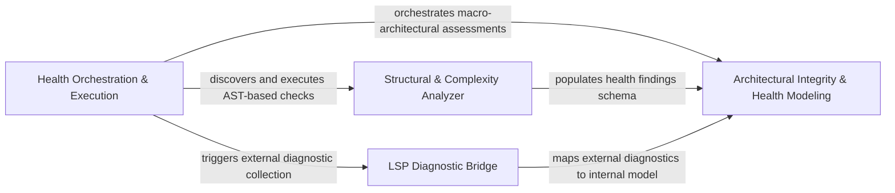

## Details

Performs initial sanity checks and collects diagnostics to identify architectural smells.

### Health Orchestration & Execution [[Expand]](./Health_Orchestration_Execution.md)
Acts as the central controller and entry point for the diagnostic subsystem, managing check discovery, exclusion filtering, and execution flow.

**Related Classes/Methods**:

- `health.runner._collect_checks_for_language`:71-131
- `health.runner._apply_exclude_patterns`:44-63
- `health.checks.circular_deps.check_circular_dependencies`:10-48

**Source Files:**

- [`health/checks/circular_deps.py`](https://github.com/CodeBoarding/CodeBoarding/blob/main/.codeboardinghealth/checks/circular_deps.py)
  - `health.checks.circular_deps.check_circular_dependencies` ([L10-L48](https://github.com/CodeBoarding/CodeBoarding/blob/main/.codeboardinghealth/checks/circular_deps.py#L10-L48)) - Function
- [`health/checks/unused_code_diagnostics.py`](https://github.com/CodeBoarding/CodeBoarding/blob/main/.codeboardinghealth/checks/unused_code_diagnostics.py)
  - `health.checks.unused_code_diagnostics.FileDiagnostic` ([L131-L135](https://github.com/CodeBoarding/CodeBoarding/blob/main/.codeboardinghealth/checks/unused_code_diagnostics.py#L131-L135)) - Class
  - `health.checks.unused_code_diagnostics.LSPDiagnosticsCollector` ([L138-L262](https://github.com/CodeBoarding/CodeBoarding/blob/main/.codeboardinghealth/checks/unused_code_diagnostics.py#L138-L262)) - Class
  - `health.checks.unused_code_diagnostics.LSPDiagnosticsCollector.add_diagnostic` ([L145-L146](https://github.com/CodeBoarding/CodeBoarding/blob/main/.codeboardinghealth/checks/unused_code_diagnostics.py#L145-L146)) - Method
- [`health/models.py`](https://github.com/CodeBoarding/CodeBoarding/blob/main/.codeboardinghealth/models.py)
  - `health.models.CircularDependencyCheck` ([L88-L103](https://github.com/CodeBoarding/CodeBoarding/blob/main/.codeboardinghealth/models.py#L88-L103)) - Class
- [`health/runner.py`](https://github.com/CodeBoarding/CodeBoarding/blob/main/.codeboardinghealth/runner.py)
  - `health.runner._matches_exclude_pattern` ([L34-L41](https://github.com/CodeBoarding/CodeBoarding/blob/main/.codeboardinghealth/runner.py#L34-L41)) - Function
  - `health.runner._apply_exclude_patterns` ([L44-L63](https://github.com/CodeBoarding/CodeBoarding/blob/main/.codeboardinghealth/runner.py#L44-L63)) - Function
  - `health.runner._collect_checks_for_language` ([L71-L131](https://github.com/CodeBoarding/CodeBoarding/blob/main/.codeboardinghealth/runner.py#L71-L131)) - Function

### Structural & Complexity Analyzer [[Expand]](./Structural_Complexity_Analyzer.md)
Performs deep static analysis using AST node representations to identify clean code violations such as God Classes, high fan-out, and excessive function size.

**Related Classes/Methods**:

- `health.checks.god_class.check_god_classes`:67-167
- `health.checks.coupling.check_fan_out`:35-85
- `health.checks.function_size.check_function_size`:28-85

**Source Files:**

- [`health/checks/coupling.py`](https://github.com/CodeBoarding/CodeBoarding/blob/main/.codeboardinghealth/checks/coupling.py)
  - `health.checks.coupling.collect_coupling_values` ([L15-L32](https://github.com/CodeBoarding/CodeBoarding/blob/main/.codeboardinghealth/checks/coupling.py#L15-L32)) - Function
  - `health.checks.coupling.check_fan_out` ([L35-L85](https://github.com/CodeBoarding/CodeBoarding/blob/main/.codeboardinghealth/checks/coupling.py#L35-L85)) - Function
  - `health.checks.coupling.check_fan_in` ([L88-L140](https://github.com/CodeBoarding/CodeBoarding/blob/main/.codeboardinghealth/checks/coupling.py#L88-L140)) - Function
- [`health/checks/function_size.py`](https://github.com/CodeBoarding/CodeBoarding/blob/main/.codeboardinghealth/checks/function_size.py)
  - `health.checks.function_size.collect_function_sizes` ([L16-L25](https://github.com/CodeBoarding/CodeBoarding/blob/main/.codeboardinghealth/checks/function_size.py#L16-L25)) - Function
  - `health.checks.function_size.check_function_size` ([L28-L85](https://github.com/CodeBoarding/CodeBoarding/blob/main/.codeboardinghealth/checks/function_size.py#L28-L85)) - Function
- [`health/checks/god_class.py`](https://github.com/CodeBoarding/CodeBoarding/blob/main/.codeboardinghealth/checks/god_class.py)
  - `health.checks.god_class._group_methods_by_class` ([L16-L27](https://github.com/CodeBoarding/CodeBoarding/blob/main/.codeboardinghealth/checks/god_class.py#L16-L27)) - Function
  - `health.checks.god_class.collect_god_class_values` ([L30-L64](https://github.com/CodeBoarding/CodeBoarding/blob/main/.codeboardinghealth/checks/god_class.py#L30-L64)) - Function
  - `health.checks.god_class.check_god_classes` ([L67-L167](https://github.com/CodeBoarding/CodeBoarding/blob/main/.codeboardinghealth/checks/god_class.py#L67-L167)) - Function
- [`repo_utils/ignore.py`](https://github.com/CodeBoarding/CodeBoarding/blob/main/.codeboardingrepo_utils/ignore.py)
  - `repo_utils.ignore.RepoIgnoreManager.should_skip_file` ([L292-L301](https://github.com/CodeBoarding/CodeBoarding/blob/main/.codeboardingrepo_utils/ignore.py#L292-L301)) - Method
- [`static_analyzer/node.py`](https://github.com/CodeBoarding/CodeBoarding/blob/main/.codeboardingstatic_analyzer/node.py)
  - `static_analyzer.node.Node.is_class` ([L37-L39](https://github.com/CodeBoarding/CodeBoarding/blob/main/.codeboardingstatic_analyzer/node.py#L37-L39)) - Method
  - `static_analyzer.node.Node.is_data` ([L41-L43](https://github.com/CodeBoarding/CodeBoarding/blob/main/.codeboardingstatic_analyzer/node.py#L41-L43)) - Method

### LSP Diagnostic Bridge [[Expand]](./LSP_Diagnostic_Bridge.md)
Integrates external diagnostic data from Language Servers, translating compiler-level warnings and linting results into the subsystem's internal issue model.

**Related Classes/Methods**:

- `health.checks.unused_code_diagnostics.check_unused_code_diagnostics`:265-340
- `health.checks.unused_code_diagnostics.DiagnosticIssue`:45-54

**Source Files:**

- [`health/checks/unused_code_diagnostics.py`](https://github.com/CodeBoarding/CodeBoarding/blob/main/.codeboardinghealth/checks/unused_code_diagnostics.py)
  - `health.checks.unused_code_diagnostics.DeadCodeCategory` ([L31-L41](https://github.com/CodeBoarding/CodeBoarding/blob/main/.codeboardinghealth/checks/unused_code_diagnostics.py#L31-L41)) - Class
  - `health.checks.unused_code_diagnostics.DiagnosticIssue` ([L45-L54](https://github.com/CodeBoarding/CodeBoarding/blob/main/.codeboardinghealth/checks/unused_code_diagnostics.py#L45-L54)) - Class
  - `health.checks.unused_code_diagnostics.LSPDiagnosticsCollector.__init__` ([L141-L143](https://github.com/CodeBoarding/CodeBoarding/blob/main/.codeboardinghealth/checks/unused_code_diagnostics.py#L141-L143)) - Method
  - `health.checks.unused_code_diagnostics.LSPDiagnosticsCollector.process_diagnostics` ([L148-L183](https://github.com/CodeBoarding/CodeBoarding/blob/main/.codeboardinghealth/checks/unused_code_diagnostics.py#L148-L183)) - Method
  - `health.checks.unused_code_diagnostics.LSPDiagnosticsCollector._convert_to_issue` ([L185-L213](https://github.com/CodeBoarding/CodeBoarding/blob/main/.codeboardinghealth/checks/unused_code_diagnostics.py#L185-L213)) - Method
  - `health.checks.unused_code_diagnostics.LSPDiagnosticsCollector._categorize_diagnostic` ([L215-L235](https://github.com/CodeBoarding/CodeBoarding/blob/main/.codeboardinghealth/checks/unused_code_diagnostics.py#L215-L235)) - Method
  - `health.checks.unused_code_diagnostics.LSPDiagnosticsCollector._categorize_by_message` ([L237-L243](https://github.com/CodeBoarding/CodeBoarding/blob/main/.codeboardinghealth/checks/unused_code_diagnostics.py#L237-L243)) - Method
  - `health.checks.unused_code_diagnostics.LSPDiagnosticsCollector._map_severity` ([L245-L253](https://github.com/CodeBoarding/CodeBoarding/blob/main/.codeboardinghealth/checks/unused_code_diagnostics.py#L245-L253)) - Method
  - `health.checks.unused_code_diagnostics.LSPDiagnosticsCollector.get_issues_by_category` ([L255-L262](https://github.com/CodeBoarding/CodeBoarding/blob/main/.codeboardinghealth/checks/unused_code_diagnostics.py#L255-L262)) - Method
  - `health.checks.unused_code_diagnostics.check_unused_code_diagnostics` ([L265-L340](https://github.com/CodeBoarding/CodeBoarding/blob/main/.codeboardinghealth/checks/unused_code_diagnostics.py#L265-L340)) - Function
  - `health.checks.unused_code_diagnostics.get_category_description` ([L343-L355](https://github.com/CodeBoarding/CodeBoarding/blob/main/.codeboardinghealth/checks/unused_code_diagnostics.py#L343-L355)) - Function

### Architectural Integrity & Health Modeling [[Expand]](./Architectural_Integrity_Health_Modeling.md)
Defines the data schema for diagnostic findings and performs high-level architectural assessments, including package instability and inheritance depth, to aggregate a unified health baseline.

**Related Classes/Methods**:

- `health.models.StandardCheckSummary`:63-85
- `health.models.FindingGroup`:42-48
- `health.checks.inheritance.check_inheritance_depth`:53-104
- `health.checks.instability.check_package_instability`:8-77

**Source Files:**

- [`health/checks/cohesion.py`](https://github.com/CodeBoarding/CodeBoarding/blob/main/.codeboardinghealth/checks/cohesion.py)
  - `health.checks.cohesion.check_component_cohesion` ([L9-L99](https://github.com/CodeBoarding/CodeBoarding/blob/main/.codeboardinghealth/checks/cohesion.py#L9-L99)) - Function
- [`health/checks/inheritance.py`](https://github.com/CodeBoarding/CodeBoarding/blob/main/.codeboardinghealth/checks/inheritance.py)
  - `health.checks.inheritance._compute_inheritance_depths` ([L15-L50](https://github.com/CodeBoarding/CodeBoarding/blob/main/.codeboardinghealth/checks/inheritance.py#L15-L50)) - Function
  - `health.checks.inheritance.check_inheritance_depth` ([L53-L104](https://github.com/CodeBoarding/CodeBoarding/blob/main/.codeboardinghealth/checks/inheritance.py#L53-L104)) - Function
- [`health/checks/instability.py`](https://github.com/CodeBoarding/CodeBoarding/blob/main/.codeboardinghealth/checks/instability.py)
  - `health.checks.instability.check_package_instability` ([L8-L77](https://github.com/CodeBoarding/CodeBoarding/blob/main/.codeboardinghealth/checks/instability.py#L8-L77)) - Function
- [`health/models.py`](https://github.com/CodeBoarding/CodeBoarding/blob/main/.codeboardinghealth/models.py)
  - `health.models.FindingEntity` ([L18-L39](https://github.com/CodeBoarding/CodeBoarding/blob/main/.codeboardinghealth/models.py#L18-L39)) - Class
  - `health.models.FindingGroup` ([L42-L48](https://github.com/CodeBoarding/CodeBoarding/blob/main/.codeboardinghealth/models.py#L42-L48)) - Class
  - `health.models.StandardCheckSummary` ([L63-L85](https://github.com/CodeBoarding/CodeBoarding/blob/main/.codeboardinghealth/models.py#L63-L85)) - Class
- [`static_analyzer/cluster_helpers.py`](https://github.com/CodeBoarding/CodeBoarding/blob/main/.codeboardingstatic_analyzer/cluster_helpers.py)
  - `static_analyzer.cluster_helpers.get_files_for_cluster_ids` ([L496-L511](https://github.com/CodeBoarding/CodeBoarding/blob/main/.codeboardingstatic_analyzer/cluster_helpers.py#L496-L511)) - Function
- [`static_analyzer/graph.py`](https://github.com/CodeBoarding/CodeBoarding/blob/main/.codeboardingstatic_analyzer/graph.py)
  - `static_analyzer.graph.ClusterResult.get_files_for_cluster` ([L63-L64](https://github.com/CodeBoarding/CodeBoarding/blob/main/.codeboardingstatic_analyzer/graph.py#L63-L64)) - Method

### [FAQ](https://github.com/CodeBoarding/GeneratedOnBoardings/tree/main?tab=readme-ov-file#faq)