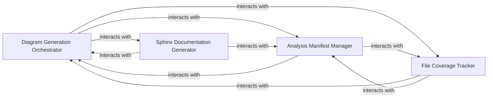

## Details

Specializes in converting structured analysis data into visual architectural diagrams, primarily using formats like Mermaid.js syntax. It produces diagram definitions that can be embedded into various documentation formats by other generators.

### Diagram Generation Orchestrator
Orchestrates the core analysis process, initiating analysis, handling incremental updates, processing individual components, and managing the overall flow of diagram generation. Converts structured analysis data into visual diagrams, primarily using Mermaid.js syntax.

**Related Classes/Methods**:

- <a href="https://github.com/CodeBoarding/CodeBoarding/blob/main/.codeboardingdiagram_analysis/diagram_generator.py" target="_blank" rel="noopener noreferrer">`repos.codeboarding.diagram_analysis.diagram_generator.MermaidGenerator`</a>
- <a href="https://github.com/CodeBoarding/CodeBoarding/blob/main/.codeboardingoutput_generators/sphinx.py" target="_blank" rel="noopener noreferrer">`repos.codeboarding.output.DiagramGenerator`</a>

### Analysis Manifest Manager
Maintains a structured record of analysis results, mapping files to components and providing methods to query and update this manifest. Acts as the system's memory for what has been analyzed.

**Related Classes/Methods**:

- <a href="https://github.com/CodeBoarding/CodeBoarding/blob/main/.codeboardingdiagram_analysis/manifest.py" target="_blank" rel="noopener noreferrer">`diagram_analysis.manifest`</a>

### File Coverage Tracker
Manages and tracks coverage of files during analysis, handling loading, saving, and updating information about which parts of the codebase have been processed or modified. Supports efficient incremental analysis.

**Related Classes/Methods**:

- <a href="https://github.com/CodeBoarding/CodeBoarding/blob/main/.codeboardingdiagram_analysis/file_coverage.py" target="_blank" rel="noopener noreferrer">`diagram_analysis.file_coverage`</a>

### Sphinx Documentation Generator
Generates documentation output in reStructuredText (RST) format for Sphinx, creating component headers and embedding generated Mermaid diagrams. Translates internal analysis results into user-consumable documentation.

**Related Classes/Methods**:

- <a href="https://github.com/CodeBoarding/CodeBoarding/blob/main/.codeboardingoutput_generators/sphinx.py" target="_blank" rel="noopener noreferrer">`output_generators.sphinx`</a>

### [FAQ](https://github.com/CodeBoarding/GeneratedOnBoardings/tree/main?tab=readme-ov-file#faq)