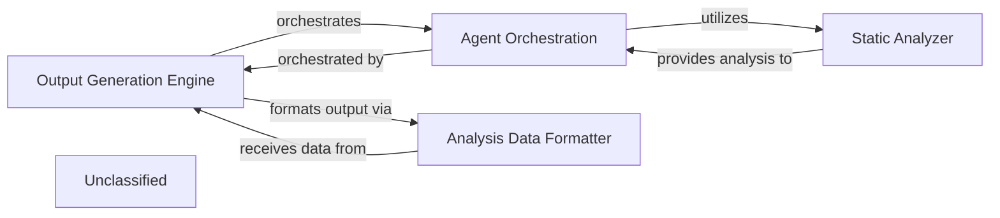

## Details

The system's architecture is composed of four key components: the `Output Generation Engine`, `Agent Orchestration`, `Static Analyzer`, and `Analysis Data Formatter`. The `Output Generation Engine` acts as the central control, orchestrating the entire analysis workflow from initial code processing to final output generation. It delegates the complex task of code interpretation and insight generation to the `Agent Orchestration` component, which in turn leverages the `Static Analyzer` for fundamental, language-specific source code analysis. Once the `Agent Orchestration` completes its tasks, the `Output Generation Engine` directs the results to the `Analysis Data Formatter`, ensuring that all generated architectural insights are consistently structured into a standardized JSON format, ready for seamless integration with diagramming tools and comprehensive documentation.

### Output Generation Engine [[Expand]](./Output_Generation_Engine.md)
Orchestrates the entire process of generating structured analysis outputs from interpreted code. It coordinates `Agent Orchestration` to perform detailed analysis, abstraction, planning, and validation, ultimately producing JSON files that serve as the basis for architectural diagrams. It also utilizes the `Analysis Data Formatter`.

**Related Classes/Methods**:

- `OutputGenerationEngine`

### Agent Orchestration
Manages and coordinates various specialized agents responsible for interpreting code, performing detailed analysis, abstraction, planning, and validation. These agents rely on the `Static Analyzer` for foundational code understanding.

**Related Classes/Methods**:

- `AgentOrchestration`:1-10

### Static Analyzer
Provides foundational capabilities for understanding and processing source code across different programming languages. It extracts structural and semantic information, which is then consumed by `Agent Orchestration` for deeper analysis.

**Related Classes/Methods**:

- <a href="https://github.com/CodeBoarding/CodeBoarding/blob/main/.codeboardingstatic_analyzer/programming_language.py" target="_blank" rel="noopener noreferrer">`static_analyzer.programming_language.ProgrammingLanguage`</a>
- <a href="https://github.com/CodeBoarding/CodeBoarding/blob/main/.codeboardingstatic_analyzer/scanner.py" target="_blank" rel="noopener noreferrer">`static_analyzer.scanner.Scanner`</a>

### Analysis Data Formatter
Responsible for converting the internal analysis objects into a standardized JSON format. This component ensures that the output is structured consistently, making it suitable for consumption by external diagram rendering tools.

**Related Classes/Methods**:

### Unclassified
Component for all unclassified files and utility functions (Utility functions/External Libraries/Dependencies)

**Related Classes/Methods**: _None_

### [FAQ](https://github.com/CodeBoarding/GeneratedOnBoardings/tree/main?tab=readme-ov-file#faq)
