```mermaid
graph LR
    API_Service_User_Interface["API Service / User Interface"]
    Orchestration_Engine["Orchestration Engine"]
    Job_Database["Job Database"]
    Repository_Manager["Repository Manager"]
    Static_Analysis_Engine["Static Analysis Engine"]
    AI_Interpretation_Layer["AI Interpretation Layer"]
    Output_Generation_Engine["Output Generation Engine"]
    Diagram_Analysis_Renderer["Diagram Analysis & Renderer"]
    Unclassified["Unclassified"]
    API_Service_User_Interface -- "initiates analysis requests to" --> Orchestration_Engine
    API_Service_User_Interface -- "retrieves analysis status and results from" --> Orchestration_Engine
    Orchestration_Engine -- "dispatches tasks to" --> Repository_Manager
    Orchestration_Engine -- "manages analysis workflow with" --> Diagram_Analysis_Renderer
    Orchestration_Engine -- "provides interpreted results to" --> Output_Generation_Engine
    Orchestration_Engine -- "updates job status in" --> Job_Database
    Job_Database -- "stores job details and status for" --> Orchestration_Engine
    Job_Database -- "provides job history and state to" --> Orchestration_Engine
    Repository_Manager -- "provides source code to" --> Static_Analysis_Engine
    Static_Analysis_Engine -- "provides raw analysis data to" --> AI_Interpretation_Layer
    AI_Interpretation_Layer -- "generates architectural insights for" --> Diagram_Analysis_Renderer
    Diagram_Analysis_Renderer -- "produces interpreted analysis results for" --> Orchestration_Engine
    Output_Generation_Engine -- "consumes interpreted analysis results from" --> Orchestration_Engine
    click Repository_Manager href "https://github.com/CodeBoarding/CodeBoarding/blob/main/.codeboarding/Repository_Manager.md" "Details"
    click Static_Analysis_Engine href "https://github.com/CodeBoarding/CodeBoarding/blob/main/.codeboarding/Static_Analysis_Engine.md" "Details"
    click AI_Interpretation_Layer href "https://github.com/CodeBoarding/CodeBoarding/blob/main/.codeboarding/AI_Interpretation_Layer.md" "Details"
    click Output_Generation_Engine href "https://github.com/CodeBoarding/CodeBoarding/blob/main/.codeboarding/Output_Generation_Engine.md" "Details"
    click Diagram_Analysis_Renderer href "https://github.com/CodeBoarding/CodeBoarding/blob/main/.codeboarding/Diagram_Analysis_Renderer.md" "Details"
```

## Details

The CodeBoarding system is designed to generate architectural documentation and diagrams from source code repositories. The process begins with the API Service / User Interface, which allows users to initiate analysis jobs and retrieve results. The Orchestration Engine acts as the central coordinator, managing the lifecycle of each analysis job, dispatching tasks to other components, and updating job statuses in the Job Database. The Repository Manager is responsible for fetching and managing source code from various repositories. The retrieved code is then processed by the Static Analysis Engine, which extracts structural and semantic information. This raw analysis data is fed into the AI Interpretation Layer, where AI/ML models interpret it into high-level architectural insights. The Diagram Analysis & Renderer component utilizes these insights to produce structured analysis results, which are then consumed by the Output Generation Engine to generate documentation in various formats, including visual diagrams.

### API Service / User Interface
Provides the external interface for users and other systems to interact with the tool. It exposes API endpoints for initiating analysis, retrieving results, and managing configurations.

**Related Classes/Methods**:

- <a href="https://github.com/CodeBoarding/CodeBoarding/blob/main/.codeboardinglocal_app.py#L47-L51" target="_blank" rel="noopener noreferrer">`local_app.app`:47-51</a>

### Orchestration Engine
Acts as the central coordinator for the entire analysis workflow. It manages the sequence of operations, dispatches tasks to other components, and handles the overall lifecycle of an analysis job.

**Related Classes/Methods**:

- <a href="https://github.com/CodeBoarding/CodeBoarding/blob/main/.codeboardinglocal_app.py#L95-L166" target="_blank" rel="noopener noreferrer">`local_app.generate_onboarding`:95-166</a>

### Job Database
Stores persistent information regarding analysis jobs, including their status, parameters, intermediate results, and historical data. It supports the asynchronous and pipeline-driven nature of the system.

**Related Classes/Methods**:

- <a href="https://github.com/CodeBoarding/CodeBoarding/blob/main/.codeboardingduckdb_crud.py#L16-L45" target="_blank" rel="noopener noreferrer">`duckdb_crud.init_db`:16-45</a>

### Repository Manager [[Expand]](./Repository_Manager.md)
Responsible for interacting with various code repositories (e.g., Git, local file systems) to retrieve and manage source code. It ensures that the correct code versions are available for analysis.

**Related Classes/Methods**:

- <a href="https://github.com/CodeBoarding/CodeBoarding/blob/main/.codeboardinggithub_action.py" target="_blank" rel="noopener noreferrer">`repo_utils.clone_repository`</a>

### Static Analysis Engine [[Expand]](./Static_Analysis_Engine.md)
Performs in-depth static analysis on the retrieved source code to extract structural, syntactic, and semantic information. This includes parsing code, building Abstract Syntax Trees (ASTs), and identifying code patterns.

**Related Classes/Methods**:

- <a href="https://github.com/CodeBoarding/CodeBoarding/blob/main/.codeboardingstatic_analyzer/scanner.py#L13-L70" target="_blank" rel="noopener noreferrer">`static_analyzer.scanner.ProjectScanner`:13-70</a>

### AI Interpretation Layer [[Expand]](./AI_Interpretation_Layer.md)
Utilizes AI/ML models (e.g., LLMs) to interpret the output from the Static Analysis Engine. It translates low-level code insights into higher-level architectural concepts, relationships, and potential design patterns.

**Related Classes/Methods**:

- <a href="https://github.com/CodeBoarding/CodeBoarding/blob/main/.codeboardingagents/agent.py#L41-L70" target="_blank" rel="noopener noreferrer">`agents.agent.CodeBoardingAgent`:41-70</a>

### Output Generation Engine [[Expand]](./Output_Generation_Engine.md)
Manages the transformation of interpreted analysis results into various output formats. It acts as a hub for different output types, including structured data, reports, and visual diagram specifications.

**Related Classes/Methods**:

- <a href="https://github.com/CodeBoarding/CodeBoarding/blob/main/.codeboardingoutput_generators/markdown.py#L103-L116" target="_blank" rel="noopener noreferrer">`output_generators.markdown.generate_markdown_file`:103-116</a>

### Diagram Analysis & Renderer [[Expand]](./Diagram_Analysis_Renderer.md)
Refines structured analysis output into a diagram-specific format (e.g., Mermaid.js syntax) and renders it into visual architectural diagrams. It focuses on the visualization aspect of the tool.

**Related Classes/Methods**:

- <a href="https://github.com/CodeBoarding/CodeBoarding/blob/main/.codeboardingdiagram_analysis/diagram_generator.py#L23-L196" target="_blank" rel="noopener noreferrer">`diagram_analysis.diagram_generator.DiagramGenerator`:23-196</a>

### Unclassified
Component for all unclassified files and utility functions (Utility functions/External Libraries/Dependencies)

**Related Classes/Methods**: _None_

### [FAQ](https://github.com/CodeBoarding/GeneratedOnBoardings/tree/main?tab=readme-ov-file#faq)
