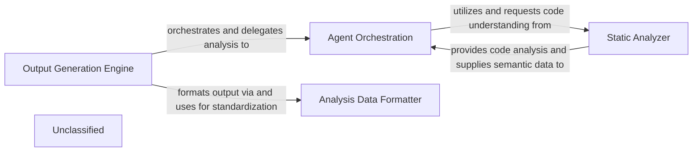

## Details

The system's primary objective is to generate structured architectural analysis outputs. This process is initiated and managed by the Output Generation Engine, which orchestrates the entire workflow. It delegates the complex task of code interpretation and detailed analysis to the Agent Orchestration component. The Agent Orchestration component, in turn, relies heavily on the Static Analyzer to acquire foundational and semantic understanding of the codebase. Once the analysis is complete, the Output Generation Engine utilizes the Analysis Data Formatter to convert the internal analysis objects into a standardized JSON format, suitable for external consumption and diagram rendering.

### Output Generation Engine [[Expand]](./Output_Generation_Engine.md)
The Output Generation Engine serves as the central orchestrator, managing the overall analysis workflow and coordinating the other components. It initiates and manages the process of generating structured architectural analysis outputs and utilizes the Analysis Data Formatter to convert internal analysis objects into a standardized JSON format.

**Related Classes/Methods**:

- `OutputGenerationEngine`

### Agent Orchestration
The Agent Orchestration component is responsible for the complex task of code interpretation and detailed analysis. It relies on the Static Analyzer for foundational and semantic understanding of the codebase and has been enhanced with refined agent behaviors and expanded task capabilities.

**Related Classes/Methods**:

- <a href="https://github.com/CodeBoarding/CodeBoarding/blob/main/.codeboardingagents/agent.py#L40-L267" target="_blank" rel="noopener noreferrer">`AgentOrchestration`:40-267</a>

### Static Analyzer
The Static Analyzer provides foundational code understanding, leveraging its advanced capabilities to extract structural and semantic information from the codebase, which is then used by the Agent Orchestration component.

**Related Classes/Methods**:

- <a href="https://github.com/CodeBoarding/CodeBoarding/blob/main/.codeboardingstatic_analyzer/__init__.py#L44-L67" target="_blank" rel="noopener noreferrer">`StaticAnalyzer`:44-67</a>

### Analysis Data Formatter
The Analysis Data Formatter ensures that all generated analysis data is converted into a standardized JSON format, making it readily consumable for documentation and diagram generation.

**Related Classes/Methods**:

- `AnalysisDataFormatter`

### Unclassified
Component for all unclassified files and utility functions (Utility functions/External Libraries/Dependencies)

**Related Classes/Methods**: _None_

### [FAQ](https://github.com/CodeBoarding/GeneratedOnBoardings/tree/main?tab=readme-ov-file#faq)
