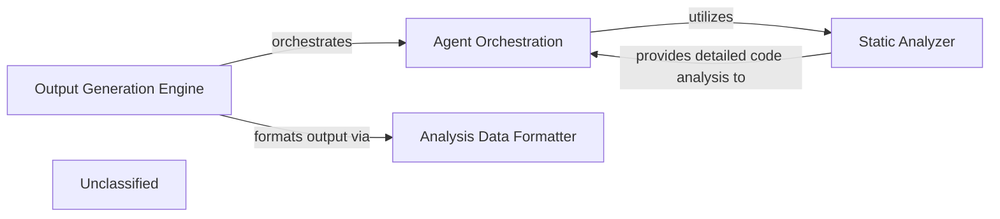

## Details

The system is orchestrated by the Output Generation Engine, which initiates the analysis process. It delegates detailed code interpretation, abstraction, planning, and validation to the Agent Orchestration component. The Agent Orchestration component, in turn, relies heavily on the Static Analyzer for foundational code understanding. The Static Analyzer has been significantly enhanced with a deeper integration of the Language Server Protocol (LSP) through its LSPClient, enabling it to extract comprehensive structural and semantic information, including call graphs, class hierarchies, and package dependencies. This rich data is then consumed by the Agent Orchestration's expanded toolset to perform sophisticated analysis. Finally, the Output Generation Engine uses the Analysis Data Formatter to convert the processed analysis into a standardized JSON format for architectural diagram generation.

### Output Generation Engine [[Expand]](./Output_Generation_Engine.md)
Orchestrates the entire process of generating structured analysis outputs from interpreted code. It coordinates `Agent Orchestration` to perform detailed analysis, abstraction, planning, and validation, ultimately producing JSON files that serve as the basis for architectural diagrams. It also utilizes the `Analysis Data Formatter`.

**Related Classes/Methods**:

- `OutputGenerationEngine`

### Agent Orchestration
Manages and coordinates various specialized agents responsible for interpreting code, performing detailed analysis, abstraction, planning, and validation. These agents rely on the `Static Analyzer` for foundational code understanding, leveraging its enhanced capabilities through a sophisticated toolset for reading documentation, file content, file structures, and package information.

**Related Classes/Methods**:

- <a href="https://github.com/CodeBoarding/CodeBoarding/blob/main/.codeboardingagents/tools/utils.py" target="_blank" rel="noopener noreferrer">`AgentOrchestration`</a>

### Static Analyzer
Provides foundational capabilities for understanding and processing source code across different programming languages. It has been significantly enhanced with a deeper integration of the Language Server Protocol (LSP) via its `LSPClient`, enabling it to extract comprehensive structural and semantic information, including call graphs, class hierarchies, and package dependencies. This rich data is then consumed by `Agent Orchestration` for deeper analysis.

**Related Classes/Methods**:

- <a href="https://github.com/CodeBoarding/CodeBoarding/blob/main/.codeboardingstatic_analyzer/programming_language.py" target="_blank" rel="noopener noreferrer">`static_analyzer.programming_language.ProgrammingLanguage`</a>
- <a href="https://github.com/CodeBoarding/CodeBoarding/blob/main/.codeboardingstatic_analyzer/scanner.py" target="_blank" rel="noopener noreferrer">`static_analyzer.scanner.Scanner`</a>
- <a href="https://github.com/CodeBoarding/CodeBoarding/blob/main/.codeboardingstatic_analyzer/lsp_client/client.py" target="_blank" rel="noopener noreferrer">`static_analyzer.lsp_client.client.LSPClient`</a>

### Analysis Data Formatter
Responsible for converting the internal analysis objects into a standardized JSON format. This component ensures that the output is structured consistently, making it suitable for consumption by external diagram rendering tools.

**Related Classes/Methods**:

- <a href="https://github.com/CodeBoarding/CodeBoarding/blob/main/.codeboarding." target="_blank" rel="noopener noreferrer">`AnalysisDataFormatter`</a>

### Unclassified
Component for all unclassified files and utility functions (Utility functions/External Libraries/Dependencies)

**Related Classes/Methods**: _None_

### [FAQ](https://github.com/CodeBoarding/GeneratedOnBoardings/tree/main?tab=readme-ov-file#faq)
