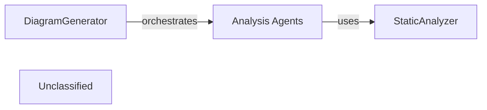

## Details

The diagram_analysis subsystem is centered around the DiagramGenerator, which acts as the primary orchestrator for generating architectural insights. It initiates and manages a suite of Analysis Agents, each specialized in a particular aspect of code analysis, such as metadata extraction, detailed component examination, abstraction, and validation. These agents rely on the StaticAnalyzer to obtain fundamental structural information about the codebase. The DiagramGenerator coordinates the parallel execution of these agents across different levels of architectural depth, iteratively refining the analysis based on feedback. The final output of this orchestrated process is a set of structured Analysis Files, which serve as a persistent record of the derived architectural components and their relationships, ready for consumption by documentation or visualization tools.

### DiagramGenerator
This is the core orchestrator of the architectural analysis process. It initializes, configures, and coordinates various specialized Analysis Agents to perform a multi-stage analysis of the codebase. It manages the parallel execution of component analysis, applies feedback for iterative refinement, and ultimately persists the generated architectural insights into structured Analysis Files.

**Related Classes/Methods**:

- <a href="https://github.com/CodeBoarding/CodeBoarding/blob/main/.codeboardingdiagram_analysis/diagram_generator.py" target="_blank" rel="noopener noreferrer">`diagram_analysis.diagram_generator.DiagramGenerator`</a>

### Analysis Agents
This component represents a collection of intelligent agents (MetaAgent, DetailsAgent, AbstractionAgent, PlannerAgent, ValidatorAgent, DiffAnalyzingAgent) that perform specific tasks within the analysis pipeline. They are responsible for gathering project metadata, conducting detailed code analysis, abstracting architectural components, planning subsequent analysis steps, validating the accuracy of the analysis, and managing incremental updates based on code changes.

**Related Classes/Methods**:

- <a href="https://github.com/CodeBoarding/CodeBoarding/blob/main/.codeboardingagents/meta_agent.py" target="_blank" rel="noopener noreferrer">`agents.meta_agent.MetaAgent`</a>
- <a href="https://github.com/CodeBoarding/CodeBoarding/blob/main/.codeboardingagents/details_agent.py" target="_blank" rel="noopener noreferrer">`agents.details_agent.DetailsAgent`</a>
- <a href="https://github.com/CodeBoarding/CodeBoarding/blob/main/.codeboardingagents/abstraction_agent.py" target="_blank" rel="noopener noreferrer">`agents.abstraction_agent.AbstractionAgent`</a>
- <a href="https://github.com/CodeBoarding/CodeBoarding/blob/main/.codeboardingagents/planner_agent.py" target="_blank" rel="noopener noreferrer">`agents.planner_agent.PlannerAgent`</a>
- <a href="https://github.com/CodeBoarding/CodeBoarding/blob/main/.codeboardingagents/validator_agent.py" target="_blank" rel="noopener noreferrer">`agents.validator_agent.ValidatorAgent`</a>
- <a href="https://github.com/CodeBoarding/CodeBoarding/blob/main/.codeboardingagents/diff_analyzer.py" target="_blank" rel="noopener noreferrer">`agents.diff_analyzer.DiffAnalyzingAgent`</a>

### StaticAnalyzer
Provides foundational static code analysis capabilities. It extracts structural and semantic information from the codebase without executing it, which is then consumed by the Analysis Agents to inform their analytical tasks.

**Related Classes/Methods**:

### Unclassified
Component for all unclassified files and utility functions (Utility functions/External Libraries/Dependencies)

**Related Classes/Methods**: _None_

### [FAQ](https://github.com/CodeBoarding/GeneratedOnBoardings/tree/main?tab=readme-ov-file#faq)
